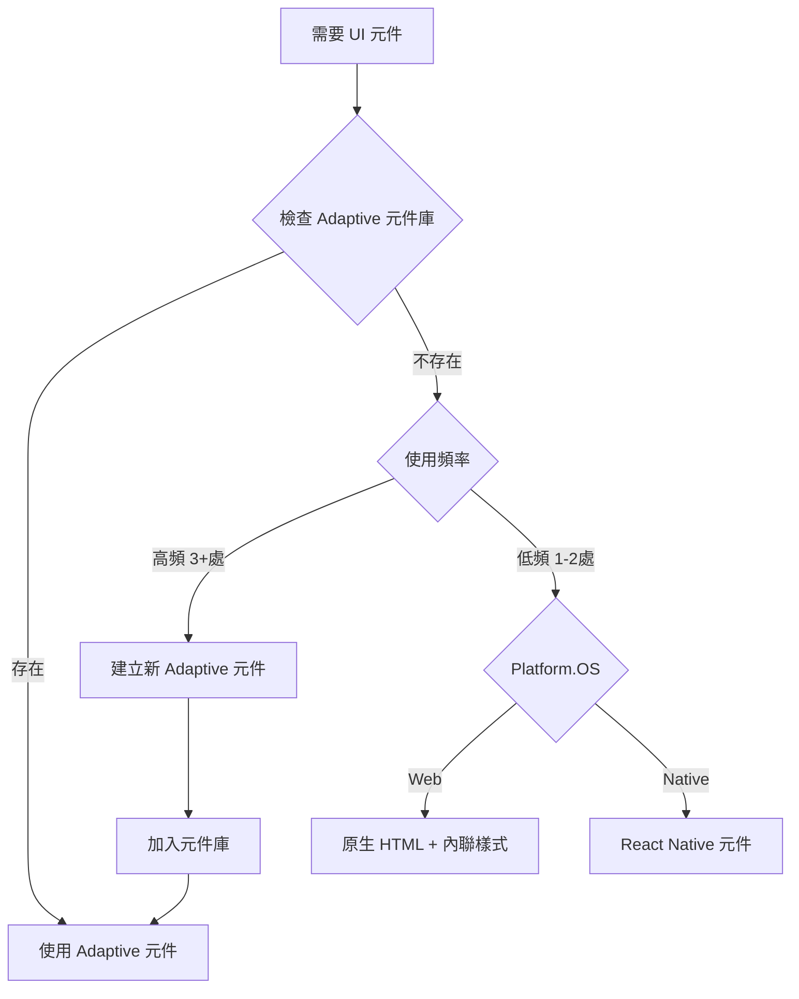

# PRP-112: Adaptive 元件使用強制規範與開發者工具

**建立日期**: 2025-08-13  
**作者**: Claude  
**狀態**: 📋 待執行  
**優先級**: 🔴 高  
**類型**: 🛠️ 開發工具  
**信心分數**: 8/10  
**前置條件**: PRP-111 完成（AdaptiveSwitch）

## Goal
建立完整的 Adaptive 元件使用強制機制，確保開發者使用正確的跨平台元件，防止直接使用會造成 Web 樣式問題的 React Native 元件。

## Why
- **重複問題**：開發者不知道或忘記使用 Adaptive 元件，導致 Web 樣式問題反覆出現
- **缺乏強制**：有了 Adaptive 元件但沒有強制使用，問題持續發生
- **文件不足**：CLAUDE.md 缺乏明確的元件使用指引和決策流程
- **開發體驗差**：每次都要手動檢查是否有對應的 Adaptive 元件

## What
建立多層次的強制機制和開發者工具：

1. **ESLint 規則** - 編譯時檢查和自動修復
2. **VS Code 擴充** - 即時提示和程式碼片段
3. **Pre-commit Hooks** - 提交前檢查
4. **CLAUDE.md 更新** - 明確的使用指引
5. **開發者工具** - 元件狀態儀表板

### Success Criteria
- [ ] ESLint 規則能自動偵測並警告不當使用
- [ ] VS Code 提供即時提示和自動完成
- [ ] Pre-commit hook 阻擋包含問題元件的提交
- [ ] CLAUDE.md 有完整的元件使用決策樹
- [ ] 新程式碼 100% 使用 Adaptive 元件

## All Needed Context

### Documentation & References
```yaml
- url: https://eslint.org/docs/latest/developer-guide/working-with-rules
  why: ESLint 自定義規則開發指南
  
- url: https://typicode.github.io/husky/
  why: Git hooks 管理工具，用於 pre-commit 檢查
  
- url: https://code.visualstudio.com/api/language-extensions/snippet-guide
  why: VS Code snippets 建立指南

- file: /.eslintrc.js
  why: 現有 ESLint 配置，需要擴展
  
- file: /CLAUDE.md
  why: 專案開發指南，需要更新
  
- file: /src/components/adaptive/core/
  why: 現有 Adaptive 元件清單
```

### 現有問題統計
```typescript
// 問題元件使用統計（來自 PRP-94 分析）
- Switch from 'react-native': 5 個檔案
- Picker from '@react-native-picker/picker': 3+ 個檔案
- TextInput 直接使用: 7 個檔案
- TouchableOpacity 未使用 .web.tsx: 多處
```

## Implementation Blueprint

### Part 1: ESLint 規則系統

#### 1.1 建立自定義規則
```javascript
// .eslintrc.js 更新
module.exports = {
  rules: {
    // 新增：禁止直接使用問題元件
    'no-restricted-imports': [
      'error',
      {
        paths: [
          {
            name: 'react-native',
            importNames: ['Switch', 'Picker'],
            message: '請使用 @/components/adaptive 的 AdaptiveSwitch 或 AdaptiveSelect'
          },
          {
            name: '@react-native-picker/picker',
            message: '請使用 @/components/adaptive 的 AdaptiveSelect'
          }
        ],
        patterns: [
          {
            group: ['react-native'],
            importNames: ['Switch'],
            message: '❌ 禁止使用 React Native Switch！\n✅ 請使用: import { AdaptiveSwitch } from "@/components/adaptive"'
          }
        ]
      }
    ],
    
    // 新增：強制使用 Adaptive 元件
    'prefer-adaptive-components': ['warn', {
      components: {
        'Switch': 'AdaptiveSwitch',
        'Picker': 'AdaptiveSelect',
        'Modal': 'AdaptiveModal',
        'Button': 'AdaptiveButton'
      }
    }]
  }
};
```

#### 1.2 自定義 ESLint 外掛
```javascript
// eslint-plugin-adaptive/index.js
module.exports = {
  rules: {
    'use-adaptive-components': {
      create(context) {
        return {
          ImportDeclaration(node) {
            if (node.source.value === 'react-native') {
              const problematicImports = node.specifiers.filter(spec => 
                ['Switch', 'Picker', 'Modal'].includes(spec.imported.name)
              );
              
              problematicImports.forEach(spec => {
                context.report({
                  node: spec,
                  message: `使用 Adaptive${spec.imported.name} 替代 ${spec.imported.name}`,
                  fix(fixer) {
                    // 自動修復：替換 import
                    return fixer.replaceText(
                      node,
                      `import { Adaptive${spec.imported.name} } from '@/components/adaptive'`
                    );
                  }
                });
              });
            }
          }
        };
      }
    }
  }
};
```

### Part 2: Pre-commit Hooks

#### 2.1 安裝和配置 Husky
```bash
npm install --save-dev husky lint-staged
npx husky install
npx husky add .husky/pre-commit "npx lint-staged"
```

#### 2.2 Lint-staged 配置
```json
// package.json
{
  "lint-staged": {
    "*.{ts,tsx}": [
      "eslint --fix",
      "bash scripts/check-adaptive-components.sh"
    ]
  }
}
```

#### 2.3 檢查腳本
```bash
#!/bin/bash
# scripts/check-adaptive-components.sh

# 檢查是否使用了禁用的元件
FORBIDDEN_IMPORTS=(
  "import.*Switch.*from.*'react-native'"
  "import.*Picker.*from.*'@react-native-picker/picker'"
  "from 'react-native'.*Switch"
)

for pattern in "${FORBIDDEN_IMPORTS[@]}"; do
  if grep -r "$pattern" --include="*.tsx" --include="*.ts" src/; then
    echo "❌ 發現禁用的元件 import！"
    echo "請使用 @/components/adaptive 中的 Adaptive 元件"
    exit 1
  fi
done

echo "✅ Adaptive 元件檢查通過"
```

### Part 3: VS Code 工具

#### 3.1 程式碼片段
```json
// .vscode/adaptive.code-snippets
{
  "Import AdaptiveSwitch": {
    "prefix": "ias",
    "body": [
      "import { AdaptiveSwitch } from '@/components/adaptive';",
      "",
      "<AdaptiveSwitch",
      "  value={$1}",
      "  onValueChange={$2}",
      "  trackColor={{ false: '#E3E1DC', true: '#FE7821' }}",
      "/>"
    ],
    "description": "Import and use AdaptiveSwitch"
  },
  
  "Import AdaptiveSelect": {
    "prefix": "iase",
    "body": [
      "import { AdaptiveSelect } from '@/components/adaptive';",
      "",
      "<AdaptiveSelect",
      "  value={$1}",
      "  onValueChange={$2}",
      "  options={$3}",
      "  placeholder=\"$4\"",
      "/>"
    ],
    "description": "Import and use AdaptiveSelect"
  }
}
```

#### 3.2 VS Code 設定
```json
// .vscode/settings.json
{
  "editor.codeActionsOnSave": {
    "source.fixAll.eslint": true
  },
  "eslint.rules.customizations": [
    {
      "rule": "no-restricted-imports",
      "severity": "error"
    }
  ],
  "editor.quickSuggestions": {
    "strings": true
  }
}
```

### Part 4: CLAUDE.md 更新

```markdown
## 🎯 Web UI 元件使用規範

### 📊 元件使用決策樹


### 🚫 禁用元件黑名單（Web 平台）
| ❌ 絕對不要用 | ✅ 必須使用 | 原因 |
|--------------|------------|------|
| Switch (react-native) | AdaptiveSwitch | 樣式被覆蓋 |
| Picker | AdaptiveSelect | 背景透明問題 |
| TextInput (直接) | AdaptiveInput | 樣式不一致 |
| Modal (直接) | AdaptiveModal | 顯示問題 |

### ✅ Adaptive 元件庫清單
```typescript
// 可用的 Adaptive 元件（持續更新）
import {
  AdaptiveButton,    // ✅ 已完成
  AdaptiveModal,     // ✅ 已完成
  AdaptiveSwitch,    // ✅ 已完成
  AdaptiveSelect,    // ✅ 已完成
  AdaptiveInput,     // ✅ 已完成
  AdaptiveText,      // ✅ 已完成
  AdaptiveView,      // ✅ 已完成
  AdaptiveImage,     // ✅ 已完成
} from '@/components/adaptive';
```

### 🔍 快速檢查清單
開發新功能前，請檢查：
- [ ] 是否有對應的 Adaptive 元件？
- [ ] 是否會在 Web 平台使用？
- [ ] 是否有樣式被覆蓋的風險？
- [ ] 是否需要建立新的 Adaptive 元件？

### 🛠️ 建立新 Adaptive 元件 SOP
1. 使用元件模板生成器
   ```bash
   npm run create:adaptive Switch
   ```
2. 實作 .web.tsx 版本（內聯樣式）
3. 實作 .native.tsx 版本
4. 加入測試
5. 更新此文件的元件清單

### ⚠️ 常見錯誤和解決方案
| 症狀 | 原因 | 解決方案 |
|------|------|----------|
| 按鈕黑字黑底 | 全域 CSS 覆蓋 | 使用 AdaptiveButton |
| Switch 軌道透明 | CSS 優先級問題 | 使用 AdaptiveSwitch |
| 下拉選單無背景 | Picker 不相容 | 使用 AdaptiveSelect |
| Input 無內邊距 | 樣式被覆蓋 | 使用 AdaptiveInput |
```

### Part 5: 開發者儀表板

#### 5.1 元件使用統計腳本
```typescript
// scripts/adaptive-stats.ts
import * as fs from 'fs';
import * as path from 'path';

function scanAdaptiveUsage() {
  const stats = {
    correctUsage: [],
    incorrectUsage: [],
    coverage: 0
  };
  
  // 掃描所有 .tsx 檔案
  // 統計 Adaptive 元件使用情況
  // 生成報告
  
  return stats;
}

// 生成報告
const report = scanAdaptiveUsage();
console.log('📊 Adaptive 元件使用報告：');
console.log(`✅ 正確使用: ${report.correctUsage.length} 處`);
console.log(`❌ 需要修正: ${report.incorrectUsage.length} 處`);
console.log(`📈 覆蓋率: ${report.coverage}%`);
```

## Tasks (執行順序)

1. **設定 ESLint 規則** (30 分鐘)
   - 更新 .eslintrc.js
   - 加入 no-restricted-imports
   - 測試規則效果

2. **建立 Pre-commit Hooks** (30 分鐘)
   - 安裝 Husky
   - 配置 lint-staged
   - 建立檢查腳本

3. **VS Code 工具** (45 分鐘)
   - 建立程式碼片段
   - 配置編輯器設定
   - 測試自動完成

4. **更新 CLAUDE.md** (60 分鐘)
   - 加入決策樹
   - 更新元件清單
   - 加入使用範例
   - 建立 SOP

5. **建立統計工具** (30 分鐘)
   - 掃描腳本
   - 生成報告
   - 加入 CI/CD

6. **測試和驗證** (30 分鐘)
   - 測試所有檢查機制
   - 修復假陽性
   - 調整規則嚴格度

## Validation Gates

### ESLint 測試
```bash
# 測試規則是否生效
echo "import { Switch } from 'react-native';" > test.tsx
npx eslint test.tsx
# 應該看到錯誤提示

# 測試自動修復
npx eslint --fix test.tsx
# 應該自動替換為 AdaptiveSwitch
```

### Pre-commit 測試
```bash
# 測試 pre-commit hook
git add .
echo "import { Switch } from 'react-native';" >> src/test.tsx
git commit -m "test"
# 應該被阻擋
```

### 統計報告
```bash
# 生成使用報告
npm run adaptive:stats
# 應該看到統計數據
```

## Error Handling

### 可能的問題
1. **過度嚴格**：某些場景確實需要原生元件
   - 解決：使用 eslint-disable-next-line 註解
   
2. **假陽性**：誤判正確的使用
   - 解決：調整規則正則表達式
   
3. **性能影響**：Pre-commit 太慢
   - 解決：只檢查變更的檔案

### 降級策略
```javascript
// 允許特定檔案跳過檢查
// .eslintignore
src/legacy/**
src/third-party/**
```

## Post-Implementation Checklist
- [ ] ESLint 規則正確觸發
- [ ] Pre-commit hook 正常運作
- [ ] VS Code 提示正確
- [ ] CLAUDE.md 更新完整
- [ ] 統計工具準確
- [ ] 團隊培訓完成
- [ ] CI/CD 整合

## Metrics for Success
- 新程式碼 Adaptive 元件使用率 > 95%
- Web 樣式問題減少 80%
- 開發者滿意度提升
- Code Review 時間減少 30%

---

**信心分數: 8/10**
- 技術方案成熟（ESLint、Husky 都是標準工具）
- 可能需要調整規則嚴格度
- 需要團隊配合和習慣養成