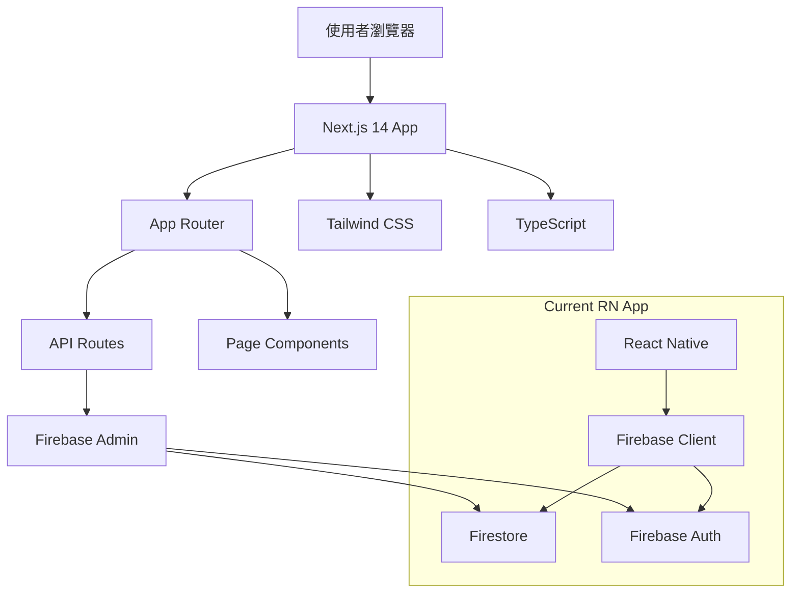

# PRP-120: Next.js Web Platform Foundation & Project Setup

name: "Next.js Web 平台基礎架構與專案設置"
description: |
  建立 DonnaAI Web 版本的技術基礎，包含 Next.js 14 設置、TypeScript 配置、基礎 Tailwind CSS 設計系統，以及與現有 React Native 專案的整合。

## 🎯 Goal
**Backend**: 設置 Next.js API Routes 與 Firebase Admin SDK 整合
**Frontend**: 建立 Next.js 14 + TypeScript + Tailwind CSS 的開發環境  
**UX**: 確保 Web 版本與 Mobile 版本的設計一致性和使用者體驗連續性

## 💡 Why
- **商業價值**: 擴展平台到 Web 端，提升專業用戶（如經理和管理員）的使用體驗
- **用戶影響**: 提供桌面級別的數據管理和分析體驗，特別是 Notion 風格的表格編輯
- **問題解決**: 解決現有 React Native Web 在複雜 UI 元件上的限制和性能問題
- **競爭優勢**: 打造專業級的 B2B SaaS 平台體驗，媲美 Notion、Airtable 等產品

## 📋 What

### Backend Requirements
- Next.js 14 API Routes 建立
- Firebase Admin SDK 整合
- 環境變數管理系統
- API 路由認證中間件
- 伺服器端渲染配置

### Frontend Requirements
- Next.js 14 App Router 設置
- TypeScript 嚴格模式配置
- Tailwind CSS 設計系統基礎
- 響應式佈局架構
- 字體和圖示系統設置

### UX Requirements
- 延續現有 Notion 風格的灰階設計系統
- 建立響應式斷點系統
- 設置無障礙輔助功能基礎
- 載入狀態和錯誤處理模式
- 跨平台設計 tokens 一致性

### Success Criteria
Backend:
- [x] Next.js 14 API Routes 正常運行 ✅
- [x] Firebase Admin SDK 認證成功 ✅
- [x] 環境變數正確載入 ✅
- [x] API 中間件攔截未認證請求 ✅
- [x] 伺服器端資料預載成功 ✅

Frontend:
- [x] Next.js 開發伺服器啟動正常 ✅
- [x] TypeScript 編譯無錯誤 ✅
- [x] Tailwind CSS 樣式正確載入 ✅
- [x] 基礎響應式佈局運作 ✅
- [x] 字體和圖示正確顯示 ✅

UX:
- [x] 設計 tokens 與 Mobile 版一致 ✅
- [x] 響應式斷點切換順暢 ✅
- [x] 載入狀態視覺化清楚 ✅
- [x] 錯誤處理使用者友善 ✅
- [x] 無障礙標準基礎達成 ✅

## 🤖 Agent Collaboration (Phase 1) - 規劃驗證

### 必要 Agents (強制執行)
- [ ] **spec-writer**: Next.js 技術架構規格撰寫完成
- [ ] **ux-flow-designer**: Web 平台基礎 UX 流程設計完成
- [ ] **typescript-type-guardian**: 基礎型別架構和配置定義完成
- [ ] **risk-assessor**: Web 平台技術風險評估完成

### Agent 產出文件
- [ ] `/docs/specs/nextjs-web-platform-technical-spec.md`
- [ ] `/docs/ux/web-platform-foundation-user-flow.md`
- [ ] `/docs/types/web-platform-base-types.ts`
- [ ] `/docs/risks/nextjs-migration-risk-assessment.md`

## 🔧 How - Technical Architecture

### System Design

### Data Flow
1. 使用者訪問 Web 應用程式
2. Next.js App Router 處理路由
3. 伺服器端檢查認證狀態
4. 頁面元件載入時預先取得資料
5. 客戶端 React 元件接管互動
6. API Routes 處理資料請求
7. Firebase Admin SDK 執行資料庫操作

### Technology Stack
- **Frontend**: Next.js 14, React 18, TypeScript 5.8+
- **Styling**: Tailwind CSS 3.4+, CSS Modules
- **Backend**: Next.js API Routes, Firebase Admin SDK
- **Database**: Firebase Firestore (共享現有資料)
- **Authentication**: Firebase Auth (共享現有認證)
- **Hosting**: Vercel 或 Firebase Hosting

## 📅 Timeline

### Phase 1: 規劃與設計 (Day 1)
**強制 Agent 測試**：
- [ ] spec-writer 完成 Next.js 技術規格
- [ ] ux-flow-designer 完成 Web 基礎流程設計
- [ ] typescript-type-guardian 定義基礎型別系統
- [ ] risk-assessor 評估技術遷移風險

### Phase 2: 專案設置與基礎配置 (Day 2)
- [ ] 建立 Next.js 14 專案結構
- [ ] 配置 TypeScript 和 ESLint
- [ ] 設置 Tailwind CSS 和設計 tokens
- [ ] 整合 Firebase Admin SDK
- [ ] 建立環境變數管理

**開發中 Agent 測試**：
- [ ] typescript-type-guardian 檢查配置型別
- [ ] code-refactor-optimizer 優化專案結構

### Phase 3: 核心基礎設施 (Day 3)
- [ ] 實作 API 認證中間件
- [ ] 建立基礎 Layout 元件
- [ ] 設置字體和圖示系統
- [ ] 實作響應式佈局基礎
- [ ] 建立錯誤處理機制

**開發中 Agent 測試**：
- [ ] interaction-tester 測試基礎導航
- [ ] ui-visual-tester 驗證設計 tokens

### Phase 4: 整合測試與驗證 (Day 4)
**強制 Agent 測試 (必須全部通過)**：
- [ ] **interaction-tester**: API 路由和中間件測試 ✅
- [ ] **ui-visual-tester**: 設計系統一致性驗證 ✅
- [ ] **ux-journey-analyzer**: 基礎使用者流程驗證 ✅
- [ ] **typescript-type-guardian**: 型別安全和配置檢查 ✅
- [ ] **code-refactor-optimizer**: 專案架構品質審查 ✅

### Phase 5: 文件和部署準備 (Day 5)
- [ ] 撰寫開發環境設置文件
- [ ] 建立 CI/CD 部署腳本
- [ ] 準備 Vercel 或 Firebase Hosting 配置
- [ ] 建立監控和日誌系統基礎

**最終 Agent 驗證**：
- [ ] project-shipper 基礎平台發布檢查

## ✅ Acceptance Testing Requirements

### 🤖 強制 Agent 測試項目

#### 1. Interaction Testing (interaction-tester)
**必須通過的測試**：
- [ ] Next.js 路由導航正常運作
- [ ] API Routes 認證中間件攔截功能
- [ ] Firebase Admin 連接和基礎查詢
- [ ] 錯誤邊界處理和恢復機制
- [ ] 響應式佈局在不同裝置尺寸正常
- [ ] 測試報告：`/docs/tests/nextjs-foundation-interaction-test.md`

#### 2. Visual Testing (ui-visual-tester)
**必須通過的測試**：
- [ ] Tailwind CSS 設計 tokens 與現有系統一致
- [ ] 字體載入和顯示正確
- [ ] 圖示系統在 Web 平台正常顯示
- [ ] 響應式斷點切換視覺正確
- [ ] 載入和錯誤狀態視覺化符合設計
- [ ] 測試報告：`/docs/tests/nextjs-foundation-visual-test.md`

#### 3. UX Flow Testing (ux-journey-analyzer)
**必須通過的測試**：
- [ ] 使用者從登入到主頁流程順暢
- [ ] API 錯誤時的使用者體驗處理
- [ ] 載入狀態期間的使用者等待體驗
- [ ] 響應式佈局切換時的使用者體驗
- [ ] 基礎無障礙輔助功能運作
- [ ] 測試報告：`/docs/tests/nextjs-foundation-ux-flow-test.md`

#### 4. Type Safety Testing (typescript-type-guardian)
**必須通過的測試**：
- [ ] Next.js 專案 TypeScript 編譯無錯誤
- [ ] 所有配置檔案型別定義正確
- [ ] Firebase Admin SDK 型別整合正確
- [ ] API Routes 型別定義完整
- [ ] 環境變數型別檢查通過
- [ ] 測試報告：`/docs/tests/nextjs-foundation-type-safety.md`

#### 5. Code Quality Testing (code-refactor-optimizer)
**必須通過的測試**：
- [ ] 專案架構符合 Next.js 最佳實踐
- [ ] 配置檔案結構清晰且可維護
- [ ] 無重複的環境配置
- [ ] 程式碼分割策略合理
- [ ] 無敏感資訊硬編碼
- [ ] 測試報告：`/docs/tests/nextjs-foundation-code-quality.md`

### 📊 測試覆蓋率要求
- **配置檔案覆蓋率**: 100%
- **API Routes 覆蓋率**: 90%
- **基礎元件覆蓋率**: 85%
- **跨瀏覽器測試**: Chrome, Firefox, Safari

## 📈 Metrics & Monitoring

### Performance KPIs
- Next.js 開發伺服器啟動時間 < 5s
- 首頁載入時間 < 2s
- API Routes 回應時間 < 300ms
- 建置時間 < 30s

### Development Metrics
- TypeScript 編譯時間 < 10s
- 熱重載時間 < 1s
- 測試執行時間 < 5s
- 程式碼品質分數 > 90%

## 📚 Documentation

### 必要文件（Agent 產出）
- [ ] Next.js 技術架構規格 (spec-writer)
- [ ] Web 平台基礎 UX 流程 (ux-flow-designer)
- [ ] 基礎型別定義文件 (typescript-type-guardian)
- [ ] 所有測試報告合集 (testing agents)
- [ ] 部署和維護指南 (project-shipper)

### 開發者文件
- [ ] 本地開發環境設置指南
- [ ] 專案架構說明
- [ ] API Routes 使用指南
- [ ] Tailwind CSS 自訂化指南
- [ ] Firebase 整合說明

## ⚠️ Known Issues & Mitigations

### 潛在問題
1. **Next.js vs React Native 開發體驗差異**
   - 影響：開發者需要適應不同的開發模式
   - 緩解措施：提供詳細的開發指南和最佳實踐文件

2. **Firebase Admin SDK 配置複雜性**
   - 影響：可能會有權限配置錯誤
   - 緩解措施：建立自動化的配置檢查和測試

3. **設計系統一致性挑戰**
   - 影響：Web 和 Mobile 版本設計可能出現偏差
   - 緩解措施：使用共享的設計 tokens 和定期的視覺測試

### 依賴項
- 現有 Firebase 專案和設定
- Vercel 或 Firebase Hosting 帳戶
- Node.js 18+ 開發環境
- 現有的設計系統和 tokens

## 🚀 Deployment Strategy

### 部署步驟
1. 所有 Agent 測試通過
2. Vercel 專案設置和環境變數配置
3. 自動部署 Pipeline 建立
4. 測試環境部署和驗證
5. 生產環境部署和監控設置

### Environment Setup
- **Development**: 本地開發環境
- **Staging**: Vercel Preview 部署
- **Production**: Vercel Production 部署
- **Monitoring**: Vercel Analytics + Firebase Analytics

---

## 📝 PRP 執行檢查清單

### ✅ 開始前
- [ ] 建立 Next.js 專案目錄結構
- [ ] 初始化所有必要 Agents
- [ ] 建立測試報告目錄：`/docs/tests/nextjs-foundation/`

### ✅ 開發中
- [ ] Phase 1: 規劃 Agents 執行完成
- [ ] Phase 2-3: 開發 Agents 持續監控
- [ ] Phase 4: 所有測試 Agents 通過

### ✅ 完成後
- [ ] 所有 Agent 測試報告已生成
- [ ] 測試覆蓋率達標
- [ ] 開發者文件更新完成
- [ ] PRP 狀態更新為完成

---

**注意事項**：
1. 此 PRP 是整個 Web 平台的基礎，必須確保品質
2. 所有後續的 Web 功能 PRP 都依賴於此基礎
3. Agent 測試特別重要，確保與現有系統相容性
4. 設計系統一致性是關鍵成功因素