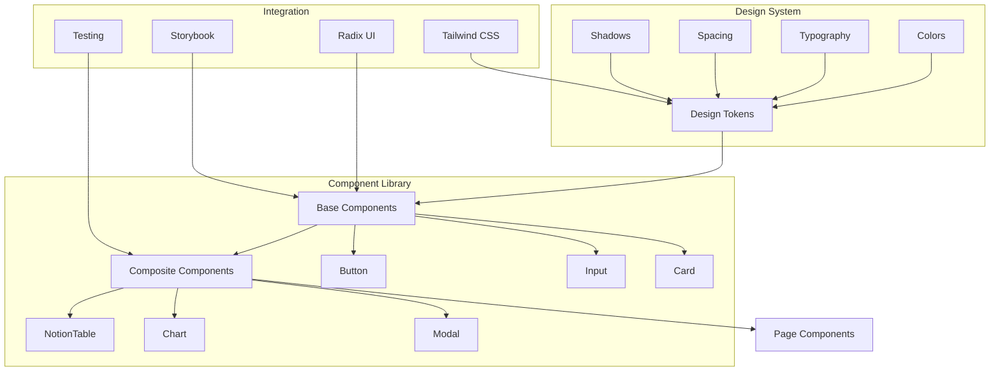

# PRP-121: Web-optimized Design System & Component Library

name: "Web 最佳化設計系統與元件庫"
description: |
  基於現有 Adaptive Architecture 建立純 Web 版本的設計系統與元件庫，包含 Radix UI + Tailwind CSS 的現代化元件實作，確保與現有 Mobile 版本的設計一致性。

## 🎯 Goal
**Backend**: 建立元件庫的 TypeScript 型別系統和設計 tokens 管理
**Frontend**: 建立完整的 Web 元件庫，支援 Notion 風格的專業 UI 元件  
**UX**: 確保 Web 版本元件的無障礙性和使用者體驗最佳化

## 💡 Why
- **商業價值**: 建立可重用的專業級 UI 元件庫，加速後續功能開發
- **用戶影響**: 提供一致且專業的使用者介面體驗，特別是複雜的資料管理功能
- **問題解決**: 解決現有 React Native Web 元件在複雜互動上的限制
- **競爭優勢**: 打造媲美 Notion、Linear 等產品的專業 UI 質感

## 📋 What

### Backend Requirements
- 設計系統 TypeScript 型別定義
- 元件 API 介面標準化
- 主題系統和 CSS 變數管理
- 元件測試和文件生成系統
- Storybook 整合配置

### Frontend Requirements
- 基礎 UI 元件庫（Button, Input, Card 等）
- 專業元件（NotionTable, Charts, Modal 等）
- 佈局和導航元件系統
- 表單處理和驗證元件
- 響應式設計和無障礙支援

### UX Requirements
- 繼承現有 Notion 風格灰階設計
- 建立一致的互動模式和狀態反饋
- 實作無障礙輔助功能（ARIA）
- 建立載入和錯誤狀態標準
- 響應式設計系統和斷點管理

### Success Criteria
Backend:
- [ ] 設計 tokens 完整定義且型別安全
- [ ] 元件 API 介面標準化完成
- [ ] 主題系統支援深色/淺色模式
- [ ] Storybook 文件自動生成
- [ ] 元件測試覆蓋率 > 90%

Frontend:
- [ ] 20+ 基礎和專業元件完成
- [ ] 所有元件支援 TypeScript
- [ ] 響應式設計在所有斷點正常
- [ ] 元件效能最佳化完成
- [ ] 跨瀏覽器相容性驗證

UX:
- [ ] 設計與現有 Mobile 版本一致
- [ ] 無障礙輔助功能達到 WCAG 2.1 AA 級
- [ ] 互動狀態和動畫流暢自然
- [ ] 錯誤和載入狀態使用者友善
- [ ] 使用者測試回饋積極

## 🤖 Agent Collaboration (Phase 1) - 規劃驗證

### 必要 Agents (強制執行)
- [ ] **spec-writer**: Web 元件庫技術規格撰寫完成
- [ ] **ux-flow-designer**: 元件互動流程和使用模式設計完成
- [ ] **typescript-type-guardian**: 元件型別系統架構定義完成
- [ ] **risk-assessor**: 元件庫技術和維護風險評估完成

### Agent 產出文件
- [ ] `/docs/specs/web-component-library-technical-spec.md`
- [ ] `/docs/ux/component-interaction-patterns.md`
- [ ] `/docs/types/component-library-types.ts`
- [ ] `/docs/risks/component-library-risk-assessment.md`

## 🔧 How - Technical Architecture

### System Design

### Component Architecture
1. **Design Tokens Layer**: 顏色、字體、間距等設計 tokens
2. **Primitive Layer**: Radix UI 無樣式元件
3. **Base Layer**: 基礎 UI 元件（Button, Input 等）
4. **Composite Layer**: 複合元件（NotionTable, Charts 等）
5. **Page Layer**: 頁面級元件和佈局

### Technology Stack
- **Base UI**: Radix UI (無樣式、無障礙)
- **Styling**: Tailwind CSS + CSS-in-JS
- **Icons**: Lucide React (一致的圖示系統)
- **Testing**: Vitest + Testing Library
- **Documentation**: Storybook
- **Type Safety**: TypeScript + Zod

## 📅 Timeline

### Phase 1: 規劃與設計 (Day 1)
**強制 Agent 測試**：
- [ ] spec-writer 完成元件庫技術規格
- [ ] ux-flow-designer 完成元件互動模式設計
- [ ] typescript-type-guardian 定義元件型別系統
- [ ] risk-assessor 評估元件庫風險

### Phase 2: 設計系統基礎 (Day 2)
- [ ] 建立 Design Tokens 系統
- [ ] 配置 Tailwind CSS 自訂主題
- [ ] 實作顏色、字體、間距系統
- [ ] 建立 CSS 變數和響應式系統
- [ ] 設置 Storybook 環境

**開發中 Agent 測試**：
- [ ] typescript-type-guardian 檢查 tokens 型別
- [ ] ui-visual-tester 驗證設計一致性

### Phase 3: 基礎元件開發 (Day 3-4)
- [ ] Button 元件（各種變體和狀態）
- [ ] Input 元件（文字、密碼、搜尋等）
- [ ] Card 元件（容器和佈局）
- [ ] Modal 元件（對話框和覆蓋層）
- [ ] Select 元件（下拉選單和多選）

**開發中 Agent 測試**：
- [ ] interaction-tester 測試元件互動
- [ ] code-refactor-optimizer 優化元件實作

### Phase 4: 專業元件開發 (Day 5-6)
- [ ] NotionTable 元件基礎架構
- [ ] Chart 元件（基於 Recharts）
- [ ] OrganizationChart 元件（基於 ReactFlow）
- [ ] AIQueryInterface 元件
- [ ] Navigation 和 Layout 元件

**開發中 Agent 測試**：
- [ ] interaction-tester 測試複雜元件
- [ ] ui-visual-tester 驗證專業元件設計

### Phase 5: 整合測試與文件 (Day 7)
**強制 Agent 測試 (必須全部通過)**：
- [ ] **interaction-tester**: 所有元件互動測試 ✅
- [ ] **ui-visual-tester**: 視覺一致性和設計規範驗證 ✅
- [ ] **ux-journey-analyzer**: 元件使用流程驗證 ✅
- [ ] **typescript-type-guardian**: 型別安全檢查 ✅
- [ ] **code-refactor-optimizer**: 元件庫程式碼品質審查 ✅

### Phase 6: 文件和發布準備 (Day 8)
- [ ] Storybook 文件完善
- [ ] 元件使用指南撰寫
- [ ] 無障礙輔助功能驗證
- [ ] 效能基準測試
- [ ] NPM 套件發布準備

**最終 Agent 驗證**：
- [ ] project-shipper 元件庫發布檢查

## ✅ Acceptance Testing Requirements

### 🤖 強制 Agent 測試項目

#### 1. Interaction Testing (interaction-tester)
**必須通過的測試**：
- [ ] 所有按鈕點擊和 hover 狀態正常
- [ ] 表單元件驗證和提交功能
- [ ] Modal 開啟、關閉和鍵盤導航
- [ ] Select 下拉選單和多選功能
- [ ] 複雜元件（Table、Chart）互動正確
- [ ] 測試報告：`/docs/tests/component-library-interaction-test.md`

#### 2. Visual Testing (ui-visual-tester)
**必須通過的測試**：
- [ ] 所有元件符合 Notion 設計風格
- [ ] 顏色系統與現有 Mobile 版一致
- [ ] 字體和間距符合設計規格
- [ ] 響應式設計在各斷點正確
- [ ] 深色/淺色主題切換正常
- [ ] 測試報告：`/docs/tests/component-library-visual-test.md`

#### 3. UX Flow Testing (ux-journey-analyzer)
**必須通過的測試**：
- [ ] 元件使用流程直觀且無障礙
- [ ] 錯誤狀態和驗證訊息清楚
- [ ] 載入狀態和回饋適當
- [ ] 鍵盤導航和焦點管理正確
- [ ] 螢幕閱讀器相容性良好
- [ ] 測試報告：`/docs/tests/component-library-ux-flow-test.md`

#### 4. Type Safety Testing (typescript-type-guardian)
**必須通過的測試**：
- [ ] 所有元件型別定義正確且完整
- [ ] Props 介面嚴格型別檢查
- [ ] 設計 tokens 型別安全
- [ ] 無 any 類型濫用
- [ ] 泛型使用正確且有意義
- [ ] 測試報告：`/docs/tests/component-library-type-safety.md`

#### 5. Code Quality Testing (code-refactor-optimizer)
**必須通過的測試**：
- [ ] 元件實作遵循 React 最佳實踐
- [ ] 無重複程式碼和邏輯
- [ ] 效能最佳化（memo、callback 等）
- [ ] 無障礙輔助功能完整實作
- [ ] 測試覆蓋率達標且有意義
- [ ] 測試報告：`/docs/tests/component-library-code-quality.md`

### 📊 測試覆蓋率要求
- **元件單元測試覆蓋率**: >= 90%
- **互動測試覆蓋率**: 100%
- **視覺回歸測試覆蓋率**: 100%
- **無障礙測試覆蓋率**: 100%

## 📈 Metrics & Monitoring

### Performance KPIs
- 元件載入時間 < 100ms
- Bundle 大小 < 500KB (gzipped)
- 元件渲染時間 < 16ms
- 記憶體使用增長 < 10MB

### Development Metrics
- 元件開發完成度 100%
- Storybook 文件完整度 100%
- 測試覆蓋率 > 90%
- 無障礙輔助功能合規率 100%

### User Experience Metrics
- 元件載入錯誤率 < 0.1%
- 使用者滿意度 > 4.5/5
- 元件 API 易用性評分 > 4/5
- 開發者採用率 > 80%

## 📚 Documentation

### 必要文件（Agent 產出）
- [ ] 元件庫技術規格文件 (spec-writer)
- [ ] 元件互動模式指南 (ux-flow-designer)
- [ ] 完整型別定義文件 (typescript-type-guardian)
- [ ] 所有測試報告合集 (testing agents)
- [ ] 元件庫維護指南 (project-shipper)

### 使用者文件
- [ ] 元件庫快速開始指南
- [ ] 設計系統使用手冊
- [ ] 元件 API 參考文件
- [ ] 無障礙輔助功能指南
- [ ] 自訂主題和樣式指南

## ⚠️ Known Issues & Mitigations

### 潛在問題
1. **Radix UI 學習曲線**
   - 影響：開發者需要熟悉 Radix UI 的無樣式概念
   - 緩解措施：提供詳細的使用範例和最佳實踐指南

2. **效能考量（Bundle 大小）**
   - 影響：元件庫可能會增加應用程式的包大小
   - 緩解措施：實作 Tree Shaking 和按需載入

3. **瀏覽器相容性**
   - 影響：新的 CSS 功能可能在舊瀏覽器不支援
   - 緩解措施：設定適當的 Browserslist 和 Polyfills

### 依賴項
- Next.js 14 基礎平台（PRP-120）
- 現有設計系統和 tokens
- Radix UI 和 Tailwind CSS
- Testing 和 Storybook 環境

## 🚀 Deployment Strategy

### 發布策略
- **Alpha**: 內部開發使用和測試
- **Beta**: 有限範圍的功能測試
- **Stable**: 正式發布和文件完成
- **Maintenance**: 持續更新和 bug 修復

### 版本管理
- 遵循 Semantic Versioning (SemVer)
- 主要版本：重大變更或 API 變更
- 次要版本：新增功能和元件
- 修補版本：bug 修復和小幅改進

---

## 📝 PRP 執行檢查清單

### ✅ 開始前
- [ ] 建立元件庫專案結構
- [ ] 初始化所有必要 Agents
- [ ] 建立測試報告目錄：`/docs/tests/component-library/`

### ✅ 開發中
- [ ] Phase 1: 規劃 Agents 執行完成
- [ ] Phase 2-4: 開發 Agents 持續監控
- [ ] Phase 5: 所有測試 Agents 通過

### ✅ 完成後
- [ ] 所有 Agent 測試報告已生成
- [ ] Storybook 文件完整且可訪問
- [ ] 元件庫發布準備完成
- [ ] PRP 狀態更新為完成

---

**注意事項**：
1. 此元件庫將是所有後續 Web 功能的基礎
2. 設計一致性和無障礙性是絕對優先
3. 每個元件都必須經過完整的 Agent 測試
4. 文件和範例必須清楚且完整