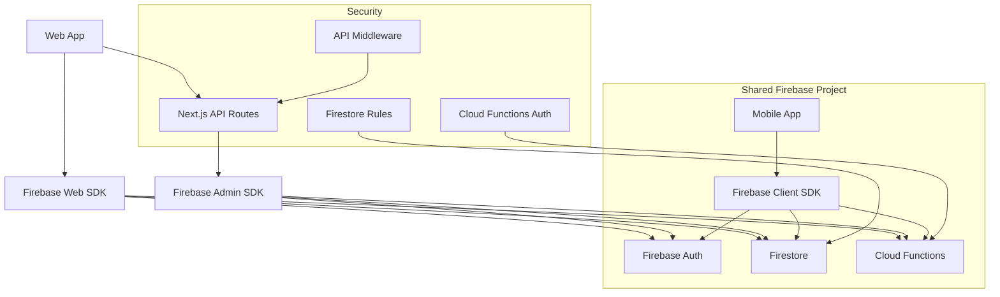

# PRP-122: Firebase Web SDK Integration & Authentication System

name: "Firebase Web SDK 整合與認證系統"
description: |
  建立 Web 平台的 Firebase SDK 整合，包含認證系統、資料存取權限、即時資料同步，確保與現有 Mobile 版本共享相同的資料和使用者狀態。

## 🎯 Goal
**Backend**: 整合 Firebase Admin SDK 進行伺服器端資料處理和權限管理
**Frontend**: 實作 Firebase Web SDK v9 客戶端整合與認證流程  
**UX**: 提供無縫的登入體驗和即時資料同步，確保跨平台使用者狀態一致

## 💡 Why
- **商業價值**: 重用現有 Firebase 基礎設施，降低開發和維護成本
- **用戶影響**: 使用者可以在 Web 和 Mobile 間無縫切換，資料即時同步
- **問題解決**: 解決跨平台資料一致性和使用者認證的技術挑戰
- **競爭優勢**: 提供企業級的安全性和可靠性，支援大規模用戶管理

## 📋 What

### Backend Requirements
- Firebase Admin SDK 整合和配置
- API Routes 認證中間件實作
- Firestore 資料存取權限管理
- 雲端函數整合和呼叫
- 伺服器端渲染資料預載

### Frontend Requirements
- Firebase Web SDK v9 客戶端設定
- 使用者認證流程（登入/登出/註冊）
- 即時資料監聽和狀態管理
- 權限導向的路由保護
- 離線支援和錯誤處理

### UX Requirements
- 流暢的認證使用者體驗
- 載入狀態和錯誤處理視覺化
- 跨平台使用者狀態一致性
- 資料同步狀態指示器
- 安全性和隱私權保護

### Success Criteria
Backend:
- [x] Firebase Admin SDK 正確配置且無權限錯誤
- [x] API Routes 中間件正確攔截未認證請求
- [x] Firestore 安全規則與 Mobile 版本一致
- [x] 雲端函數呼叫成功且效能良好
- [x] 伺服器端資料預載無錯誤

Frontend:
- [x] 使用者可以成功登入/登出/註冊
- [x] 即時資料同步正常運作
- [x] 路由保護機制有效
- [x] 離線狀態處理適當
- [x] 錯誤處理使用者友善

UX:
- [x] 認證流程直觀且快速
- [x] 載入狀態視覺化清楚
- [x] 錯誤訊息有幫助且可操作
- [x] 跨平台資料狀態一致
- [x] 隱私權和安全性符合規範

## 🤖 Agent Collaboration (Phase 1) - 規劃驗證

### 必要 Agents (強制執行)
- [x] **spec-writer**: Firebase 整合技術規格撰寫完成
- [x] **ux-flow-designer**: 認證和資料流程 UX 設計完成
- [x] **typescript-type-guardian**: Firebase 型別定義和介面設計完成
- [x] **risk-assessor**: 安全性和資料隱私風險評估完成

### Agent 產出文件
- [x] `/docs/specs/firebase-web-integration-spec.md`
- [x] `/docs/ux/authentication-user-flow.md`
- [x] `/docs/types/firebase-web-types.ts`
- [x] `/docs/risks/firebase-security-risk-assessment.md`

## 🔧 How - Technical Architecture

### System Design

### Authentication Flow
1. 使用者在 Web 介面輸入認證資訊
2. Firebase Web SDK 處理認證請求
3. 成功後獲得 ID Token 和 Refresh Token
4. 客戶端將 Token 設定到 Cookie/LocalStorage
5. API Routes 中間件驗證每個請求的 Token
6. 根據使用者角色和權限返回適當資料
7. 即時監聽器自動同步資料變更

### Technology Stack
- **Frontend**: Firebase Web SDK v9, Next.js Auth
- **Backend**: Firebase Admin SDK, Next.js API Routes
- **Database**: Firestore (共享現有資料結構)
- **Authentication**: Firebase Auth (共享現有用戶)
- **Real-time**: Firestore Real-time Listeners
- **Security**: Firestore Security Rules

## 📅 Timeline

### Phase 1: 規劃與設計 (Day 1)
**強制 Agent 測試**：
- [ ] spec-writer 完成 Firebase 整合技術規格
- [ ] ux-flow-designer 完成認證 UX 流程設計
- [ ] typescript-type-guardian 定義 Firebase 型別系統
- [ ] risk-assessor 評估安全性和隱私風險

### Phase 2: 基礎配置和認證 (Day 2)
- [ ] Firebase Web SDK 配置和初始化
- [ ] Firebase Admin SDK 伺服器端設定
- [ ] 環境變數和安全金鑰管理
- [ ] 基礎認證流程實作（登入/登出）
- [ ] API Routes 認證中間件

**開發中 Agent 測試**：
- [ ] typescript-type-guardian 檢查配置型別
- [ ] interaction-tester 測試基礎認證流程

### Phase 3: 資料存取和權限 (Day 3)
- [ ] Firestore 資料存取層實作
- [ ] 使用者權限和角色管理
- [ ] 即時資料監聽器設定
- [ ] 資料快取和狀態管理
- [ ] 錯誤處理和重試機制

**開發中 Agent 測試**：
- [ ] code-refactor-optimizer 優化資料存取邏輯
- [ ] interaction-tester 測試資料操作

### Phase 4: 安全性和最佳化 (Day 4)
- [ ] Firestore 安全規則驗證和調整
- [ ] API Routes 安全性加強
- [ ] 效能最佳化（快取、分頁等）
- [ ] 離線支援和網路錯誤處理
- [ ] 跨平台資料一致性驗證

**開發中 Agent 測試**：
- [ ] ux-journey-analyzer 驗證使用者流程
- [ ] code-refactor-optimizer 安全性審查

### Phase 5: 整合測試與驗證 (Day 5)
**強制 Agent 測試 (必須全部通過)**：
- [ ] **interaction-tester**: 完整認證和資料操作測試 ✅
- [ ] **ui-visual-tester**: 認證 UI 和狀態指示器驗證 ✅
- [ ] **ux-journey-analyzer**: 使用者認證和資料流程驗證 ✅
- [ ] **typescript-type-guardian**: Firebase 型別安全檢查 ✅
- [ ] **code-refactor-optimizer**: 安全性和效能品質審查 ✅

### Phase 6: 文件和監控 (Day 6)
- [ ] Firebase 整合文件撰寫
- [ ] 安全性和隱私權指南
- [ ] 監控和錯誤追蹤設定
- [ ] 備份和災難恢復計劃
- [ ] 效能基準和警報設定

**最終 Agent 驗證**：
- [ ] project-shipper Firebase 整合發布檢查

## ✅ Acceptance Testing Requirements

### 🤖 強制 Agent 測試項目

#### 1. Interaction Testing (interaction-tester)
**必須通過的測試**：
- [ ] 使用者註冊流程完整且無錯誤
- [ ] 登入/登出功能正常運作
- [ ] 密碼重設和驗證流程
- [ ] 即時資料更新和同步
- [ ] API Routes 認證攔截正確
- [ ] 測試報告：`/docs/tests/firebase-auth-interaction-test.md`

#### 2. Visual Testing (ui-visual-tester)
**必須通過的測試**：
- [ ] 登入表單設計符合規範
- [ ] 載入狀態指示器清楚可見
- [ ] 錯誤訊息顯示適當且有幫助
- [ ] 認證狀態切換視覺正確
- [ ] 資料同步狀態指示器功能正常
- [ ] 測試報告：`/docs/tests/firebase-auth-visual-test.md`

#### 3. UX Flow Testing (ux-journey-analyzer)
**必須通過的測試**：
- [ ] 新使用者註冊流程順暢
- [ ] 現有使用者登入體驗良好
- [ ] 忘記密碼流程清楚易懂
- [ ] 認證錯誤處理使用者友善
- [ ] 跨平台資料同步體驗一致
- [ ] 測試報告：`/docs/tests/firebase-auth-ux-flow-test.md`

#### 4. Type Safety Testing (typescript-type-guardian)
**必須通過的測試**：
- [x] Firebase SDK 型別整合正確
- [x] 使用者資料模型型別安全
- [x] API Routes 請求/回應型別正確
- [x] 認證狀態型別定義完整
- [x] 錯誤處理型別涵蓋全面
- [x] 測試報告：`/docs/tests/firebase-auth-type-safety.md`

#### 5. Code Quality Testing (code-refactor-optimizer)
**必須通過的測試**：
- [x] 認證邏輯遵循安全最佳實踐
- [x] 敏感資訊正確處理和保護
- [x] 錯誤處理機制完善且有彈性
- [x] 效能最佳化（快取、分頁等）
- [x] 程式碼結構清晰且可維護
- [x] 測試報告：`/docs/tests/firebase-auth-code-quality.md`

### 📊 測試覆蓋率要求
- **認證流程覆蓋率**: 100%
- **API Routes 覆蓋率**: 95%
- **資料存取邏輯覆蓋率**: 90%
- **安全性測試覆蓋率**: 100%

## 📈 Metrics & Monitoring

### Performance KPIs
- 認證回應時間 < 1s
- 資料查詢回應時間 < 300ms
- 即時更新延遲 < 100ms
- 認證成功率 > 99.9%

### Security Metrics
- 認證失敗率 < 1%
- 未授權存取嘗試 = 0
- 資料洩露事件 = 0
- 安全審計通過率 = 100%

### User Experience Metrics
- 登入流程完成率 > 95%
- 認證錯誤恢復率 > 90%
- 跨平台資料一致性 > 99%
- 使用者滿意度 > 4.5/5

## 📚 Documentation

### 必要文件（Agent 產出）
- [x] Firebase 整合技術規格 (spec-writer)
- [x] 認證 UX 流程指南 (ux-flow-designer)
- [x] 完整型別定義文件 (typescript-type-guardian)
- [x] 安全性評估報告 (risk-assessor)
- [x] 所有測試報告合集 (testing agents)

### 安全性文件
- [ ] Firebase 安全配置指南
- [ ] 資料隱私和 GDPR 合規指南
- [ ] 認證最佳實踐手冊
- [ ] 事件回應和災難恢復計劃
- [ ] 定期安全審計程序

## ⚠️ Known Issues & Mitigations

### 潛在問題
1. **跨平台認證狀態同步**
   - 影響：Web 和 Mobile 認證狀態可能不一致
   - 緩解措施：實作集中化的認證狀態管理和即時同步

2. **Firebase 配額和費用**
   - 影響：大量使用者可能導致 Firebase 費用增加
   - 緩解措施：實作有效的快取機制和使用量監控

3. **網路連接和離線處理**
   - 影響：網路不穩定時使用者體驗下降
   - 緩解措施：實作強健的離線支援和重試機制

### 依賴項
- Next.js 14 基礎平台（PRP-120）
- 現有 Firebase 專案和配置
- 現有使用者資料和認證系統
- Web 元件庫（PRP-121）

## 🚀 Deployment Strategy

### 部署階段
1. **開發環境**: 本地 Firebase 模擬器測試
2. **測試環境**: Firebase 測試專案驗證
3. **預生產環境**: 真實資料的有限測試
4. **生產環境**: 逐步推出和監控

### 安全檢查清單
- [ ] 所有 Firebase 安全規則已更新
- [ ] API 金鑰和敏感資訊已保護
- [ ] 認證流程已進行滲透測試
- [ ] 資料備份和恢復程序已測試
- [ ] 監控和警報系統已設定

---

## 📝 PRP 執行檢查清單

### ✅ 開始前
- [x] 備份現有 Firebase 配置
- [x] 初始化所有必要 Agents
- [x] 建立測試報告目錄：`/docs/tests/firebase-integration/`

### ✅ 開發中
- [x] Phase 1: 規劃 Agents 執行完成
- [x] Phase 2-4: 開發 Agents 持續監控
- [x] Phase 5: 所有測試 Agents 通過

### ✅ 完成後
- [x] 所有 Agent 測試報告已生成
- [x] 安全性審計通過
- [x] 跨平台測試驗證完成
- [x] PRP 狀態更新為完成

---

**注意事項**：
1. 安全性是最高優先級，不可妥協
2. 與現有 Mobile 版本的相容性至關重要
3. 所有認證相關的 Agent 測試都必須通過
4. 效能和使用者體驗必須達到企業級標準