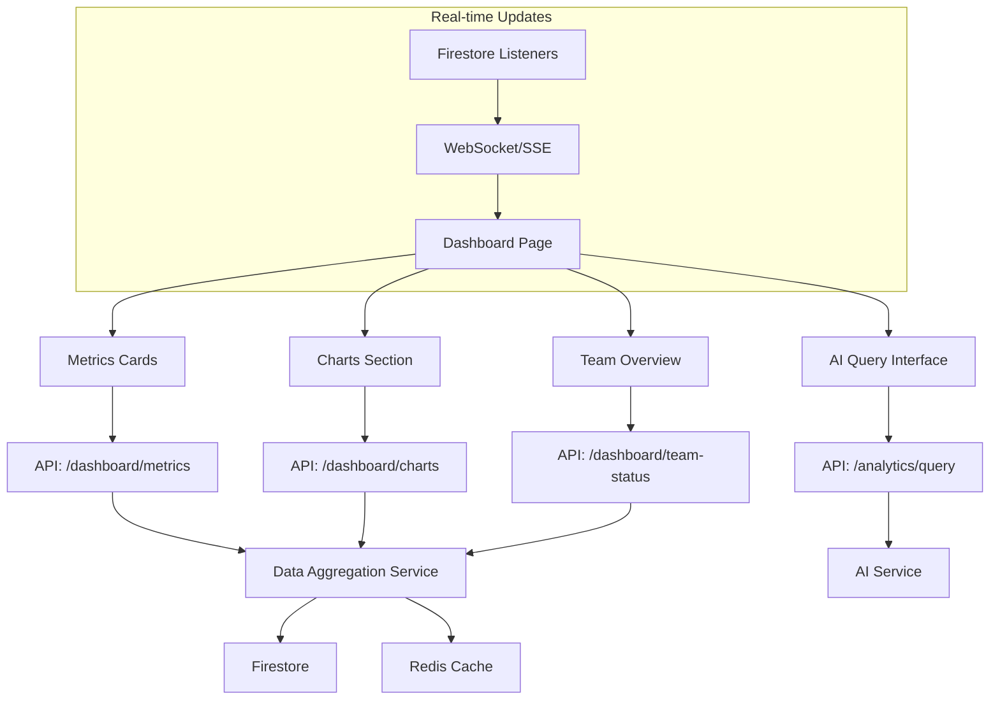

# PRP-123: Dashboard Page with Analytics Integration

name: "儀表板頁面與分析功能整合"
description: |
  建立 DonnaAI Web 版本的主要儀表板頁面，整合關鍵業務指標、趨勢圖表、AI 查詢入口、團隊狀態概覽等功能，為管理階層提供全方位的業務洞察。

## 🎯 Goal
**Backend**: 建立高效能的儀表板資料聚合 API 和即時統計計算
**Frontend**: 實作響應式儀表板介面，支援即時資料更新和互動式圖表  
**UX**: 提供直觀且資訊豐富的管理儀表板，支援快速決策和深度分析

## 💡 Why
- **商業價值**: 為管理層提供即時業務洞察，提升決策效率和準確性
- **用戶影響**: 管理員可以快速掌握組織整體狀況，識別問題和機會
- **問題解決**: 解決分散式資料難以整合和視覺化的挑戰
- **競爭優勢**: 提供類似 Salesforce、HubSpot 等企業級儀表板體驗

## 📋 What

### Backend Requirements
- 儀表板資料聚合 API 開發
- 即時統計計算和快取機制
- 權限導向的資料過濾
- 效能最佳化的資料查詢
- 資料更新通知系統

### Frontend Requirements
- 響應式儀表板佈局設計
- 關鍵指標卡片元件
- 互動式圖表和趨勢分析
- AI 查詢入口整合
- 即時資料更新機制

### UX Requirements
- 清晰的資訊層次和視覺引導
- 快速載入和流暢的互動體驗
- 自訂化和個人化選項
- 行動裝置友善的響應式設計
- 直觀的深入分析入口

### Success Criteria
Backend:
- [ ] 儀表板 API 回應時間 < 500ms
- [ ] 即時統計計算準確性 100%
- [ ] 支援 1000+ 並發使用者
- [ ] 資料快取命中率 > 80%
- [ ] 權限過濾正確性 100%

Frontend:
- [ ] 頁面載入時間 < 2s
- [ ] 圖表渲染時間 < 1s
- [ ] 即時更新延遲 < 3s
- [ ] 響應式設計在所有裝置正常
- [ ] 無障礙輔助功能符合 WCAG 2.1

UX:
- [ ] 使用者可在 30 秒內理解關鍵指標
- [ ] 95% 使用者能成功執行 AI 查詢
- [ ] 儀表板自訂化滿意度 > 4/5
- [ ] 資訊查找效率提升 > 50%
- [ ] 整體使用者體驗評分 > 4.5/5

## 🤖 Agent Collaboration (Phase 1) - 規劃驗證

### 必要 Agents (強制執行)
- [x] **spec-writer**: 儀表板技術規格和 API 設計完成
- [x] **ux-flow-designer**: 儀表板使用者流程和互動模式設計完成
- [x] **typescript-type-guardian**: 儀表板資料模型和介面定義完成
- [x] **risk-assessor**: 效能和資料安全風險評估完成

### Agent 產出文件
- [x] `/docs/specs/dashboard-analytics-technical-spec.md`
- [x] `/docs/ux/dashboard-user-journey-flow.md`
- [x] `/docs/types/dashboard-data-models.ts`
- [x] `/docs/risks/dashboard-performance-risk-assessment.md`

## 🔧 How - Technical Architecture

### System Design

### Dashboard Components
1. **關鍵指標區塊**：業績、客戶數、任務完成率、本月收入
2. **趨勢圖表區塊**：30 天業績趨勢、客戶獲取、團隊表現
3. **AI 查詢入口**：自然語言查詢介面
4. **團隊狀態區塊**：成員活動、任務分配、績效概覽
5. **快速操作區塊**：常用功能和報表連結

### Technology Stack
- **Frontend**: Next.js, React, TypeScript, Recharts
- **Backend**: Next.js API Routes, Firebase Functions
- **Database**: Firestore, Redis (快取)
- **Charts**: Recharts, D3.js (進階圖表)
- **Real-time**: Firestore Listeners, WebSocket
- **AI**: 整合現有 AI 查詢系統

## 📅 Timeline

### Phase 1: 規劃與設計 (Day 1)
**強制 Agent 測試**：
- [x] spec-writer 完成儀表板技術規格
- [x] ux-flow-designer 完成使用者流程設計
- [x] typescript-type-guardian 定義資料模型
- [x] risk-assessor 評估效能風險

### Phase 2: 後端 API 開發 (Day 2-3)
- [ ] 建立儀表板資料聚合 API
- [ ] 實作即時統計計算邏輯
- [ ] 設置 Redis 快取機制
- [ ] 實作權限導向資料過濾
- [ ] 建立資料更新通知系統

**開發中 Agent 測試**：
- [ ] typescript-type-guardian 檢查 API 型別
- [ ] code-refactor-optimizer 優化資料查詢

### Phase 3: 前端儀表板開發 (Day 4-5)
- [ ] 建立響應式儀表板佈局
- [ ] 實作關鍵指標卡片元件
- [ ] 開發互動式圖表元件
- [ ] 整合 AI 查詢入口
- [ ] 實作即時資料更新

**開發中 Agent 測試**：
- [ ] ui-visual-tester 驗證設計規範
- [ ] interaction-tester 測試圖表互動

### Phase 4: 整合和最佳化 (Day 6)
- [ ] 前後端 API 整合測試
- [ ] 效能最佳化和快取調優
- [ ] 即時更新功能測試
- [ ] 響應式設計調整
- [ ] 錯誤處理和載入狀態

**開發中 Agent 測試**：
- [ ] ux-journey-analyzer 驗證使用者流程
- [ ] code-refactor-optimizer 效能優化

### Phase 5: 整合測試與驗證 (Day 7)
**強制 Agent 測試 (必須全部通過)**：
- [ ] **interaction-tester**: 儀表板所有互動功能測試 ✅
- [ ] **ui-visual-tester**: 視覺設計和響應式驗證 ✅
- [ ] **ux-journey-analyzer**: 使用者流程和體驗驗證 ✅
- [ ] **typescript-type-guardian**: 型別安全和資料流檢查 ✅
- [ ] **code-refactor-optimizer**: 效能和程式碼品質審查 ✅

### Phase 6: 文件和部署準備 (Day 8)
- [ ] 儀表板使用指南撰寫
- [ ] API 文件和範例
- [ ] 效能監控設定
- [ ] 使用者訓練材料
- [ ] 備份和災難恢復

**最終 Agent 驗證**：
- [ ] project-shipper 儀表板發布檢查

## ✅ Acceptance Testing Requirements

### 🤖 強制 Agent 測試項目

#### 1. Interaction Testing (interaction-tester)
**必須通過的測試**：
- [ ] 所有指標卡片點擊和 hover 效果
- [ ] 圖表縮放、平移、篩選功能
- [ ] AI 查詢輸入和結果顯示
- [ ] 即時資料更新和通知
- [ ] 響應式佈局在不同裝置尺寸
- [ ] 測試報告：`/docs/tests/dashboard-interaction-test.md`

#### 2. Visual Testing (ui-visual-tester)
**必須通過的測試**：
- [ ] 儀表板設計符合 Notion 風格
- [ ] 圖表顏色和字體一致性
- [ ] 載入狀態和骨架屏效果
- [ ] 錯誤狀態視覺化設計
- [ ] 響應式斷點視覺正確性
- [ ] 測試報告：`/docs/tests/dashboard-visual-test.md`

#### 3. UX Flow Testing (ux-journey-analyzer)
**必須通過的測試**：
- [ ] 新使用者首次訪問體驗
- [ ] 管理員日常監控工作流程
- [ ] AI 查詢使用流程順暢性
- [ ] 資料深入分析路徑清楚
- [ ] 錯誤恢復和幫助機制
- [ ] 測試報告：`/docs/tests/dashboard-ux-flow-test.md`

#### 4. Type Safety Testing (typescript-type-guardian)
**必須通過的測試**：
- [ ] 儀表板資料模型型別正確
- [ ] API 請求/回應型別完整
- [ ] 圖表資料型別安全
- [ ] 即時更新事件型別正確
- [ ] 錯誤處理型別覆蓋完整
- [ ] 測試報告：`/docs/tests/dashboard-type-safety.md`

#### 5. Code Quality Testing (code-refactor-optimizer)
**必須通過的測試**：
- [ ] 資料查詢邏輯最佳化
- [ ] 圖表渲染效能優良
- [ ] 記憶體洩露檢查通過
- [ ] 程式碼結構清晰可維護
- [ ] 無重複的業務邏輯
- [ ] 測試報告：`/docs/tests/dashboard-code-quality.md`

### 📊 測試覆蓋率要求
- **功能測試覆蓋率**: >= 95%
- **API 測試覆蓋率**: >= 90%
- **UI 元件測試覆蓋率**: >= 90%
- **效能測試覆蓋率**: 100%

## 📈 Metrics & Monitoring

### Performance KPIs
- 首次載入時間 < 2s
- 圖表渲染時間 < 1s
- API 回應時間 < 500ms
- 即時更新延遲 < 3s

### Business Metrics
- 儀表板使用頻率 (daily/weekly)
- AI 查詢使用率
- 深入分析點擊率
- 管理決策支援效果

### User Experience Metrics
- 使用者停留時間
- 頁面跳出率 < 20%
- 功能使用完成率 > 85%
- 使用者滿意度 > 4.5/5

## 📚 Documentation

### 必要文件（Agent 產出）
- [ ] 儀表板技術規格文件 (spec-writer)
- [ ] 使用者流程指南 (ux-flow-designer)
- [ ] 資料模型文件 (typescript-type-guardian)
- [ ] 效能評估報告 (risk-assessor)
- [ ] 所有測試報告合集 (testing agents)

### 使用者文件
- [ ] 儀表板功能指南
- [ ] AI 查詢使用手冊
- [ ] 圖表互動教學
- [ ] 常見問題和解決方案
- [ ] 最佳實踐建議

## ⚠️ Known Issues & Mitigations

### 潛在問題
1. **大量資料載入效能**
   - 影響：當組織資料量大時，儀表板載入可能緩慢
   - 緩解措施：實作資料分頁、虛擬滾動、智能快取

2. **即時更新頻率控制**
   - 影響：過於頻繁的更新可能影響使用者體驗
   - 緩解措施：實作適當的節流和防抖機制

3. **跨時區資料顯示**
   - 影響：不同時區的用戶看到的時間資料可能混亂
   - 緩解措施：實作智能時區檢測和轉換

### 依賴項
- Next.js 基礎平台（PRP-120）
- Web 元件庫（PRP-121）
- Firebase 整合（PRP-122）
- 現有業務資料和統計邏輯

## 🚀 Deployment Strategy

### 部署階段
1. **Beta**: 限量管理員使用者測試
2. **Staged Rollout**: 逐步開放給所有管理員
3. **Full Deployment**: 全面上線和監控
4. **Optimization**: 根據使用資料持續優化

### 監控策略
- 即時效能監控和警報
- 使用者行為分析和熱圖
- API 回應時間和錯誤率追蹤
- 業務指標準確性驗證

---

## 📝 PRP 執行檢查清單

### ✅ 開始前
- [ ] 分析現有業務資料結構
- [ ] 初始化所有必要 Agents
- [ ] 建立測試報告目錄：`/docs/tests/dashboard/`

### ✅ 開發中
- [ ] Phase 1: 規劃 Agents 執行完成
- [ ] Phase 2-4: 開發 Agents 持續監控
- [ ] Phase 5: 所有測試 Agents 通過

### ✅ 完成後
- [ ] 所有 Agent 測試報告已生成
- [ ] 效能基準測試通過
- [ ] 使用者驗收測試完成
- [ ] PRP 狀態更新為完成

---

**注意事項**：
1. 儀表板是管理員的主要工作介面，品質要求極高
2. 效能和即時性是關鍵成功因素
3. 所有圖表和統計必須準確無誤
4. 使用者體驗要直觀且專業