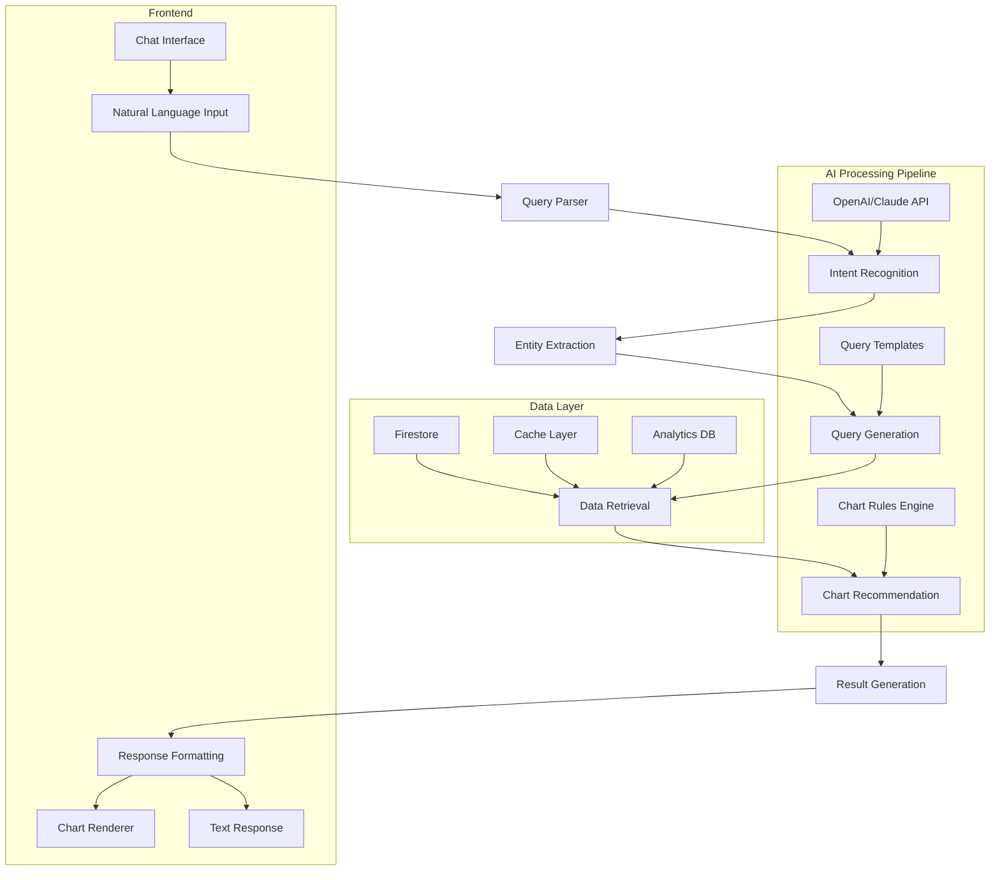

# PRP-124: AI-powered Analytics Query Interface

name: "AI 驅動的分析查詢介面"
description: |
  建立智能分析查詢系統，讓使用者能夠透過自然語言詢問業務問題，AI 自動理解意圖並生成相應的圖表和分析報告，提供類似 ChatGPT 的分析體驗。

## 🎯 Goal
**Backend**: 建立自然語言處理和查詢意圖理解系統，自動生成資料查詢和圖表配置
**Frontend**: 實作對話式查詢介面，支援自然語言輸入和動態圖表生成  
**UX**: 提供直觀的 AI 分析助手體驗，讓非技術用戶也能進行複雜的資料分析

## 💡 Why
- **商業價值**: 降低資料分析門檻，讓所有管理人員都能自主進行深度分析
- **用戶影響**: 管理員可以即時獲得資料洞察，快速驗證假設和發現趨勢
- **問題解決**: 解決傳統 BI 工具複雜難用的問題，實現真正的自助分析
- **競爭優勢**: 提供類似 ChatGPT + Tableau 結合的創新分析體驗

## 📋 What

### Backend Requirements
- 自然語言查詢解析引擎
- 查詢意圖理解和實體提取
- 動態 SQL/Firestore 查詢生成
- 圖表類型智能推薦系統
- 查詢結果快取和最佳化

### Frontend Requirements
- ChatGPT 風格的對話式介面
- 動態圖表生成和渲染
- 查詢歷史和收藏功能
- 報表匯出和分享功能
- 查詢建議和自動完成

### UX Requirements
- 自然且直觀的對話體驗
- 即時的查詢理解反饋
- 清楚的圖表解釋和洞察
- 易於理解的錯誤處理
- 學習和改進的互動機制

### Success Criteria
Backend:
- [ ] 查詢理解準確率 > 85%
- [ ] 圖表生成成功率 > 90%
- [ ] API 回應時間 < 3s
- [ ] 支援 20+ 種查詢類型
- [ ] 快取命中率 > 70%

Frontend:
- [ ] 查詢輸入到圖表顯示 < 5s
- [ ] 支援 10+ 種圖表類型
- [ ] 對話歷史載入 < 1s
- [ ] 圖表匯出功能正常
- [ ] 響應式設計完整支援

UX:
- [ ] 用戶查詢成功率 > 80%
- [ ] 平均查詢時間 < 2 分鐘
- [ ] 用戶滿意度 > 4.2/5
- [ ] 功能採用率 > 60%
- [ ] 錯誤恢復成功率 > 90%

## 🤖 Agent Collaboration (Phase 1) - 規劃驗證

### 必要 Agents (強制執行)
- [ ] **spec-writer**: AI 查詢系統技術規格和架構設計完成
- [ ] **ux-flow-designer**: 對話式查詢使用者流程設計完成
- [ ] **typescript-type-guardian**: AI 查詢資料模型和介面定義完成
- [ ] **risk-assessor**: AI 準確性和效能風險評估完成

### Agent 產出文件
- [ ] `/docs/specs/ai-analytics-query-technical-spec.md`
- [ ] `/docs/ux/conversational-analytics-user-flow.md`
- [ ] `/docs/types/ai-query-data-models.ts`
- [ ] `/docs/risks/ai-query-accuracy-risk-assessment.md`

## 🔧 How - Technical Architecture

### System Design

### Query Processing Pipeline
1. **自然語言解析**：使用 AI 理解用戶查詢意圖
2. **實體提取**：識別時間、數量、人員、類別等實體
3. **查詢生成**：根據意圖生成 Firestore 查詢
4. **資料檢索**：執行查詢並獲取結果
5. **圖表推薦**：根據資料類型推薦最適合的圖表
6. **結果生成**：生成圖表配置和文字解釋
7. **回應格式化**：整合圖表和解釋為完整回應

### Technology Stack
- **AI**: OpenAI GPT-4 或 Claude Sonnet
- **Frontend**: React, TypeScript, Recharts
- **Backend**: Next.js API Routes, Node.js
- **Database**: Firestore, Redis (快取)
- **Charts**: Recharts, Chart.js
- **NLP**: OpenAI API, 自定義規則引擎

## 📅 Timeline

### Phase 1: 規劃與設計 (Day 1)
**強制 Agent 測試**：
- [ ] spec-writer 完成 AI 查詢系統技術規格
- [ ] ux-flow-designer 完成對話式介面流程設計
- [ ] typescript-type-guardian 定義查詢資料模型
- [ ] risk-assessor 評估 AI 準確性風險

### Phase 2: AI 查詢引擎開發 (Day 2-3)
- [ ] 建立自然語言解析服務
- [ ] 實作查詢意圖理解邏輯
- [ ] 開發實體提取和驗證
- [ ] 建立動態查詢生成器
- [ ] 實作圖表推薦引擎

**開發中 Agent 測試**：
- [ ] typescript-type-guardian 檢查 AI 介面型別
- [ ] code-refactor-optimizer 優化 AI 處理邏輯

### Phase 3: 前端對話介面開發 (Day 4-5)
- [ ] 建立 ChatGPT 風格的對話介面
- [ ] 實作動態圖表渲染系統
- [ ] 開發查詢歷史和狀態管理
- [ ] 建立載入狀態和錯誤處理
- [ ] 實作查詢建議和自動完成

**開發中 Agent 測試**：
- [ ] ui-visual-tester 驗證對話介面設計
- [ ] interaction-tester 測試對話互動

### Phase 4: 整合和智能優化 (Day 6)
- [ ] 前後端 AI 系統整合
- [ ] 查詢準確性調優和測試
- [ ] 圖表推薦邏輯優化
- [ ] 效能最佳化和快取策略
- [ ] 錯誤處理和回復機制

**開發中 Agent 測試**：
- [ ] ux-journey-analyzer 驗證查詢流程
- [ ] code-refactor-optimizer AI 邏輯優化

### Phase 5: 整合測試與驗證 (Day 7)
**強制 Agent 測試 (必須全部通過)**：
- [ ] **interaction-tester**: 對話介面和圖表互動測試 ✅
- [ ] **ui-visual-tester**: AI 介面設計和圖表視覺驗證 ✅
- [ ] **ux-journey-analyzer**: 完整查詢流程使用者體驗驗證 ✅
- [ ] **typescript-type-guardian**: AI 系統型別安全檢查 ✅
- [ ] **code-refactor-optimizer**: AI 邏輯和效能品質審查 ✅

### Phase 6: 訓練資料和部署 (Day 8)
- [ ] 準備 AI 訓練資料和範例
- [ ] 建立查詢品質監控系統
- [ ] 實作使用者回饋收集
- [ ] 撰寫 AI 查詢使用指南
- [ ] 設置 A/B 測試環境

**最終 Agent 驗證**：
- [ ] project-shipper AI 查詢系統發布檢查

## ✅ Acceptance Testing Requirements

### 🤖 強制 Agent 測試項目

#### 1. Interaction Testing (interaction-tester)
**必須通過的測試**：
- [ ] 自然語言輸入和查詢提交
- [ ] 對話歷史瀏覽和重新執行
- [ ] 圖表互動（縮放、篩選、匯出）
- [ ] 查詢建議點擊和自動完成
- [ ] 錯誤狀態恢復和重試
- [ ] 測試報告：`/docs/tests/ai-query-interaction-test.md`

#### 2. Visual Testing (ui-visual-tester)
**必須通過的測試**：
- [ ] 對話介面設計符合品牌規範
- [ ] 圖表樣式和顏色一致性
- [ ] 載入動畫和狀態指示器
- [ ] 錯誤訊息和幫助提示設計
- [ ] 響應式佈局在不同螢幕尺寸
- [ ] 測試報告：`/docs/tests/ai-query-visual-test.md`

#### 3. UX Flow Testing (ux-journey-analyzer)
**必須通過的測試**：
- [ ] 新使用者首次 AI 查詢體驗
- [ ] 複雜查詢分步引導流程
- [ ] 查詢失敗時的幫助和恢復
- [ ] 圖表解讀和深入分析路徑
- [ ] 協作和分享查詢結果流程
- [ ] 測試報告：`/docs/tests/ai-query-ux-flow-test.md`

#### 4. Type Safety Testing (typescript-type-guardian)
**必須通過的測試**：
- [ ] AI 查詢請求和回應型別正確
- [ ] 圖表配置和資料型別安全
- [ ] 查詢歷史和狀態型別完整
- [ ] 錯誤處理和例外型別覆蓋
- [ ] AI 解析結果型別驗證
- [ ] 測試報告：`/docs/tests/ai-query-type-safety.md`

#### 5. Code Quality Testing (code-refactor-optimizer)
**必須通過的測試**：
- [ ] AI 查詢邏輯清晰且可維護
- [ ] 查詢快取和最佳化策略
- [ ] 錯誤處理和降級機制
- [ ] AI API 呼叫效率和成本控制
- [ ] 程式碼安全性和資料保護
- [ ] 測試報告：`/docs/tests/ai-query-code-quality.md`

### 📊 測試覆蓋率要求
- **AI 查詢類型覆蓋率**: >= 90%
- **圖表類型覆蓋率**: >= 95%
- **錯誤情境覆蓋率**: 100%
- **使用者互動覆蓋率**: 100%

## 📈 Metrics & Monitoring

### AI Performance KPIs
- 查詢理解準確率 > 85%
- 圖表生成成功率 > 90%
- AI API 回應時間 < 3s
- 查詢處理成功率 > 95%

### User Experience Metrics
- 平均查詢完成時間 < 2 分鐘
- 用戶重複查詢率 > 40%
- 查詢結果滿意度 > 4.2/5
- 功能使用頻率 (queries/user/week)

### Business Impact Metrics
- 自助分析採用率
- 資料驅動決策增加比例
- 分析請求處理效率提升
- 管理洞察準確性改善

## 📚 Documentation

### 必要文件（Agent 產出）
- [ ] AI 查詢系統技術規格 (spec-writer)
- [ ] 對話式分析用戶流程 (ux-flow-designer)
- [ ] AI 查詢資料模型 (typescript-type-guardian)
- [ ] AI 準確性風險評估 (risk-assessor)
- [ ] 所有測試報告合集 (testing agents)

### 使用者文件
- [ ] AI 分析助手使用指南
- [ ] 查詢語句範例和技巧
- [ ] 圖表解讀和分析方法
- [ ] 常見問題和故障排除
- [ ] 進階查詢技巧和最佳實踐

## ⚠️ Known Issues & Mitigations

### 潛在問題
1. **AI 查詢理解不準確**
   - 影響：用戶查詢可能被誤解，產生錯誤結果
   - 緩解措施：建立查詢確認機制，提供查詢改寫建議

2. **AI API 成本和速度**
   - 影響：大量查詢可能導致高額 AI API 費用
   - 緩解措施：實作智能快取、查詢優化、成本控制

3. **複雜查詢處理限制**
   - 影響：某些複雜的分析需求可能超出 AI 能力
   - 緩解措施：提供傳統查詢介面備案，逐步擴展 AI 能力

### 依賴項
- Next.js 基礎平台（PRP-120）
- Web 元件庫（PRP-121）
- Firebase 整合（PRP-122）
- 儀表板頁面（PRP-123）
- OpenAI 或 Claude API 服務

## 🚀 Deployment Strategy

### 分階段發布
1. **Alpha**: 內部測試，有限查詢類型
2. **Beta**: 特定用戶群體，監控準確性
3. **Limited GA**: 逐步開放更多查詢類型
4. **Full GA**: 完整功能上線和持續優化

### AI 品質保證
- 持續監控查詢準確性
- 收集用戶回饋和改進建議
- A/B 測試不同 AI 模型和提示
- 定期更新訓練資料和範例

---

## 📝 PRP 執行檢查清單

### ✅ 開始前
- [ ] 準備 AI API 金鑰和配額
- [ ] 初始化所有必要 Agents
- [ ] 建立測試報告目錄：`/docs/tests/ai-query/`

### ✅ 開發中
- [ ] Phase 1: 規劃 Agents 執行完成
- [ ] Phase 2-4: 開發 Agents 持續監控
- [ ] Phase 5: 所有測試 Agents 通過

### ✅ 完成後
- [ ] 所有 Agent 測試報告已生成
- [ ] AI 準確性測試通過
- [ ] 用戶驗收測試完成
- [ ] PRP 狀態更新為完成

---

**注意事項**：
1. AI 準確性是核心要求，必須持續監控和改進
2. 用戶體驗要直觀，降低學習門檻
3. 成本控制和效能優化同樣重要
4. 錯誤處理和降級機制必須完善