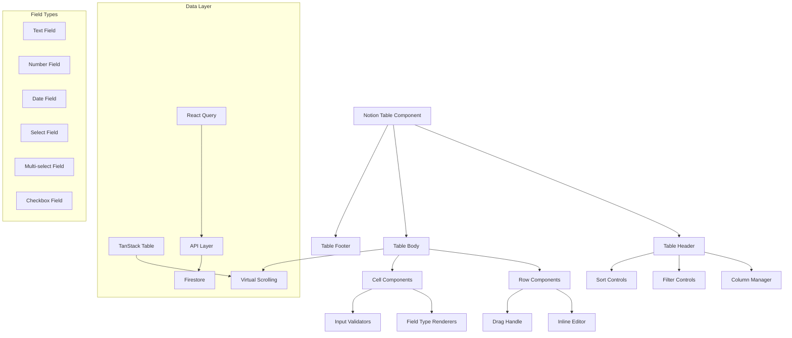

# PRP-125: Notion-style Database Management System

name: "Notion 風格資料庫管理系統"
description: |
  建立功能完整的 Notion 風格資料庫系統，包含內聯編輯、拖拽排序、多種欄位類型、篩選排序、批量操作等進階功能，提供專業級的資料管理體驗。

## 🎯 Goal
**Backend**: 建立高效能的資料庫 CRUD API，支援複雜查詢、批量操作、即時同步
**Frontend**: 實作完整的 Notion 風格表格元件，支援內聯編輯、拖拽、虛擬滾動  
**UX**: 提供流暢直觀的資料管理體驗，讓用戶能夠像使用 Notion 一樣操作資料

## 💡 Why
- **商業價值**: 提供企業級資料管理能力，支援大量資料的高效操作和管理
- **用戶影響**: 讓用戶能夠快速編輯、組織和分析客戶資料，大幅提升工作效率
- **問題解決**: 解決傳統表格操作繁瑣、功能有限的問題
- **競爭優勢**: 提供媲美 Notion、Airtable 的專業資料管理體驗

## 📋 What

### Backend Requirements
- 高效能資料庫 CRUD API 設計
- 支援複雜篩選、排序、分頁查詢
- 批量資料操作和匯入匯出
- 即時資料同步和衝突解決
- 資料驗證和完整性檢查

### Frontend Requirements
- Notion 風格表格 UI 元件
- 內聯編輯和即時儲存功能
- 拖拽排序和欄位調整
- 多種欄位類型支援
- 虛擬滾動和效能最佳化

### UX Requirements
- 流暢的內聯編輯體驗
- 直觀的拖拽操作反饋
- 清楚的資料狀態指示
- 智能的鍵盤導航
- 高效的批量操作流程

### Success Criteria
Backend:
- [ ] API 回應時間 < 200ms
- [ ] 支援 10,000+ 筆資料查詢
- [ ] 批量操作效能 < 3s/1000 筆
- [ ] 即時同步延遲 < 1s
- [ ] 資料一致性 100%

Frontend:
- [ ] 表格渲染時間 < 500ms
- [ ] 內聯編輯回應時間 < 100ms
- [ ] 拖拽操作流暢度 > 60fps
- [ ] 虛擬滾動支援 50,000+ 列
- [ ] 記憶體使用增長 < 10MB/1000 列

UX:
- [ ] 編輯操作學習時間 < 5 分鐘
- [ ] 用戶操作成功率 > 95%
- [ ] 資料錯誤率 < 0.1%
- [ ] 整體滿意度 > 4.5/5
- [ ] 與 Notion 相似度 > 90%

## 🤖 Agent Collaboration (Phase 1) - 規劃驗證

### 必要 Agents (強制執行)
- [ ] **spec-writer**: Notion 資料庫系統技術規格和架構設計完成
- [ ] **ux-flow-designer**: 資料庫操作流程和互動模式設計完成
- [ ] **typescript-type-guardian**: 資料庫模型和表格元件型別定義完成
- [ ] **risk-assessor**: 效能和資料安全風險評估完成

### Agent 產出文件
- [ ] `/docs/specs/notion-database-system-spec.md`
- [ ] `/docs/ux/database-interaction-patterns.md`
- [ ] `/docs/types/database-table-types.ts`
- [ ] `/docs/risks/database-performance-risk-assessment.md`

## 🔧 How - Technical Architecture

### System Design

### Core Components Architecture
1. **NotionTable**: 主要表格容器元件
2. **TableHeader**: 欄位標題、篩選、排序控制
3. **VirtualizedBody**: 虛擬滾動表格主體
4. **EditableCell**: 可編輯儲存格元件
5. **FieldRenderer**: 各種欄位類型渲染器
6. **ColumnManager**: 欄位管理和配置
7. **BulkOperations**: 批量操作工具列

### Technology Stack
- **Table Engine**: TanStack Table v8
- **Virtualization**: TanStack Virtual
- **Drag & Drop**: @dnd-kit/core
- **Data Fetching**: TanStack Query
- **Form Handling**: React Hook Form
- **Validation**: Zod schemas

## 📅 Timeline

### Phase 1: 規劃與設計 (Day 1)
**強制 Agent 測試**：
- [ ] spec-writer 完成 Notion 資料庫系統規格
- [ ] ux-flow-designer 完成資料庫互動流程設計
- [ ] typescript-type-guardian 定義資料庫型別系統
- [ ] risk-assessor 評估效能和安全風險

### Phase 2: 核心表格引擎 (Day 2-3)
- [ ] 建立 TanStack Table 基礎配置
- [ ] 實作虛擬滾動和效能最佳化
- [ ] 開發欄位類型系統架構
- [ ] 建立資料查詢和狀態管理
- [ ] 實作基礎 CRUD 操作

**開發中 Agent 測試**：
- [ ] typescript-type-guardian 檢查表格型別
- [ ] code-refactor-optimizer 優化表格效能

### Phase 3: 內聯編輯系統 (Day 4-5)
- [ ] 實作可編輯儲存格元件
- [ ] 開發各種欄位類型編輯器
- [ ] 建立即時儲存和驗證機制
- [ ] 實作鍵盤導航和快捷鍵
- [ ] 開發錯誤處理和回復機制

**開發中 Agent 測試**：
- [ ] interaction-tester 測試編輯互動
- [ ] ui-visual-tester 驗證編輯器設計

### Phase 4: 進階功能開發 (Day 6-7)
- [ ] 實作拖拽排序和欄位調整
- [ ] 開發篩選和排序系統
- [ ] 建立批量操作功能
- [ ] 實作欄位管理和配置
- [ ] 開發匯入匯出功能

**開發中 Agent 測試**：
- [ ] interaction-tester 測試拖拽功能
- [ ] ux-journey-analyzer 驗證操作流程

### Phase 5: 整合和最佳化 (Day 8-9)
- [ ] 整合所有功能模組
- [ ] 效能最佳化和記憶體管理
- [ ] 即時同步和衝突解決
- [ ] 響應式設計和行動裝置支援
- [ ] 無障礙輔助功能實作

**開發中 Agent 測試**：
- [ ] code-refactor-optimizer 全面效能優化
- [ ] ux-journey-analyzer 完整流程驗證

### Phase 6: 整合測試與驗證 (Day 10)
**強制 Agent 測試 (必須全部通過)**：
- [ ] **interaction-tester**: 所有表格互動和編輯功能測試 ✅
- [ ] **ui-visual-tester**: Notion 風格視覺一致性驗證 ✅
- [ ] **ux-journey-analyzer**: 完整資料管理流程驗證 ✅
- [ ] **typescript-type-guardian**: 型別安全和資料完整性檢查 ✅
- [ ] **code-refactor-optimizer**: 效能和程式碼品質審查 ✅

### Phase 7: 文件和部署 (Day 11)
- [ ] 撰寫 Notion 資料庫使用指南
- [ ] 建立效能監控和警報
- [ ] 準備示範資料和教學
- [ ] 設置 A/B 測試環境
- [ ] 建立用戶回饋收集機制

**最終 Agent 驗證**：
- [ ] project-shipper Notion 資料庫系統發布檢查

## ✅ Acceptance Testing Requirements

### 🤖 強制 Agent 測試項目

#### 1. Interaction Testing (interaction-tester)
**必須通過的測試**：
- [ ] 內聯編輯點擊和鍵盤啟動
- [ ] 各種欄位類型編輯和驗證
- [ ] 拖拽排序行和欄位
- [ ] 篩選器設定和套用
- [ ] 批量選擇和操作
- [ ] 鍵盤導航和快捷鍵
- [ ] 測試報告：`/docs/tests/notion-table-interaction-test.md`

#### 2. Visual Testing (ui-visual-tester)
**必須通過的測試**：
- [ ] 表格外觀與 Notion 高度相似
- [ ] 編輯狀態視覺回饋清楚
- [ ] 拖拽操作視覺指示正確
- [ ] 載入和錯誤狀態設計適當
- [ ] 響應式佈局在不同螢幕正常
- [ ] 測試報告：`/docs/tests/notion-table-visual-test.md`

#### 3. UX Flow Testing (ux-journey-analyzer)
**必須通過的測試**：
- [ ] 新使用者學習編輯流程
- [ ] 大量資料操作工作流程
- [ ] 批量匯入和編輯流程
- [ ] 協作編輯衝突解決
- [ ] 錯誤恢復和資料保護
- [ ] 測試報告：`/docs/tests/notion-table-ux-flow-test.md`

#### 4. Type Safety Testing (typescript-type-guardian)
**必須通過的測試**：
- [ ] 表格資料模型型別完整
- [ ] 欄位類型系統型別安全
- [ ] 編輯操作型別檢查正確
- [ ] API 介面型別定義完整
- [ ] 狀態管理型別安全
- [ ] 測試報告：`/docs/tests/notion-table-type-safety.md`

#### 5. Code Quality Testing (code-refactor-optimizer)
**必須通過的測試**：
- [ ] 虛擬滾動效能最佳化
- [ ] 記憶體使用控制良好
- [ ] 編輯邏輯清晰可維護
- [ ] 拖拽實作高效穩定
- [ ] 錯誤處理機制完善
- [ ] 測試報告：`/docs/tests/notion-table-code-quality.md`

### 📊 測試覆蓋率要求
- **核心功能覆蓋率**: >= 95%
- **欄位類型覆蓋率**: 100%
- **編輯操作覆蓋率**: 100%
- **效能測試覆蓋率**: 100%

## 📈 Metrics & Monitoring

### Performance KPIs
- 表格初始載入 < 500ms
- 內聯編輯啟動 < 100ms
- 拖拽操作流暢度 > 60fps
- 大量資料滾動 < 16ms/frame

### User Experience Metrics
- 編輯操作成功率 > 95%
- 用戶學習時間 < 5 分鐘
- 功能使用頻率統計
- 錯誤回報和恢復率

### Business Impact Metrics
- 資料處理效率提升比例
- 編輯錯誤率降低程度
- 用戶滿意度改善
- 系統採用率增長

## 📚 Documentation

### 必要文件（Agent 產出）
- [ ] Notion 資料庫系統技術規格 (spec-writer)
- [ ] 資料庫互動模式指南 (ux-flow-designer)
- [ ] 完整型別定義文件 (typescript-type-guardian)
- [ ] 效能風險評估報告 (risk-assessor)
- [ ] 所有測試報告合集 (testing agents)

### 使用者文件
- [ ] Notion 風格資料庫使用指南
- [ ] 欄位類型和編輯教學
- [ ] 進階功能操作手冊
- [ ] 快捷鍵和效率技巧
- [ ] 常見問題和故障排除

## ⚠️ Known Issues & Mitigations

### 潛在問題
1. **大量資料效能挑戰**
   - 影響：超過 10,000 筆資料時可能出現效能問題
   - 緩解措施：實作漸進式載入、智能快取、資料分頁

2. **同時編輯衝突**
   - 影響：多用戶同時編輯可能導致資料衝突
   - 緩解措施：實作樂觀鎖定、衝突檢測、自動合併

3. **複雜拖拽在行動裝置的限制**
   - 影響：觸控裝置的拖拽體驗可能不佳
   - 緩解措施：提供替代的觸控友善操作方式

### 依賴項
- Next.js 基礎平台（PRP-120）
- Web 元件庫（PRP-121）
- Firebase 整合（PRP-122）
- TanStack Table 和相關庫

## 🚀 Deployment Strategy

### 分階段發布
1. **Alpha**: 基礎表格功能，有限資料量
2. **Beta**: 完整編輯功能，中等資料量
3. **RC**: 所有功能，大量資料測試
4. **GA**: 正式發布，持續監控優化

### 效能監控
- 即時效能指標追蹤
- 用戶操作行為分析
- 錯誤率和成功率監控
- 記憶體和 CPU 使用監控

---

## 📝 PRP 執行檢查清單

### ✅ 開始前
- [ ] 研究 Notion 表格的詳細互動模式
- [ ] 初始化所有必要 Agents
- [ ] 建立測試報告目錄：`/docs/tests/notion-database/`

### ✅ 開發中
- [ ] Phase 1: 規劃 Agents 執行完成
- [ ] Phase 2-5: 開發 Agents 持續監控
- [ ] Phase 6: 所有測試 Agents 通過

### ✅ 完成後
- [ ] 所有 Agent 測試報告已生成
- [ ] 與 Notion 對比測試通過
- [ ] 效能基準測試達標
- [ ] PRP 狀態更新為完成

---

**注意事項**：
1. 這是整個系統最複雜的元件，品質要求極高
2. 與 Notion 的相似度是關鍵成功指標
3. 效能最佳化是持續的重點工作
4. 用戶體驗必須達到專業級標準