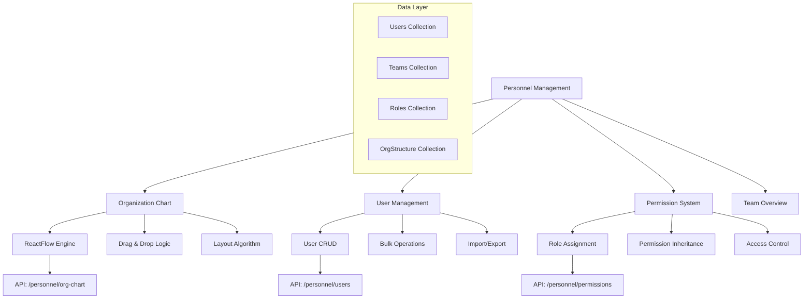

# PRP-126: Personnel Management with Organization Chart

name: "人事管理與組織圖視覺化系統"
description: |
  建立完整的人事管理系統，包含互動式組織圖、用戶權限管理、團隊結構視覺化、角色指派等功能，為組織管理員提供全方位的人員管理工具。

## 🎯 Goal
**Backend**: 建立靈活的組織架構 API，支援複雜的階層關係和權限繼承
**Frontend**: 實作互動式組織圖和人員管理介面，支援拖拽編輯和即時更新  
**UX**: 提供直觀的組織管理體驗，讓管理員能夠輕鬆查看和調整組織結構

## 💡 Why
- **商業價值**: 提供清晰的組織管理工具，提升人員配置和權限管理效率
- **用戶影響**: 管理員可以視覺化地管理團隊結構，快速了解組織狀況
- **問題解決**: 解決複雜組織結構難以理解和管理的問題
- **競爭優勢**: 提供類似 Monday.com、Asana 的專業組織管理功能

## 📋 What

### Backend Requirements
- 階層式組織架構資料模型
- 用戶權限繼承和計算邏輯
- 團隊結構 CRUD API 開發
- 組織變更歷史記錄系統
- 批量用戶管理和匯入功能

### Frontend Requirements
- 互動式組織圖視覺化元件
- 拖拽式組織結構編輯
- 用戶詳情和權限管理介面
- 團隊績效和狀態概覽
- 響應式設計和行動裝置支援

### UX Requirements
- 清晰的組織層級視覺表達
- 直觀的拖拽編輯操作
- 即時的變更反饋和確認
- 權限狀態的清楚指示
- 高效的查找和篩選功能

### Success Criteria
Backend:
- [ ] 支援 1000+ 員工的組織架構
- [ ] 權限計算準確性 100%
- [ ] 組織變更 API 回應 < 300ms
- [ ] 批量操作效能 < 5s/100 人
- [ ] 資料一致性和完整性 100%

Frontend:
- [ ] 組織圖渲染時間 < 1s
- [ ] 拖拽操作流暢度 > 60fps
- [ ] 支援 10 層以上組織層級
- [ ] 響應式設計完整支援
- [ ] 大型組織圖效能穩定

UX:
- [ ] 組織結構理解時間 < 30s
- [ ] 編輯操作成功率 > 95%
- [ ] 用戶查找效率提升 > 50%
- [ ] 權限配置準確率 > 98%
- [ ] 整體滿意度 > 4.3/5

## 🤖 Agent Collaboration (Phase 1) - 規劃驗證

### 必要 Agents (強制執行)
- [ ] **spec-writer**: 人事管理系統技術規格和組織圖架構設計完成
- [ ] **ux-flow-designer**: 組織管理流程和視覺化互動設計完成
- [ ] **typescript-type-guardian**: 組織架構和用戶權限型別定義完成
- [ ] **risk-assessor**: 權限安全和組織複雜度風險評估完成

### Agent 產出文件
- [ ] `/docs/specs/personnel-organization-system-spec.md`
- [ ] `/docs/ux/organization-management-user-flow.md`
- [ ] `/docs/types/organization-chart-types.ts`
- [ ] `/docs/risks/personnel-security-risk-assessment.md`

## 🔧 How - Technical Architecture

### System Design

### Organization Chart Architecture
1. **組織節點模型**：用戶資訊、職位、層級、關係
2. **視覺化引擎**：ReactFlow + 自訂節點和邊線
3. **佈局算法**：樹狀圖自動佈局和手動調整
4. **拖拽系統**：組織結構重新組織功能
5. **權限視覺化**：權限繼承和例外的視覺表達
6. **搜尋和篩選**：快速定位特定人員或團隊

### Technology Stack
- **Visualization**: ReactFlow, D3.js (佈局計算)
- **Drag & Drop**: @dnd-kit/core
- **Data Management**: TanStack Query, Zustand
- **UI Components**: 自訂元件 + Radix UI
- **Charts**: Victory (團隊統計圖表)
- **Export**: Canvas API, SVG (圖表匯出)

## 📅 Timeline

### Phase 1: 規劃與設計 (Day 1)
**強制 Agent 測試**：
- [ ] spec-writer 完成人事管理系統規格
- [ ] ux-flow-designer 完成組織管理流程設計
- [ ] typescript-type-guardian 定義組織架構型別
- [ ] risk-assessor 評估權限安全風險

### Phase 2: 組織架構後端 (Day 2-3)
- [ ] 建立組織架構資料模型
- [ ] 實作階層關係 API
- [ ] 開發權限繼承邏輯
- [ ] 建立組織變更追蹤
- [ ] 實作批量操作 API

**開發中 Agent 測試**：
- [ ] typescript-type-guardian 檢查後端型別
- [ ] code-refactor-optimizer 優化資料結構

### Phase 3: 組織圖視覺化 (Day 4-5)
- [ ] 建立 ReactFlow 組織圖元件
- [ ] 實作自訂節點和邊線設計
- [ ] 開發自動佈局算法
- [ ] 建立縮放和平移功能
- [ ] 實作搜尋和高亮功能

**開發中 Agent 測試**：
- [ ] ui-visual-tester 驗證組織圖設計
- [ ] interaction-tester 測試視覺化互動

### Phase 4: 拖拽編輯功能 (Day 6)
- [ ] 實作節點拖拽移動功能
- [ ] 建立組織結構重組邏輯
- [ ] 開發變更確認和驗證
- [ ] 實作即時更新和同步
- [ ] 建立操作歷史和復原

**開發中 Agent 測試**：
- [ ] interaction-tester 測試拖拽操作
- [ ] ux-journey-analyzer 驗證編輯流程

### Phase 5: 用戶管理功能 (Day 7)
- [ ] 建立用戶詳情管理介面
- [ ] 實作角色和權限指派
- [ ] 開發團隊成員管理
- [ ] 建立用戶狀態監控
- [ ] 實作批量用戶操作

**開發中 Agent 測試**：
- [ ] interaction-tester 測試用戶管理
- [ ] code-refactor-optimizer 優化權限邏輯

### Phase 6: 整合測試與驗證 (Day 8)
**強制 Agent 測試 (必須全部通過)**：
- [ ] **interaction-tester**: 組織圖和用戶管理所有互動測試 ✅
- [ ] **ui-visual-tester**: 組織圖視覺設計和響應式驗證 ✅
- [ ] **ux-journey-analyzer**: 完整人事管理流程驗證 ✅
- [ ] **typescript-type-guardian**: 組織架構型別安全檢查 ✅
- [ ] **code-refactor-optimizer**: 權限系統和效能品質審查 ✅

### Phase 7: 文件和部署 (Day 9)
- [ ] 撰寫組織管理使用指南
- [ ] 建立權限配置最佳實踐
- [ ] 設置組織變更監控
- [ ] 準備示範組織資料
- [ ] 建立備份和恢復程序

**最終 Agent 驗證**：
- [ ] project-shipper 人事管理系統發布檢查

## ✅ Acceptance Testing Requirements

### 🤖 強制 Agent 測試項目

#### 1. Interaction Testing (interaction-tester)
**必須通過的測試**：
- [ ] 組織圖節點點擊和選擇
- [ ] 拖拽移動和組織重組
- [ ] 縮放、平移、搜尋功能
- [ ] 用戶詳情編輯和儲存
- [ ] 權限角色指派和取消
- [ ] 批量用戶操作
- [ ] 測試報告：`/docs/tests/personnel-org-chart-interaction-test.md`

#### 2. Visual Testing (ui-visual-tester)
**必須通過的測試**：
- [ ] 組織圖佈局和節點設計
- [ ] 權限狀態視覺指示器
- [ ] 層級關係線條和箭頭
- [ ] 用戶頭像和資訊顯示
- [ ] 響應式佈局調整
- [ ] 測試報告：`/docs/tests/personnel-org-chart-visual-test.md`

#### 3. UX Flow Testing (ux-journey-analyzer)
**必須通過的測試**：
- [ ] 新管理員首次組織設置
- [ ] 組織結構調整工作流程
- [ ] 新員工加入和權限配置
- [ ] 團隊重組和權限轉移
- [ ] 大型組織的導航和管理
- [ ] 測試報告：`/docs/tests/personnel-org-chart-ux-flow-test.md`

#### 4. Type Safety Testing (typescript-type-guardian)
**必須通過的測試**：
- [ ] 組織架構資料模型型別正確
- [ ] 權限系統型別完整性
- [ ] 組織圖節點和邊線型別
- [ ] API 請求回應型別安全
- [ ] 狀態管理型別檢查
- [ ] 測試報告：`/docs/tests/personnel-org-chart-type-safety.md`

#### 5. Code Quality Testing (code-refactor-optimizer)
**必須通過的測試**：
- [ ] 組織圖渲染效能最佳化
- [ ] 權限計算邏輯效率
- [ ] 拖拽操作流暢性
- [ ] 大型組織資料處理
- [ ] 安全性和存取控制
- [ ] 測試報告：`/docs/tests/personnel-org-chart-code-quality.md`

### 📊 測試覆蓋率要求
- **組織管理功能覆蓋率**: >= 95%
- **權限系統覆蓋率**: 100%
- **視覺化元件覆蓋率**: >= 90%
- **安全性測試覆蓋率**: 100%

## 📈 Metrics & Monitoring

### Performance KPIs
- 組織圖載入時間 < 1s
- 拖拽操作回應時間 < 100ms
- 權限計算時間 < 200ms
- 大型組織圖渲染 < 3s

### User Experience Metrics
- 組織結構理解速度
- 編輯操作成功率 > 95%
- 用戶查找效率
- 權限配置準確率

### Business Impact Metrics
- 組織管理效率提升
- 權限錯誤率降低
- 人員配置最佳化效果
- 管理決策支援改善

## 📚 Documentation

### 必要文件（Agent 產出）
- [ ] 人事管理系統技術規格 (spec-writer)
- [ ] 組織管理流程指南 (ux-flow-designer)
- [ ] 組織架構型別文件 (typescript-type-guardian)
- [ ] 權限安全評估報告 (risk-assessor)
- [ ] 所有測試報告合集 (testing agents)

### 管理員文件
- [ ] 組織圖使用和編輯指南
- [ ] 權限系統設定手冊
- [ ] 用戶管理最佳實踐
- [ ] 組織變更程序指南
- [ ] 故障排除和常見問題

## ⚠️ Known Issues & Mitigations

### 潛在問題
1. **大型組織圖效能**
   - 影響：超過 500 人的組織圖可能載入緩慢
   - 緩解措施：實作分層載入、視窗化渲染、LOD 技術

2. **複雜權限繼承計算**
   - 影響：多層級權限繼承可能導致計算複雜
   - 緩解措施：快取權限計算結果、最佳化演算法

3. **組織變更衝突**
   - 影響：同時進行組織調整可能產生衝突
   - 緩解措施：實作樂觀鎖定、變更佇列機制

### 依賴項
- Next.js 基礎平台（PRP-120）
- Web 元件庫（PRP-121）
- Firebase 整合（PRP-122）
- ReactFlow 和拖拽庫

## 🚀 Deployment Strategy

### 分階段發布
1. **Alpha**: 基礎組織圖查看功能
2. **Beta**: 增加編輯和權限管理
3. **RC**: 完整功能和大型組織測試
4. **GA**: 正式發布和持續最佳化

### 安全考量
- 權限變更審計日誌
- 敏感操作二次確認
- 資料存取記錄追蹤
- 定期權限審核機制

---

## 📝 PRP 執行檢查清單

### ✅ 開始前
- [ ] 分析現有組織架構資料
- [ ] 初始化所有必要 Agents
- [ ] 建立測試報告目錄：`/docs/tests/personnel-org-chart/`

### ✅ 開發中
- [ ] Phase 1: 規劃 Agents 執行完成
- [ ] Phase 2-5: 開發 Agents 持續監控
- [ ] Phase 6: 所有測試 Agents 通過

### ✅ 完成後
- [ ] 所有 Agent 測試報告已生成
- [ ] 權限安全審核通過
- [ ] 大型組織效能測試完成
- [ ] PRP 狀態更新為完成

---

**注意事項**：
1. 權限安全是最高優先級，不可有漏洞
2. 大型組織的效能表現至關重要
3. 用戶體驗要直觀，降低學習成本
4. 組織變更要有完整的追蹤和審計