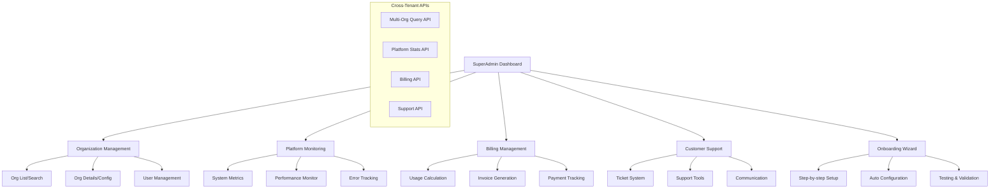

# PRP-127: SuperAdmin Platform Management Interface

name: "SuperAdmin 平台管理介面"
description: |
  建立 SuperAdmin 專用的平台管理系統，包含組織管理、客戶導入精靈、平台監控、計費管理、客戶支援等全方位的 SaaS 平台營運工具。

## 🎯 Goal
**Backend**: 建立跨組織的資料存取 API，支援平台級監控、計費計算、客戶管理
**Frontend**: 實作功能豐富的 SuperAdmin 管理介面，支援多租戶管理和平台營運  
**UX**: 提供高效的平台管理體驗，讓 SuperAdmin 能夠有效監控和支援整個 SaaS 平台

## 💡 Why
- **商業價值**: 提供專業的 SaaS 平台營運工具，支援規模化客戶管理和服務
- **用戶影響**: SuperAdmin 可以高效管理所有客戶組織，提供及時支援和監控
- **問題解決**: 解決多租戶 SaaS 平台營運管理的複雜性挑戰
- **競爭優勢**: 提供類似 Stripe Dashboard、AWS Console 的企業級管理體驗

## 📋 What

### Backend Requirements
- 跨組織資料存取和權限控制
- 平台使用量統計和計費計算
- 客戶組織管理和配置 API
- 系統監控和健康檢查 API
- 客戶導入和自動化配置

### Frontend Requirements
- 多租戶組織管理介面
- 客戶導入精靈和自動化流程
- 平台監控儀表板和警報
- 計費管理和發票系統
- 客戶支援工具和工單系統

### UX Requirements
- 清晰的多租戶資料組織
- 高效的客戶管理工作流程
- 即時的平台狀態監控
- 直觀的計費和使用量展示
- 便捷的客戶支援工具

### Success Criteria
Backend:
- [ ] 支援 1000+ 組織管理
- [ ] 跨組織查詢效能 < 1s
- [ ] 計費計算準確性 100%
- [ ] 監控資料即時性 < 30s
- [ ] API 可用性 > 99.9%

Frontend:
- [ ] 組織列表載入 < 2s
- [ ] 客戶導入流程 < 10 分鐘
- [ ] 監控儀表板更新 < 5s
- [ ] 支援 10,000+ 組織瀏覽
- [ ] 響應式設計完整支援

UX:
- [ ] 平台管理學習時間 < 30 分鐘
- [ ] 客戶問題解決效率提升 > 50%
- [ ] 導入流程成功率 > 95%
- [ ] SuperAdmin 滿意度 > 4.5/5
- [ ] 平台營運效率提升 > 40%

## 🤖 Agent Collaboration (Phase 1) - 規劃驗證

### 必要 Agents (強制執行)
- [ ] **spec-writer**: SuperAdmin 平台管理系統技術規格設計完成
- [ ] **ux-flow-designer**: 平台管理流程和客戶支援流程設計完成
- [ ] **typescript-type-guardian**: 多租戶資料模型和管理介面型別定義完成
- [ ] **risk-assessor**: 平台安全和資料隔離風險評估完成

### Agent 產出文件
- [ ] `/docs/specs/superadmin-platform-management-spec.md`
- [ ] `/docs/ux/superadmin-workflow-design.md`
- [ ] `/docs/types/multi-tenant-management-types.ts`
- [ ] `/docs/risks/platform-security-risk-assessment.md`

## 🔧 How - Technical Architecture

### System Design

### Multi-Tenant Architecture
1. **組織隔離層**：確保資料安全和存取控制
2. **跨租戶查詢引擎**：高效聚合多組織資料
3. **計費計算引擎**：自動計算使用量和費用
4. **監控聚合器**：收集和分析平台指標
5. **導入自動化器**：標準化客戶導入流程
6. **支援工具集**：客戶問題診斷和解決

### Technology Stack
- **Frontend**: Next.js, React, TypeScript, Recharts
- **Backend**: Next.js API Routes, Firebase Admin
- **Database**: Firestore (多租戶策略)
- **Monitoring**: Firebase Analytics, Custom Metrics
- **Billing**: Stripe API Integration
- **Communication**: Email API, Slack Integration

## 📅 Timeline

### Phase 1: 規劃與設計 (Day 1)
**強制 Agent 測試**：
- [ ] spec-writer 完成 SuperAdmin 平台管理規格
- [ ] ux-flow-designer 完成平台管理流程設計
- [ ] typescript-type-guardian 定義多租戶管理型別
- [ ] risk-assessor 評估平台安全風險

### Phase 2: 組織管理系統 (Day 2-3)
- [ ] 建立跨組織資料存取 API
- [ ] 實作組織列表和搜尋功能
- [ ] 開發組織詳情和配置介面
- [ ] 建立組織狀態管理
- [ ] 實作批量組織操作

**開發中 Agent 測試**：
- [ ] typescript-type-guardian 檢查多租戶型別
- [ ] code-refactor-optimizer 優化跨組織查詢

### Phase 3: 平台監控系統 (Day 4)
- [ ] 建立平台指標收集 API
- [ ] 實作監控儀表板介面
- [ ] 開發警報和通知系統
- [ ] 建立效能追蹤和分析
- [ ] 實作錯誤監控和日誌

**開發中 Agent 測試**：
- [ ] ui-visual-tester 驗證監控介面設計
- [ ] interaction-tester 測試監控互動

### Phase 4: 客戶導入精靈 (Day 5)
- [ ] 設計多步驟導入流程
- [ ] 實作自動化配置邏輯
- [ ] 建立導入進度追蹤
- [ ] 開發測試和驗證機制
- [ ] 實作導入完成通知

**開發中 Agent 測試**：
- [ ] ux-journey-analyzer 驗證導入流程
- [ ] interaction-tester 測試精靈步驟

### Phase 5: 計費和支援系統 (Day 6-7)
- [ ] 建立使用量計算 API
- [ ] 實作計費管理介面
- [ ] 開發客戶支援工具
- [ ] 建立工單系統
- [ ] 實作溝通和協作功能

**開發中 Agent 測試**：
- [ ] code-refactor-optimizer 優化計費邏輯
- [ ] ux-journey-analyzer 驗證支援流程

### Phase 6: 整合測試與驗證 (Day 8)
**強制 Agent 測試 (必須全部通過)**：
- [ ] **interaction-tester**: 所有 SuperAdmin 功能互動測試 ✅
- [ ] **ui-visual-tester**: 平台管理介面設計和一致性驗證 ✅
- [ ] **ux-journey-analyzer**: 完整平台管理流程驗證 ✅
- [ ] **typescript-type-guardian**: 多租戶型別安全檢查 ✅
- [ ] **code-refactor-optimizer**: 安全性和效能品質審查 ✅

### Phase 7: 安全性和部署 (Day 9)
- [ ] 多租戶安全性審核
- [ ] 存取控制和權限驗證
- [ ] 監控和警報設定
- [ ] 備份和災難恢復
- [ ] 文件和訓練材料

**最終 Agent 驗證**：
- [ ] project-shipper SuperAdmin 平台發布檢查

## ✅ Acceptance Testing Requirements

### 🤖 強制 Agent 測試項目

#### 1. Interaction Testing (interaction-tester)
**必須通過的測試**：
- [ ] 組織列表搜尋和篩選
- [ ] 組織詳情查看和編輯
- [ ] 客戶導入精靈全流程
- [ ] 監控儀表板互動和警報
- [ ] 計費管理和發票操作
- [ ] 支援工單建立和處理
- [ ] 測試報告：`/docs/tests/superadmin-platform-interaction-test.md`

#### 2. Visual Testing (ui-visual-tester)
**必須通過的測試**：
- [ ] SuperAdmin 介面設計專業性
- [ ] 多租戶資料視覺組織
- [ ] 監控圖表和指標顯示
- [ ] 導入精靈步驟視覺引導
- [ ] 計費資料清楚易懂
- [ ] 測試報告：`/docs/tests/superadmin-platform-visual-test.md`

#### 3. UX Flow Testing (ux-journey-analyzer)
**必須通過的測試**：
- [ ] 新客戶完整導入流程
- [ ] 日常平台監控工作流程
- [ ] 客戶問題支援處理流程
- [ ] 計費問題調查和解決
- [ ] 平台事件回應流程
- [ ] 測試報告：`/docs/tests/superadmin-platform-ux-flow-test.md`

#### 4. Type Safety Testing (typescript-type-guardian)
**必須通過的測試**：
- [ ] 多租戶資料模型型別正確
- [ ] 跨組織 API 型別安全
- [ ] 監控資料型別完整性
- [ ] 計費計算型別準確性
- [ ] 支援系統型別定義
- [ ] 測試報告：`/docs/tests/superadmin-platform-type-safety.md`

#### 5. Code Quality Testing (code-refactor-optimizer)
**必須通過的測試**：
- [ ] 多租戶資料隔離安全性
- [ ] 跨組織查詢效能最佳化
- [ ] 計費計算邏輯準確性
- [ ] 監控系統穩定性
- [ ] 程式碼安全性和存取控制
- [ ] 測試報告：`/docs/tests/superadmin-platform-code-quality.md`

### 📊 測試覆蓋率要求
- **平台管理功能覆蓋率**: >= 95%
- **安全性測試覆蓋率**: 100%
- **多租戶隔離測試覆蓋率**: 100%
- **計費系統測試覆蓋率**: 100%

## 📈 Metrics & Monitoring

### Platform KPIs
- 平台總體可用性 > 99.9%
- 跨組織查詢效能 < 1s
- 客戶導入成功率 > 95%
- 支援響應時間 < 2 小時

### Business Metrics
- 客戶滿意度分數
- 平台收入成長率
- 客戶流失率控制
- 支援成本效率

### Operational Metrics
- SuperAdmin 工作效率
- 平台問題解決時間
- 客戶導入完成時間
- 系統監控覆蓋率

## 📚 Documentation

### 必要文件（Agent 產出）
- [ ] SuperAdmin 平台管理技術規格 (spec-writer)
- [ ] 平台管理流程指南 (ux-flow-designer)
- [ ] 多租戶管理型別文件 (typescript-type-guardian)
- [ ] 平台安全風險評估 (risk-assessor)
- [ ] 所有測試報告合集 (testing agents)

### 營運文件
- [ ] SuperAdmin 平台管理手冊
- [ ] 客戶導入標準流程
- [ ] 平台監控和警報指南
- [ ] 客戶支援最佳實踐
- [ ] 計費和發票管理程序

## ⚠️ Known Issues & Mitigations

### 潛在問題
1. **多租戶資料隔離**
   - 影響：不同組織資料可能出現交叉存取風險
   - 緩解措施：實作嚴格的資料隔離和存取控制

2. **大規模組織管理效能**
   - 影響：管理數千個組織時可能出現效能問題
   - 緩解措施：實作分頁、虛擬滾動、智能快取

3. **計費計算複雜性**
   - 影響：複雜的使用量計算可能導致計費錯誤
   - 緩解措施：多層驗證、審計追蹤、定期對帳

### 依賴項
- Next.js 基礎平台（PRP-120）
- Web 元件庫（PRP-121）
- Firebase 整合（PRP-122）
- 現有多租戶架構和資料

## 🚀 Deployment Strategy

### 安全部署
1. **Staging**: 完整安全性測試和滲透測試
2. **Limited Beta**: 內部 SuperAdmin 使用
3. **Production**: 正式上線和持續監控
4. **Monitoring**: 全面監控和警報設定

### 權限控制
- SuperAdmin 存取記錄和審計
- 敏感操作多重驗證
- 資料存取範圍限制
- 定期權限審核和更新

---

## 📝 PRP 執行檢查清單

### ✅ 開始前
- [ ] 規劃多租戶資料存取策略
- [ ] 初始化所有必要 Agents
- [ ] 建立測試報告目錄：`/docs/tests/superadmin-platform/`

### ✅ 開發中
- [ ] Phase 1: 規劃 Agents 執行完成
- [ ] Phase 2-5: 開發 Agents 持續監控
- [ ] Phase 6: 所有測試 Agents 通過

### ✅ 完成後
- [ ] 所有 Agent 測試報告已生成
- [ ] 安全性審核和滲透測試通過
- [ ] 多租戶隔離驗證完成
- [ ] PRP 狀態更新為完成

---

**注意事項**：
1. 資料安全和隔離是絕對優先級
2. 計費準確性關乎商業信譽，必須確保無誤
3. 平台穩定性影響所有客戶，需要全面監控
4. SuperAdmin 工具要高效，支援快速問題解決