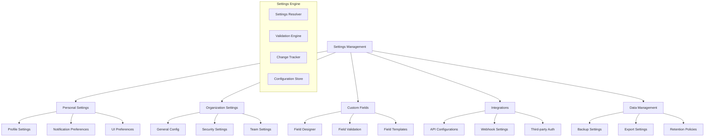

# PRP-128: Settings & Configuration Management

name: "設定與配置管理系統"
description: |
  建立完整的系統設定管理功能，包含個人資料設定、組織配置、自訂欄位定義、第三方整合、通知偏好、資料管理等全方位的設定介面。

## 🎯 Goal
**Backend**: 建立靈活的設定管理 API，支援層級式配置、動態欄位定義、整合配置
**Frontend**: 實作直觀的設定介面，支援即時預覽、批量配置、匯入匯出  
**UX**: 提供清晰易用的設定體驗，讓用戶能夠輕鬆自訂系統行為和偏好

## 💡 Why
- **商業價值**: 提供彈性的系統配置能力，支援不同組織的客製化需求
- **用戶影響**: 用戶可以根據需求調整系統行為，提升使用體驗和工作效率
- **問題解決**: 解決一體適用系統無法滿足個別需求的問題
- **競爭優勢**: 提供類似 Slack、Notion 的豐富設定和自訂功能

## 📋 What

### Backend Requirements
- 層級式設定管理（個人/組織/全域）
- 動態自訂欄位定義和驗證
- 第三方服務整合配置
- 設定變更歷史和復原
- 設定匯入匯出和範本

### Frontend Requirements
- 分類清楚的設定介面架構
- 即時預覽和變更確認
- 自訂欄位設計器
- 整合配置精靈
- 設定搜尋和快速存取

### UX Requirements
- 直觀的設定分類和導航
- 清楚的選項說明和幫助
- 即時的變更預覽和回饋
- 安全的設定變更確認
- 高效的批量配置流程

### Success Criteria
Backend:
- [ ] 設定更新回應時間 < 300ms
- [ ] 支援 100+ 自訂欄位定義
- [ ] 設定同步準確性 100%
- [ ] 設定驗證錯誤率 < 1%
- [ ] 設定備份恢復成功率 100%

Frontend:
- [ ] 設定頁面載入時間 < 1s
- [ ] 設定變更即時預覽 < 200ms
- [ ] 支援複雜的設定組合
- [ ] 響應式設計完整支援
- [ ] 設定搜尋結果準確

UX:
- [ ] 設定查找時間 < 30s
- [ ] 設定變更成功率 > 98%
- [ ] 用戶設定滿意度 > 4.3/5
- [ ] 設定錯誤恢復率 > 95%
- [ ] 設定學習時間 < 10 分鐘

## 🤖 Agent Collaboration (Phase 1) - 規劃驗證

### 必要 Agents (強制執行)
- [ ] **spec-writer**: 設定管理系統技術規格和架構設計完成
- [ ] **ux-flow-designer**: 設定配置流程和使用者體驗設計完成
- [ ] **typescript-type-guardian**: 設定資料模型和介面型別定義完成
- [ ] **risk-assessor**: 設定安全性和資料完整性風險評估完成

### Agent 產出文件
- [ ] `/docs/specs/settings-configuration-system-spec.md`
- [ ] `/docs/ux/settings-management-user-flow.md`
- [ ] `/docs/types/settings-configuration-types.ts`
- [ ] `/docs/risks/settings-security-risk-assessment.md`

## 🔧 How - Technical Architecture

### System Design

### Settings Hierarchy
1. **全域設定**：系統預設值和限制
2. **組織設定**：組織層級的配置和政策
3. **團隊設定**：團隊特定的配置和偏好
4. **個人設定**：使用者個人偏好和客製化
5. **覆蓋規則**：設定優先級和繼承邏輯

### Technology Stack
- **Frontend**: Next.js, React, TypeScript, React Hook Form
- **Backend**: Next.js API Routes, Zod Validation
- **Database**: Firestore (設定儲存)
- **Validation**: Zod schemas, Custom validators
- **Forms**: React Hook Form + Zod resolver
- **Preview**: Real-time configuration application

## 📅 Timeline

### Phase 1: 規劃與設計 (Day 1)
**強制 Agent 測試**：
- [ ] spec-writer 完成設定管理系統規格
- [ ] ux-flow-designer 完成設定管理流程設計
- [ ] typescript-type-guardian 定義設定資料型別
- [ ] risk-assessor 評估設定安全風險

### Phase 2: 設定架構建立 (Day 2)
- [ ] 建立層級式設定管理 API
- [ ] 實作設定解析和繼承邏輯
- [ ] 開發設定驗證引擎
- [ ] 建立設定變更追蹤
- [ ] 實作設定備份和恢復

**開發中 Agent 測試**：
- [ ] typescript-type-guardian 檢查設定型別
- [ ] code-refactor-optimizer 優化設定邏輯

### Phase 3: 個人和組織設定 (Day 3-4)
- [ ] 建立個人資料設定介面
- [ ] 實作通知偏好配置
- [ ] 開發組織基本設定
- [ ] 建立安全性設定
- [ ] 實作 UI 偏好設定

**開發中 Agent 測試**：
- [ ] ui-visual-tester 驗證設定介面設計
- [ ] interaction-tester 測試設定互動

### Phase 4: 自訂欄位系統 (Day 5)
- [ ] 建立自訂欄位設計器
- [ ] 實作欄位類型和驗證
- [ ] 開發欄位範本系統
- [ ] 建立欄位預覽功能
- [ ] 實作欄位批量管理

**開發中 Agent 測試**：
- [ ] interaction-tester 測試欄位設計器
- [ ] ux-journey-analyzer 驗證設計流程

### Phase 5: 整合和資料管理 (Day 6)
- [ ] 建立第三方整合配置
- [ ] 實作 API 和 Webhook 設定
- [ ] 開發資料匯出設定
- [ ] 建立備份和保留政策
- [ ] 實作設定範本功能

**開發中 Agent 測試**：
- [ ] code-refactor-optimizer 優化整合邏輯
- [ ] ux-journey-analyzer 驗證配置流程

### Phase 6: 整合測試與驗證 (Day 7)
**強制 Agent 測試 (必須全部通過)**：
- [ ] **interaction-tester**: 所有設定功能互動測試 ✅
- [ ] **ui-visual-tester**: 設定介面設計和一致性驗證 ✅
- [ ] **ux-journey-analyzer**: 完整設定管理流程驗證 ✅
- [ ] **typescript-type-guardian**: 設定型別安全檢查 ✅
- [ ] **code-refactor-optimizer**: 設定邏輯和安全性品質審查 ✅

### Phase 7: 文件和部署 (Day 8)
- [ ] 撰寫設定管理使用指南
- [ ] 建立設定最佳實踐文件
- [ ] 設置設定變更監控
- [ ] 準備設定範本庫
- [ ] 建立設定故障排除

**最終 Agent 驗證**：
- [ ] project-shipper 設定管理系統發布檢查

## ✅ Acceptance Testing Requirements

### 🤖 強制 Agent 測試項目

#### 1. Interaction Testing (interaction-tester)
**必須通過的測試**：
- [ ] 設定分類導航和搜尋
- [ ] 各種設定選項變更和儲存
- [ ] 自訂欄位設計和預覽
- [ ] 整合配置精靈流程
- [ ] 設定匯入匯出功能
- [ ] 設定復原和重設功能
- [ ] 測試報告：`/docs/tests/settings-configuration-interaction-test.md`

#### 2. Visual Testing (ui-visual-tester)
**必須通過的測試**：
- [ ] 設定介面佈局和導航
- [ ] 設定變更即時預覽效果
- [ ] 自訂欄位設計器 UI
- [ ] 整合配置精靈視覺
- [ ] 設定狀態和回饋指示器
- [ ] 測試報告：`/docs/tests/settings-configuration-visual-test.md`

#### 3. UX Flow Testing (ux-journey-analyzer)
**必須通過的測試**：
- [ ] 新用戶首次設定配置
- [ ] 組織管理員設定流程
- [ ] 自訂欄位建立和使用
- [ ] 第三方整合設定流程
- [ ] 設定問題故障排除
- [ ] 測試報告：`/docs/tests/settings-configuration-ux-flow-test.md`

#### 4. Type Safety Testing (typescript-type-guardian)
**必須通過的測試**：
- [ ] 設定資料模型型別正確
- [ ] 層級式設定型別繼承
- [ ] 自訂欄位型別系統
- [ ] 設定驗證規則型別
- [ ] API 介面型別安全
- [ ] 測試報告：`/docs/tests/settings-configuration-type-safety.md`

#### 5. Code Quality Testing (code-refactor-optimizer)
**必須通過的測試**：
- [ ] 設定解析邏輯效能
- [ ] 設定驗證引擎效率
- [ ] 設定變更追蹤準確性
- [ ] 敏感設定安全保護
- [ ] 設定架構可維護性
- [ ] 測試報告：`/docs/tests/settings-configuration-code-quality.md`

### 📊 測試覆蓋率要求
- **設定功能覆蓋率**: >= 95%
- **自訂欄位系統覆蓋率**: 100%
- **設定驗證覆蓋率**: 100%
- **安全性測試覆蓋率**: 100%

## 📈 Metrics & Monitoring

### Performance KPIs
- 設定載入時間 < 1s
- 設定變更回應 < 300ms
- 設定搜尋速度 < 500ms
- 自訂欄位建立 < 2s

### User Experience Metrics
- 設定查找成功率 > 95%
- 設定變更成功率 > 98%
- 用戶設定採用率
- 設定相關支援請求數

### System Health Metrics
- 設定同步成功率
- 設定驗證錯誤率
- 設定復原成功率
- 設定備份完整性

## 📚 Documentation

### 必要文件（Agent 產出）
- [ ] 設定管理系統技術規格 (spec-writer)
- [ ] 設定管理流程指南 (ux-flow-designer)
- [ ] 設定型別定義文件 (typescript-type-guardian)
- [ ] 設定安全風險評估 (risk-assessor)
- [ ] 所有測試報告合集 (testing agents)

### 使用者文件
- [ ] 設定管理完整指南
- [ ] 自訂欄位設計教學
- [ ] 第三方整合設定手冊
- [ ] 設定最佳實踐建議
- [ ] 設定故障排除指南

## ⚠️ Known Issues & Mitigations

### 潛在問題
1. **複雜設定依賴關係**
   - 影響：某些設定變更可能影響其他設定
   - 緩解措施：實作設定依賴檢查和警告機制

2. **設定衝突解決**
   - 影響：層級式設定可能產生衝突或覆蓋問題
   - 緩解措施：清楚的優先級規則和衝突提示

3. **大量自訂欄位效能**
   - 影響：過多自訂欄位可能影響系統效能
   - 緩解措施：合理的欄位數量限制和最佳化

### 依賴項
- Next.js 基礎平台（PRP-120）
- Web 元件庫（PRP-121）
- Firebase 整合（PRP-122）
- 現有使用者和組織系統

## 🚀 Deployment Strategy

### 漸進式發布
1. **Alpha**: 基礎個人設定功能
2. **Beta**: 增加組織設定和自訂欄位
3. **RC**: 完整功能和整合配置
4. **GA**: 正式發布和持續優化

### 設定遷移
- 現有設定資料遷移計劃
- 向後相容性保證
- 設定升級和版本管理
- 使用者設定保留策略

---

## 📝 PRP 執行檢查清單

### ✅ 開始前
- [ ] 分析現有設定和配置需求
- [ ] 初始化所有必要 Agents
- [ ] 建立測試報告目錄：`/docs/tests/settings-configuration/`

### ✅ 開發中
- [ ] Phase 1: 規劃 Agents 執行完成
- [ ] Phase 2-5: 開發 Agents 持續監控
- [ ] Phase 6: 所有測試 Agents 通過

### ✅ 完成後
- [ ] 所有 Agent 測試報告已生成
- [ ] 設定遷移測試通過
- [ ] 安全性審核完成
- [ ] PRP 狀態更新為完成

---

**注意事項**：
1. 設定變更要有明確的確認和復原機制
2. 敏感設定必須有額外的安全保護
3. 設定介面要直觀，降低錯誤配置風險
4. 設定系統要有完整的審計追蹤