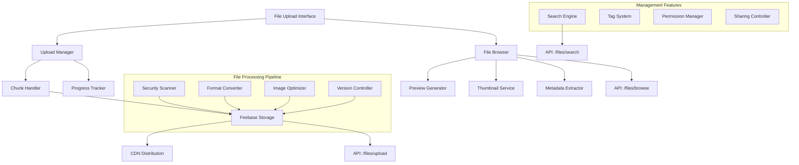

# PRP-129: Advanced File Upload & Media Management

name: "進階檔案上傳與媒體管理系統"
description: |
  建立企業級的檔案管理系統，包含拖拽上傳、進度顯示、檔案預覽、版本控制、批量操作、CDN 整合等功能，為 Web 平台提供完整的媒體資產管理能力。

## 🎯 Goal
**Backend**: 建立高效能的檔案處理 API，支援大檔案上傳、格式轉換、CDN 分發
**Frontend**: 實作現代化的檔案管理介面，支援拖拽上傳、即時預覽、批量操作  
**UX**: 提供直觀流暢的檔案管理體驗，讓用戶能夠輕鬆管理各種媒體資產

## 💡 Why
- **商業價值**: 提供專業的媒體資產管理能力，支援行銷內容和客戶資料的集中管理
- **用戶影響**: 用戶可以高效管理檔案、圖片、文件，支援多媒體內容的業務流程
- **問題解決**: 解決檔案管理分散、上傳不穩定、缺乏版本控制的問題
- **競爭優勢**: 提供類似 Dropbox、Google Drive 的企業級檔案管理體驗

## 📋 What

### Backend Requirements
- 高效能檔案上傳和存儲 API
- 檔案格式驗證和安全掃描
- 圖片/影片自動最佳化和轉換
- 檔案版本控制和歷史記錄
- CDN 整合和全球分發

### Frontend Requirements
- 拖拽式檔案上傳介面
- 即時上傳進度和狀態顯示
- 檔案預覽和縮圖生成
- 批量檔案操作和管理
- 檔案搜尋和標籤系統

### UX Requirements
- 直觀的拖拽上傳體驗
- 清楚的上傳進度反饋
- 快速的檔案瀏覽和預覽
- 高效的檔案組織和搜尋
- 安全的分享和權限控制

### Success Criteria
Backend:
- [ ] 支援 100MB+ 單檔上傳
- [ ] 檔案處理回應時間 < 5s
- [ ] CDN 全球加載速度 < 2s
- [ ] 檔案安全掃描覆蓋率 100%
- [ ] 存儲成本最佳化 > 30%

Frontend:
- [ ] 拖拽上傳成功率 > 98%
- [ ] 上傳進度即時更新 < 500ms
- [ ] 檔案預覽載入 < 1s
- [ ] 支援 10+ 種檔案格式
- [ ] 響應式設計完整支援

UX:
- [ ] 檔案上傳學習時間 < 2 分鐘
- [ ] 檔案查找效率提升 > 60%
- [ ] 用戶操作成功率 > 95%
- [ ] 檔案管理滿意度 > 4.4/5
- [ ] 錯誤恢復成功率 > 90%

## 🤖 Agent Collaboration (Phase 1) - 規劃驗證

### 必要 Agents (強制執行)
- [ ] **spec-writer**: 檔案管理系統技術規格和存儲架構設計完成
- [ ] **ux-flow-designer**: 檔案上傳流程和管理體驗設計完成
- [ ] **typescript-type-guardian**: 檔案元數據和 API 介面型別定義完成
- [ ] **risk-assessor**: 檔案安全和效能風險評估完成

### Agent 產出文件
- [ ] `/docs/specs/file-upload-media-management-spec.md`
- [ ] `/docs/ux/file-management-user-experience.md`
- [ ] `/docs/types/file-media-data-types.ts`
- [ ] `/docs/risks/file-security-risk-assessment.md`

## 🔧 How - Technical Architecture

### System Design

### File Management Architecture
1. **上傳引擎**：分塊上傳、斷點續傳、並行處理
2. **處理管道**：格式驗證、安全掃描、最佳化轉換
3. **存儲策略**：多層存儲、自動歸檔、成本最佳化
4. **預覽系統**：即時縮圖、多格式預覽、快速載入
5. **權限控制**：細粒度權限、安全分享、存取記錄
6. **搜尋引擎**：元數據索引、全文搜尋、智能標籤

### Technology Stack
- **Upload**: Uppy.js, React Dropzone
- **Storage**: Firebase Storage, Cloud Storage
- **CDN**: Cloudflare, AWS CloudFront
- **Processing**: Sharp (圖片), FFmpeg (影片)
- **Preview**: PDF.js, React PDF Viewer
- **Search**: Algolia, Elasticsearch

## 📅 Timeline

### Phase 1: 規劃與設計 (Day 1)
**強制 Agent 測試**：
- [ ] spec-writer 完成檔案管理系統技術規格
- [ ] ux-flow-designer 完成檔案管理流程設計
- [ ] typescript-type-guardian 定義檔案資料型別
- [ ] risk-assessor 評估檔案安全風險

### Phase 2: 檔案上傳引擎 (Day 2-3)
- [ ] 建立分塊上傳和進度追蹤
- [ ] 實作檔案驗證和安全掃描
- [ ] 開發格式轉換和最佳化
- [ ] 建立 CDN 整合和分發
- [ ] 實作斷點續傳和錯誤恢復

**開發中 Agent 測試**：
- [ ] typescript-type-guardian 檢查上傳 API 型別
- [ ] code-refactor-optimizer 優化上傳效能

### Phase 3: 檔案瀏覽器 (Day 4)
- [ ] 建立檔案瀏覽和預覽介面
- [ ] 實作縮圖生成和快取
- [ ] 開發檔案元數據顯示
- [ ] 建立檔案選擇和操作
- [ ] 實作檔案詳情和屬性

**開發中 Agent 測試**：
- [ ] ui-visual-tester 驗證檔案瀏覽器設計
- [ ] interaction-tester 測試檔案操作

### Phase 4: 進階管理功能 (Day 5)
- [ ] 實作批量檔案操作
- [ ] 開發檔案搜尋和篩選
- [ ] 建立標籤和分類系統
- [ ] 實作檔案版本控制
- [ ] 開發檔案分享和權限

**開發中 Agent 測試**：
- [ ] interaction-tester 測試進階功能
- [ ] ux-journey-analyzer 驗證管理流程

### Phase 5: 整合和最佳化 (Day 6)
- [ ] 整合所有檔案管理功能
- [ ] 效能最佳化和記憶體管理
- [ ] 安全性強化和權限驗證
- [ ] 響應式設計和行動支援
- [ ] 無障礙輔助功能

**開發中 Agent 測試**：
- [ ] code-refactor-optimizer 全面效能優化
- [ ] ux-journey-analyzer 完整功能驗證

### Phase 6: 整合測試與驗證 (Day 7)
**強制 Agent 測試 (必須全部通過)**：
- [ ] **interaction-tester**: 所有檔案操作和上傳功能測試 ✅
- [ ] **ui-visual-tester**: 檔案管理介面設計一致性驗證 ✅
- [ ] **ux-journey-analyzer**: 完整檔案管理流程驗證 ✅
- [ ] **typescript-type-guardian**: 檔案系統型別安全檢查 ✅
- [ ] **code-refactor-optimizer**: 效能和安全性品質審查 ✅

### Phase 7: 安全性和部署 (Day 8)
- [ ] 檔案安全掃描和驗證
- [ ] 存取記錄和審計追蹤
- [ ] 備份和災難恢復
- [ ] 監控和警報設定
- [ ] 使用指南和最佳實踐

**最終 Agent 驗證**：
- [ ] project-shipper 檔案管理系統發布檢查

## ✅ Acceptance Testing Requirements

### 🤖 強制 Agent 測試項目

#### 1. Interaction Testing (interaction-tester)
**必須通過的測試**：
- [ ] 拖拽檔案上傳和進度顯示
- [ ] 檔案瀏覽和預覽功能
- [ ] 批量檔案選擇和操作
- [ ] 檔案搜尋和篩選功能
- [ ] 檔案分享和權限設定
- [ ] 測試報告：`/docs/tests/file-upload-interaction-test.md`

#### 2. Visual Testing (ui-visual-tester)
**必須通過的測試**：
- [ ] 檔案上傳介面設計專業
- [ ] 進度指示器和狀態顯示
- [ ] 檔案預覽和縮圖品質
- [ ] 批量操作界面清晰
- [ ] 響應式設計在各裝置正常
- [ ] 測試報告：`/docs/tests/file-upload-visual-test.md`

#### 3. UX Flow Testing (ux-journey-analyzer)
**必須通過的測試**：
- [ ] 新用戶首次檔案上傳
- [ ] 大量檔案批量管理
- [ ] 檔案搜尋和組織工作流程
- [ ] 檔案分享和協作流程
- [ ] 錯誤處理和恢復體驗
- [ ] 測試報告：`/docs/tests/file-upload-ux-flow-test.md`

#### 4. Type Safety Testing (typescript-type-guardian)
**必須通過的測試**：
- [ ] 檔案元數據型別完整性
- [ ] 上傳 API 介面型別安全
- [ ] 檔案狀態和進度型別
- [ ] 權限系統型別定義
- [ ] 搜尋結果型別檢查
- [ ] 測試報告：`/docs/tests/file-upload-type-safety.md`

#### 5. Code Quality Testing (code-refactor-optimizer)
**必須通過的測試**：
- [ ] 檔案上傳效能最佳化
- [ ] 記憶體使用控制良好
- [ ] 安全掃描邏輯完善
- [ ] 錯誤處理機制健全
- [ ] 程式碼可維護性高
- [ ] 測試報告：`/docs/tests/file-upload-code-quality.md`

### 📊 測試覆蓋率要求
- **檔案操作功能覆蓋率**: >= 95%
- **安全檢查覆蓋率**: 100%
- **錯誤處理覆蓋率**: 100%
- **檔案格式支援覆蓋率**: >= 90%

## 📈 Metrics & Monitoring

### Performance KPIs
- 檔案上傳成功率 > 98%
- 平均上傳速度 > 10MB/s
- 檔案預覽載入 < 1s
- CDN 命中率 > 95%

### User Experience Metrics
- 檔案操作成功率 > 95%
- 用戶學習時間 < 2 分鐘
- 檔案查找效率提升
- 管理工作流程滿意度

### Business Impact Metrics
- 存儲成本最佳化效果
- 檔案管理效率提升
- 媒體資產利用率
- 用戶採用和留存率

## 📚 Documentation

### 必要文件（Agent 產出）
- [ ] 檔案管理系統技術規格 (spec-writer)
- [ ] 檔案管理用戶體驗指南 (ux-flow-designer)
- [ ] 檔案系統型別定義 (typescript-type-guardian)
- [ ] 檔案安全風險評估 (risk-assessor)
- [ ] 所有測試報告合集 (testing agents)

### 使用者文件
- [ ] 檔案上傳和管理指南
- [ ] 支援檔案格式說明
- [ ] 進階功能使用技巧
- [ ] 檔案安全最佳實踐
- [ ] 常見問題和故障排除

## ⚠️ Known Issues & Mitigations

### 潛在問題
1. **大檔案上傳穩定性**
   - 影響：網路不穩定時大檔案上傳可能失敗
   - 緩解措施：實作分塊上傳、斷點續傳、重試機制

2. **檔案格式安全風險**
   - 影響：惡意檔案可能對系統造成安全威脅
   - 緩解措施：多層安全掃描、格式驗證、沙箱執行

3. **存儲成本控制**
   - 影響：大量檔案存儲可能導致成本快速增長
   - 緩解措施：自動歸檔、重複檔案檢測、存儲層級管理

### 依賴項
- Next.js 基礎平台（PRP-120）
- Web 元件庫（PRP-121）
- Firebase 整合（PRP-122）
- CDN 和存儲服務

## 🚀 Deployment Strategy

### 分階段發布
1. **Alpha**: 基礎上傳功能，有限檔案格式
2. **Beta**: 完整管理功能，效能最佳化
3. **RC**: 進階功能和安全強化
4. **GA**: 正式發布和持續監控

### 安全考量
- 檔案內容掃描和驗證
- 存取權限和審計記錄
- 資料加密和安全傳輸
- 備份和災難恢復計劃

---

## 📝 PRP 執行檢查清單

### ✅ 開始前
- [ ] 規劃檔案存儲和 CDN 策略
- [ ] 初始化所有必要 Agents
- [ ] 建立測試報告目錄：`/docs/tests/file-upload/`

### ✅ 開發中
- [ ] Phase 1: 規劃 Agents 執行完成
- [ ] Phase 2-5: 開發 Agents 持續監控
- [ ] Phase 6: 所有測試 Agents 通過

### ✅ 完成後
- [ ] 所有 Agent 測試報告已生成
- [ ] 安全掃描和驗證通過
- [ ] 效能基準測試達標
- [ ] PRP 狀態更新為完成

---

**注意事項**：
1. 檔案安全是最高優先級，不可有任何漏洞
2. 上傳體驗要流暢，錯誤處理要完善
3. 存儲成本要控制，效能要持續監控
4. 支援的檔案格式要逐步擴展