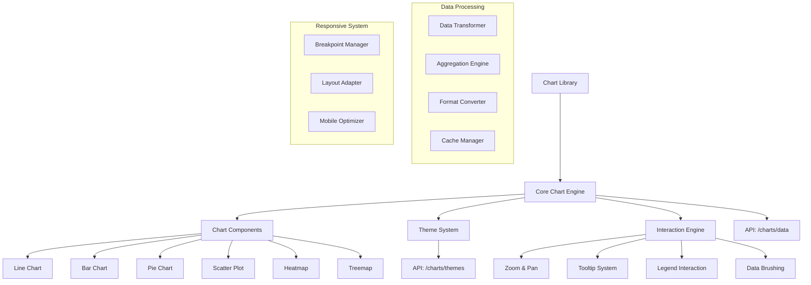

# PRP-130: Web-specific Chart & Visualization Library

name: "Web 專用圖表與視覺化元件庫"
description: |
  建立企業級的圖表視覺化元件庫，包含互動式圖表、自訂主題、動畫效果、響應式設計、資料探索等功能，為 Web 平台提供專業級的資料視覺化能力。

## 🎯 Goal
**Backend**: 建立圖表資料處理 API，支援大量資料聚合、即時更新、效能最佳化
**Frontend**: 實作豐富的圖表元件庫，支援互動式操作、自訂樣式、響應式設計  
**UX**: 提供專業美觀的資料視覺化體驗，讓用戶能夠直觀理解複雜的業務資料

## 💡 Why
- **商業價值**: 提供專業的資料視覺化能力，支援管理決策和業務洞察分析
- **用戶影響**: 用戶可以通過直觀的圖表快速理解資料趨勢和關鍵指標
- **問題解決**: 解決現有圖表功能有限、互動性不足、自訂性低的問題
- **競爭優勢**: 提供類似 Tableau、Power BI 的企業級視覺化體驗

## 📋 What

### Backend Requirements
- 高效能圖表資料聚合 API
- 即時資料更新和推送
- 大量資料分頁和最佳化
- 圖表配置和主題管理
- 效能監控和快取策略

### Frontend Requirements
- 完整的圖表元件庫
- 互動式圖表操作功能
- 自訂主題和樣式系統
- 響應式圖表適配
- 圖表動畫和過渡效果

### UX Requirements
- 直觀的圖表互動體驗
- 清楚的資料標籤和說明
- 流暢的縮放和篩選操作
- 專業的視覺設計風格
- 無障礙和可用性支援

### Success Criteria
Backend:
- [ ] 圖表資料 API 回應 < 1s
- [ ] 支援 100,000+ 資料點
- [ ] 即時更新延遲 < 2s
- [ ] 資料聚合準確性 100%
- [ ] API 可用性 > 99.5%

Frontend:
- [ ] 圖表渲染時間 < 500ms
- [ ] 支援 15+ 種圖表類型
- [ ] 互動回應時間 < 100ms
- [ ] 響應式適配完美
- [ ] 記憶體使用最佳化

UX:
- [ ] 圖表理解時間 < 30s
- [ ] 互動操作成功率 > 95%
- [ ] 視覺設計滿意度 > 4.5/5
- [ ] 資料洞察準確性 > 90%
- [ ] 無障礙合規性 100%

## 🤖 Agent Collaboration (Phase 1) - 規劃驗證

### 必要 Agents (強制執行)
- [ ] **spec-writer**: 圖表視覺化系統技術規格和元件架構設計完成
- [ ] **ux-flow-designer**: 資料視覺化互動流程和用戶體驗設計完成
- [ ] **typescript-type-guardian**: 圖表配置和資料模型型別定義完成
- [ ] **risk-assessor**: 效能和可用性風險評估完成

### Agent 產出文件
- [ ] `/docs/specs/chart-visualization-library-spec.md`
- [ ] `/docs/ux/data-visualization-interaction-patterns.md`
- [ ] `/docs/types/chart-configuration-types.ts`
- [ ] `/docs/risks/visualization-performance-risk-assessment.md`

## 🔧 How - Technical Architecture

### System Design

### Chart Component Architecture
1. **基礎圖表引擎**：Recharts + D3.js 整合
2. **元件系統**：可重用的圖表元件和組合
3. **主題引擎**：統一的設計系統和自訂主題
4. **互動系統**：縮放、篩選、選擇、刷選等操作
5. **響應式引擎**：自動適配不同螢幕和裝置
6. **動畫系統**：流暢的過渡和載入動畫
7. **無障礙支援**：螢幕閱讀器和鍵盤導航

### Technology Stack
- **Chart Engine**: Recharts, D3.js
- **Animation**: Framer Motion, React Spring
- **Canvas**: Konva.js (高效能渲染)
- **Export**: Canvas API, SVG, PDF
- **Responsive**: Container Queries, CSS Grid
- **Accessibility**: ARIA, Focus Management

## 📅 Timeline

### Phase 1: 規劃與設計 (Day 1)
**強制 Agent 測試**：
- [ ] spec-writer 完成圖表視覺化系統技術規格
- [ ] ux-flow-designer 完成資料視覺化互動設計
- [ ] typescript-type-guardian 定義圖表配置型別
- [ ] risk-assessor 評估視覺化效能風險

### Phase 2: 核心圖表引擎 (Day 2-3)
- [ ] 建立圖表渲染引擎基礎
- [ ] 實作核心圖表元件
- [ ] 開發主題系統和樣式
- [ ] 建立資料轉換和處理
- [ ] 實作響應式適配邏輯

**開發中 Agent 測試**：
- [ ] typescript-type-guardian 檢查圖表型別
- [ ] code-refactor-optimizer 優化渲染效能

### Phase 3: 圖表元件開發 (Day 4-5)
- [ ] 實作基礎圖表類型（線圖、柱圖、圓餅圖）
- [ ] 開發進階圖表（散點圖、熱力圖、樹狀圖）
- [ ] 建立組合圖表和儀表板
- [ ] 實作圖表配置和自訂
- [ ] 開發圖例和標籤系統

**開發中 Agent 測試**：
- [ ] ui-visual-tester 驗證圖表設計品質
- [ ] interaction-tester 測試圖表互動

### Phase 4: 互動和動畫系統 (Day 6)
- [ ] 實作縮放和平移功能
- [ ] 開發工具提示和懸停效果
- [ ] 建立資料選擇和刷選
- [ ] 實作圖表動畫和過渡
- [ ] 開發鍵盤導航和無障礙

**開發中 Agent 測試**：
- [ ] interaction-tester 測試所有互動功能
- [ ] ux-journey-analyzer 驗證使用流程

### Phase 5: 進階功能和最佳化 (Day 7)
- [ ] 實作圖表匯出功能
- [ ] 開發資料探索工具
- [ ] 建立圖表範本系統
- [ ] 實作效能監控和最佳化
- [ ] 開發圖表分享和嵌入

**開發中 Agent 測試**：
- [ ] code-refactor-optimizer 全面效能優化
- [ ] ux-journey-analyzer 完整功能驗證

### Phase 6: 整合測試與驗證 (Day 8)
**強制 Agent 測試 (必須全部通過)**：
- [ ] **interaction-tester**: 所有圖表互動和操作功能測試 ✅
- [ ] **ui-visual-tester**: 圖表視覺設計和主題一致性驗證 ✅
- [ ] **ux-journey-analyzer**: 完整資料視覺化流程驗證 ✅
- [ ] **typescript-type-guardian**: 圖表系統型別安全檢查 ✅
- [ ] **code-refactor-optimizer**: 效能和程式碼品質審查 ✅

### Phase 7: 文件和部署 (Day 9)
- [ ] 撰寫圖表元件使用指南
- [ ] 建立 Storybook 展示和文件
- [ ] 準備圖表範例和教學
- [ ] 設置效能監控和警報
- [ ] 建立用戶回饋收集

**最終 Agent 驗證**：
- [ ] project-shipper 圖表視覺化庫發布檢查

## ✅ Acceptance Testing Requirements

### 🤖 強制 Agent 測試項目

#### 1. Interaction Testing (interaction-tester)
**必須通過的測試**：
- [ ] 圖表縮放和平移操作
- [ ] 資料點選擇和高亮
- [ ] 工具提示顯示和隱藏
- [ ] 圖例點擊和篩選
- [ ] 資料刷選和範圍選擇
- [ ] 鍵盤導航和無障礙操作
- [ ] 測試報告：`/docs/tests/chart-visualization-interaction-test.md`

#### 2. Visual Testing (ui-visual-tester)
**必須通過的測試**：
- [ ] 圖表視覺設計專業美觀
- [ ] 主題系統一致性和完整性
- [ ] 顏色搭配和對比度適當
- [ ] 響應式設計在各裝置正常
- [ ] 動畫效果流暢自然
- [ ] 測試報告：`/docs/tests/chart-visualization-visual-test.md`

#### 3. UX Flow Testing (ux-journey-analyzer)
**必須通過的測試**：
- [ ] 新用戶創建第一個圖表
- [ ] 資料探索和洞察發現流程
- [ ] 圖表自訂和配置體驗
- [ ] 圖表分享和協作流程
- [ ] 效能問題時的用戶體驗
- [ ] 測試報告：`/docs/tests/chart-visualization-ux-flow-test.md`

#### 4. Type Safety Testing (typescript-type-guardian)
**必須通過的測試**：
- [ ] 圖表配置物件型別完整
- [ ] 資料格式和轉換型別安全
- [ ] 主題系統型別定義正確
- [ ] 互動事件型別檢查
- [ ] API 介面型別一致性
- [ ] 測試報告：`/docs/tests/chart-visualization-type-safety.md`

#### 5. Code Quality Testing (code-refactor-optimizer)
**必須通過的測試**：
- [ ] 圖表渲染效能最佳化
- [ ] 記憶體使用控制良好
- [ ] 資料處理邏輯高效
- [ ] 程式碼結構清晰可維護
- [ ] 錯誤處理機制完善
- [ ] 測試報告：`/docs/tests/chart-visualization-code-quality.md`

### 📊 測試覆蓋率要求
- **圖表類型覆蓋率**: >= 95%
- **互動功能覆蓋率**: 100%
- **響應式測試覆蓋率**: 100%
- **無障礙功能覆蓋率**: 100%

## 📈 Metrics & Monitoring

### Performance KPIs
- 圖表渲染時間 < 500ms
- 大量資料處理 < 2s
- 互動回應延遲 < 100ms
- 記憶體使用增長 < 5MB/chart

### User Experience Metrics
- 圖表理解準確率 > 90%
- 互動操作成功率 > 95%
- 視覺設計滿意度 > 4.5/5
- 功能使用頻率統計

### Business Impact Metrics
- 資料洞察發現率提升
- 決策支援效率改善
- 視覺化採用率增長
- 用戶分析深度提升

## 📚 Documentation

### 必要文件（Agent 產出）
- [ ] 圖表視覺化系統技術規格 (spec-writer)
- [ ] 資料視覺化互動模式指南 (ux-flow-designer)
- [ ] 圖表配置型別定義文件 (typescript-type-guardian)
- [ ] 視覺化效能風險評估 (risk-assessor)
- [ ] 所有測試報告合集 (testing agents)

### 開發者文件
- [ ] 圖表元件庫完整文檔
- [ ] 主題自訂和配置指南
- [ ] 高效能圖表最佳實踐
- [ ] 無障礙設計指導原則
- [ ] Storybook 互動式範例

## ⚠️ Known Issues & Mitigations

### 潛在問題
1. **大量資料渲染效能**
   - 影響：超過 10,000 個資料點時可能出現效能問題
   - 緩解措施：實作資料虛擬化、分層渲染、Canvas 最佳化

2. **響應式設計複雜性**
   - 影響：不同螢幕尺寸的圖表適配可能不完美
   - 緩解措施：實作智能佈局、斷點管理、元件重組

3. **瀏覽器相容性問題**
   - 影響：舊版瀏覽器可能不支援某些視覺效果
   - 緩解措施：漸進式增強、功能檢測、降級方案

### 依賴項
- Next.js 基礎平台（PRP-120）
- Web 元件庫（PRP-121）
- Firebase 整合（PRP-122）
- 儀表板頁面（PRP-123）

## 🚀 Deployment Strategy

### 分階段發布
1. **Alpha**: 基礎圖表類型和互動
2. **Beta**: 完整功能和主題系統
3. **RC**: 效能最佳化和無障礙
4. **GA**: 正式發布和持續改進

### 效能監控
- 即時渲染效能追蹤
- 用戶互動行為分析
- 記憶體使用監控
- 錯誤率和成功率統計

---

## 📝 PRP 執行檢查清單

### ✅ 開始前
- [ ] 研究業界領先的圖表庫設計
- [ ] 初始化所有必要 Agents
- [ ] 建立測試報告目錄：`/docs/tests/chart-visualization/`

### ✅ 開發中
- [ ] Phase 1: 規劃 Agents 執行完成
- [ ] Phase 2-5: 開發 Agents 持續監控
- [ ] Phase 6: 所有測試 Agents 通過

### ✅ 完成後
- [ ] 所有 Agent 測試報告已生成
- [ ] 效能基準測試達標
- [ ] 無障礙合規性驗證通過
- [ ] PRP 狀態更新為完成

---

**注意事項**：
1. 視覺設計品質是關鍵成功因素
2. 效能最佳化必須持續監控和改進
3. 無障礙支援是必須完成的要求
4. 圖表庫要易於使用和擴展