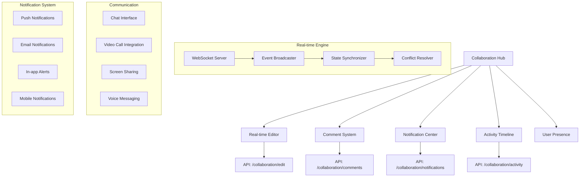

# PRP-131: Real-time Collaboration & Communication

name: "即時協作與溝通系統"
description: |
  建立企業級的即時協作系統，包含即時編輯、評論系統、通知中心、活動追蹤、視訊會議整合等功能，為 Web 平台提供完整的團隊協作能力。

## 🎯 Goal
**Backend**: 建立即時通訊和協作 API，支援 WebSocket 連接、事件廣播、狀態同步
**Frontend**: 實作即時協作介面，支援多用戶編輯、評論系統、通知中心  
**UX**: 提供無縫的團隊協作體驗，讓分散式團隊能夠高效溝通和協作

## 💡 Why
- **商業價值**: 提升團隊協作效率，支援遠程工作和分散式團隊管理
- **用戶影響**: 團隊成員可以即時溝通、協作編輯、追蹤進度，提升工作效率
- **問題解決**: 解決團隊溝通分散、協作不即時、進度追蹤困難的問題
- **競爭優勢**: 提供類似 Slack + Notion + Zoom 整合的協作體驗

## 📋 What

### Backend Requirements
- WebSocket 即時通訊架構
- 多用戶狀態同步引擎
- 事件廣播和通知系統
- 活動記錄和追蹤 API
- 權限控制和安全管理

### Frontend Requirements
- 即時多用戶編輯介面
- 評論和討論系統
- 通知中心和提醒
- 用戶在線狀態顯示
- 活動時間線和歷史

### UX Requirements
- 流暢的即時協作體驗
- 清楚的用戶存在感知
- 直觀的評論和回覆
- 及時的通知和提醒
- 高效的溝通工具整合

### Success Criteria
Backend:
- [ ] WebSocket 連接穩定性 > 99%
- [ ] 事件同步延遲 < 100ms
- [ ] 支援 1000+ 並發連接
- [ ] 消息送達率 > 99.9%
- [ ] API 可用性 > 99.5%

Frontend:
- [ ] 即時更新顯示 < 200ms
- [ ] 評論載入時間 < 500ms
- [ ] 通知響應時間 < 100ms
- [ ] 支援 50+ 同時編輯用戶
- [ ] 響應式設計完整支援

UX:
- [ ] 協作功能學習時間 < 10 分鐘
- [ ] 用戶協作滿意度 > 4.4/5
- [ ] 溝通效率提升 > 40%
- [ ] 功能採用率 > 70%
- [ ] 協作錯誤率 < 2%

## 🤖 Agent Collaboration (Phase 1) - 規劃驗證

### 必要 Agents (強制執行)
- [ ] **spec-writer**: 即時協作系統技術規格和通訊架構設計完成
- [ ] **ux-flow-designer**: 協作工作流程和溝通體驗設計完成
- [ ] **typescript-type-guardian**: 協作事件和通訊協議型別定義完成
- [ ] **risk-assessor**: 即時性能和安全風險評估完成

### Agent 產出文件
- [ ] `/docs/specs/real-time-collaboration-system-spec.md`
- [ ] `/docs/ux/team-collaboration-workflow-design.md`
- [ ] `/docs/types/collaboration-event-types.ts`
- [ ] `/docs/risks/real-time-performance-risk-assessment.md`

## 🔧 How - Technical Architecture

### System Design

### Real-time Collaboration Architecture
1. **即時編輯引擎**：操作轉換（OT）和衝突解決
2. **評論系統**：層級回覆、提及通知、解決狀態
3. **存在感知**：用戶在線狀態、游標位置、編輯指示
4. **通知中心**：即時推播、分類管理、優先級設定
5. **活動追蹤**：完整的操作記錄和時間線
6. **整合通訊**：文字聊天、語音、視訊會議
7. **權限管理**：細粒度協作權限控制

### Technology Stack
- **Real-time**: Socket.io, WebRTC
- **Collaboration**: Y.js (CRDT), ShareJS
- **Video**: Agora.io, Zoom SDK
- **Notifications**: Firebase Cloud Messaging
- **State**: Zustand, Jotai (原子化狀態)
- **Database**: Firestore (即時同步)

## 📅 Timeline

### Phase 1: 規劃與設計 (Day 1)
**強制 Agent 測試**：
- [ ] spec-writer 完成即時協作系統技術規格
- [ ] ux-flow-designer 完成協作工作流程設計
- [ ] typescript-type-guardian 定義協作事件型別
- [ ] risk-assessor 評估即時效能風險

### Phase 2: 即時通訊基礎 (Day 2-3)
- [ ] 建立 WebSocket 通訊架構
- [ ] 實作事件廣播和同步
- [ ] 開發用戶存在感知
- [ ] 建立基礎通知系統
- [ ] 實作權限和安全控制

**開發中 Agent 測試**：
- [ ] typescript-type-guardian 檢查通訊協議型別
- [ ] code-refactor-optimizer 優化即時通訊效能

### Phase 3: 協作編輯系統 (Day 4)
- [ ] 實作即時多用戶編輯
- [ ] 開發操作轉換和衝突解決
- [ ] 建立編輯狀態和游標同步
- [ ] 實作變更歷史和復原
- [ ] 開發協作鎖定機制

**開發中 Agent 測試**：
- [ ] interaction-tester 測試即時編輯功能
- [ ] ux-journey-analyzer 驗證協作流程

### Phase 4: 評論和溝通系統 (Day 5)
- [ ] 建立評論和回覆系統
- [ ] 實作提及和通知功能
- [ ] 開發討論串和解決狀態
- [ ] 建立即時聊天介面
- [ ] 實作表情符號和反應

**開發中 Agent 測試**：
- [ ] ui-visual-tester 驗證評論系統設計
- [ ] interaction-tester 測試溝通功能

### Phase 5: 通知和活動中心 (Day 6)
- [ ] 建立完整通知中心
- [ ] 實作多渠道通知推送
- [ ] 開發活動時間線和追蹤
- [ ] 建立通知偏好和設定
- [ ] 實作智能通知聚合

**開發中 Agent 測試**：
- [ ] interaction-tester 測試通知系統
- [ ] ux-journey-analyzer 驗證活動追蹤

### Phase 6: 進階整合功能 (Day 7)
- [ ] 整合視訊會議功能
- [ ] 實作螢幕分享和協作
- [ ] 開發語音訊息和通話
- [ ] 建立檔案協作和版本控制
- [ ] 實作工作流程自動化

**開發中 Agent 測試**：
- [ ] code-refactor-optimizer 全面系統優化
- [ ] ux-journey-analyzer 完整協作體驗驗證

### Phase 7: 整合測試與驗證 (Day 8)
**強制 Agent 測試 (必須全部通過)**：
- [ ] **interaction-tester**: 所有協作和溝通功能測試 ✅
- [ ] **ui-visual-tester**: 協作介面設計和一致性驗證 ✅
- [ ] **ux-journey-analyzer**: 完整團隊協作流程驗證 ✅
- [ ] **typescript-type-guardian**: 協作系統型別安全檢查 ✅
- [ ] **code-refactor-optimizer**: 即時效能和程式碼品質審查 ✅

### Phase 8: 部署和監控 (Day 9)
- [ ] 建立即時系統監控
- [ ] 設置效能警報和指標
- [ ] 準備協作功能教學
- [ ] 實作使用分析和統計
- [ ] 建立協作最佳實踐

**最終 Agent 驗證**：
- [ ] project-shipper 即時協作系統發布檢查

## ✅ Acceptance Testing Requirements

### 🤖 強制 Agent 測試項目

#### 1. Interaction Testing (interaction-tester)
**必須通過的測試**：
- [ ] 即時編輯和多用戶同步
- [ ] 評論創建、回覆、解決
- [ ] 通知點擊和狀態管理
- [ ] 聊天訊息發送和接收
- [ ] 視訊會議啟動和參與
- [ ] 活動時間線瀏覽和篩選
- [ ] 測試報告：`/docs/tests/collaboration-interaction-test.md`

#### 2. Visual Testing (ui-visual-tester)
**必須通過的測試**：
- [ ] 協作編輯視覺指示清楚
- [ ] 評論系統介面直觀
- [ ] 通知中心設計專業
- [ ] 用戶在線狀態顯示
- [ ] 響應式設計在各裝置正常
- [ ] 測試報告：`/docs/tests/collaboration-visual-test.md`

#### 3. UX Flow Testing (ux-journey-analyzer)
**必須通過的測試**：
- [ ] 新團隊成員協作入門
- [ ] 多人即時編輯工作流程
- [ ] 評論討論和問題解決
- [ ] 通知管理和偏好設定
- [ ] 視訊會議協作體驗
- [ ] 測試報告：`/docs/tests/collaboration-ux-flow-test.md`

#### 4. Type Safety Testing (typescript-type-guardian)
**必須通過的測試**：
- [ ] 即時事件型別完整性
- [ ] 協作狀態型別安全
- [ ] 通訊協議型別正確
- [ ] 通知資料型別檢查
- [ ] WebSocket 訊息型別
- [ ] 測試報告：`/docs/tests/collaboration-type-safety.md`

#### 5. Code Quality Testing (code-refactor-optimizer)
**必須通過的測試**：
- [ ] WebSocket 連接管理最佳化
- [ ] 即時同步效能優化
- [ ] 記憶體洩漏防護
- [ ] 錯誤處理和恢復機制
- [ ] 安全性和權限控制
- [ ] 測試報告：`/docs/tests/collaboration-code-quality.md`

### 📊 測試覆蓋率要求
- **即時功能覆蓋率**: >= 95%
- **協作場景覆蓋率**: 100%
- **通知系統覆蓋率**: 100%
- **安全性測試覆蓋率**: 100%

## 📈 Metrics & Monitoring

### Real-time Performance KPIs
- WebSocket 連接穩定性 > 99%
- 事件同步延遲 < 100ms
- 消息送達成功率 > 99.9%
- 同時在線用戶支援 > 1000

### Collaboration Metrics
- 多用戶編輯衝突率 < 1%
- 評論回應率 > 80%
- 通知點擊率 > 60%
- 協作會話平均時長

### Business Impact Metrics
- 團隊溝通效率提升
- 協作項目完成速度
- 遠程工作生產力
- 用戶協作滿意度

## 📚 Documentation

### 必要文件（Agent 產出）
- [ ] 即時協作系統技術規格 (spec-writer)
- [ ] 團隊協作工作流程指南 (ux-flow-designer)
- [ ] 協作事件型別定義 (typescript-type-guardian)
- [ ] 即時效能風險評估 (risk-assessor)
- [ ] 所有測試報告合集 (testing agents)

### 使用者文件
- [ ] 團隊協作功能完整指南
- [ ] 即時編輯最佳實踐
- [ ] 通知設定和管理手冊
- [ ] 視訊會議使用教學
- [ ] 協作故障排除指南

## ⚠️ Known Issues & Mitigations

### 潛在問題
1. **即時同步性能問題**
   - 影響：大量並發用戶時可能出現延遲
   - 緩解措施：實作負載均衡、連接池管理、智能降級

2. **衝突解決複雜性**
   - 影響：複雜編輯操作可能產生難以解決的衝突
   - 緩解措施：改進操作轉換算法、用戶提示、手動解決

3. **通知疲勞問題**
   - 影響：過多通知可能造成用戶體驗不佳
   - 緩解措施：智能通知聚合、優先級管理、個人化設定

### 依賴項
- Next.js 基礎平台（PRP-120）
- Web 元件庫（PRP-121）
- Firebase 整合（PRP-122）
- 現有用戶和權限系統

## 🚀 Deployment Strategy

### 分階段發布
1. **Alpha**: 基礎即時編輯和評論
2. **Beta**: 完整協作功能和通知
3. **RC**: 視訊整合和進階功能
4. **GA**: 正式發布和持續優化

### 監控和維護
- 即時系統健康監控
- WebSocket 連接品質追蹤
- 用戶協作行為分析
- 效能瓶頸識別和優化

---

## 📝 PRP 執行檢查清單

### ✅ 開始前
- [ ] 規劃即時通訊架構和擴展性
- [ ] 初始化所有必要 Agents
- [ ] 建立測試報告目錄：`/docs/tests/collaboration/`

### ✅ 開發中
- [ ] Phase 1: 規劃 Agents 執行完成
- [ ] Phase 2-6: 開發 Agents 持續監控
- [ ] Phase 7: 所有測試 Agents 通過

### ✅ 完成後
- [ ] 所有 Agent 測試報告已生成
- [ ] 即時效能測試通過
- [ ] 多用戶協作測試完成
- [ ] PRP 狀態更新為完成

---

**注意事項**：
1. 即時性能是核心要求，延遲必須控制在最小
2. 用戶體驗要無縫，不能有明顯的協作摩擦
3. 安全性和權限控制不可妥協
4. 擴展性設計要考慮未來用戶增長