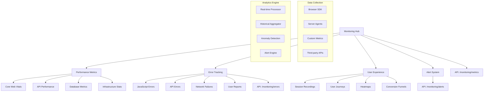

# PRP-132: Performance Monitoring & Error Tracking

name: "效能監控與錯誤追蹤系統"
description: |
  建立企業級的效能監控和錯誤追蹤系統，包含即時效能指標、錯誤捕獲與分析、使用者體驗監控、警報系統等功能，為 Web 平台提供全方位的系統健康監控。

## 🎯 Goal
**Backend**: 建立效能資料收集和分析 API，支援即時監控、歷史分析、智能警報
**Frontend**: 實作監控儀表板和錯誤追蹤介面，支援即時查看、深入分析、問題診斷  
**UX**: 提供清晰直觀的監控體驗，讓開發和營運團隊能夠快速發現和解決問題

## 💡 Why
- **商業價值**: 提升系統穩定性和用戶體驗，降低停機時間和技術債務成本
- **用戶影響**: 確保系統高可用性和良好效能，提供穩定可靠的服務體驗
- **問題解決**: 解決問題發現滯後、根因分析困難、效能瓶頸不明的問題
- **競爭優勢**: 提供類似 DataDog、Sentry 的專業級監控能力

## 📋 What

### Backend Requirements
- 即時效能指標收集和聚合
- 錯誤捕獲和分析處理
- 使用者會話和行為追蹤
- 智能警報和通知系統
- 歷史資料存儲和查詢

### Frontend Requirements
- 即時監控儀表板
- 錯誤詳情和堆疊追蹤
- 效能分析和視覺化
- 警報管理和配置
- 問題排除和診斷工具

### UX Requirements
- 清晰的監控資料展示
- 直觀的錯誤分析介面
- 高效的問題定位流程
- 及時的警報和通知
- 深入的效能洞察分析

### Success Criteria
Backend:
- [ ] 資料收集覆蓋率 > 99%
- [ ] 即時指標延遲 < 30s
- [ ] 錯誤捕獲準確率 > 95%
- [ ] 警報響應時間 < 2 分鐘
- [ ] 系統監控可用性 > 99.9%

Frontend:
- [ ] 儀表板載入時間 < 2s
- [ ] 錯誤分析查詢 < 1s
- [ ] 支援 100+ 同時監控用戶
- [ ] 即時資料更新 < 10s
- [ ] 響應式設計完整支援

UX:
- [ ] 問題發現時間 < 5 分鐘
- [ ] 根因分析效率提升 > 60%
- [ ] 監控工具學習時間 < 30 分鐘
- [ ] 開發團隊滿意度 > 4.3/5
- [ ] 誤報率 < 5%

## 🤖 Agent Collaboration (Phase 1) - 規劃驗證

### 必要 Agents (強制執行)
- [ ] **spec-writer**: 效能監控系統技術規格和監控架構設計完成
- [ ] **ux-flow-designer**: 監控工作流程和問題診斷體驗設計完成
- [ ] **typescript-type-guardian**: 監控資料模型和指標型別定義完成
- [ ] **risk-assessor**: 監控系統效能和隱私風險評估完成

### Agent 產出文件
- [ ] `/docs/specs/performance-monitoring-system-spec.md`
- [ ] `/docs/ux/monitoring-workflow-design.md`
- [ ] `/docs/types/monitoring-metrics-types.ts`
- [ ] `/docs/risks/monitoring-privacy-risk-assessment.md`

## 🔧 How - Technical Architecture

### System Design

### Monitoring Architecture
1. **資料收集層**：瀏覽器 SDK、伺服器代理、自訂指標
2. **即時處理**：資料串流、即時聚合、異常檢測
3. **存儲引擎**：時序資料庫、日誌存儲、索引最佳化
4. **分析引擎**：統計分析、趨勢預測、根因分析
5. **視覺化層**：儀表板、圖表、報告生成
6. **警報系統**：智能閾值、多渠道通知、升級機制
7. **整合介面**：API 接口、Webhook、第三方整合

### Technology Stack
- **Frontend SDK**: @sentry/browser, Web Vitals API
- **Backend**: OpenTelemetry, Prometheus
- **Database**: InfluxDB, Elasticsearch
- **Visualization**: Grafana, Custom Dashboards
- **Alerting**: PagerDuty, Slack Integration
- **Session Recording**: LogRocket, FullStory

## 📅 Timeline

### Phase 1: 規劃與設計 (Day 1)
**強制 Agent 測試**：
- [ ] spec-writer 完成效能監控系統技術規格
- [ ] ux-flow-designer 完成監控工作流程設計
- [ ] typescript-type-guardian 定義監控資料型別
- [ ] risk-assessor 評估監控隱私風險

### Phase 2: 資料收集基礎 (Day 2-3)
- [ ] 建立瀏覽器 SDK 和資料收集
- [ ] 實作伺服器端監控代理
- [ ] 開發自訂指標收集
- [ ] 建立資料傳輸和存儲
- [ ] 實作基礎安全和隱私保護

**開發中 Agent 測試**：
- [ ] typescript-type-guardian 檢查監控資料型別
- [ ] code-refactor-optimizer 優化收集效能

### Phase 3: 錯誤追蹤系統 (Day 4)
- [ ] 實作 JavaScript 錯誤捕獲
- [ ] 開發 API 錯誤追蹤
- [ ] 建立錯誤聚合和分析
- [ ] 實作堆疊追蹤和源碼映射
- [ ] 開發錯誤通知和警報

**開發中 Agent 測試**：
- [ ] interaction-tester 測試錯誤追蹤功能
- [ ] ux-journey-analyzer 驗證錯誤分析流程

### Phase 4: 效能監控儀表板 (Day 5)
- [ ] 建立即時監控儀表板
- [ ] 實作效能指標視覺化
- [ ] 開發歷史資料分析
- [ ] 建立自訂儀表板功能
- [ ] 實作資料匯出和報告

**開發中 Agent 測試**：
- [ ] ui-visual-tester 驗證儀表板設計
- [ ] interaction-tester 測試監控介面

### Phase 5: 警報和通知系統 (Day 6)
- [ ] 建立智能警報配置
- [ ] 實作多渠道通知推送
- [ ] 開發異常檢測和預警
- [ ] 建立警報升級和解決
- [ ] 實作警報歷史和分析

**開發中 Agent 測試**：
- [ ] interaction-tester 測試警報系統
- [ ] ux-journey-analyzer 驗證通知流程

### Phase 6: 進階分析功能 (Day 7)
- [ ] 實作使用者會話錄影
- [ ] 開發使用者行為分析
- [ ] 建立效能瓶頸診斷
- [ ] 實作 A/B 測試整合
- [ ] 開發自動化問題檢測

**開發中 Agent 測試**：
- [ ] code-refactor-optimizer 全面系統優化
- [ ] ux-journey-analyzer 完整監控體驗驗證

### Phase 7: 整合測試與驗證 (Day 8)
**強制 Agent 測試 (必須全部通過)**：
- [ ] **interaction-tester**: 所有監控和分析功能測試 ✅
- [ ] **ui-visual-tester**: 監控介面設計和資料視覺化驗證 ✅
- [ ] **ux-journey-analyzer**: 完整監控工作流程驗證 ✅
- [ ] **typescript-type-guardian**: 監控系統型別安全檢查 ✅
- [ ] **code-refactor-optimizer**: 效能和程式碼品質審查 ✅

### Phase 8: 部署和優化 (Day 9)
- [ ] 建立監控系統自監控
- [ ] 設置備份和災難恢復
- [ ] 準備監控使用培訓
- [ ] 實作成本控制和最佳化
- [ ] 建立監控最佳實踐

**最終 Agent 驗證**：
- [ ] project-shipper 效能監控系統發布檢查

## ✅ Acceptance Testing Requirements

### 🤖 強制 Agent 測試項目

#### 1. Interaction Testing (interaction-tester)
**必須通過的測試**：
- [ ] 儀表板導航和資料篩選
- [ ] 錯誤詳情查看和分析
- [ ] 警報配置和測試
- [ ] 效能圖表互動和縮放
- [ ] 報告生成和匯出
- [ ] 問題標記和解決
- [ ] 測試報告：`/docs/tests/monitoring-interaction-test.md`

#### 2. Visual Testing (ui-visual-tester)
**必須通過的測試**：
- [ ] 監控儀表板設計專業
- [ ] 錯誤追蹤介面清晰
- [ ] 圖表和指標視覺化
- [ ] 警報狀態指示器
- [ ] 響應式設計在各裝置正常
- [ ] 測試報告：`/docs/tests/monitoring-visual-test.md`

#### 3. UX Flow Testing (ux-journey-analyzer)
**必須通過的測試**：
- [ ] 新開發者監控設定流程
- [ ] 錯誤發現和診斷工作流程
- [ ] 效能問題調查和解決
- [ ] 警報響應和處理流程
- [ ] 團隊協作和溝通體驗
- [ ] 測試報告：`/docs/tests/monitoring-ux-flow-test.md`

#### 4. Type Safety Testing (typescript-type-guardian)
**必須通過的測試**：
- [ ] 監控指標資料型別完整
- [ ] 錯誤追蹤資料型別安全
- [ ] 警報配置型別檢查
- [ ] API 介面型別一致性
- [ ] 事件追蹤型別定義
- [ ] 測試報告：`/docs/tests/monitoring-type-safety.md`

#### 5. Code Quality Testing (code-refactor-optimizer)
**必須通過的測試**：
- [ ] 資料收集效能最佳化
- [ ] 監控系統自身效能
- [ ] 記憶體使用控制良好
- [ ] 錯誤處理和恢復機制
- [ ] 安全性和隱私保護
- [ ] 測試報告：`/docs/tests/monitoring-code-quality.md`

### 📊 測試覆蓋率要求
- **監控功能覆蓋率**: >= 95%
- **錯誤追蹤覆蓋率**: 100%
- **警報系統覆蓋率**: 100%
- **隱私保護覆蓋率**: 100%

## 📈 Metrics & Monitoring

### System Health KPIs
- 監控系統可用性 > 99.9%
- 資料收集延遲 < 30s
- 錯誤捕獲覆蓋率 > 95%
- 警報響應時間 < 2 分鐘

### Monitoring Effectiveness
- 問題發現時間縮短比例
- 根因分析效率提升
- 誤報率控制 < 5%
- 開發團隊採用率

### Business Impact Metrics
- 系統停機時間減少
- 用戶體驗指標改善
- 技術債務成本降低
- 開發生產力提升

## 📚 Documentation

### 必要文件（Agent 產出）
- [ ] 效能監控系統技術規格 (spec-writer)
- [ ] 監控工作流程指南 (ux-flow-designer)
- [ ] 監控資料型別定義 (typescript-type-guardian)
- [ ] 監控隱私風險評估 (risk-assessor)
- [ ] 所有測試報告合集 (testing agents)

### 營運文件
- [ ] 監控系統設置指南
- [ ] 警報配置最佳實踐
- [ ] 問題診斷和解決手冊
- [ ] 效能最佳化建議
- [ ] 監控資料隱私政策

## ⚠️ Known Issues & Mitigations

### 潛在問題
1. **監控資料隱私問題**
   - 影響：可能收集敏感的用戶資料和行為
   - 緩解措施：實作資料匿名化、選擇性收集、GDPR 合規

2. **監控系統效能影響**
   - 影響：監控本身可能影響應用程式效能
   - 緩解措施：輕量級 SDK、取樣策略、非同步處理

3. **警報疲勞問題**
   - 影響：過多警報可能導致重要問題被忽略
   - 緩解措施：智能聚合、優先級分級、機器學習優化

### 依賴項
- Next.js 基礎平台（PRP-120）
- Web 元件庫（PRP-121）
- Firebase 整合（PRP-122）
- 第三方監控服務 API

## 🚀 Deployment Strategy

### 分階段發布
1. **Alpha**: 基礎監控和錯誤追蹤
2. **Beta**: 完整儀表板和警報系統
3. **RC**: 進階分析和整合功能
4. **GA**: 正式發布和持續優化

### 合規和安全
- 資料收集透明度說明
- 用戶隱私設定選項
- 資料保留和刪除政策
- 安全傳輸和存儲保護

---

## 📝 PRP 執行檢查清單

### ✅ 開始前
- [ ] 規劃監控資料架構和隱私策略
- [ ] 初始化所有必要 Agents
- [ ] 建立測試報告目錄：`/docs/tests/monitoring/`

### ✅ 開發中
- [ ] Phase 1: 規劃 Agents 執行完成
- [ ] Phase 2-6: 開發 Agents 持續監控
- [ ] Phase 7: 所有測試 Agents 通過

### ✅ 完成後
- [ ] 所有 Agent 測試報告已生成
- [ ] 監控系統自測試通過
- [ ] 隱私合規審核完成
- [ ] PRP 狀態更新為完成

---

**注意事項**：
1. 用戶隱私保護是最高優先級，必須完全合規
2. 監控系統自身不能成為效能瓶頸
3. 警報系統要智能，避免誤報和疲勞
4. 資料安全和傳輸加密不可妥協