# PRP-133: SEO & Marketing Optimization

name: "SEO 與行銷最佳化系統"
description: |
  建立企業級的 SEO 和行銷最佳化系統，包含搜尋引擎最佳化、元標籤管理、結構化資料、行銷追蹤、A/B 測試等功能，為 Web 平台提供全方位的數位行銷支援。

## 🎯 Goal
**Backend**: 建立 SEO 最佳化和行銷追蹤 API，支援動態元標籤、Sitemap 生成、分析整合
**Frontend**: 實作 SEO 友善的頁面結構，支援結構化資料、載入最佳化、行銷工具整合  
**UX**: 提供優質的使用者體驗，同時確保搜尋引擎可見性和行銷轉換最佳化

## 💡 Why
- **商業價值**: 提升品牌曝光和自然流量，降低獲客成本，提高行銷 ROI
- **用戶影響**: 用戶能夠更容易找到和使用服務，獲得更快速流暢的體驗
- **問題解決**: 解決搜尋引擎收錄困難、頁面效能不佳、行銷追蹤不完整的問題
- **競爭優勢**: 提供專業級的 SEO 和行銷技術，支援業務成長和市場競爭

## 📋 What

### Backend Requirements
- 動態 SEO 元標籤生成
- XML Sitemap 自動生成和更新
- 結構化資料 (Schema.org) 管理
- 行銷追蹤像素整合
- 頁面效能最佳化 API

### Frontend Requirements
- SEO 友善的頁面架構
- 動態元標籤和 Open Graph
- 結構化資料標記
- 頁面載入速度最佳化
- 行銷工具和追蹤整合

### UX Requirements
- 快速的頁面載入體驗
- 清晰的資訊架構和導航
- 行動裝置最佳化
- 無障礙和可用性支援
- 轉換漏斗最佳化

### Success Criteria
Backend:
- [ ] Core Web Vitals 全部達到 Good
- [ ] Sitemap 即時更新 < 1 小時
- [ ] 結構化資料驗證 100% 通過
- [ ] 追蹤資料準確性 > 98%
- [ ] API 效能回應 < 200ms

Frontend:
- [ ] Lighthouse SEO 分數 > 95
- [ ] 頁面載入速度 < 1.5s
- [ ] First Contentful Paint < 1s
- [ ] Cumulative Layout Shift < 0.1
- [ ] 行動裝置友善度 100%

UX:
- [ ] 搜尋引擎收錄率 > 95%
- [ ] 自然流量成長 > 30%
- [ ] 轉換率提升 > 20%
- [ ] 跳出率降低 > 15%
- [ ] 使用者滿意度 > 4.4/5

## 🤖 Agent Collaboration (Phase 1) - 規劃驗證

### 必要 Agents (強制執行)
- [ ] **spec-writer**: SEO 最佳化系統技術規格和架構設計完成
- [ ] **ux-flow-designer**: 使用者體驗和轉換流程設計完成
- [ ] **typescript-type-guardian**: SEO 資料模型和行銷追蹤型別定義完成
- [ ] **risk-assessor**: 效能和隱私風險評估完成

### Agent 產出文件
- [ ] `/docs/specs/seo-marketing-optimization-spec.md`
- [ ] `/docs/ux/conversion-optimization-user-flow.md`
- [ ] `/docs/types/seo-marketing-data-types.ts`
- [ ] `/docs/risks/marketing-privacy-risk-assessment.md`

## 🔧 How - Technical Architecture

### System Design

```mermaid
graph TD
    A[SEO & Marketing Hub] --> B[Meta Management]
    A --> C[Structured Data]
    A --> D[Performance Optimization]
    A --> E[Marketing Integration]
    
    B --> F[Dynamic Meta Tags]
    B --> G[Open Graph]
    B --> H[Twitter Cards]
    B --> I[Canonical URLs]
    
    C --> J[Organization Schema]
    C --> K[Product Schema]
    C --> L[Article Schema]
    C --> M[FAQ Schema]
    
    D --> N[Image Optimization]
    D --> O[Code Splitting]
    D --> P[Caching Strategy]
    D --> Q[CDN Integration]
    
    E --> R[Google Analytics]
    E --> S[Facebook Pixel]
    E --> T[Google Ads]
    E --> U[A/B Testing]
    
    subgraph "SEO Tools"
        V[Sitemap Generator]
        W[Robots.txt Manager]
        X[SEO Analyzer]
        Y[Performance Monitor]
    end
    
    A --> Z[API: /seo/metadata]
    V --> AA[API: /seo/sitemap]
    E --> BB[API: /marketing/tracking]
```

### SEO Optimization Architecture
1. **元標籤引擎**：動態生成頁面專屬的 SEO 標籤
2. **結構化資料**：自動生成 Schema.org 標記
3. **效能最佳化**：圖片壓縮、代碼分割、快取策略
4. **內容最佳化**：關鍵字分析、內容建議、可讀性檢查
5. **技術 SEO**：Sitemap、Robots.txt、Canonical URLs
6. **分析整合**：GA4、Search Console、第三方工具
7. **A/B 測試**：轉換最佳化、使用者體驗測試

### Technology Stack
- **SEO**: Next.js SEO, React Helmet Async
- **Performance**: Next.js Image, SWR, React Query
- **Analytics**: Google Analytics 4, Google Tag Manager
- **Testing**: Optimizely, Google Optimize
- **Monitoring**: Lighthouse CI, Core Web Vitals
- **Schema**: React Schema.org, JSON-LD

## 📅 Timeline

### Phase 1: 規劃與設計 (Day 1)
**強制 Agent 測試**：
- [ ] spec-writer 完成 SEO 最佳化系統技術規格
- [ ] ux-flow-designer 完成轉換最佳化流程設計
- [ ] typescript-type-guardian 定義 SEO 資料型別
- [ ] risk-assessor 評估行銷隱私風險

### Phase 2: 基礎 SEO 架構 (Day 2-3)
- [ ] 建立動態元標籤管理系統
- [ ] 實作 Open Graph 和 Twitter Cards
- [ ] 開發 Canonical URL 管理
- [ ] 建立 Sitemap 自動生成
- [ ] 實作 Robots.txt 動態管理

**開發中 Agent 測試**：
- [ ] typescript-type-guardian 檢查 SEO 資料型別
- [ ] code-refactor-optimizer 優化 SEO 生成效能

### Phase 3: 結構化資料系統 (Day 4)
- [ ] 實作組織和產品 Schema
- [ ] 開發文章和 FAQ Schema
- [ ] 建立評論和評分 Schema
- [ ] 實作麵包屑和導航 Schema
- [ ] 開發事件和促銷 Schema

**開發中 Agent 測試**：
- [ ] interaction-tester 測試結構化資料
- [ ] ux-journey-analyzer 驗證資訊架構

### Phase 4: 效能最佳化 (Day 5)
- [ ] 實作圖片自動最佳化
- [ ] 開發代碼分割和懶載入
- [ ] 建立智能快取策略
- [ ] 實作 CDN 整合
- [ ] 開發 Core Web Vitals 監控

**開發中 Agent 測試**：
- [ ] ui-visual-tester 驗證載入體驗
- [ ] code-refactor-optimizer 效能最佳化

### Phase 5: 行銷工具整合 (Day 6)
- [ ] 整合 Google Analytics 4
- [ ] 實作 Facebook Pixel 追蹤
- [ ] 開發 Google Ads 轉換追蹤
- [ ] 建立自訂事件追蹤
- [ ] 實作 A/B 測試框架

**開發中 Agent 測試**：
- [ ] interaction-tester 測試追蹤功能
- [ ] ux-journey-analyzer 驗證轉換流程

### Phase 6: SEO 分析工具 (Day 7)
- [ ] 建立 SEO 健康檢查工具
- [ ] 實作關鍵字追蹤分析
- [ ] 開發競爭對手分析
- [ ] 建立內容最佳化建議
- [ ] 實作 SEO 報告生成

**開發中 Agent 測試**：
- [ ] code-refactor-optimizer 全面系統優化
- [ ] ux-journey-analyzer 完整 SEO 體驗驗證

### Phase 7: 整合測試與驗證 (Day 8)
**強制 Agent 測試 (必須全部通過)**：
- [ ] **interaction-tester**: 所有 SEO 和行銷功能測試 ✅
- [ ] **ui-visual-tester**: 頁面設計和載入體驗驗證 ✅
- [ ] **ux-journey-analyzer**: 完整轉換流程驗證 ✅
- [ ] **typescript-type-guardian**: SEO 系統型別安全檢查 ✅
- [ ] **code-refactor-optimizer**: 效能和程式碼品質審查 ✅

### Phase 8: 部署和監控 (Day 9)
- [ ] 設置 SEO 效能監控
- [ ] 建立搜尋引擎提交
- [ ] 準備 SEO 最佳實踐指南
- [ ] 實作持續最佳化流程
- [ ] 建立 SEO 團隊培訓

**最終 Agent 驗證**：
- [ ] project-shipper SEO 最佳化系統發布檢查

## ✅ Acceptance Testing Requirements

### 🤖 強制 Agent 測試項目

#### 1. Interaction Testing (interaction-tester)
**必須通過的測試**：
- [ ] 頁面導航和內部連結
- [ ] 搜尋功能和結果頁面
- [ ] 表單提交和轉換追蹤
- [ ] 行動裝置觸控操作
- [ ] 無障礙鍵盤導航
- [ ] A/B 測試變體切換
- [ ] 測試報告：`/docs/tests/seo-marketing-interaction-test.md`

#### 2. Visual Testing (ui-visual-tester)
**必須通過的測試**：
- [ ] 頁面載入和渲染品質
- [ ] 響應式設計在各裝置
- [ ] 圖片最佳化和顯示
- [ ] 字體載入和可讀性
- [ ] 版面穩定性 (CLS)
- [ ] 測試報告：`/docs/tests/seo-marketing-visual-test.md`

#### 3. UX Flow Testing (ux-journey-analyzer)
**必須通過的測試**：
- [ ] 新訪客首次體驗流程
- [ ] 搜尋引擎訪客轉換路徑
- [ ] 行動裝置用戶體驗
- [ ] 社群媒體流量轉換
- [ ] 付費廣告著陸體驗
- [ ] 測試報告：`/docs/tests/seo-marketing-ux-flow-test.md`

#### 4. Type Safety Testing (typescript-type-guardian)
**必須通過的測試**：
- [ ] SEO 元資料型別完整性
- [ ] 結構化資料型別正確
- [ ] 追蹤事件型別安全
- [ ] API 回應型別檢查
- [ ] 配置物件型別驗證
- [ ] 測試報告：`/docs/tests/seo-marketing-type-safety.md`

#### 5. Code Quality Testing (code-refactor-optimizer)
**必須通過的測試**：
- [ ] 頁面載入效能最佳化
- [ ] SEO 標籤生成效率
- [ ] 圖片處理效能
- [ ] 追蹤代碼輕量化
- [ ] 快取策略有效性
- [ ] 測試報告：`/docs/tests/seo-marketing-code-quality.md`

### 📊 測試覆蓋率要求
- **SEO 功能覆蓋率**: >= 95%
- **效能最佳化覆蓋率**: 100%
- **追蹤功能覆蓋率**: 100%
- **無障礙功能覆蓋率**: 100%

## 📈 Metrics & Monitoring

### SEO Performance KPIs
- Lighthouse SEO 分數 > 95
- Core Web Vitals 全部 Good
- 搜尋引擎收錄率 > 95%
- 自然搜尋流量成長

### Marketing Effectiveness
- 轉換率提升比例
- 跳出率降低程度
- 平均會話時長增加
- 行銷 ROI 改善

### Technical Metrics
- 頁面載入速度 < 1.5s
- 圖片最佳化率 > 90%
- 快取命中率 > 85%
- 錯誤率 < 1%

## 📚 Documentation

### 必要文件（Agent 產出）
- [ ] SEO 最佳化系統技術規格 (spec-writer)
- [ ] 轉換最佳化用戶流程 (ux-flow-designer)
- [ ] SEO 資料型別定義 (typescript-type-guardian)
- [ ] 行銷隱私風險評估 (risk-assessor)
- [ ] 所有測試報告合集 (testing agents)

### 行銷團隊文件
- [ ] SEO 最佳實踐指南
- [ ] 內容最佳化手冊
- [ ] 關鍵字研究工具
- [ ] 競爭分析報告
- [ ] 行銷追蹤設定指南

## ⚠️ Known Issues & Mitigations

### 潛在問題
1. **頁面效能與功能平衡**
   - 影響：過多的行銷工具可能影響載入速度
   - 緩解措施：懶載入、異步載入、條件載入

2. **隱私法規合規**
   - 影響：GDPR、CCPA 等法規對追蹤有限制
   - 緩解措施：Cookie 同意、資料匿名化、選擇退出

3. **搜尋引擎算法變化**
   - 影響：SEO 策略可能因算法更新失效
   - 緩解措施：持續監控、快速調整、多元化策略

### 依賴項
- Next.js 基礎平台（PRP-120）
- Web 元件庫（PRP-121）
- Firebase 整合（PRP-122）
- 效能監控系統（PRP-132）

## 🚀 Deployment Strategy

### 分階段發布
1. **Alpha**: 基礎 SEO 最佳化功能
2. **Beta**: 完整追蹤和分析整合
3. **RC**: 進階最佳化和 A/B 測試
4. **GA**: 正式發布和持續監控

### 合規和最佳實踐
- Cookie 政策和同意管理
- 資料收集透明度說明
- 使用者隱私設定選項
- 定期 SEO 健康檢查

---

## 📝 PRP 執行檢查清單

### ✅ 開始前
- [ ] 規劃 SEO 策略和關鍵字研究
- [ ] 初始化所有必要 Agents
- [ ] 建立測試報告目錄：`/docs/tests/seo-marketing/`

### ✅ 開發中
- [ ] Phase 1: 規劃 Agents 執行完成
- [ ] Phase 2-6: 開發 Agents 持續監控
- [ ] Phase 7: 所有測試 Agents 通過

### ✅ 完成後
- [ ] 所有 Agent 測試報告已生成
- [ ] Lighthouse 分數達標
- [ ] 隱私合規檢查通過
- [ ] PRP 狀態更新為完成

---

**注意事項**：
1. 用戶體驗永遠優先於 SEO 技術要求
2. 效能最佳化是持續的工作重點
3. 隱私保護和法規合規不可妥協
4. SEO 策略要數據驅動，持續測試和調整