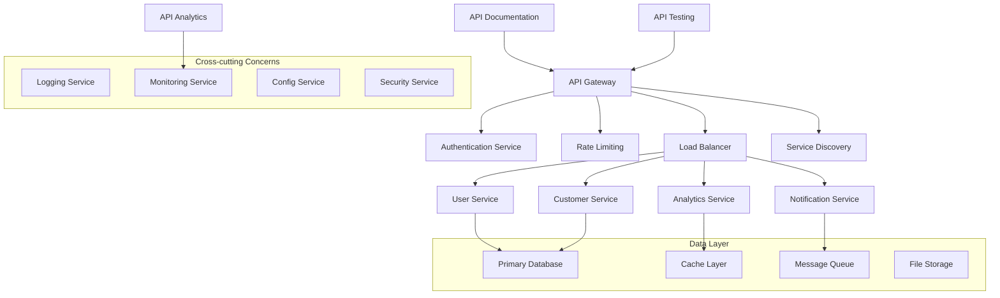

# PRP-134: Backend API Gateway & Microservices Architecture

name: "後端 API 閘道器與微服務架構"
description: |
  建立企業級的後端 API 架構，包含 API 閘道器、微服務管理、服務發現、負載均衡、API 版本控制、認證授權、限流保護等功能，為 Web 平台提供穩定可擴展的後端服務基礎。

## 🎯 Goal
**Backend**: 建立高可用性的 API 閘道器和微服務架構，支援自動擴展、服務治理、監控告警
**API Design**: 實作 RESTful API 和 GraphQL 支援，提供一致的 API 設計和文檔  
**Infrastructure**: 提供穩定可靠的後端服務基礎，支援高併發和業務快速迭代

## 💡 Why
- **商業價值**: 提供穩定的技術基礎設施，支援業務快速成長和系統擴展需求
- **開發效率**: 統一的 API 標準和工具鏈，提升開發團隊的協作效率
- **問題解決**: 解決 API 管理混亂、服務耦合、擴展困難、監控不足的問題
- **競爭優勢**: 提供企業級的 API 管理能力，支援複雜業務場景和大規模用戶

## 📋 What

### Backend Requirements
- API 閘道器和路由管理
- 微服務註冊和發現
- 服務間通訊和負載均衡
- 認證授權和安全控制
- API 限流和防護機制

### API Management Requirements
- 統一的 API 設計規範
- 自動 API 文檔生成
- API 版本控制和相容性
- 請求回應驗證
- API 使用分析和監控

### Infrastructure Requirements
- 容器化和編排管理
- 自動擴展和故障恢復
- 配置管理和環境隔離
- 日誌聚合和分析
- 效能監控和警報

### Success Criteria
Backend:
- [ ] API 可用性 > 99.9%
- [ ] API 回應時間 < 200ms (P95)
- [ ] 支援 10,000+ RPS 併發
- [ ] 自動擴展回應時間 < 30s
- [ ] 故障恢復時間 < 5 分鐘

API Quality:
- [ ] API 文檔覆蓋率 100%
- [ ] API 測試覆蓋率 > 95%
- [ ] 向後相容性保證 100%
- [ ] API 錯誤率 < 0.1%
- [ ] 開發者滿意度 > 4.5/5

Infrastructure:
- [ ] 部署時間 < 10 分鐘
- [ ] 零停機部署成功率 100%
- [ ] 資源使用率最佳化 > 80%
- [ ] 安全漏洞檢測覆蓋率 100%
- [ ] 監控覆蓋率 100%

## 🤖 Agent Collaboration (Phase 1) - 規劃驗證

### 必要 Agents (強制執行)
- [ ] **spec-writer**: API 閘道器和微服務架構技術規格設計完成
- [ ] **ux-flow-designer**: API 開發者體驗和工具鏈設計完成
- [ ] **typescript-type-guardian**: API 介面和資料模型型別定義完成
- [ ] **risk-assessor**: 系統安全和可用性風險評估完成

### Agent 產出文件
- [ ] `/docs/specs/api-gateway-microservices-architecture-spec.md`
- [ ] `/docs/ux/api-developer-experience-design.md`
- [ ] `/docs/types/api-interface-definitions.ts`
- [ ] `/docs/risks/backend-security-availability-risk-assessment.md`

## 🔧 How - Technical Architecture

### System Design

### API Gateway Architecture
1. **請求路由**：智能路由、版本控制、A/B 測試
2. **認證授權**：JWT 驗證、OAuth 2.0、RBAC 權限
3. **限流保護**：按用戶、API、時間窗口限流
4. **快取管理**：響應快取、智能失效、分層快取
5. **監控分析**：請求追蹤、效能分析、使用統計
6. **安全防護**：DDoS 防護、SQL 注入防護、XSS 保護
7. **服務治理**：健康檢查、熔斷降級、故障轉移

### Technology Stack
- **API Gateway**: Kong, AWS API Gateway, Nginx
- **Microservices**: Next.js API Routes, Express.js
- **Service Discovery**: Consul, etcd
- **Load Balancing**: HAProxy, Nginx
- **Monitoring**: Prometheus, Grafana, Jaeger
- **Documentation**: OpenAPI 3.0, Swagger UI

## 📅 Timeline

### Phase 1: 規劃與設計 (Day 1)
**強制 Agent 測試**：
- [ ] spec-writer 完成 API 閘道器微服務架構規格
- [ ] ux-flow-designer 完成 API 開發者體驗設計
- [ ] typescript-type-guardian 定義 API 介面型別
- [ ] risk-assessor 評估後端安全可用性風險

### Phase 2: API 閘道器核心 (Day 2-3)
- [ ] 建立 API 閘道器基礎架構
- [ ] 實作請求路由和負載均衡
- [ ] 開發認證授權中間件
- [ ] 建立限流和防護機制
- [ ] 實作基礎監控和日誌

**開發中 Agent 測試**：
- [ ] typescript-type-guardian 檢查 API 介面型別
- [ ] code-refactor-optimizer 優化閘道器效能

### Phase 3: 微服務架構 (Day 4-5)
- [ ] 實作服務註冊和發現
- [ ] 開發服務間通訊機制
- [ ] 建立配置管理系統
- [ ] 實作健康檢查和故障轉移
- [ ] 開發服務編排和依賴管理

**開發中 Agent 測試**：
- [ ] interaction-tester 測試服務間通訊
- [ ] code-refactor-optimizer 微服務架構優化

### Phase 4: API 管理工具 (Day 6)
- [ ] 建立 API 文檔自動生成
- [ ] 實作 API 版本控制系統
- [ ] 開發 API 測試和驗證
- [ ] 建立 API 使用分析
- [ ] 實作開發者工具和 SDK

**開發中 Agent 測試**：
- [ ] ux-journey-analyzer 驗證開發者體驗
- [ ] interaction-tester 測試 API 工具

### Phase 5: 基礎設施自動化 (Day 7)
- [ ] 實作容器化和編排
- [ ] 開發自動擴展機制
- [ ] 建立 CI/CD 管道
- [ ] 實作零停機部署
- [ ] 開發災難恢復機制

**開發中 Agent 測試**：
- [ ] code-refactor-optimizer 基礎設施優化
- [ ] ux-journey-analyzer 部署流程驗證

### Phase 6: 監控和安全強化 (Day 8)
- [ ] 建立全方位監控系統
- [ ] 實作安全掃描和防護
- [ ] 開發效能分析工具
- [ ] 建立警報和通知系統
- [ ] 實作合規性檢查

**開發中 Agent 測試**：
- [ ] code-refactor-optimizer 安全性審查
- [ ] ux-journey-analyzer 監控工具體驗

### Phase 7: 整合測試與驗證 (Day 9)
**強制 Agent 測試 (必須全部通過)**：
- [ ] **interaction-tester**: 所有 API 和服務互動測試 ✅
- [ ] **ui-visual-tester**: API 管理介面和文檔驗證 ✅
- [ ] **ux-journey-analyzer**: 完整開發者使用流程驗證 ✅
- [ ] **typescript-type-guardian**: API 系統型別安全檢查 ✅
- [ ] **code-refactor-optimizer**: 架構和效能品質審查 ✅

### Phase 8: 部署和優化 (Day 10)
- [ ] 生產環境部署和驗證
- [ ] 效能調優和基準測試
- [ ] 安全加固和滲透測試
- [ ] 團隊培訓和文檔完善
- [ ] 持續改進機制建立

**最終 Agent 驗證**：
- [ ] project-shipper API 閘道器微服務系統發布檢查

## ✅ Acceptance Testing Requirements

### 🤖 強制 Agent 測試項目

#### 1. Interaction Testing (interaction-tester)
**必須通過的測試**：
- [ ] API 請求路由和回應
- [ ] 認證授權流程測試
- [ ] 限流機制觸發和恢復
- [ ] 服務間通訊和故障處理
- [ ] API 文檔和測試工具使用
- [ ] 監控儀表板操作
- [ ] 測試報告：`/docs/tests/api-gateway-interaction-test.md`

#### 2. Visual Testing (ui-visual-tester)
**必須通過的測試**：
- [ ] API 文檔介面設計專業
- [ ] 監控儀表板視覺清晰
- [ ] 開發者工具界面友善
- [ ] 錯誤頁面和訊息設計
- [ ] 響應式設計支援
- [ ] 測試報告：`/docs/tests/api-gateway-visual-test.md`

#### 3. UX Flow Testing (ux-journey-analyzer)
**必須通過的測試**：
- [ ] 新開發者 API 接入流程
- [ ] API 開發和測試工作流程
- [ ] 問題診斷和解決路徑
- [ ] 服務部署和維護體驗
- [ ] 監控和警報處理流程
- [ ] 測試報告：`/docs/tests/api-gateway-ux-flow-test.md`

#### 4. Type Safety Testing (typescript-type-guardian)
**必須通過的測試**：
- [ ] API 請求回應型別完整
- [ ] 服務間介面型別安全
- [ ] 配置物件型別檢查
- [ ] 監控資料型別定義
- [ ] 錯誤處理型別覆蓋
- [ ] 測試報告：`/docs/tests/api-gateway-type-safety.md`

#### 5. Code Quality Testing (code-refactor-optimizer)
**必須通過的測試**：
- [ ] API 閘道器效能最佳化
- [ ] 微服務架構設計品質
- [ ] 安全控制實作完善
- [ ] 錯誤處理和恢復機制
- [ ] 程式碼可維護性高
- [ ] 測試報告：`/docs/tests/api-gateway-code-quality.md`

### 📊 測試覆蓋率要求
- **API 功能覆蓋率**: >= 95%
- **安全機制覆蓋率**: 100%
- **錯誤處理覆蓋率**: 100%
- **效能測試覆蓋率**: 100%

## 📈 Metrics & Monitoring

### API Performance KPIs
- API 可用性 > 99.9%
- API 回應時間 < 200ms (P95)
- 請求成功率 > 99.9%
- 併發處理能力 > 10,000 RPS

### Service Health Metrics
- 服務發現成功率 > 99%
- 負載均衡效率 > 95%
- 自動擴展回應時間 < 30s
- 故障恢復時間 < 5 分鐘

### Developer Experience Metrics
- API 文檔完整度 100%
- 開發者接入時間 < 1 小時
- API 使用錯誤率 < 1%
- 開發者滿意度 > 4.5/5

## 📚 Documentation

### 必要文件（Agent 產出）
- [ ] API 閘道器微服務架構技術規格 (spec-writer)
- [ ] API 開發者體驗設計指南 (ux-flow-designer)
- [ ] API 介面型別定義文件 (typescript-type-guardian)
- [ ] 後端安全可用性風險評估 (risk-assessor)
- [ ] 所有測試報告合集 (testing agents)

### 營運文件
- [ ] API 閘道器部署和維護指南
- [ ] 微服務開發最佳實踐
- [ ] 系統監控和故障排除手冊
- [ ] 安全配置和合規檢查清單
- [ ] 效能調優和擴展策略

## ⚠️ Known Issues & Mitigations

### 潛在問題
1. **單點故障風險**
   - 影響：API 閘道器故障可能影響所有服務
   - 緩解措施：多實例部署、健康檢查、故障轉移

2. **效能瓶頸問題**
   - 影響：閘道器可能成為系統效能瓶頸
   - 緩解措施：效能最佳化、智能快取、負載分散

3. **配置管理複雜性**
   - 影響：微服務配置管理可能變得複雜
   - 緩解措施：統一配置中心、版本控制、自動化部署

### 依賴項
- Next.js 基礎平台（PRP-120）
- Firebase 整合（PRP-122）
- 效能監控系統（PRP-132）
- 容器化和雲端基礎設施

## 🚀 Deployment Strategy

### 分階段發布
1. **Alpha**: 基礎 API 閘道器功能
2. **Beta**: 完整微服務架構
3. **RC**: 進階監控和自動化
4. **GA**: 正式發布和持續優化

### 運維策略
- 藍綠部署和金絲雀發布
- 自動化測試和部署流程
- 全方位監控和警報
- 定期安全審計和更新

---

## 📝 PRP 執行檢查清單

### ✅ 開始前
- [ ] 規劃微服務拆分和邊界定義
- [ ] 初始化所有必要 Agents
- [ ] 建立測試報告目錄：`/docs/tests/api-gateway/`

### ✅ 開發中
- [ ] Phase 1: 規劃 Agents 執行完成
- [ ] Phase 2-6: 開發 Agents 持續監控
- [ ] Phase 7: 所有測試 Agents 通過

### ✅ 完成後
- [ ] 所有 Agent 測試報告已生成
- [ ] 效能基準測試達標
- [ ] 安全滲透測試通過
- [ ] PRP 狀態更新為完成

---

**注意事項**：
1. 系統可用性和穩定性是最高優先級
2. API 設計要考慮向後相容性和擴展性
3. 安全控制必須覆蓋所有層面
4. 監控和警報要全面且及時