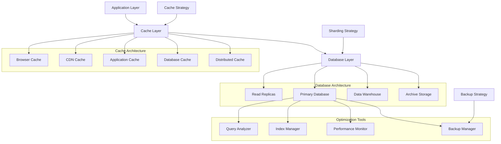

# PRP-135: Database Optimization & Caching Strategy

name: "資料庫最佳化與快取策略系統"
description: |
  建立企業級的資料庫最佳化和快取管理系統，包含查詢最佳化、索引策略、分層快取、資料分片、備份恢復等功能，為 Web 平台提供高效能、高可用的資料存儲基礎。

## 🎯 Goal
**Database**: 建立高效能的資料庫架構，支援複雜查詢、大量併發、自動最佳化
**Caching**: 實作多層快取策略，提供近乎即時的資料存取和更新同步  
**Performance**: 提供穩定快速的資料服務，支援業務快速成長和用戶規模擴展

## 💡 Why
- **商業價值**: 提升系統效能和用戶體驗，降低基礎設施成本和維護複雜度
- **技術影響**: 為所有業務功能提供穩定的資料基礎，支援複雜的分析和報告需求
- **問題解決**: 解決資料查詢緩慢、快取不一致、擴展困難、備份不完整的問題
- **競爭優勢**: 提供企業級的資料管理能力，支援大規模用戶和複雜業務場景

## 📋 What

### Database Requirements
- 查詢效能最佳化和索引策略
- 資料庫分片和水平擴展
- 自動備份和災難恢復
- 資料一致性和事務管理
- 資料庫監控和健康檢查

### Caching Requirements
- 多層快取架構設計
- 智能快取失效和更新
- 分散式快取同步
- 快取預熱和預載入
- 快取效能監控和分析

### Performance Requirements
- 資料存取效能最佳化
- 併發控制和鎖管理
- 資料壓縮和歸檔策略
- 讀寫分離和負載均衡
- 自動擴展和容量規劃

### Success Criteria
Database:
- [ ] 查詢回應時間 < 100ms (P95)
- [ ] 資料庫可用性 > 99.95%
- [ ] 支援 5,000+ 併發連接
- [ ] 備份恢復時間 < 1 小時
- [ ] 資料一致性 100%

Caching:
- [ ] 快取命中率 > 90%
- [ ] 快取更新延遲 < 10ms
- [ ] 記憶體使用效率 > 85%
- [ ] 快取失效準確性 100%
- [ ] 分散式同步延遲 < 50ms

Performance:
- [ ] 資料吞吐量 > 50,000 ops/s
- [ ] 存儲空間使用率 < 80%
- [ ] 自動擴展回應時間 < 2 分鐘
- [ ] 資料壓縮率 > 60%
- [ ] 查詢最佳化覆蓋率 > 95%

## 🤖 Agent Collaboration (Phase 1) - 規劃驗證

### 必要 Agents (強制執行)
- [ ] **spec-writer**: 資料庫最佳化和快取系統技術規格設計完成
- [ ] **ux-flow-designer**: 資料管理工作流程和開發者體驗設計完成
- [ ] **typescript-type-guardian**: 資料模型和快取介面型別定義完成
- [ ] **risk-assessor**: 資料安全和效能風險評估完成

### Agent 產出文件
- [ ] `/docs/specs/database-caching-optimization-spec.md`
- [ ] `/docs/ux/data-management-developer-experience.md`
- [ ] `/docs/types/database-cache-data-types.ts`
- [ ] `/docs/risks/data-security-performance-risk-assessment.md`

## 🔧 How - Technical Architecture

### System Design

### Database Optimization Architecture
1. **查詢最佳化**：查詢計劃分析、索引建議、SQL 優化
2. **資料分片**：水平分片、垂直分片、自動分片管理
3. **讀寫分離**：主從複製、讀取負載均衡、一致性保證
4. **索引策略**：複合索引、部分索引、動態索引管理
5. **快取層級**：查詢快取、資料快取、結果快取
6. **備份策略**：增量備份、時間點恢復、跨區域備份
7. **監控告警**：效能指標、容量警告、異常檢測

### Technology Stack
- **Database**: Firestore, PostgreSQL (分析)
- **Caching**: Redis Cluster, Memcached
- **CDN**: Cloudflare, AWS CloudFront
- **Monitoring**: Prometheus, DataDog
- **Backup**: Firebase Backup, Automated Scripts
- **Analytics**: BigQuery, Data Studio

## 📅 Timeline

### Phase 1: 規劃與設計 (Day 1)
**強制 Agent 測試**：
- [ ] spec-writer 完成資料庫快取最佳化系統規格
- [ ] ux-flow-designer 完成資料管理工作流程設計
- [ ] typescript-type-guardian 定義資料快取型別
- [ ] risk-assessor 評估資料安全效能風險

### Phase 2: 資料庫最佳化基礎 (Day 2-3)
- [ ] 建立查詢效能分析工具
- [ ] 實作自動索引建議系統
- [ ] 開發資料庫分片策略
- [ ] 建立讀寫分離架構
- [ ] 實作連接池和併發控制

**開發中 Agent 測試**：
- [ ] typescript-type-guardian 檢查資料模型型別
- [ ] code-refactor-optimizer 優化資料庫操作

### Phase 3: 快取架構實作 (Day 4-5)
- [ ] 建立多層快取系統
- [ ] 實作智能快取策略
- [ ] 開發分散式快取同步
- [ ] 建立快取預熱機制
- [ ] 實作快取失效和更新

**開發中 Agent 測試**：
- [ ] interaction-tester 測試快取操作
- [ ] code-refactor-optimizer 快取效能優化

### Phase 6: 備份和恢復系統 (Day 6)
- [ ] 建立自動備份機制
- [ ] 實作增量備份策略
- [ ] 開發災難恢復程序
- [ ] 建立備份驗證系統
- [ ] 實作跨區域備份

**開發中 Agent 測試**：
- [ ] ux-journey-analyzer 驗證備份流程
- [ ] code-refactor-optimizer 備份系統優化

### Phase 7: 監控和自動化 (Day 7-8)
- [ ] 建立全方位資料庫監控
- [ ] 實作自動擴展機制
- [ ] 開發效能警報系統
- [ ] 建立容量規劃工具
- [ ] 實作自動最佳化建議

**開發中 Agent 測試**：
- [ ] interaction-tester 測試監控工具
- [ ] ux-journey-analyzer 監控體驗驗證

### Phase 8: 整合測試與驗證 (Day 9)
**強制 Agent 測試 (必須全部通過)**：
- [ ] **interaction-tester**: 所有資料庫和快取操作測試 ✅
- [ ] **ui-visual-tester**: 資料管理介面和監控儀表板驗證 ✅
- [ ] **ux-journey-analyzer**: 完整資料管理流程驗證 ✅
- [ ] **typescript-type-guardian**: 資料系統型別安全檢查 ✅
- [ ] **code-refactor-optimizer**: 效能和程式碼品質審查 ✅

### Phase 9: 部署和調優 (Day 10)
- [ ] 生產環境部署和驗證
- [ ] 效能基準測試和調優
- [ ] 災難恢復演練
- [ ] 團隊培訓和文檔完善
- [ ] 持續最佳化機制

**最終 Agent 驗證**：
- [ ] project-shipper 資料庫快取最佳化系統發布檢查

## ✅ Acceptance Testing Requirements

### 🤖 強制 Agent 測試項目

#### 1. Interaction Testing (interaction-tester)
**必須通過的測試**：
- [ ] 資料庫查詢和更新操作
- [ ] 快取讀取和失效操作
- [ ] 備份創建和恢復流程
- [ ] 監控儀表板操作
- [ ] 自動擴展觸發和恢復
- [ ] 效能分析工具使用
- [ ] 測試報告：`/docs/tests/database-caching-interaction-test.md`

#### 2. Visual Testing (ui-visual-tester)
**必須通過的測試**：
- [ ] 資料庫監控儀表板設計
- [ ] 快取效能視覺化圖表
- [ ] 查詢分析工具介面
- [ ] 備份狀態和進度顯示
- [ ] 警報和通知設計
- [ ] 測試報告：`/docs/tests/database-caching-visual-test.md`

#### 3. UX Flow Testing (ux-journey-analyzer)
**必須通過的測試**：
- [ ] 開發者資料查詢工作流程
- [ ] 資料庫效能問題診斷流程
- [ ] 備份恢復操作體驗
- [ ] 快取最佳化配置流程
- [ ] 監控警報處理體驗
- [ ] 測試報告：`/docs/tests/database-caching-ux-flow-test.md`

#### 4. Type Safety Testing (typescript-type-guardian)
**必須通過的測試**：
- [ ] 資料模型型別完整性
- [ ] 快取介面型別安全
- [ ] 查詢建構器型別檢查
- [ ] 監控資料型別定義
- [ ] 配置物件型別驗證
- [ ] 測試報告：`/docs/tests/database-caching-type-safety.md`

#### 5. Code Quality Testing (code-refactor-optimizer)
**必須通過的測試**：
- [ ] 資料庫操作效能最佳化
- [ ] 快取策略設計品質
- [ ] 記憶體使用控制良好
- [ ] 錯誤處理和恢復機制
- [ ] 安全性和存取控制
- [ ] 測試報告：`/docs/tests/database-caching-code-quality.md`

### 📊 測試覆蓋率要求
- **資料庫操作覆蓋率**: >= 95%
- **快取機制覆蓋率**: 100%
- **備份恢復覆蓋率**: 100%
- **效能最佳化覆蓋率**: 100%

## 📈 Metrics & Monitoring

### Database Performance KPIs
- 查詢回應時間 < 100ms (P95)
- 資料庫可用性 > 99.95%
- 併發連接處理 > 5,000
- 資料一致性 100%

### Cache Effectiveness Metrics
- 快取命中率 > 90%
- 快取更新延遲 < 10ms
- 記憶體使用效率 > 85%
- 分散式同步成功率 > 99%

### System Health Metrics
- 資料吞吐量 > 50,000 ops/s
- 自動擴展回應時間 < 2 分鐘
- 備份成功率 100%
- 災難恢復時間 < 1 小時

## 📚 Documentation

### 必要文件（Agent 產出）
- [ ] 資料庫快取最佳化技術規格 (spec-writer)
- [ ] 資料管理工作流程指南 (ux-flow-designer)
- [ ] 資料快取型別定義文件 (typescript-type-guardian)
- [ ] 資料安全效能風險評估 (risk-assessor)
- [ ] 所有測試報告合集 (testing agents)

### 營運文件
- [ ] 資料庫效能調優指南
- [ ] 快取策略配置手冊
- [ ] 備份恢復操作程序
- [ ] 監控警報處理手冊
- [ ] 容量規劃和擴展策略

## ⚠️ Known Issues & Mitigations

### 潛在問題
1. **快取一致性問題**
   - 影響：分散式快取可能出現資料不一致
   - 緩解措施：強一致性保證、版本控制、最終一致性策略

2. **資料庫效能瓶頸**
   - 影響：高併發時可能出現效能問題
   - 緩解措施：讀寫分離、查詢最佳化、自動擴展

3. **備份存儲成本**
   - 影響：長期備份可能導致存儲成本過高
   - 緩解措施：智能歸檔、壓縮策略、生命週期管理

### 依賴項
- Next.js 基礎平台（PRP-120）
- Firebase 整合（PRP-122）
- API 閘道器（PRP-134）
- 效能監控系統（PRP-132）

## 🚀 Deployment Strategy

### 分階段發布
1. **Alpha**: 基礎最佳化和快取功能
2. **Beta**: 完整監控和自動化
3. **RC**: 進階最佳化和災難恢復
4. **GA**: 正式發布和持續監控

### 維護策略
- 定期效能審計和調優
- 自動化監控和警報
- 災難恢復演練
- 容量規劃和預測

---

## 📝 PRP 執行檢查清單

### ✅ 開始前
- [ ] 分析現有資料庫效能瓶頸
- [ ] 初始化所有必要 Agents
- [ ] 建立測試報告目錄：`/docs/tests/database-caching/`

### ✅ 開發中
- [ ] Phase 1: 規劃 Agents 執行完成
- [ ] Phase 2-7: 開發 Agents 持續監控
- [ ] Phase 8: 所有測試 Agents 通過

### ✅ 完成後
- [ ] 所有 Agent 測試報告已生成
- [ ] 效能基準測試達標
- [ ] 災難恢復測試通過
- [ ] PRP 狀態更新為完成

---

**注意事項**：
1. 資料安全和一致性是最高優先級
2. 效能最佳化要持續監控和調整
3. 備份策略要定期測試和驗證
4. 擴展性設計要考慮未來成長需求