# PRP-136: Comprehensive Testing & Quality Assurance

name: "全方位測試與品質保證系統"
description: |
  建立企業級的測試和品質保證系統，包含自動化測試、品質閘道器、測試報告、效能測試、安全測試等功能，為 Web 平台提供全面的品質控制和持續改進機制。

## 🎯 Goal
**Testing**: 建立完整的自動化測試體系，涵蓋單元測試、整合測試、端對端測試
**Quality Gates**: 實作品質閘道器和部署把關機制，確保代碼品質和系統穩定性  
**Continuous QA**: 提供持續的品質保證流程，支援快速迭代和高品質交付

## 💡 Why
- **商業價值**: 降低產品缺陷率和維護成本，提升客戶滿意度和品牌信譽
- **開發效率**: 自動化測試流程提升開發速度，減少手動測試和回歸錯誤
- **問題解決**: 解決測試覆蓋不足、品質標準不一致、缺陷發現滯後的問題
- **競爭優勢**: 提供可靠穩定的產品品質，支援快速市場響應和用戶增長

## 📋 What

### Testing Framework Requirements
- 多層級自動化測試架構
- 端對端測試和使用者旅程驗證
- 效能測試和負載測試
- 安全測試和漏洞掃描
- 視覺回歸測試和跨瀏覽器測試

### Quality Assurance Requirements
- 代碼品質指標和閘道器
- 自動化品質檢查和審核
- 測試報告和覆蓋率分析
- 缺陷追蹤和解決流程
- 品質趨勢分析和改進建議

### CI/CD Integration Requirements
- 測試流水線自動化
- 品質閘道器整合
- 自動化部署前檢查
- 測試環境管理
- 結果通知和反饋機制

### Success Criteria
Testing Coverage:
- [ ] 單元測試覆蓋率 > 90%
- [ ] 整合測試覆蓋率 > 85%
- [ ] 端對端測試覆蓋率 > 80%
- [ ] 關鍵路徑測試覆蓋率 100%
- [ ] API 測試覆蓋率 > 95%

Quality Metrics:
- [ ] 代碼品質分數 > 8.5/10
- [ ] 缺陷逃逸率 < 2%
- [ ] 測試執行成功率 > 98%
- [ ] 平均缺陷解決時間 < 24 小時
- [ ] 客戶報告缺陷率 < 0.1%

Performance:
- [ ] 測試執行時間 < 30 分鐘
- [ ] 並行測試效率 > 80%
- [ ] 測試環境啟動 < 5 分鐘
- [ ] 測試結果反饋 < 2 分鐘
- [ ] 自動化程度 > 95%

## 🤖 Agent Collaboration (Phase 1) - 規劃驗證

### 必要 Agents (強制執行)
- [ ] **spec-writer**: 測試品質保證系統技術規格和測試策略設計完成
- [ ] **ux-flow-designer**: 測試工作流程和開發者測試體驗設計完成
- [ ] **typescript-type-guardian**: 測試框架和品質指標型別定義完成
- [ ] **risk-assessor**: 測試遺漏和品質風險評估完成

### Agent 產出文件
- [ ] `/docs/specs/comprehensive-testing-qa-system-spec.md`
- [ ] `/docs/ux/testing-developer-workflow-design.md`
- [ ] `/docs/types/testing-quality-metrics-types.ts`
- [ ] `/docs/risks/testing-coverage-risk-assessment.md`

## 🔧 How - Technical Architecture

### System Design

```mermaid
graph TD
    A[Testing Hub] --> B[Unit Testing]
    A --> C[Integration Testing]
    A --> D[E2E Testing]
    A --> E[Performance Testing]
    A --> F[Security Testing]
    
    B --> G[Jest Framework]
    B --> H[React Testing Library]
    B --> I[Code Coverage]
    
    C --> J[API Testing]
    C --> K[Database Testing]
    C --> L[Service Integration]
    
    D --> M[Playwright/Cypress]
    D --> N[User Journey Tests]
    D --> O[Cross-browser Testing]
    
    E --> P[Load Testing]
    E --> Q[Stress Testing]
    E --> R[Performance Monitoring]
    
    F --> S[Security Scanning]
    F --> T[Vulnerability Assessment]
    F --> U[Penetration Testing]
    
    subgraph "Quality Gates"
        V[Code Quality Check]
        W[Test Coverage Gate]
        X[Performance Gate]
        Y[Security Gate]
    end
    
    subgraph "Reporting"
        Z[Test Reports]
        AA[Quality Dashboard]
        BB[Trend Analysis]
        CC[Alert System]
    end
    
    A --> V
    A --> Z
```

### Testing Strategy Architecture
1. **測試金字塔**：單元測試（70%）、整合測試（20%）、端對端測試（10%）
2. **測試環境**：開發、測試、預發布、生產環境隔離
3. **自動化流水線**：提交觸發、分支保護、自動化部署
4. **品質閘道器**：代碼審查、測試通過、效能達標、安全檢查
5. **測試資料管理**：測試資料生成、資料隱私、環境重置
6. **結果分析**：測試報告、趨勢分析、改進建議
7. **持續改進**：指標監控、流程優化、工具升級

### Technology Stack
- **Unit Testing**: Jest, React Testing Library, Vitest
- **Integration Testing**: Supertest, Testing Library
- **E2E Testing**: Playwright, Cypress
- **Performance**: Lighthouse CI, K6, JMeter
- **Security**: OWASP ZAP, Snyk, SonarQube
- **Quality Gates**: SonarQube, ESLint, Prettier

## 📅 Timeline

### Phase 1: 規劃與設計 (Day 1)
**強制 Agent 測試**：
- [ ] spec-writer 完成測試品質保證系統技術規格
- [ ] ux-flow-designer 完成測試工作流程設計
- [ ] typescript-type-guardian 定義測試品質型別
- [ ] risk-assessor 評估測試覆蓋風險

### Phase 2: 基礎測試框架 (Day 2-3)
- [ ] 建立單元測試框架和配置
- [ ] 實作整合測試環境
- [ ] 開發測試工具鏈和輔助函數
- [ ] 建立測試資料管理系統
- [ ] 實作基礎測試報告

**開發中 Agent 測試**：
- [ ] typescript-type-guardian 檢查測試型別
- [ ] code-refactor-optimizer 優化測試效能

### Phase 3: 端對端測試系統 (Day 4-5)
- [ ] 建立 E2E 測試框架
- [ ] 實作關鍵用戶旅程測試
- [ ] 開發跨瀏覽器測試
- [ ] 建立視覺回歸測試
- [ ] 實作測試環境自動化

**開發中 Agent 測試**：
- [ ] interaction-tester 驗證 E2E 測試覆蓋
- [ ] ux-journey-analyzer 確認用戶路徑測試

### Phase 4: 效能和安全測試 (Day 6-7)
- [ ] 建立效能測試框架
- [ ] 實作負載和壓力測試
- [ ] 開發安全掃描和測試
- [ ] 建立漏洞評估流程
- [ ] 實作效能監控和基準

**開發中 Agent 測試**：
- [ ] code-refactor-optimizer 效能測試優化
- [ ] ux-journey-analyzer 驗證測試流程

### Phase 5: 品質閘道器系統 (Day 8)
- [ ] 建立代碼品質檢查
- [ ] 實作測試覆蓋率閘道器
- [ ] 開發效能品質閘道器
- [ ] 建立安全檢查閘道器
- [ ] 實作自動化品質報告

**開發中 Agent 測試**：
- [ ] interaction-tester 測試品質閘道器
- [ ] code-refactor-optimizer 閘道器邏輯優化

### Phase 6: CI/CD 整合 (Day 9)
- [ ] 整合測試到 CI/CD 流水線
- [ ] 實作分支保護和自動檢查
- [ ] 開發測試結果通知
- [ ] 建立失敗自動回滾
- [ ] 實作測試環境管理

**開發中 Agent 測試**：
- [ ] ux-journey-analyzer 驗證開發者工作流程
- [ ] code-refactor-optimizer CI/CD 優化

### Phase 7: 整合測試與驗證 (Day 10)
**強制 Agent 測試 (必須全部通過)**：
- [ ] **interaction-tester**: 所有測試工具和流程功能測試 ✅
- [ ] **ui-visual-tester**: 測試報告和儀表板視覺驗證 ✅
- [ ] **ux-journey-analyzer**: 完整測試開發流程驗證 ✅
- [ ] **typescript-type-guardian**: 測試系統型別安全檢查 ✅
- [ ] **code-refactor-optimizer**: 測試效能和程式碼品質審查 ✅

### Phase 8: 部署和優化 (Day 11)
- [ ] 生產環境測試部署
- [ ] 測試效能調優和最佳化
- [ ] 團隊培訓和文檔完善
- [ ] 建立持續改進機制
- [ ] 設置品質指標監控

**最終 Agent 驗證**：
- [ ] project-shipper 測試品質保證系統發布檢查

## ✅ Acceptance Testing Requirements

### 🤖 強制 Agent 測試項目

#### 1. Interaction Testing (interaction-tester)
**必須通過的測試**：
- [ ] 測試執行和結果查看
- [ ] 品質閘道器觸發和通過
- [ ] 測試報告生成和分享
- [ ] CI/CD 流水線操作
- [ ] 測試環境管理操作
- [ ] 缺陷追蹤和解決流程
- [ ] 測試報告：`/docs/tests/testing-qa-interaction-test.md`

#### 2. Visual Testing (ui-visual-tester)
**必須通過的測試**：
- [ ] 測試報告介面設計專業
- [ ] 品質儀表板視覺清晰
- [ ] 測試覆蓋率圖表準確
- [ ] 趨勢分析視覺化效果
- [ ] 警報和通知設計適當
- [ ] 測試報告：`/docs/tests/testing-qa-visual-test.md`

#### 3. UX Flow Testing (ux-journey-analyzer)
**必須通過的測試**：
- [ ] 開發者測試工作流程
- [ ] 新功能測試添加流程
- [ ] 測試失敗診斷和修復
- [ ] 品質閘道器處理體驗
- [ ] 測試環境設置和使用
- [ ] 測試報告：`/docs/tests/testing-qa-ux-flow-test.md`

#### 4. Type Safety Testing (typescript-type-guardian)
**必須通過的測試**：
- [ ] 測試框架型別定義完整
- [ ] 測試資料型別安全
- [ ] 品質指標型別檢查
- [ ] 測試配置型別驗證
- [ ] 報告資料型別正確
- [ ] 測試報告：`/docs/tests/testing-qa-type-safety.md`

#### 5. Code Quality Testing (code-refactor-optimizer)
**必須通過的測試**：
- [ ] 測試執行效能最佳化
- [ ] 測試程式碼品質高
- [ ] 品質閘道器邏輯正確
- [ ] 測試環境資源使用合理
- [ ] 測試維護性良好
- [ ] 測試報告：`/docs/tests/testing-qa-code-quality.md`

### 📊 測試覆蓋率要求
- **核心功能測試覆蓋率**: >= 95%
- **品質閘道器覆蓋率**: 100%
- **測試工具功能覆蓋率**: >= 90%
- **CI/CD 整合覆蓋率**: 100%

## 📈 Metrics & Monitoring

### Testing Effectiveness KPIs
- 單元測試覆蓋率 > 90%
- 整合測試覆蓋率 > 85%
- E2E 測試覆蓋率 > 80%
- 測試執行成功率 > 98%

### Quality Assurance Metrics
- 代碼品質分數 > 8.5/10
- 缺陷逃逸率 < 2%
- 平均缺陷解決時間 < 24 小時
- 客戶報告缺陷率 < 0.1%

### Development Efficiency
- 測試執行時間 < 30 分鐘
- CI/CD 流水線成功率 > 95%
- 開發者測試滿意度 > 4.4/5
- 自動化測試比例 > 95%

## 📚 Documentation

### 必要文件（Agent 產出）
- [ ] 測試品質保證系統技術規格 (spec-writer)
- [ ] 測試工作流程設計指南 (ux-flow-designer)
- [ ] 測試品質型別定義文件 (typescript-type-guardian)
- [ ] 測試覆蓋風險評估報告 (risk-assessor)
- [ ] 所有測試報告合集 (testing agents)

### 開發團隊文件
- [ ] 測試最佳實踐指南
- [ ] 自動化測試編寫手冊
- [ ] 品質閘道器配置指南
- [ ] 測試環境使用手冊
- [ ] 缺陷處理標準流程

## ⚠️ Known Issues & Mitigations

### 潛在問題
1. **測試執行時間過長**
   - 影響：過長的測試時間可能影響開發效率
   - 緩解措施：並行執行、測試分層、智能選擇

2. **測試維護成本高**
   - 影響：大量測試案例的維護可能耗費資源
   - 緩解措施：測試重構、自動生成、定期清理

3. **測試環境不穩定**
   - 影響：不穩定的測試環境可能導致測試失敗
   - 緩解措施：環境標準化、自動化部署、監控警報

### 依賴項
- 所有前端和後端 PRPs (120-135)
- CI/CD 基礎設施
- 測試環境和資源
- 團隊測試文化和技能

## 🚀 Deployment Strategy

### 分階段發布
1. **Alpha**: 基礎測試框架和單元測試
2. **Beta**: 完整測試體系和品質閘道器
3. **RC**: 進階分析和持續改進
4. **GA**: 正式發布和團隊推廣

### 採用策略
- 團隊培訓和技能提升
- 漸進式測試覆蓋率提升
- 品質文化建立和推廣
- 持續改進和最佳化

---

## 📝 PRP 執行檢查清單

### ✅ 開始前
- [ ] 評估現有測試現狀和缺口
- [ ] 初始化所有必要 Agents
- [ ] 建立測試報告目錄：`/docs/tests/comprehensive-qa/`

### ✅ 開發中
- [ ] Phase 1: 規劃 Agents 執行完成
- [ ] Phase 2-6: 開發 Agents 持續監控
- [ ] Phase 7: 所有測試 Agents 通過

### ✅ 完成後
- [ ] 所有 Agent 測試報告已生成
- [ ] 測試覆蓋率達標
- [ ] 品質閘道器正常運作
- [ ] PRP 狀態更新為完成

---

**注意事項**：
1. 測試品質和覆蓋率是產品品質的基石
2. 自動化程度要高，減少手動測試負擔
3. 品質閘道器要嚴格，不能妥協品質標準
4. 測試文化要深入團隊，成為開發習慣