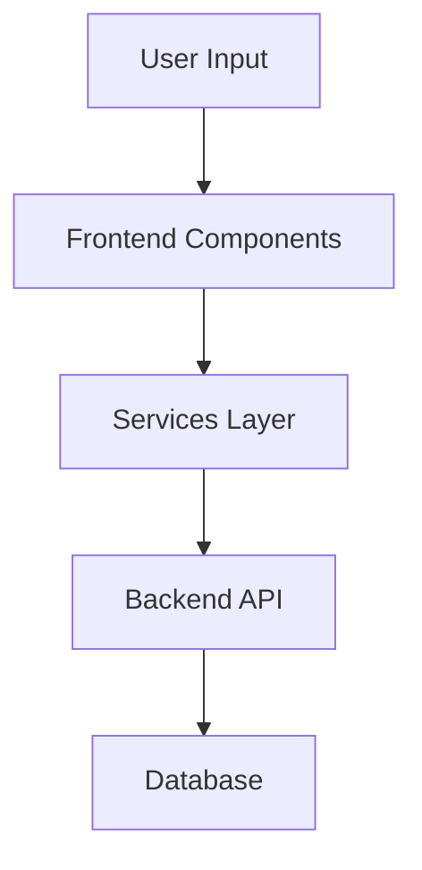

# PRP v4 Template - Agent 強制測試版

name: "功能名稱"
description: |
  功能描述，使用 PRP v4 模板，強制要求使用 Agent 進行完整測試驗證。

## 🎯 Goal
**Backend**: 後端目標
**Frontend**: 前端目標  
**UX**: 使用者體驗目標

## 💡 Why
- **商業價值**: 
- **用戶影響**: 
- **問題解決**: 
- **競爭優勢**: 

## 📋 What

### Backend Requirements
- 需求項目 1
- 需求項目 2

### Frontend Requirements
- 需求項目 1
- 需求項目 2

### UX Requirements
- 需求項目 1
- 需求項目 2

### Success Criteria
Backend:
- [ ] 標準 1
- [ ] 標準 2

Frontend:
- [ ] 標準 1
- [ ] 標準 2

UX:
- [ ] 標準 1
- [ ] 標準 2

## 🤖 Agent Collaboration (Phase 1) - 規劃驗證

### 必要 Agents (強制執行)
- [ ] **spec-writer**: 技術規格撰寫完成
- [ ] **ux-flow-designer**: UX 流程設計完成
- [ ] **typescript-type-guardian**: 型別架構定義完成
- [ ] **risk-assessor**: 風險評估完成

### Agent 產出文件
- [ ] `/docs/specs/[feature-name]-technical-spec.md`
- [ ] `/docs/ux/[feature-name]-user-flow.md`
- [ ] `/docs/types/[feature-name]-type-definitions.ts`
- [ ] `/docs/risks/[feature-name]-risk-assessment.md`

## 🔧 How - Technical Architecture

### System Design

### Data Flow
1. 步驟 1
2. 步驟 2
3. 步驟 3

### Technology Stack
- **Frontend**: React Native, TypeScript
- **Backend**: Firebase Functions, Node.js
- **Database**: Firestore
- **Storage**: Firebase Storage

## 📅 Timeline

### Phase 1: 規劃與設計 (Day 1)
**強制 Agent 測試**：
- [ ] spec-writer 完成技術規格
- [ ] ux-flow-designer 完成流程設計
- [ ] typescript-type-guardian 定義型別
- [ ] risk-assessor 評估風險

### Phase 2: 後端開發 (Day 2-3)
- [ ] API 設計與實作
- [ ] 資料庫架構
- [ ] 業務邏輯實作

**開發中 Agent 測試**：
- [ ] code-refactor-optimizer 持續優化
- [ ] typescript-type-guardian 型別檢查

### Phase 3: 前端開發 (Day 3-4)
- [ ] UI 元件開發
- [ ] 狀態管理
- [ ] API 整合

**開發中 Agent 測試**：
- [ ] interaction-tester 測試互動
- [ ] ui-visual-tester 視覺驗證

### Phase 4: 整合測試 (Day 5)
**強制 Agent 測試 (必須全部通過)**：
- [ ] **interaction-tester**: 完整互動測試 ✅
- [ ] **ui-visual-tester**: 視覺一致性驗證 ✅
- [ ] **ux-journey-analyzer**: 用戶流程驗證 ✅
- [ ] **typescript-type-guardian**: 型別安全檢查 ✅
- [ ] **code-refactor-optimizer**: 程式碼品質審查 ✅

### Phase 5: 發布準備 (Day 6)
- [ ] 文件更新
- [ ] 部署準備
- [ ] 使用者通知

**最終 Agent 驗證**：
- [ ] project-shipper 發布檢查清單

## ✅ Acceptance Testing Requirements

### 🤖 強制 Agent 測試項目

#### 1. Interaction Testing (interaction-tester)
**必須通過的測試**：
- [ ] 所有按鈕 onPress 事件正常
- [ ] 表單驗證和提交功能
- [ ] 導航和路由切換
- [ ] 錯誤處理和恢復
- [ ] 鍵盤和觸控互動
- [ ] 測試報告：`/docs/tests/interaction-test-report.md`

#### 2. Visual Testing (ui-visual-tester)
**必須通過的測試**：
- [ ] 設計規範符合度 100%
- [ ] 跨平台視覺一致性
- [ ] 響應式佈局正確
- [ ] 顏色和字體統一
- [ ] 無重複 UI 元件
- [ ] 測試報告：`/docs/tests/visual-test-report.md`

#### 3. UX Flow Testing (ux-journey-analyzer)
**必須通過的測試**：
- [ ] 完整用戶流程無斷點
- [ ] 頁面轉換邏輯正確
- [ ] 錯誤狀態處理完善
- [ ] 載入和等待體驗
- [ ] 可及性標準達成
- [ ] 測試報告：`/docs/tests/ux-flow-test-report.md`

#### 4. Type Safety Testing (typescript-type-guardian)
**必須通過的測試**：
- [ ] 無 TypeScript 編譯錯誤
- [ ] 無 any 類型濫用
- [ ] 介面定義完整
- [ ] 型別推斷正確
- [ ] 嚴格 null 檢查通過
- [ ] 測試報告：`/docs/tests/type-safety-report.md`

#### 5. Code Quality Testing (code-refactor-optimizer)
**必須通過的測試**：
- [ ] 無重複程式碼（DRY）
- [ ] 效能瓶頸已優化
- [ ] 記憶體洩漏檢查通過
- [ ] 最佳實踐符合度 >90%
- [ ] 無硬編碼敏感資訊
- [ ] 測試報告：`/docs/tests/code-quality-report.md`

### 📊 測試覆蓋率要求
- **功能覆蓋率**: >= 95%
- **程式碼覆蓋率**: >= 90%
- **互動元素覆蓋率**: 100%
- **跨平台測試**: Web + iOS + Android

### ⚠️ 測試失敗處理
如果任何 Agent 測試失敗：
1. 必須修復所有識別的問題
2. 重新執行失敗的 Agent 測試
3. 更新測試報告
4. 獲得所有 Agent 測試通過才能進入下一階段

## 📈 Metrics & Monitoring

### Performance KPIs
- API 回應時間 < 200ms
- 頁面載入時間 < 2s
- 記憶體使用 < 100MB
- 錯誤率 < 0.1%

### User Metrics
- 功能採用率
- 使用頻率
- 使用者滿意度
- 錯誤回報數

## 📚 Documentation

### 必要文件（Agent 產出）
- [ ] 技術規格文件 (spec-writer)
- [ ] UX 流程文件 (ux-flow-designer)
- [ ] API 文件
- [ ] 測試報告合集 (所有 testing agents)
- [ ] 部署指南 (project-shipper)

### 交付標準
- [ ] 所有 Agent 測試通過
- [ ] 文件完整性檢查
- [ ] Code Review 通過
- [ ] 部署驗證成功

## ⚠️ Known Issues & Mitigations

### 潛在問題
1. 問題描述
   - 影響：
   - 緩解措施：

### 依賴項
- 依賴項 1
- 依賴項 2

## 🚀 Deployment Strategy

### 部署步驟
1. Agent 測試全部通過
2. 預生產環境部署
3. 煙霧測試
4. 生產環境部署
5. 監控和回滾準備

### Rollback Plan
- 回滾觸發條件
- 回滾步驟
- 資料恢復程序

---

## 📝 PRP 執行檢查清單

### ✅ 開始前
- [ ] 建立 PRP 文件
- [ ] 初始化所有必要 Agents
- [ ] 建立測試報告目錄結構

### ✅ 開發中
- [ ] Phase 1: 所有規劃 Agents 執行完成
- [ ] Phase 2-3: 開發 Agents 持續監控
- [ ] Phase 4: 所有測試 Agents 通過

### ✅ 完成後
- [ ] 所有 Agent 測試報告已生成
- [ ] 測試覆蓋率達標
- [ ] 文件更新完成
- [ ] PRP 狀態更新為完成

---

**注意事項**：
1. **所有 Agent 測試都是強制性的**，不可跳過
2. **測試失敗必須修復**後才能繼續
3. **每個階段都要有 Agent 參與**驗證
4. **測試報告必須完整保存**供日後查證

此模板確保每個 PRP 都經過完整的 Agent 測試驗證，提升交付品質。