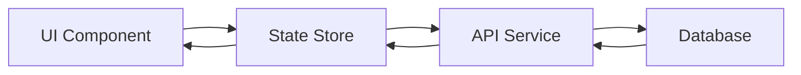

name: "Base PRP Template v3 - Full-Stack with Agent Integration"
description: |
  Enhanced template that ensures comprehensive planning across all layers (Backend, Frontend, UX, Security) 
  with mandatory Agent collaboration checkpoints.

## Purpose
Template optimized for AI agents to implement COMPLETE features with mandatory frontend/backend/UX consideration 
and agent-driven validation to achieve working code through iterative refinement.

## Core Principles
1. **Full-Stack Thinking**: MUST include Backend, Frontend, AND UX considerations
2. **Agent Collaboration**: MANDATORY use of specified agents at each phase
3. **Context is King**: Include ALL necessary documentation, examples, and caveats
4. **Validation Loops**: Provide executable tests/lints the AI can run and fix
5. **Progressive Success**: Start simple, validate, then enhance
6. **Global rules**: Follow all rules in CLAUDE.md

---

## 🎯 Goal
[What needs to be built - be specific about the end state for BOTH backend and frontend]

## 💡 Why
- [Business value and user impact]
- [Integration with existing features]
- [Problems this solves and for whom]
- [User journey improvement]

## 📋 What
### Backend Requirements
[Data models, APIs, services needed]

### Frontend Requirements
[UI components, screens, interactions]

### UX Requirements
[User flows, accessibility, responsive design]

### Success Criteria
Backend:
- [ ] [API endpoints working]
- [ ] [Data correctly stored]
- [ ] [Performance targets met]

Frontend:
- [ ] [UI components rendered correctly]
- [ ] [User interactions smooth]
- [ ] [Responsive on all devices]

UX:
- [ ] [User can complete primary flow]
- [ ] [Error states handled gracefully]
- [ ] [Accessibility standards met]

---

## 🤖 MANDATORY Agent Collaboration

### Phase 1: Planning & Design (MUST COMPLETE)
```yaml
Required Agents:
- spec-writer:
    purpose: Generate technical specifications
    output_location: "## Technical Specification"
    
- ux-flow-designer:
    purpose: Design complete user flows
    output_location: "## UX Design"
    
- risk-assessor:
    purpose: Identify and mitigate risks
    output_location: "## Risk Analysis"

Validation:
- [ ] spec-writer output included
- [ ] ux-flow-designer output included
- [ ] risk-assessor output included
```

### Phase 2: Architecture (MUST COMPLETE)
```yaml
Required Agents:
- backend-architect:
    purpose: Design backend structure
    output_location: "## Backend Architecture"
    
- typescript-type-guardian:
    purpose: Define type structures
    output_location: "## Type Definitions"
    
- ux-journey-analyzer:
    purpose: Validate user journeys
    output_location: "## Journey Analysis"

Validation:
- [ ] All agent outputs included
- [ ] Cross-layer integration verified
```

### Phase 3: Implementation Planning
```yaml
Required Agents:
- sprint-prioritizer:
    purpose: Break down into tasks
    output_location: "## Sprint Plan"
    
- interaction-tester:
    purpose: Plan test scenarios
    output_location: "## Test Strategy"

Validation:
- [ ] Tasks cover frontend AND backend
- [ ] Test scenarios comprehensive
```

---

## 📐 Technical Specification
<!-- OUTPUT FROM spec-writer AGENT -->
[Agent output will be placed here]

## 🎨 UX Design
<!-- OUTPUT FROM ux-flow-designer AGENT -->
### User Flows
[Agent output will be placed here]

### UI Components Required
- Component 1: [Purpose, location, interaction]
- Component 2: [Purpose, location, interaction]

### Screen Mockups (ASCII or description)
```
┌─────────────────────────┐
│  Header                 │
├─────────────────────────┤
│  [Main Content Area]    │
│                         │
│  • Dynamic Field List   │
│  • Action Buttons       │
│                         │
└─────────────────────────┘
```

### Mobile Considerations
- [How it adapts to mobile]
- [Touch interactions]
- [Reduced field display strategy]

---

## ⚠️ Risk Analysis
<!-- OUTPUT FROM risk-assessor AGENT -->
[Agent output will be placed here]

---

## 🏗️ Backend Architecture
<!-- OUTPUT FROM backend-architect AGENT -->
[Agent output will be placed here]

## 📝 Type Definitions
<!-- OUTPUT FROM typescript-type-guardian AGENT -->
```typescript
// Core type definitions
[Agent output will be placed here]
```

---

## 🗺️ Journey Analysis
<!-- OUTPUT FROM ux-journey-analyzer AGENT -->
[Agent output will be placed here]

---

## 📅 Sprint Plan
<!-- OUTPUT FROM sprint-prioritizer AGENT -->
[Agent output will be placed here]

---

## 🧪 Test Strategy
<!-- OUTPUT FROM interaction-tester AGENT -->
[Agent output will be placed here]

---

## 📂 All Needed Context

### Documentation & References
```yaml
# Backend
- file: [backend service file]
  why: [Pattern to follow]
  
# Frontend
- file: [UI component file]
  why: [Component patterns]
  
# UX
- url: [Design system docs]
  why: [UI standards]
  
# Cross-platform
- file: src/components/adaptive/
  why: [Platform-specific components]
```

### Current Codebase Structure
```bash
# Backend
src/
├── services/
├── types/
└── utils/

# Frontend
src/
├── components/
├── screens/
└── hooks/
```

### Platform-Specific Considerations
```typescript
// Web vs Native
if (Platform.OS === 'web') {
  // Web-specific implementation
} else {
  // Native implementation
}

// Responsive breakpoints
const BREAKPOINTS = {
  mobile: 480,
  tablet: 768,
  desktop: 1024
};
```

---

## 💻 Implementation Blueprint

### Frontend Components
```typescript
// List all UI components needed
1. DynamicFieldList.tsx
   - Purpose: Display dynamic fields
   - Props: fields, onFieldClick, onFieldReorder
   - State: selectedFields, sortOrder
   
2. FieldConfigurator.tsx
   - Purpose: Configure field properties
   - Props: field, onSave, onCancel
   - State: fieldConfig, validation
```

### Backend Services
```typescript
// List all services needed
1. DynamicFieldService.ts
   - Methods: analyzeFields, saveFieldConfig, loadFields
   - Dependencies: Firebase, ValidationEngine
   
2. QueryOptimizer.ts
   - Methods: optimizeQuery, buildIndexes
   - Dependencies: Firestore, CacheService
```

### Data Flow


### Tasks (Frontend + Backend)
```yaml
Frontend Tasks:
  Task 1: Create field list component
  Task 2: Implement virtual scrolling
  Task 3: Add field configurator
  Task 4: Mobile responsive layout
  
Backend Tasks:
  Task 5: Field analysis service
  Task 6: Storage optimization
  Task 7: Query engine
  Task 8: API endpoints

Integration Tasks:
  Task 9: Connect frontend to API
  Task 10: End-to-end testing
```

---

## ✅ Validation Loops

### Frontend Validation
```bash
# Component testing
npm run test:components

# UI testing
npm run test:ui

# Accessibility
npm run test:a11y

# Cross-browser
npm run test:browsers
```

### Backend Validation
```bash
# Type checking
npx tsc --noEmit

# Unit tests
npm run test:backend

# API tests
npm run test:api
```

### Integration Validation
```bash
# E2E tests
npm run test:e2e

# Performance
npm run test:performance

# Security
npm run test:security
```

---

## 📱 Responsive Design Requirements

### Mobile (< 768px)
- [How layout changes]
- [Which features are hidden/modified]
- [Touch gesture support]

### Tablet (768px - 1024px)
- [Layout adaptations]
- [Feature availability]

### Desktop (> 1024px)
- [Full feature set]
- [Multi-column layouts]

---

## ♿ Accessibility Requirements
- [ ] ARIA labels on all interactive elements
- [ ] Keyboard navigation support
- [ ] Screen reader compatibility
- [ ] Color contrast compliance (WCAG 2.1 AA)
- [ ] Focus indicators visible

---

## 🔒 Security Considerations
- [ ] Input validation on frontend
- [ ] API authentication required
- [ ] Data encryption for sensitive fields
- [ ] Rate limiting implemented
- [ ] CORS properly configured

---

## 📊 Performance Targets
Frontend:
- Initial load: < 3s
- Interaction response: < 100ms
- Memory usage: < 150MB

Backend:
- API response: < 500ms
- Database query: < 200ms
- Concurrent users: 1000+

---

## 🚀 Deployment Checklist
- [ ] Frontend build optimized
- [ ] Backend services deployed
- [ ] Database migrations run
- [ ] Environment variables set
- [ ] Monitoring configured
- [ ] Feature flags enabled

---

## 📚 Final Validation Checklist

### Agent Validation
- [ ] All required agents were used
- [ ] Agent outputs incorporated into PRP
- [ ] Cross-agent consistency verified

### Frontend Validation
- [ ] All UI components implemented
- [ ] Responsive design working
- [ ] Accessibility standards met
- [ ] Cross-platform tested (Web/iOS/Android)

### Backend Validation
- [ ] All endpoints working
- [ ] Data persistence verified
- [ ] Performance targets met
- [ ] Security measures in place

### Integration Validation
- [ ] Frontend ↔ Backend communication working
- [ ] End-to-end flows tested
- [ ] Error handling comprehensive
- [ ] Monitoring/logging active

---

## ❌ Anti-Patterns to Avoid
Backend:
- ❌ Don't ignore database limits
- ❌ Don't skip input validation
- ❌ Don't hardcode credentials

Frontend:
- ❌ Don't ignore mobile users
- ❌ Don't skip accessibility
- ❌ Don't use platform-specific components without checks
- ❌ Don't render 1000+ items without virtualization

UX:
- ❌ Don't hide critical errors
- ❌ Don't make users guess
- ❌ Don't ignore loading states
- ❌ Don't break platform conventions

---

## 📝 Notes for PRP Generator
When using this template:
1. MUST run all specified agents
2. MUST include frontend/backend/UX sections
3. MUST consider mobile/web differences
4. MUST include type definitions
5. MUST have visual mockups (even ASCII)
6. Agent outputs should be clearly marked
7. Check that tasks cover ALL layers

Score: _/10 (Rate confidence in one-pass implementation)