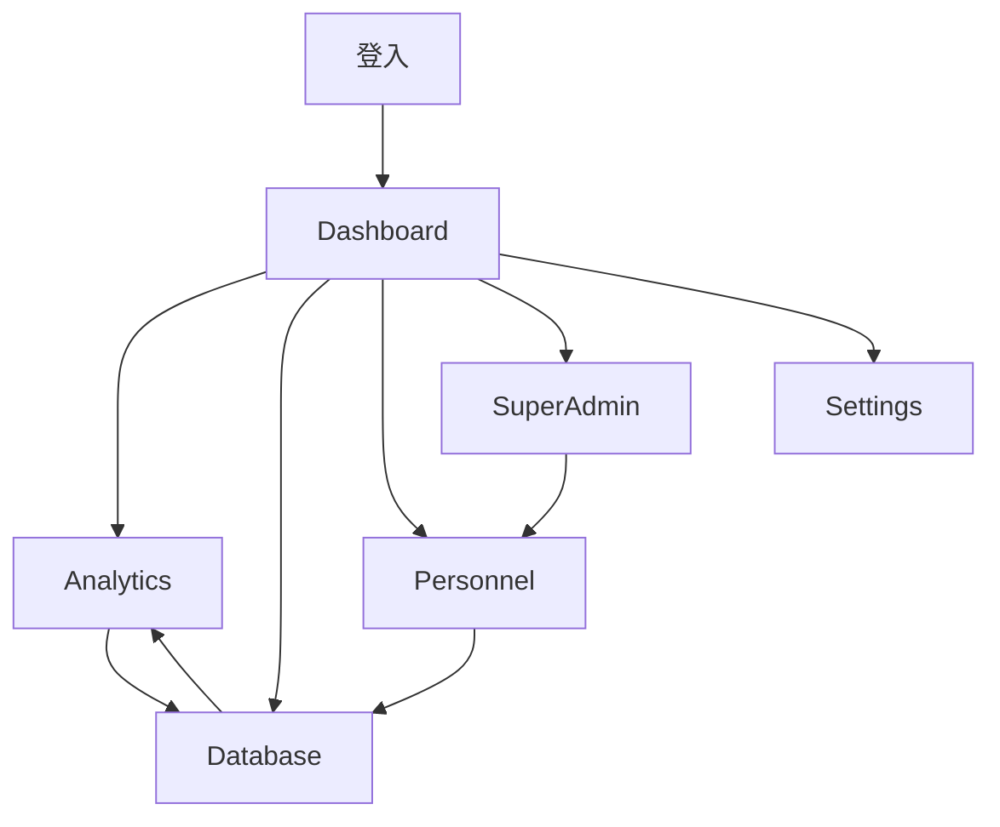

# DonnaAI Web 版架構規格書

## 📋 專案概述

**專案名稱：** DonnaAI Web Platform v2.0  
**技術決策：** 重寫為純 Web 應用（Next.js）  
**核心定位：** 管理 + 文書處理  

---

## 👤 用戶角色定義

### 🔴 SuperAdmin（超級管理員）
- **職責：** 平台管理、客戶 onboarding、系統監控
- **權限：** 最高權限，可訪問所有組織資料
- **使用場景：** 協助新客戶設定、解決技術問題、平台監控

### 🟠 組織管理員（Organization Admin）
- **職責：** 企業內部系統管理、用戶管理、權限設定
- **權限：** 組織內最高權限
- **使用場景：** 設定組織架構、管理用戶帳號、配置系統

### 🟡 業務主管（Manager）
- **職責：** 團隊管理、業績分析、決策支援
- **權限：** 可查看團隊數據、生成報表
- **使用場景：** 查看團隊業績、AI 圖表分析、人員管理

### 🟢 業務員（Salesperson）
- **職責：** 客戶資料維護（Web 版使用較少）
- **權限：** 基本資料讀寫
- **使用場景：** 大量資料整理、辦公室內的資料處理

---

## 🏗️ 頁面架構

### 🏠 首頁與導航
```
/
├── / (根路徑)
│   ├── 🏠 Dashboard（儀表板）
│   ├── 📊 Analytics（分析報表）
│   ├── 📝 Database（資料庫）
│   ├── 👥 Personnel（人事管理）
│   ├── 🔧 SuperAdmin（超管功能）
│   └── ⚙️ Settings（設定）
└── /auth
    ├── 🔐 Login（登入）
    └── 🔐 Logout（登出）
```

---

## 📄 詳細頁面規格

### 🏠 Dashboard（儀表板）
**路徑：** `/dashboard`  
**主要用戶：** 業務主管、組織管理員  
**頁面目標：** 提供組織概況和快速洞察  

#### 子頁面
```
/dashboard
├── / (主儀表板)
├── /overview (詳細概況)
└── /quick-actions (快速操作)
```

#### 核心功能
- 📊 關鍵指標卡片（業績、客戶數、任務完成率）
- 📈 趨勢圖表（最近 30 天）
- 🎯 快速 AI 查詢入口
- 📋 待辦事項提醒
- 👥 團隊狀態概覽

#### 資料需求
- 組織總體統計
- 團隊業績數據
- 最新活動記錄
- 系統通知

---

### 📊 Analytics（分析報表）
**路徑：** `/analytics`  
**主要用戶：** 業務主管  
**頁面目標：** AI 驅動的數據分析和圖表生成  

#### 子頁面
```
/analytics
├── / (AI 查詢介面)
├── /saved-reports (已儲存報表)
├── /templates (報表模板)
└── /export (匯出功能)
```

#### 核心功能
- 🤖 自然語言查詢框（主功能）
- 📊 動態圖表生成和顯示
- 💾 報表儲存和分享
- 📤 多格式匯出（PDF、Excel）
- 🔄 報表排程和自動更新
- 📱 報表模板庫

#### 特殊需求
- 響應式圖表庫
- AI 查詢解析
- 即時數據更新
- 高效能圖表渲染

---

### 📝 Database（資料庫管理）
**路徑：** `/database`  
**主要用戶：** 所有角色  
**頁面目標：** 強大的資料編輯和管理功能  

#### 子頁面
```
/database
├── /customers (客戶資料)
│   ├── / (客戶列表 - Notion 風格表格)
│   ├── /import (資料匯入精靈)
│   ├── /export (資料匯出)
│   └── /templates (CSV 模板)
├── /records (會議記錄)
│   ├── / (記錄列表 - 只讀檢視)
│   └── /details/[id] (記錄詳情)
└── /tasks (任務管理)
    ├── / (任務列表)
    ├── /assignment (任務指派)
    └── /tracking (進度追蹤)
```

#### 核心功能
- 🔥 **Notion 風格表格編輯**（核心功能）
  - 內聯編輯
  - 拖拽調整欄位
  - 多種欄位類型（文字、日期、選單、核取方塊）
  - 即時儲存
- 📥 **批量資料匯入**
  - CSV/Excel 檔案上傳
  - 智能欄位映射
  - 錯誤驗證和修正
  - 匯入預覽
- 🔍 **進階篩選和搜尋**
  - 多條件篩選
  - 全文搜尋
  - 自訂檢視
  - 儲存篩選條件
- 📤 **靈活匯出功能**
  - 選擇性欄位匯出
  - 多種格式支援
  - 範圍選擇匯出

#### 特殊需求
- 高效能虛擬滾動（處理大量資料）
- 即時協作編輯
- 復原/重做功能
- 離線編輯能力

---

### 👥 Personnel（人事管理）
**路徑：** `/personnel`  
**主要用戶：** 組織管理員、業務主管  
**頁面目標：** 組織架構管理和權限設定  

#### 子頁面
```
/personnel
├── /overview (人員概況)
├── /org-chart (組織圖)
│   ├── / (互動式組織圖)
│   ├── /edit (編輯模式)
│   └── /permissions (權限設定)
├── /users (用戶管理)
│   ├── / (用戶列表)
│   ├── /create (新增用戶)
│   ├── /import (批量匯入)
│   └── /roles (角色管理)
└── /teams (團隊管理)
    ├── / (團隊列表)
    └── /structure (團隊結構)
```

#### 核心功能
- 🌳 **視覺化組織圖**（重點功能）
  - 拖拽式組織架構編輯
  - 樹狀圖顯示層級關係
  - 即時權限繼承顯示
  - 組織變更歷史
- 👤 **用戶管理**
  - 用戶 CRUD 操作
  - 批量用戶匯入
  - 權限角色指派
  - 帳號狀態管理
- 🔐 **權限管理**
  - 視覺化權限設定
  - 角色權限模板
  - 權限繼承規則
  - 權限衝突檢測

#### 特殊需求
- D3.js 或類似的視覺化庫
- 複雜的拖拽邏輯
- 權限系統整合
- 即時更新機制

---

### 🔧 SuperAdmin（超級管理員）
**路徑：** `/superadmin`  
**主要用戶：** SuperAdmin  
**頁面目標：** 平台管理和客戶支援  

#### 子頁面
```
/superadmin
├── /dashboard (平台總覽)
├── /organizations (組織管理)
│   ├── / (組織列表)
│   ├── /create (新增組織)
│   ├── /details/[id] (組織詳情)
│   └── /onboarding (客戶導入精靈)
├── /platform (平台監控)
│   ├── /metrics (使用量統計)
│   ├── /performance (性能監控)
│   └── /errors (錯誤日誌)
├── /billing (計費管理)
│   ├── / (計費概況)
│   ├── /usage (使用量統計)
│   └── /invoices (發票管理)
└── /support (客戶支援)
    ├── /tickets (工單系統)
    └── /tools (支援工具)
```

#### 核心功能
- 🏢 **組織管理**
  - 組織 CRUD 操作
  - 組織狀態管理
  - 資源配額設定
- 🎯 **客戶 Onboarding 精靈**（重點功能）
  - 分步驟設定流程
  - 組織初始化
  - 用戶帳號建立
  - 權限配置
  - 測試資料匯入
- 📊 **平台監控**
  - 使用量統計
  - 性能指標
  - 錯誤監控
  - 系統健康檢查
- 💰 **計費管理**
  - 使用量計算
  - 帳單生成
  - 付費狀態追蹤

#### 特殊需求
- 多步驟精靈介面
- 即時監控儀表板
- 權限隔離機制
- 安全性考量

---

### ⚙️ Settings（設定）
**路徑：** `/settings`  
**主要用戶：** 組織管理員  
**頁面目標：** 系統配置和個人設定  

#### 子頁面
```
/settings
├── /profile (個人資料)
├── /organization (組織設定)
│   ├── /general (基本設定)
│   ├── /fields (自訂欄位)
│   ├── /integrations (第三方整合)
│   └── /security (安全設定)
├── /notifications (通知設定)
├── /data (資料管理)
│   ├── /backup (備份設定)
│   ├── /export (匯出設定)
│   └── /retention (資料保留)
└── /system (系統設定)
    ├── /api (API 設定)
    └── /webhooks (Webhook 設定)
```

#### 核心功能
- 👤 **個人資料管理**
- 🏢 **組織設定**
  - 基本資訊編輯
  - 自訂欄位定義
  - 業務規則設定
- 🔔 **通知管理**
- 💾 **資料管理**
  - 備份和還原
  - 資料匯出設定
  - 資料保留政策
- 🔗 **第三方整合**
  - API 金鑰管理
  - Webhook 設定
  - 外部系統連接

---

## 🔗 頁面關聯性

### 主要導航流程


### 資料關聯
- **Dashboard** ← 彙總資料 ← **Database**
- **Analytics** ← 查詢資料 ← **Database**
- **Personnel** ← 權限控制 → **Database**
- **SuperAdmin** ← 管理 → **Organizations** → **Personnel**

---

## 🎨 共用元件需求

### 核心元件
- 📊 **圖表元件庫**（支援多種圖表類型）
- 📝 **表格元件**（Notion 風格，支援內聯編輯）
- 🌳 **組織圖元件**（拖拽式，可編輯）
- 🤖 **AI 查詢元件**（自然語言輸入）
- 📤 **匯出元件**（多格式支援）
- 📥 **匯入精靈**（多步驟，錯誤處理）

### UI 系統
- 🎨 **設計系統**（顏色、字體、間距）
- 🧩 **基礎元件**（按鈕、輸入框、選單）
- 📱 **佈局元件**（響應式網格、側邊欄）
- 🔔 **通知系統**（Toast、Modal、Alert）

---

## 🚀 開發優先級

### Phase 1（核心功能）- 4 週
1. 🏠 Dashboard（基礎版）
2. 📝 Database/Customers（Notion 表格）
3. 🔐 Auth 系統

### Phase 2（分析功能）- 3 週  
1. 📊 Analytics（AI 查詢）
2. 📈 圖表系統
3. 💾 報表儲存

### Phase 3（管理功能）- 3 週
1. 👥 Personnel（基礎）
2. 🌳 組織圖視覺化
3. 🔐 權限管理

### Phase 4（平台功能）- 2 週
1. 🔧 SuperAdmin 基礎
2. 🎯 Onboarding 精靈
3. ⚙️ Settings 頁面

---

## 📝 下一步行動

1. ✅ **確認頁面架構**（當前步驟）
2. ⏳ **設計每頁的詳細線框圖**
3. ⏳ **定義 API 規格**
4. ⏳ **選擇技術棧和工具**
5. ⏳ **建立開發環境**
6. ⏳ **開始 Phase 1 開發**

---

*最後更新：2025-01-18*  
*版本：v1.0*