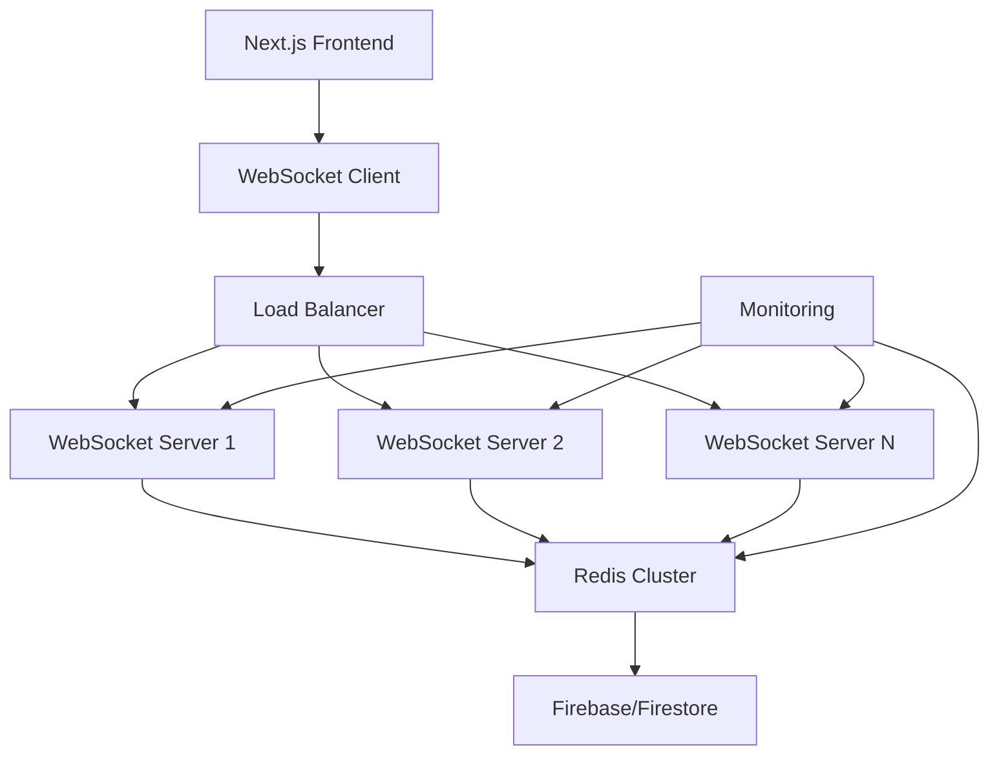

# WebSocket 伺服器部署指南

## 📋 總覽

本指南說明如何部署 DonnaAI Dashboard 的 WebSocket 即時通訊系統，包含伺服器設定、環境配置、監控和維護。

## 🏗️ 系統架構



## 📦 部署需求

### 系統需求
- **Node.js**: >= 18.0.0
- **Memory**: 至少 2GB RAM（生產環境建議 4GB+）
- **CPU**: 至少 2 核心（生產環境建議 4 核心+）
- **Storage**: 至少 10GB 可用空間
- **Network**: 穩定的網路連線，支援 WebSocket 協定

### 依賴服務
- **Redis**: 用於 WebSocket 連線狀態同步和快取
- **Firebase/Firestore**: 主要資料庫
- **Load Balancer**: 多實例部署時使用（推薦 nginx 或 HAProxy）

## 🛠️ 部署步驟

### 1. 環境準備

```bash
# 1. 安裝 Node.js (使用 nvm)
curl -o- https://raw.githubusercontent.com/nvm-sh/nvm/v0.39.0/install.sh | bash
source ~/.bashrc
nvm install 18
nvm use 18

# 2. 安裝 PM2 (進程管理器)
npm install -g pm2

# 3. 安裝 Redis (Ubuntu/Debian)
sudo apt update
sudo apt install redis-server
sudo systemctl enable redis-server
sudo systemctl start redis-server

# 或使用 Docker
docker run -d --name redis -p 6379:6379 redis:7-alpine

# 4. 克隆代碼庫
git clone https://github.com/your-org/DonnaAI-1.0.git
cd DonnaAI-1.0
```

### 2. 環境變數配置

建立生產環境配置檔案：

```bash
# 建立 .env.production
cat > .env.production << EOF
# WebSocket 伺服器配置
WS_PORT=3001
WS_HOST=0.0.0.0
NODE_ENV=production

# JWT 認證
JWT_SECRET=your_secure_jwt_secret_here_min_32_chars

# CORS 設定
CORS_ORIGIN=https://yourdomain.com

# Redis 配置
REDIS_HOST=localhost
REDIS_PORT=6379
REDIS_PASSWORD=your_redis_password
REDIS_DB=0

# Firebase 配置
FIREBASE_PROJECT_ID=your_project_id
FIREBASE_PRIVATE_KEY=your_private_key
FIREBASE_CLIENT_EMAIL=your_client_email

# 監控設定
ENABLE_METRICS=true
METRICS_PORT=3002
LOG_LEVEL=info

# 效能調優
MAX_CONNECTIONS=1000
HEARTBEAT_INTERVAL=30000
CLEANUP_INTERVAL=60000
EOF
```

### 3. 依賴安裝

```bash
# 安裝 Node.js 依賴
npm ci --production

# 或使用 yarn
yarn install --production
```

### 4. WebSocket 伺服器部署

#### 方法 1: 使用 PM2 (推薦)

建立 PM2 配置檔案：

```javascript
// ecosystem.config.js
module.exports = {
  apps: [
    {
      name: 'donnaai-websocket',
      script: './server/websocket-server.js',
      instances: 'max', // 或指定數量，如 4
      exec_mode: 'cluster',
      env: {
        NODE_ENV: 'development'
      },
      env_production: {
        NODE_ENV: 'production',
        WS_PORT: 3001
      },
      // 日誌設定
      log_file: './logs/websocket.log',
      out_file: './logs/websocket-out.log',
      error_file: './logs/websocket-error.log',
      log_date_format: 'YYYY-MM-DD HH:mm:ss',
      
      // 自動重啟設定
      watch: false,
      autorestart: true,
      max_restarts: 10,
      min_uptime: '10s',
      
      // 記憶體限制
      max_memory_restart: '1G',
      
      // 健康檢查
      health_check_grace_period: 10000,
      
      // 環境變數
      env_file: '.env.production'
    }
  ]
};
```

啟動服務：

```bash
# 建立日誌目錄
mkdir -p logs

# 啟動服務
pm2 start ecosystem.config.js --env production

# 設定開機自啟
pm2 startup
pm2 save

# 檢查狀態
pm2 status
pm2 logs donnaai-websocket
```

#### 方法 2: 使用 Docker

```dockerfile
# Dockerfile.websocket
FROM node:18-alpine

WORKDIR /app

# 安裝依賴
COPY package*.json ./
RUN npm ci --production && npm cache clean --force

# 複製應用程式碼
COPY server/ ./server/
COPY .env.production .env

# 建立非 root 使用者
RUN addgroup -g 1001 -S nodejs
RUN adduser -S nextjs -u 1001
USER nextjs

# 暴露端口
EXPOSE 3001

# 健康檢查
HEALTHCHECK --interval=30s --timeout=3s --start-period=5s --retries=3 \
  CMD curl -f http://localhost:3001/health || exit 1

# 啟動應用
CMD ["node", "server/websocket-server.js"]
```

Docker Compose 配置：

```yaml
# docker-compose.websocket.yml
version: '3.8'

services:
  websocket:
    build:
      context: .
      dockerfile: Dockerfile.websocket
    ports:
      - "3001:3001"
    environment:
      - NODE_ENV=production
      - REDIS_HOST=redis
    depends_on:
      - redis
    restart: unless-stopped
    networks:
      - donnaai-network
    
  redis:
    image: redis:7-alpine
    ports:
      - "6379:6379"
    volumes:
      - redis_data:/data
    restart: unless-stopped
    networks:
      - donnaai-network
    command: redis-server --appendonly yes

volumes:
  redis_data:

networks:
  donnaai-network:
    driver: bridge
```

部署指令：

```bash
# 建立和啟動服務
docker-compose -f docker-compose.websocket.yml up -d

# 檢查狀態
docker-compose -f docker-compose.websocket.yml ps
docker-compose -f docker-compose.websocket.yml logs websocket
```

### 5. 負載平衡器配置

#### Nginx 配置

```nginx
# /etc/nginx/sites-available/donnaai-websocket
upstream websocket_backend {
    # WebSocket 伺服器實例
    server 127.0.0.1:3001;
    server 127.0.0.1:3002;
    server 127.0.0.1:3003;
    
    # 使用 IP Hash 確保連線穩定性
    ip_hash;
}

server {
    listen 80;
    server_name ws.yourdomain.com;
    
    # 重定向到 HTTPS
    return 301 https://$server_name$request_uri;
}

server {
    listen 443 ssl http2;
    server_name ws.yourdomain.com;
    
    # SSL 憑證
    ssl_certificate /path/to/ssl/cert.pem;
    ssl_certificate_key /path/to/ssl/key.pem;
    
    # WebSocket 代理配置
    location / {
        proxy_pass http://websocket_backend;
        
        # WebSocket 必要標頭
        proxy_http_version 1.1;
        proxy_set_header Upgrade $http_upgrade;
        proxy_set_header Connection "upgrade";
        proxy_set_header Host $host;
        proxy_set_header X-Real-IP $remote_addr;
        proxy_set_header X-Forwarded-For $proxy_add_x_forwarded_for;
        proxy_set_header X-Forwarded-Proto $scheme;
        
        # 超時設定
        proxy_connect_timeout 60s;
        proxy_send_timeout 60s;
        proxy_read_timeout 60s;
        
        # 快取禁用
        proxy_cache_bypass 1;
        proxy_no_cache 1;
    }
    
    # 健康檢查端點
    location /health {
        proxy_pass http://websocket_backend/health;
        access_log off;
    }
    
    # 監控指標端點
    location /metrics {
        proxy_pass http://websocket_backend/metrics;
        allow 127.0.0.1;  # 僅允許本機存取
        deny all;
    }
}
```

啟用配置：

```bash
# 啟用站點
sudo ln -s /etc/nginx/sites-available/donnaai-websocket /etc/nginx/sites-enabled/

# 測試配置
sudo nginx -t

# 重載配置
sudo systemctl reload nginx
```

## 📊 監控與日誌

### 1. 應用程式監控

安裝和配置監控工具：

```bash
# 安裝 PM2 監控模組
pm2 install pm2-logrotate

# 設定日誌輪換
pm2 set pm2-logrotate:max_size 10M
pm2 set pm2-logrotate:compress true
pm2 set pm2-logrotate:retain 30
```

### 2. 系統監控腳本

```bash
#!/bin/bash
# monitor-websocket.sh

# WebSocket 伺服器健康檢查
check_websocket() {
    local port=${1:-3001}
    local response=$(curl -s -o /dev/null -w "%{http_code}" http://localhost:$port/health)
    
    if [ "$response" = "200" ]; then
        echo "✅ WebSocket server on port $port is healthy"
        return 0
    else
        echo "❌ WebSocket server on port $port is unhealthy (HTTP $response)"
        return 1
    fi
}

# Redis 連線檢查
check_redis() {
    if redis-cli ping > /dev/null 2>&1; then
        echo "✅ Redis is connected"
        return 0
    else
        echo "❌ Redis connection failed"
        return 1
    fi
}

# 記憶體使用檢查
check_memory() {
    local mem_usage=$(free | grep Mem | awk '{printf("%.1f"), $3/$2 * 100.0}')
    echo "💾 Memory usage: ${mem_usage}%"
    
    if (( $(echo "$mem_usage > 80" | bc -l) )); then
        echo "⚠️ High memory usage detected"
        return 1
    fi
    return 0
}

# 執行所有檢查
echo "🔍 Starting health checks..."
check_websocket 3001
check_redis
check_memory

echo "✅ Health check completed"
```

設定定期檢查：

```bash
# 添加到 crontab
crontab -e

# 每 5 分鐘執行一次健康檢查
*/5 * * * * /path/to/monitor-websocket.sh >> /var/log/websocket-health.log 2>&1
```

### 3. 日誌管理

日誌輪換配置：

```bash
# /etc/logrotate.d/donnaai-websocket
/var/log/donnaai/websocket/*.log {
    daily
    missingok
    rotate 30
    compress
    delaycompress
    notifempty
    create 0644 www-data www-data
    postrotate
        pm2 reloadLogs
    endscript
}
```

## 🔒 安全配置

### 1. 防火牆設定

```bash
# UFW 配置
sudo ufw allow 22/tcp       # SSH
sudo ufw allow 80/tcp       # HTTP
sudo ufw allow 443/tcp      # HTTPS
sudo ufw allow 3001/tcp     # WebSocket (僅內部網路)
sudo ufw enable
```

### 2. SSL/TLS 配置

使用 Let's Encrypt 取得免費 SSL 憑證：

```bash
# 安裝 Certbot
sudo apt install certbot python3-certbot-nginx

# 取得憑證
sudo certbot --nginx -d ws.yourdomain.com

# 設定自動更新
echo "0 2 * * * root certbot renew --quiet" | sudo tee -a /etc/crontab
```

### 3. 速率限制

在 Nginx 中設定速率限制：

```nginx
# 在 http 區塊中
limit_req_zone $binary_remote_addr zone=websocket:10m rate=10r/s;

# 在 server 區塊中
location / {
    limit_req zone=websocket burst=20 nodelay;
    # ... 其他配置
}
```

## 🚀 效能優化

### 1. Node.js 調優

```bash
# 增加檔案描述符限制
echo "fs.file-max = 65536" | sudo tee -a /etc/sysctl.conf
echo "* soft nofile 65536" | sudo tee -a /etc/security/limits.conf
echo "* hard nofile 65536" | sudo tee -a /etc/security/limits.conf

# 調整 TCP 設定
echo "net.core.somaxconn = 4096" | sudo tee -a /etc/sysctl.conf
echo "net.ipv4.tcp_max_syn_backlog = 4096" | sudo tee -a /etc/sysctl.conf

# 套用設定
sudo sysctl -p
```

### 2. Redis 調優

```bash
# Redis 設定優化
cat >> /etc/redis/redis.conf << EOF
# 記憶體優化
maxmemory 2gb
maxmemory-policy allkeys-lru

# 持久化設定
save 900 1
save 300 10
save 60 10000

# 網路優化
tcp-keepalive 300
timeout 0

# 最大連線數
maxclients 10000
EOF

# 重啟 Redis
sudo systemctl restart redis-server
```

### 3. 應用程式優化

```javascript
// server/websocket-server.js 效能優化設定
const CONFIG = {
  // 連線池設定
  maxConnections: process.env.MAX_CONNECTIONS || 1000,
  
  // 心跳優化
  heartbeatInterval: process.env.HEARTBEAT_INTERVAL || 30000,
  
  // 訊息壓縮
  perMessageDeflate: {
    threshold: 1024,
    concurrencyLimit: 10,
    serverMaxWindow: 13,
    clientMaxWindow: 13,
  },
  
  // 清理間隔
  cleanupInterval: process.env.CLEANUP_INTERVAL || 60000,
};
```

## 🔄 備份與災難恢復

### 1. 資料備份

```bash
#!/bin/bash
# backup-websocket.sh

BACKUP_DIR="/backup/websocket/$(date +%Y%m%d)"
mkdir -p $BACKUP_DIR

# 備份 Redis 資料
redis-cli save
cp /var/lib/redis/dump.rdb $BACKUP_DIR/

# 備份配置檔案
cp .env.production $BACKUP_DIR/
cp ecosystem.config.js $BACKUP_DIR/

# 備份日誌（最近 7 天）
find ./logs -name "*.log" -mtime -7 -exec cp {} $BACKUP_DIR/ \;

# 壓縮備份
cd /backup/websocket
tar -czf "websocket-backup-$(date +%Y%m%d-%H%M%S).tar.gz" $(basename $BACKUP_DIR)

echo "Backup completed: $BACKUP_DIR"
```

### 2. 災難恢復計劃

1. **服務中斷檢測**：監控系統檢測到服務異常
2. **自動容錯轉移**：負載平衡器自動切換到健康的節點
3. **手動介入**：必要時手動重啟服務或切換到備用環境
4. **資料恢復**：從最近的備份中恢復資料

```bash
# 快速恢復腳本
#!/bin/bash
# disaster-recovery.sh

echo "🚨 Starting disaster recovery..."

# 停止服務
pm2 stop donnaai-websocket

# 恢復最新備份
LATEST_BACKUP=$(ls -t /backup/websocket/*.tar.gz | head -1)
cd /tmp
tar -xzf $LATEST_BACKUP

# 恢復 Redis 資料
sudo systemctl stop redis-server
cp dump.rdb /var/lib/redis/
sudo chown redis:redis /var/lib/redis/dump.rdb
sudo systemctl start redis-server

# 重啟服務
pm2 start donnaai-websocket

echo "✅ Disaster recovery completed"
```

## 📋 部署檢查清單

### 部署前檢查
- [ ] 環境變數正確設定
- [ ] SSL 憑證已安裝
- [ ] Redis 服務正常運行
- [ ] 防火牆規則已配置
- [ ] 監控系統已設定

### 部署後驗證
- [ ] WebSocket 連線正常
- [ ] 即時訊息傳遞功能正常
- [ ] 負載平衡器運作正常
- [ ] 日誌記錄正常
- [ ] 監控警報設定完成

### 效能驗證
- [ ] 連線數測試通過
- [ ] 延遲測試符合要求
- [ ] 記憶體使用率在正常範圍
- [ ] CPU 使用率穩定

## 🛠️ 故障排除

### 常見問題

#### 1. WebSocket 連線失敗
```bash
# 檢查服務狀態
pm2 status
pm2 logs donnaai-websocket

# 檢查端口是否開放
netstat -tlnp | grep 3001
```

#### 2. 記憶體洩露
```bash
# 監控記憶體使用
pm2 monit

# 重啟服務釋放記憶體
pm2 restart donnaai-websocket
```

#### 3. Redis 連線問題
```bash
# 檢查 Redis 狀態
redis-cli ping
sudo systemctl status redis-server

# 檢查網路連線
telnet localhost 6379
```

## 📞 支援與維護

### 日常維護任務
- 檢查服務狀態和日誌
- 監控系統資源使用
- 更新安全補丁
- 執行效能測試

### 緊急聯絡資訊
- **技術支援**: support@donnaai.com
- **緊急熱線**: +886-xxx-xxx-xxx
- **監控警報**: alerts@donnaai.com

---

**注意**: 本指南基於 Ubuntu 20.04 LTS 環境編寫，其他作業系統可能需要調整部分指令和路徑。