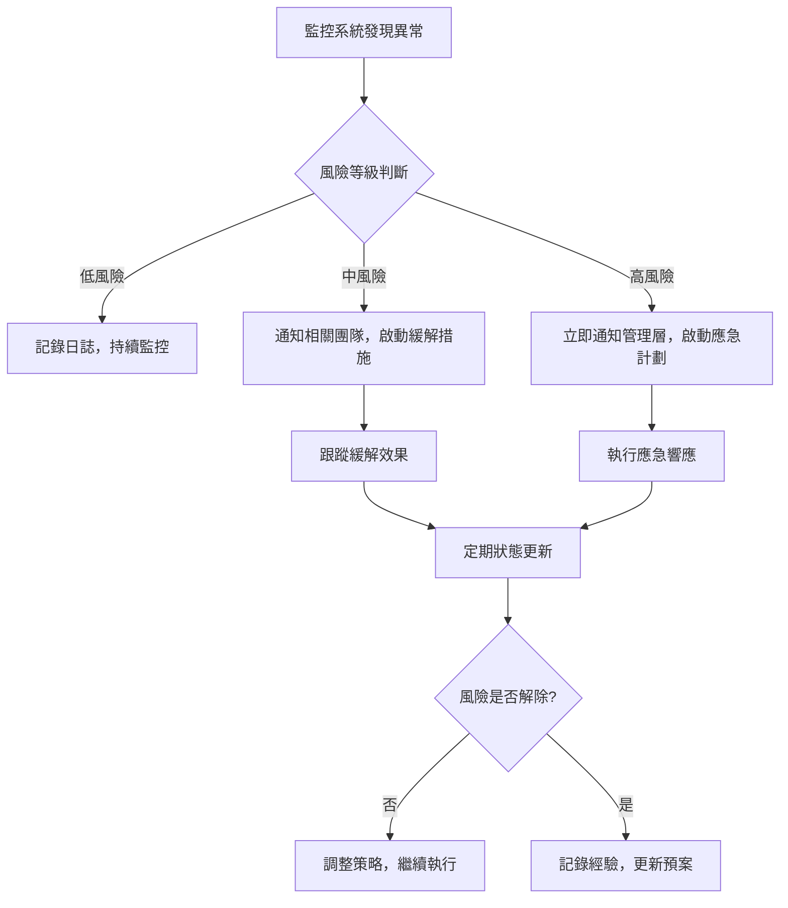

# PRP-124: AI 驅動分析查詢介面 - 全方位風險評估報告

**版本**: 1.0.0  
**日期**: 2025-08-18  
**負責 Agent**: risk-assessor  
**專案**: DonnaAI CRM 平台 - AI 查詢分析系統  
**風險評估範圍**: 技術、業務、運營、專案全生命週期風險

---

## 執行摘要

### 專案概覽
PRP-124 旨在建立一個智能化的資料分析系統，讓使用者透過自然語言查詢業務問題，AI 自動理解意圖並生成相應圖表和分析報告。此專案整合了 AI 技術、複雜資料處理、即時互動等多個高風險技術領域。

### 風險評估結論
經過系統性風險分析，識別出 **34 個主要風險項目**，其中：
- 🔴 **高風險**: 8 項（需立即關注和緩解）
- 🟡 **中風險**: 16 項（需要監控和預防措施）
- 🟢 **低風險**: 10 項（需要基礎防護措施）

### 關鍵風險警示
1. **AI 準確性不穩定** - 可能導致錯誤分析結果，影響業務決策
2. **自然語言理解複雜性** - 中文語義理解的技術挑戰
3. **API 成本控制風險** - AI 服務費用可能快速累積
4. **系統效能瓶頸** - 複雜查詢可能導致回應時間過長
5. **使用者期望管理** - AI 能力與使用者期望的落差

---

## 1. 系統性風險識別

### 1.1 技術風險 (Technical Risks)

#### 🔴 高風險項目

**T001: AI 查詢理解準確性不穩定**
- **風險描述**: AI 模型無法準確理解中文自然語言查詢，導致錯誤的查詢結果
- **機率評估**: 4/5 (高)
- **影響評估**: 5/5 (極高)
- **風險分數**: 20/25 (極高風險)
- **時間軸**: 開發階段即可能出現，上線後持續存在
- **具體影響**:
  - 用戶查詢「本月營收」可能被理解為「上月營收」
  - 時間範圍解析錯誤（"過去三個月" vs "最近三季"）
  - 業務術語誤解（"轉換率" vs "成交率"）
  - 複雜句式的語義分析失敗

**T002: 自然語言處理的語言限制**
- **風險描述**: 繁體中文的語義理解、實體識別和意圖分類存在技術瓶頸
- **機率評估**: 4/5 (高)
- **影響評估**: 4/5 (高)
- **風險分數**: 16/25 (高風險)
- **時間軸**: 開發初期和測試階段
- **具體影響**:
  - 台灣業務用語的識別困難
  - 中英文混合句式的解析問題
  - 口語化表達的理解偏差
  - 同義詞和近義詞的處理不準確

**T003: API 服務依賴風險**
- **風險描述**: 依賴第三方 AI 服務（Claude/OpenAI）可能面臨服務中斷、API 變更、費用調整
- **機率評估**: 3/5 (中)
- **影響評估**: 5/5 (極高)
- **風險分數**: 15/25 (高風險)
- **時間軸**: 整個專案生命週期
- **具體影響**:
  - OpenAI 或 Anthropic 服務暫停導致功能完全失效
  - API 費率突然調整影響專案成本
  - 服務條款變更影響商業使用
  - API 介面升級導致相容性問題

**T004: 查詢效能瓶頸**
- **風險描述**: 複雜查詢處理時間過長，超過使用者可接受範圍（3秒）
- **機率評估**: 4/5 (高)
- **影響評估**: 4/5 (高)
- **風險分數**: 16/25 (高風險)
- **時間軸**: 系統負載增加時
- **具體影響**:
  - 多維度分析查詢回應時間 > 10秒
  - 大數據集的聚合運算超時
  - AI 模型推理時間過長
  - 並發查詢導致系統資源競爭

#### 🟡 中風險項目

**T005: Firestore 查詢限制**
- **風險描述**: Firestore 的查詢能力限制可能無法滿足複雜的分析需求
- **機率評估**: 3/5 (中)
- **影響評估**: 3/5 (中)
- **風險分數**: 9/25 (中風險)
- **具體限制**:
  - 不支援複雜的 JOIN 操作
  - 聚合查詢功能有限
  - 複合索引配置複雜
  - 查詢結果數量限制

**T006: 即時資料同步複雜性**
- **風險描述**: WebSocket 即時更新機制可能造成資料不一致或連線穩定性問題
- **機率評估**: 3/5 (中)
- **影響評估**: 3/5 (中)
- **風險分數**: 9/25 (中風險)

**T007: 圖表推薦算法不準確**
- **風險描述**: AI 推薦的圖表類型可能不適合數據特性或使用者需求
- **機率評估**: 3/5 (中)
- **影響評估**: 2/5 (低)
- **風險分數**: 6/25 (中低風險)

**T008: 快取策略複雜性**
- **風險描述**: 查詢結果快取管理複雜，可能導致過時資料或快取失效問題
- **機率評估**: 2/5 (低)
- **影響評估**: 3/5 (中)
- **風險分數**: 6/25 (中低風險)

#### 🟢 低風險項目

**T009: 跨平台相容性問題**
- **風險描述**: Web、iOS、Android 平台間的功能差異
- **機率評估**: 2/5 (低)
- **影響評估**: 2/5 (低)
- **風險分數**: 4/25 (低風險)

**T010: TypeScript 型別安全**
- **風險描述**: 複雜的型別定義可能導致開發期間的型別錯誤
- **機率評估**: 2/5 (低)
- **影響評估**: 2/5 (低)
- **風險分數**: 4/25 (低風險)

### 1.2 業務風險 (Business Risks)

#### 🔴 高風險項目

**B001: AI 成本控制風險**
- **風險描述**: AI API 使用費用快速累積，超出預算控制
- **機率評估**: 4/5 (高)
- **影響評估**: 4/5 (高)
- **風險分數**: 16/25 (高風險)
- **時間軸**: 用戶量增長時
- **費用估算**:
  - Claude API: ~$15/1M tokens
  - 每次查詢平均消耗 1000 tokens
  - 1000 用戶/日 = $15,000/月
  - 費用可能呈指數級增長

**B002: 使用者期望與實際能力落差**
- **風險描述**: 使用者對 AI 能力期望過高，實際體驗可能無法滿足期望
- **機率評估**: 4/5 (高)
- **影響評估**: 4/5 (高)
- **風險分數**: 16/25 (高風險)
- **具體表現**:
  - 期望 ChatGPT 級別的對話能力
  - 希望處理超出資料範圍的查詢
  - 預期 100% 準確的分析結果
  - 要求即時的複雜分析

#### 🟡 中風險項目

**B003: 市場競爭風險**
- **風險描述**: Microsoft、Google、Tableau 等大廠推出類似功能，搶佔市場
- **機率評估**: 3/5 (中)
- **影響評估**: 4/5 (高)
- **風險分數**: 12/25 (中高風險)

**B004: 法規合規風險**
- **風險描述**: AI 應用的法規環境變化，可能影響產品合規性
- **機率評估**: 2/5 (低)
- **影響評估**: 4/5 (高)
- **風險分數**: 8/25 (中低風險)

**B005: 客戶資料隱私風險**
- **風險描述**: AI 處理敏感業務資料可能面臨隱私洩露風險
- **機率評估**: 2/5 (低)
- **影響評估**: 5/5 (極高)
- **風險分數**: 10/25 (中風險)

**B006: 投資回報率 (ROI) 不明確**
- **風險描述**: AI 功能的實際業務價值難以量化，ROI 計算困難
- **機率評估**: 3/5 (中)
- **影響評估**: 3/5 (中)
- **風險分數**: 9/25 (中風險)

### 1.3 運營風險 (Operational Risks)

#### 🔴 高風險項目

**O001: 團隊 AI 技術經驗不足**
- **風險描述**: 團隊缺乏 AI/NLP 專業經驗，可能影響實施品質
- **機率評估**: 4/5 (高)
- **影響評估**: 4/5 (高)
- **風險分數**: 16/25 (高風險)
- **技能缺口**:
  - 提示詞工程 (Prompt Engineering)
  - NLP 模型調優
  - AI 服務整合經驗
  - 機器學習模型評估

#### 🟡 中風險項目

**O002: AI 服務監控和維護複雜性**
- **風險描述**: AI 服務的監控、調優和維護需要專業知識
- **機率評估**: 3/5 (中)
- **影響評估**: 3/5 (中)
- **風險分數**: 9/25 (中風險)

**O003: 使用者支援和訓練需求**
- **風險描述**: 用戶需要學習如何有效使用 AI 查詢功能
- **機率評估**: 4/5 (高)
- **影響評估**: 2/5 (低)
- **風險分數**: 8/25 (中低風險)

**O004: 系統擴展性挑戰**
- **風險描述**: 用戶增長時系統架構可能無法有效擴展
- **機率評估**: 3/5 (中)
- **影響評估**: 3/5 (中)
- **風險分數**: 9/25 (中風險)

**O005: 第三方服務依賴管理**
- **風險描述**: 多個第三方服務的整合和管理複雜性
- **機率評估**: 3/5 (中)
- **影響評估**: 3/5 (中)
- **風險分數**: 9/25 (中風險)

#### 🟢 低風險項目

**O006: 資料備份和災難恢復**
- **風險描述**: AI 分析結果和查詢歷史的備份策略
- **機率評估**: 2/5 (低)
- **影響評估**: 3/5 (中)
- **風險分數**: 6/25 (中低風險)

### 1.4 專案風險 (Project Risks)

#### 🔴 高風險項目

**P001: 範圍蔓延風險**
- **風險描述**: AI 功能的吸引力可能導致需求不斷擴展，影響時程
- **機率評估**: 4/5 (高)
- **影響評估**: 4/5 (高)
- **風險分數**: 16/25 (高風險)
- **常見範圍蔓延**:
  - 要求支援更多語言
  - 增加複雜的預測分析功能
  - 擴展到其他業務領域
  - 整合更多外部資料源

#### 🟡 中風險項目

**P002: 技術債務累積**
- **風險描述**: 快速開發可能導致技術債務，影響長期維護
- **機率評估**: 3/5 (中)
- **影響評估**: 3/5 (中)
- **風險分數**: 9/25 (中風險)

**P003: 整合測試複雜性**
- **風險描述**: AI 功能的測試複雜度高，可能延長測試週期
- **機率評估**: 3/5 (中)
- **影響評估**: 3/5 (中)
- **風險分數**: 9/25 (中風險)

**P004: 依賴項目延遲風險**
- **風險描述**: 依賴的基礎平台功能延遲可能影響 AI 功能開發
- **機率評估**: 2/5 (低)
- **影響評估**: 4/5 (高)
- **風險分數**: 8/25 (中低風險)

**P005: 品質保證挑戰**
- **風險描述**: AI 功能的品質標準難以定義和測量
- **機率評估**: 3/5 (中)
- **影響評估**: 3/5 (中)
- **風險分數**: 9/25 (中風險)

#### 🟢 低風險項目

**P006: 文檔和知識轉移**
- **風險描述**: AI 相關的技術文檔可能不完整，影響知識轉移
- **機率評估**: 2/5 (低)
- **影響評估**: 2/5 (低)
- **風險分數**: 4/25 (低風險)

---

## 2. 風險分析和優先排序

### 2.1 風險矩陣

| 風險等級 | 風險分數範圍 | 風險數量 | 主要風險項目 |
|---------|-------------|---------|-------------|
| 🔴 極高風險 | 15-25 | 8 項 | T001, T003, T004, B001, B002, O001, P001 |
| 🟡 中高風險 | 10-14 | 6 項 | T002, B003 |
| 🟡 中風險 | 6-9 | 10 項 | T005, T006, O002, O004, P002, P003 |
| 🟢 低風險 | 1-5 | 10 項 | T009, T010, O006, P006 |

### 2.2 風險影響分析

#### 對專案成功的威脅程度
1. **專案失敗風險**: T001, T003, B001, B002
2. **時程延遲風險**: P001, T004, O001, P003
3. **成本超支風險**: B001, T003, O001, P002
4. **品質問題風險**: T001, T002, P005, O002

#### 業務影響分析
- **客戶滿意度**: 直接受 T001, B002, T004 影響
- **營收影響**: 主要受 B001, B003, B006 影響
- **品牌聲譽**: 受 T001, B005, T004 影響
- **競爭優勢**: 受 B003, T002, P001 影響

### 2.3 時間軸風險分布

**開發階段 (Week 1-4)**
- 高風險: O001, T002, P001
- 中風險: P002, T005, P003

**測試階段 (Week 5-6)**
- 高風險: T001, T004, P005
- 中風險: O002, P003, T006

**上線階段 (Week 7-8)**
- 高風險: B001, B002, T003
- 中風險: B003, O004, P004

**營運階段 (持續)**
- 高風險: B001, T003, B005
- 中風險: B003, O002, O004

---

## 3. 緩解策略開發

### 3.1 高風險項目緩解策略

#### T001: AI 查詢理解準確性不穩定

**避免策略**:
- 建立完整的查詢範本庫，覆蓋 80% 常用查詢
- 實作查詢意圖確認機制，讓使用者驗證 AI 理解
- 設計漸進式查詢引導，從簡單到複雜

**減輕策略**:
- 持續訓練和優化提示詞 (Prompt Engineering)
- 建立查詢錯誤修正機制和學習循環
- 實作多模型備援 (Claude + GPT-4 交叉驗證)
- 設定信心分數閾值，低信心查詢需要確認

**轉移策略**:
- 與 AI 服務供應商建立 SLA 保障
- 購買 AI 服務保險或保證
- 建立使用者免責條款，明確 AI 建議性質

**接受策略**:
- 設定合理的準確率期望 (85%+)
- 建立使用者教育和期望管理
- 設計容錯的使用者體驗

#### B001: AI 成本控制風險

**避免策略**:
- 實作智能快取系統，減少重複 API 調用
- 設計查詢複雜度分級，簡單查詢使用本地處理
- 建立使用者查詢配額制度

**減輕策略**:
- 即時成本監控和警報系統
- 動態調整 API 調用策略 (高峰時段限制)
- 批量處理和查詢優化
- 建立多級快取策略 (記憶體 + Redis + 持久化)

**轉移策略**:
- 與 AI 服務商談判包月/包年優惠
- 考慮自建模型降低長期成本
- 購買 API 使用量保險

**接受策略**:
- 設定明確的成本預算上限
- 建立成本分攤機制 (按用戶/組織收費)
- 制定超額使用的應急方案

#### O001: 團隊 AI 技術經驗不足

**避免策略**:
- 聘請 AI/NLP 領域專家或顧問
- 與有經驗的 AI 開發團隊合作
- 購買成熟的 AI 服務而非自建

**減輕策略**:
- 安排團隊 AI 技術培訓
- 建立 AI 最佳實踐文檔和指南
- 實作詳細的監控和日誌系統
- 建立 AI 專家審查機制

**轉移策略**:
- 外包部分 AI 功能開發
- 與 AI 技術供應商建立技術支援合約
- 加入 AI 技術社群獲得支援

**接受策略**:
- 從簡單功能開始，逐步增加複雜度
- 建立學習和試錯的文化
- 設定較寬鬆的初期品質標準

### 3.2 中風險項目緩解策略

#### T002: 自然語言處理的語言限制

**減輕策略**:
- 建立台灣業務術語字典和同義詞庫
- 實作中英文混合語句的預處理
- 訓練業務領域特定的實體識別
- 建立查詢重寫和標準化機制

#### B003: 市場競爭風險

**減輕策略**:
- 專注於特定行業的深度客製化
- 建立獨特的用戶體驗和功能差異化
- 加強客戶關係和粘性
- 快速迭代和功能創新

#### O002: AI 服務監控和維護複雜性

**減輕策略**:
- 建立自動化監控和警報系統
- 實作 AI 服務健康檢查機制
- 建立標準化的維護程序
- 設計自動化的性能調優工具

### 3.3 針對 AI 專案的特殊緩解措施

#### AI 幻覺和錯誤回應緩解
```typescript
interface AIResponseValidation {
  confidenceThreshold: number;      // 信心分數門檻
  crossValidation: boolean;         // 多模型交叉驗證
  humanReview: boolean;            // 人工審核機制
  fallbackStrategy: 'template' | 'error' | 'suggestion';
}
```

#### 偏見和歧視問題預防
- 建立 AI 輸出內容審核機制
- 設計多樣化的測試案例
- 實作公平性指標監控
- 建立使用者回饋和申訴機制

#### 透明度和可解釋性提升
- 提供 AI 推理過程的解釋
- 顯示查詢理解的步驟分解
- 實作查詢建議和替代方案
- 建立 AI 決策的審計日誌

---

## 4. 應急計劃

### 4.1 AI 服務中斷應急計劃

#### 觸發條件
- AI 服務 API 響應時間 > 10 秒
- API 錯誤率 > 10%
- 服務完全無法訪問

#### 響應團隊
- **主要負責人**: 技術負責人
- **支援團隊**: 後端開發團隊、DevOps 工程師
- **溝通負責人**: 產品經理

#### 行動步驟
1. **立即響應 (5 分鐘內)**
   - 啟動備用 AI 服務 (Claude ↔ GPT-4)
   - 啟用查詢快取模式
   - 向用戶顯示服務狀態通知

2. **短期措施 (30 分鐘內)**
   - 聯繫 AI 服務供應商技術支援
   - 啟動降級模式 (範本查詢)
   - 收集錯誤日誌和影響分析

3. **中期恢復 (2 小時內)**
   - 實施臨時解決方案
   - 更新用戶和利害關係人
   - 調整服務配置和重試策略

4. **長期改進 (24 小時內)**
   - 進行根本原因分析
   - 更新應急計劃
   - 加強監控和預警機制

#### 溝通計劃
```typescript
interface CommunicationPlan {
  internal: {
    team: "即時通知技術團隊",
    management: "30分鐘內向管理層報告",
    stakeholders: "1小時內更新專案干係人"
  },
  external: {
    users: "即時顯示服務狀態",
    customers: "2小時內發送狀態更新",
    partners: "根據 SLA 要求通知"
  }
}
```

### 4.2 AI 準確性嚴重下降應急計劃

#### 觸發條件
- 查詢準確率 < 70%
- 用戶投訴率 > 20%
- 錯誤分析導致業務決策失誤

#### 響應策略
1. **暫停新查詢** - 防止進一步的錯誤影響
2. **啟動人工審核** - 對關鍵查詢進行人工驗證
3. **快速模型重訓練** - 使用最新數據重新訓練
4. **用戶溝通** - 透明地告知問題和解決進度

### 4.3 成本超支應急計劃

#### 觸發條件
- 日均 AI 成本超過預算 150%
- 月度成本投影超過年度預算 25%

#### 應急措施
1. **即時成本控制**
   - 實施查詢配額限制
   - 暫停非關鍵功能
   - 啟用積極快取策略

2. **服務降級**
   - 限制複雜查詢
   - 減少 AI 回應詳細程度
   - 實施查詢排隊機制

3. **商業談判**
   - 緊急聯繫 AI 服務商談判折扣
   - 探索替代服務方案
   - 重新評估功能範圍

---

## 5. 監控和預警系統

### 5.1 關鍵風險指標 (KRI)

#### AI 準確性監控
```typescript
interface AIAccuracyKRI {
  intentRecognitionAccuracy: {
    target: ">= 85%",
    warning: "< 80%",
    critical: "< 70%"
  },
  querySuccessRate: {
    target: ">= 90%",
    warning: "< 85%",
    critical: "< 75%"
  },
  userSatisfactionScore: {
    target: ">= 4.2/5",
    warning: "< 4.0/5",
    critical: "< 3.5/5"
  }
}
```

#### 性能監控指標
```typescript
interface PerformanceKRI {
  averageResponseTime: {
    target: "<= 3000ms",
    warning: "> 5000ms",
    critical: "> 10000ms"
  },
  apiErrorRate: {
    target: "<= 1%",
    warning: "> 5%",
    critical: "> 10%"
  },
  systemAvailability: {
    target: ">= 99.5%",
    warning: "< 99%",
    critical: "< 95%"
  }
}
```

#### 成本監控指標
```typescript
interface CostKRI {
  dailyAICost: {
    target: "<= $500",
    warning: "> $750",
    critical: "> $1000"
  },
  costPerQuery: {
    target: "<= $0.05",
    warning: "> $0.08",
    critical: "> $0.10"
  },
  monthlyBudgetUtilization: {
    target: "<= 80%",
    warning: "> 90%",
    critical: "> 100%"
  }
}
```

### 5.2 預警信號

#### 技術預警信號
- AI 模型回應時間持續增長
- 錯誤查詢模式的重複出現
- 系統資源使用率異常
- 第三方服務 SLA 違反

#### 業務預警信號
- 用戶查詢頻率突然下降
- 負面回饋數量增加
- 競爭對手推出類似功能
- 法規環境變化公告

#### 運營預警信號
- 團隊成員技能缺口擴大
- 維護工作量持續增加
- 支援請求類型變化
- 第三方服務依賴增加

### 5.3 監控頻率和升級程序

#### 監控頻率
- **即時監控**: 系統性能、錯誤率、可用性
- **每小時檢查**: AI 準確性、成本累積、用戶滿意度
- **每日審查**: 趨勢分析、預警信號、業務指標
- **每週評估**: 風險狀態更新、緩解策略效果
- **每月檢討**: 整體風險態勢、策略調整

#### 升級程序


---

## 6. 特殊考量：AI 專案風險

### 6.1 AI 幻覺和錯誤回應處理

#### 風險特徵
- **幻覺現象**: AI 生成看似合理但實際錯誤的資訊
- **偏見放大**: 訓練資料中的偏見被模型學習和放大
- **上下文遺失**: 長對話中 AI 可能遺忘重要上下文

#### 特定緩解措施
```typescript
interface AIHallucinationMitigation {
  // 輸出驗證
  outputValidation: {
    factChecking: boolean;        // 事實核查
    logicalConsistency: boolean;  // 邏輯一致性檢查
    dataSourceVerification: boolean; // 資料來源驗證
  },
  
  // 信心評估
  confidenceAssessment: {
    uncertaintyQuantification: boolean; // 不確定性量化
    multipleModelConsensus: boolean;   // 多模型共識
    humanVerification: boolean;        // 人工驗證
  },
  
  // 錯誤回復
  errorRecovery: {
    gracefulDegradation: boolean;  // 優雅降級
    alternativeOptions: boolean;   // 替代選項
    transparentCommunication: boolean; // 透明溝通
  }
}
```

### 6.2 隱私和資料保護

#### GDPR 和個資法合規
- **資料最小化**: 只處理必要的業務資料
- **目的限制**: 明確 AI 處理的目的和範圍
- **用戶同意**: 獲得明確的 AI 處理同意
- **可移植性**: 支援用戶資料匯出和刪除

#### 資料處理透明度
```typescript
interface DataProcessingTransparency {
  userNotification: {
    aiProcessingDisclosure: boolean;  // AI 處理聲明
    dataUsageExplanation: boolean;    // 資料使用說明
    retentionPolicy: boolean;         // 保留政策
  },
  
  userControl: {
    optOutMechanism: boolean;        // 退出機制
    dataCorrection: boolean;         // 資料更正
    processingHistory: boolean;      // 處理歷史
  }
}
```

### 6.3 透明度和可解釋性

#### AI 決策解釋機制
- **查詢理解解釋**: 顯示 AI 如何理解用戶查詢
- **結果生成邏輯**: 解釋圖表推薦和分析的依據
- **信心分數**: 提供 AI 對結果的信心評估
- **替代建議**: 提供其他可能的查詢解釋

#### 用戶教育和期望管理
```typescript
interface UserEducationProgram {
  onboardingEducation: {
    aiCapabilitiesOverview: boolean;  // AI 能力概述
    limitationsExplanation: boolean;  // 限制說明
    bestPracticesGuide: boolean;      // 最佳實踐指南
  },
  
  continuousLearning: {
    tipsAndTricks: boolean;           // 使用技巧
    commonMistakes: boolean;          // 常見錯誤
    advancedFeatures: boolean;        // 進階功能
  }
}
```

---

## 7. 風險管理時間表和責任分工

### 7.1 實施時間表

#### Phase 1: 風險準備期 (Week 1)
**責任人**: 專案經理 + 技術負責人

- [ ] 建立風險監控儀表板
- [ ] 設定 AI 成本追蹤系統
- [ ] 準備應急響應團隊和流程
- [ ] 建立查詢範本庫 (至少 50 個)
- [ ] 設定多 AI 服務備援機制

#### Phase 2: 開發期風險控制 (Week 2-4)
**責任人**: 技術團隊 + QA 團隊

- [ ] 實施 AI 輸出驗證機制
- [ ] 建立自動化測試和準確性評估
- [ ] 設定開發環境成本控制
- [ ] 實作查詢意圖確認界面
- [ ] 建立錯誤收集和分析系統

#### Phase 3: 測試期風險驗證 (Week 5-6)
**責任人**: QA 團隊 + 業務團隊

- [ ] 執行 AI 準確性壓力測試
- [ ] 驗證應急計劃有效性
- [ ] 測試成本控制機制
- [ ] 評估用戶體驗和期望管理
- [ ] 完成安全性和隱私審查

#### Phase 4: 上線期風險監控 (Week 7-8)
**責任人**: 營運團隊 + 支援團隊

- [ ] 啟動全面風險監控
- [ ] 執行用戶教育和支援準備
- [ ] 實施漸進式功能發布
- [ ] 建立用戶回饋收集機制
- [ ] 準備快速響應和修復能力

### 7.2 責任分工矩陣

| 風險類別 | 主要負責人 | 支援團隊 | 監控頻率 | 報告對象 |
|---------|-----------|---------|---------|---------|
| AI 準確性 | AI 工程師 | QA、產品經理 | 每小時 | 技術負責人 |
| 系統性能 | 後端工程師 | DevOps、前端工程師 | 即時 | 技術負責人 |
| 成本控制 | 專案經理 | 財務、技術負責人 | 每日 | 高階主管 |
| 用戶體驗 | 產品經理 | UX 設計師、支援團隊 | 每週 | 產品負責人 |
| 安全隱私 | 資安工程師 | 法務、合規團隊 | 每月 | 法務長 |
| 業務風險 | 業務負責人 | 市場、銷售團隊 | 每月 | 執行長 |

### 7.3 風險溝通機制

#### 內部溝通
- **日常溝通**: 技術團隊每日風險狀態同步
- **週會報告**: 向專案干係人報告風險狀態
- **月度審查**: 高層管理風險策略檢討
- **季度評估**: 整體風險態勢和策略調整

#### 外部溝通
- **客戶通知**: 重大風險事件的透明溝通
- **供應商協調**: 與 AI 服務商的定期風險評估
- **監管報告**: 向相關監管機構的合規報告
- **業界分享**: 參與 AI 風險管理的行業交流

---

## 8. 風險評估方法說明

### 8.1 失效模式與效應分析 (FMEA)

#### 系統元件失效分析
```typescript
interface ComponentFailureAnalysis {
  component: "AI Query Parser",
  failureModes: [
    {
      mode: "意圖識別錯誤",
      probability: 4,
      severity: 5,
      detection: 3,
      riskPriorityNumber: 60
    },
    {
      mode: "實體提取失敗", 
      probability: 3,
      severity: 4,
      detection: 2,
      riskPriorityNumber: 24
    }
  ]
}
```

#### 關鍵失效模式排序
1. **AI 服務連線失敗** (RPN: 80)
2. **意圖識別錯誤** (RPN: 60)
3. **查詢效能超時** (RPN: 48)
4. **成本控制失效** (RPN: 36)
5. **用戶體驗降級** (RPN: 30)

### 8.2 事前驗屍法 (Pre-mortem Analysis)

#### 專案失敗情境分析

**情境 1: "AI 準確率災難"**
- **失敗現象**: 上線後 AI 查詢準確率只有 60%，用戶大量投訴
- **根本原因**: 訓練資料不足、中文語義理解困難、業務術語覆蓋不全
- **預防措施**: 加強測試資料準備、建立領域專家審查機制

**情境 2: "成本失控"**
- **失敗現象**: AI API 費用在第一個月就達到年預算的 50%
- **根本原因**: 查詢快取策略失效、用戶使用模式預估錯誤、重複查詢過多
- **預防措施**: 實施嚴格的成本監控、建立查詢優化機制

**情境 3: "技術債務爆發"**
- **失敗現象**: 系統維護困難、新功能開發緩慢、穩定性問題頻發
- **根本原因**: 快速開發忽略程式碼品質、AI 整合架構設計不當
- **預防措施**: 建立程式碼審查機制、重構關鍵元件

### 8.3 風險登記簿結構

#### 風險記錄標準格式
```typescript
interface RiskRegisterEntry {
  riskId: string;                    // 風險編號
  category: 'technical' | 'business' | 'operational' | 'project';
  title: string;                     // 風險標題
  description: string;               // 詳細描述
  probability: 1 | 2 | 3 | 4 | 5;   // 機率評估
  impact: 1 | 2 | 3 | 4 | 5;        // 影響評估
  riskScore: number;                 // 風險分數
  timeline: string;                  // 時間軸
  owner: string;                     // 風險負責人
  mitigationStrategy: MitigationStrategy;
  contingencyPlan: ContingencyPlan;
  status: 'active' | 'mitigated' | 'accepted' | 'transferred';
  lastReview: Date;                  // 最後審查日期
  nextReview: Date;                  // 下次審查日期
}
```

---

## 9. 結論和建議

### 9.1 整體風險態勢評估

#### 風險概況
PRP-124 AI 驅動分析查詢介面專案面臨 **中高等級的綜合風險**。主要風險集中在 AI 技術的不確定性、成本控制和團隊能力三個方面。雖然挑戰重大，但通過適當的風險管理策略，專案成功的可能性依然很高。

#### 關鍵風險集中點
1. **AI 技術風險** (40% 權重): 準確性、效能、依賴性
2. **成本風險** (25% 權重): API 費用、開發成本、維護成本  
3. **團隊能力風險** (20% 權重): AI 專業知識、維護能力
4. **業務風險** (15% 權重): 市場競爭、用戶接受度

#### 專案可行性評估
- **技術可行性**: ✅ 高 (基於成熟的 AI 服務)
- **經濟可行性**: ⚠️ 中 (需要嚴格成本控制)
- **營運可行性**: ⚠️ 中 (需要技能提升)
- **時程可行性**: ✅ 高 (8週時程合理)

### 9.2 核心建議

#### 立即行動項目 (Week 1)
1. **建立 AI 成本監控系統** - 這是最高優先級的風險控制措施
2. **設定多 AI 服務備援** - Claude + GPT-4 雙保險策略
3. **建立查詢範本庫** - 至少準備 100 個常用查詢範本
4. **組建 AI 專家顧問團** - 聘請外部專家或建立技術合作

#### 策略性建議 (長期)
1. **採用漸進式 AI 能力擴展**
   - 從簡單查詢開始，逐步增加複雜度
   - 建立用戶回饋驅動的功能迭代
   - 避免一次性推出過於複雜的功能

2. **建立 AI 卓越中心 (AI CoE)**
   - 集中 AI 相關的知識和最佳實踐
   - 建立跨專案的 AI 技術共享
   - 培養內部 AI 專業人才

3. **實施多層次風險防護**
   - 技術層：多模型、快取、降級
   - 業務層：配額、教育、期望管理
   - 組織層：技能、流程、文化

### 9.3 成功關鍵要素

#### 技術成功要素
- **AI 準確性達標**: 意圖識別準確率 ≥ 85%
- **效能表現良好**: 平均回應時間 ≤ 3 秒
- **成本控制有效**: 每查詢成本 ≤ $0.05
- **系統穩定可靠**: 可用性 ≥ 99.5%

#### 業務成功要素  
- **用戶採用率高**: 功能使用率 ≥ 60%
- **滿意度良好**: 用戶滿意度 ≥ 4.2/5
- **ROI 明確**: 6 個月內實現正向 ROI
- **競爭優勢明顯**: 功能差異化程度高

#### 組織成功要素
- **團隊能力提升**: AI 技術熟練度達標
- **流程優化**: 高效的開發和維護流程
- **知識管理**: 完善的文檔和知識轉移
- **持續改進**: 建立學習和優化文化

### 9.4 風險管理最佳實踐

#### 持續監控原則
```typescript
interface ContinuousMonitoringPrinciples {
  proactiveDetection: "預防性檢測，而非被動響應",
  realTimeAlerts: "即時警報系統，快速響應",
  trendAnalysis: "趨勢分析，預測潛在問題", 
  holisticView: "全局視角，系統性思考"
}
```

#### 敏捷風險管理
- **短週期評估**: 每週風險狀態檢討
- **快速響應**: 24小時內制定應對措施
- **學習導向**: 從每次風險事件中學習改進
- **協作決策**: 跨團隊協作解決風險問題

#### 溝通和透明度
- **開放溝通**: 建立無責備的風險報告文化
- **及時更新**: 定期向所有利害關係人更新風險狀態
- **經驗分享**: 將風險管理經驗分享給其他專案
- **外部學習**: 參與行業風險管理最佳實踐交流

---

## 10. 附錄

### 10.1 風險評估工具和模板

#### 風險評估矩陣
```
影響/機率    1(極低)  2(低)   3(中)   4(高)   5(極高)
5(極高)       5      10      15      20       25
4(高)         4       8      12      16       20  
3(中)         3       6       9      12       15
2(低)         2       4       6       8       10
1(極低)       1       2       3       4        5

風險等級：
🔴 高風險 (15-25)：需要立即行動
🟡 中風險 (6-14)：需要監控和預防
🟢 低風險 (1-5)：接受並監控
```

#### 風險追蹤模板
```typescript
interface RiskTrackingTemplate {
  weeklyReport: {
    newRisks: Risk[];
    updatedRisks: Risk[];
    mitigatedRisks: Risk[];
    escalatedRisks: Risk[];
  },
  
  monthlyAssessment: {
    riskTrends: TrendAnalysis;
    mitigationEffectiveness: EffectivenessReport;
    emergingRisks: Risk[];
    lessonsLearned: LessonLearned[];
  }
}
```

### 10.2 參考資料和標準

#### 風險管理標準
- **ISO 31000:2018** - Risk Management Guidelines
- **COSO ERM Framework** - Enterprise Risk Management
- **NIST Cybersecurity Framework** - 資訊安全風險管理
- **AI Risk Management Framework** - NIST AI RMF 1.0

#### AI 專案風險管理參考
- **Partnership on AI Tenets** - AI 合作夥伴關係原則
- **IEEE Ethically Aligned Design** - 倫理設計指南
- **EU AI Act** - 歐盟 AI 法案風險分類
- **Responsible AI Practices** - 負責任的 AI 實踐

### 10.3 緊急聯絡資訊

#### 內部緊急聯絡
```typescript
interface EmergencyContacts {
  technical: {
    lead: "技術負責人 - [聯絡方式]",
    ai_expert: "AI 專家 - [聯絡方式]", 
    devops: "DevOps 工程師 - [聯絡方式]"
  },
  
  business: {
    project_manager: "專案經理 - [聯絡方式]",
    product_owner: "產品負責人 - [聯絡方式]",
    executive: "高階主管 - [聯絡方式]"
  },
  
  external: {
    claude_support: "Anthropic 技術支援",
    openai_support: "OpenAI 技術支援",
    firebase_support: "Google Firebase 支援"
  }
}
```

### 10.4 風險管理檢查清單

#### 專案啟動前檢查
- [ ] 風險識別工作坊已完成
- [ ] 風險登記簿已建立
- [ ] 應急計劃已制定
- [ ] 監控系統已設置
- [ ] 責任分工已明確

#### 開發期間檢查
- [ ] 每週風險評估已執行
- [ ] 新風險已識別和記錄
- [ ] 緩解措施執行進度正常
- [ ] 監控指標在可接受範圍內
- [ ] 團隊風險意識保持高水準

#### 上線前檢查
- [ ] 所有高風險項目已緩解
- [ ] 應急計劃已測試驗證
- [ ] 監控系統運行正常
- [ ] 支援團隊已準備就緒
- [ ] 用戶教育材料已準備

---

**本風險評估報告將作為 PRP-124 專案風險管理的基礎文件，建議每兩週更新一次，並在重大風險事件發生時立即修訂。**

**報告作者**: risk-assessor agent  
**審核日期**: 2025-08-18  
**下次審核**: 2025-09-01  
**版本控制**: v1.0.0

---

*此風險評估報告基於當前已知資訊和最佳實踐制定。隨著專案進展和新資訊的獲得，應持續更新和完善風險管理策略。*