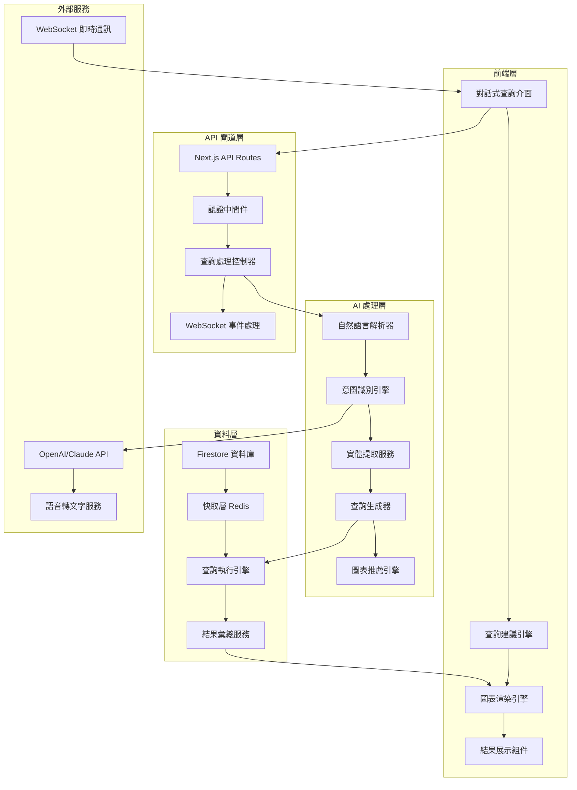
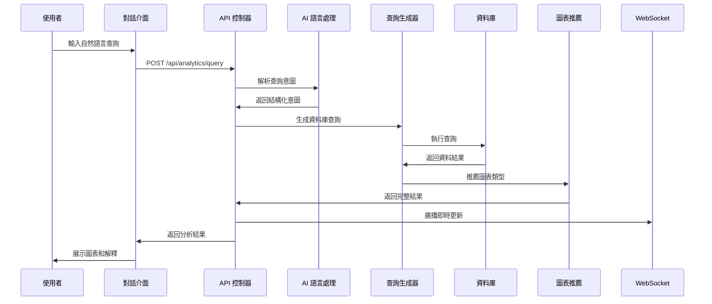
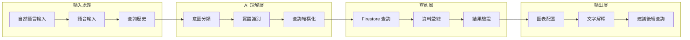

# PRP-124: AI 驅動分析查詢介面 - 技術規格文件

**版本**: 1.0.0  
**日期**: 2025-08-18  
**負責 Agent**: spec-writer  
**專案**: DonnaAI CRM 平台  

---

## 1. 產品概覽

### 1.1 功能目的和業務價值

AI 驅動的分析查詢介面旨在建立一個智能化的資料分析系統，讓使用者能夠透過自然語言詢問業務問題，由 AI 自動理解意圖並生成相應的圖表和分析報告。

**核心業務價值**:
- **降低分析門檻**: 讓非技術背景的管理人員也能進行複雜的資料分析
- **提高效率**: 從傳統的複雜 BI 工具操作轉變為直觀的對話式查詢
- **即時洞察**: 快速獲得業務資料的深度分析和趋勢預測
- **決策支持**: 提供基於 AI 的業務建議和風險警示

### 1.2 目標使用者和使用場景

**主要使用者**:
- **業務主管**: 需要快速獲取業務 KPI 和趨勢分析
- **銷售經理**: 查詢銷售業績、客戶轉換率、預測分析
- **營運人員**: 分析營運效率、資源配置、成本分析
- **資料分析師**: 進行複雜查詢探索和假設驗證

**核心使用場景**:
1. **業務 KPI 查詢**: "這個月的營收與去年同期比較如何？"
2. **趨勢分析**: "顯示過去六個月的客戶增長趨勢"
3. **對比分析**: "比較不同地區的銷售表現"
4. **預測查詢**: "根據當前趨勢預測下季度營收"
5. **異常檢測**: "找出本月表現異常的銷售指標"

### 1.3 成功指標和衡量標準

**技術指標**:
- 查詢理解準確率 ≥ 85%
- 圖表生成成功率 ≥ 90%
- API 回應時間 ≤ 3 秒
- 系統可用性 ≥ 99.5%

**業務指標**:
- 使用者查詢成功率 ≥ 80%
- 平均查詢完成時間 ≤ 2 分鐘
- 功能採用率 ≥ 60%
- 使用者滿意度 ≥ 4.2/5

---

## 2. 系統架構設計

### 2.1 整體架構圖



### 2.2 AI 查詢處理流水線



### 2.3 資料流架構



---

## 3. 功能性需求

### 3.1 自然語言查詢解析

**核心功能**:
- 支援中文自然語言查詢輸入
- 處理複雜句式和業務術語
- 支援語音轉文字輸入
- 提供查詢意圖確認機制

**支援的查詢類型**:
```typescript
interface QueryTypes {
  metric: string;           // KPI 指標查詢
  trend: string;           // 趨勢分析
  comparison: string;      // 對比分析
  prediction: string;      // 預測分析
  aggregation: string;     // 資料彙總
  filter: string;          // 條件篩選
  ranking: string;         // 排名分析
}
```

**範例查詢語句**:
- "這個月的銷售額比上個月增長多少？"
- "顯示過去三個月各地區的業績排名"
- "預測下季度的客戶增長趨勢"
- "找出轉換率最高的行銷管道"

### 3.2 查詢意圖理解和實體提取

**意圖分類系統**:
```typescript
interface IntentClassification {
  primary: 'query' | 'comparison' | 'trend' | 'prediction' | 'aggregate';
  secondary: string[];
  confidence: number;
  entities: ExtractedEntity[];
}

interface ExtractedEntity {
  type: 'metric' | 'time_period' | 'filter' | 'groupby' | 'comparison_operator';
  value: string;
  normalized_value: any;
  confidence: number;
}
```

**實體識別範圍**:
- **時間實體**: "這個月", "過去三季", "2024年"
- **指標實體**: "營收", "客戶數", "轉換率", "平均客單價"
- **維度實體**: "地區", "產品線", "銷售人員", "客戶分群"
- **運算實體**: "成長率", "同比", "平均值", "總計"

### 3.3 動態查詢生成

**查詢生成器架構**:
```typescript
interface QueryGenerator {
  generateFirestoreQuery(intent: IntentClassification): FirestoreQuery;
  optimizeQuery(query: FirestoreQuery): FirestoreQuery;
  validateQuery(query: FirestoreQuery): ValidationResult;
}

interface FirestoreQuery {
  collections: string[];
  filters: QueryFilter[];
  aggregations: Aggregation[];
  orderBy: OrderBy[];
  limit?: number;
  timeRange?: DateRange;
}
```

**查詢最佳化策略**:
- 索引利用最佳化
- 查詢結果快取機制
- 分頁和限制處理
- 複合查詢拆分

### 3.4 圖表類型智能推薦

**推薦引擎邏輯**:
```typescript
interface ChartRecommendationEngine {
  recommendChartType(data: QueryResult, intent: IntentClassification): ChartRecommendation;
  generateChartConfig(chartType: string, data: QueryResult): ChartConfiguration;
}

interface ChartRecommendation {
  primary: ChartType;
  alternatives: ChartType[];
  reasoning: string;
  confidence: number;
}

type ChartType = 'line' | 'bar' | 'pie' | 'scatter' | 'heatmap' | 'funnel' | 'gauge' | 'table';
```

**推薦規則**:
- **趨勢分析** → 線性圖、區域圖
- **對比分析** → 長條圖、分組長條圖
- **佔比分析** → 圓餅圖、甜甜圈圖
- **關聯分析** → 散佈圖、相關性矩陣
- **績效分析** → 儀表板、KPI 卡片

### 3.5 對話式 UI 介面

**介面組件架構**:
```typescript
interface ConversationalInterface {
  ChatInput: React.FC<ChatInputProps>;
  QuerySuggestions: React.FC<SuggestionsProps>;
  ResultDisplay: React.FC<ResultDisplayProps>;
  ChatHistory: React.FC<ChatHistoryProps>;
  VoiceInput: React.FC<VoiceInputProps>;
}
```

**核心功能**:
- ChatGPT 風格的對話式輸入
- 即時查詢建議和自動完成
- 查詢歷史記錄和重新執行
- 結果收藏和分享功能
- 語音輸入和輸出支援

---

## 4. 技術性需求

### 4.1 AI/NLP 服務整合

**主要 AI 服務**:
```typescript
interface AIServiceConfig {
  primary: 'claude-3.5-sonnet' | 'gpt-4o';
  fallback: 'gpt-3.5-turbo';
  endpoint: string;
  apiKey: string;
  maxTokens: number;
  temperature: number;
}
```

**提示詞工程**:
```typescript
const SYSTEM_PROMPT = `
你是 DonnaAI 的業務分析助手。請分析使用者的查詢並返回結構化的分析意圖。

業務背景：
- 公司主要業務：CRM 客戶關係管理
- 核心指標：營收、客戶數、轉換率、留存率
- 資料來源：Firestore 資料庫，包含 customers, orders, meetings, tasks 等 collection

請根據以下格式返回分析結果：
{
  "intent": "查詢意圖分類",
  "entities": [抽取的實體],
  "query_structure": "結構化查詢",
  "chart_recommendation": "推薦圖表類型",
  "explanation": "查詢解釋"
}
`;
```

### 4.2 效能要求

**回應時間要求**:
- AI 查詢解析：≤ 2 秒
- 資料庫查詢執行：≤ 1 秒
- 圖表渲染：≤ 0.5 秒
- 總端到端延遲：≤ 3 秒

**併發處理能力**:
- 同時處理 100+ 查詢請求
- WebSocket 連線數：≤ 1000
- 查詢快取命中率：≥ 70%

**資源使用限制**:
```typescript
interface PerformanceConfig {
  ai_api: {
    rate_limit: '100 requests/minute',
    timeout: '10 seconds',
    retry_attempts: 3,
  },
  database: {
    connection_pool_size: 50,
    query_timeout: '5 seconds',
    cache_ttl: '5 minutes',
  },
  websocket: {
    max_connections: 1000,
    heartbeat_interval: '30 seconds',
    message_buffer_size: '1MB',
  }
}
```

### 4.3 安全性和隱私保護

**資料存取控制**:
```typescript
interface SecurityControls {
  authentication: 'Firebase Auth JWT';
  authorization: 'Role-based access control';
  data_filtering: 'Organization and user-level isolation';
  query_validation: 'SQL injection prevention';
  rate_limiting: 'Per-user request limits';
}
```

**隱私保護措施**:
- 查詢日誌脫敏處理
- 敏感資料存取記錄
- AI 處理資料去識別化
- 符合 GDPR 和個資法規範

### 4.4 可擴展性和並發處理

**水平擴展設計**:
```typescript
interface ScalabilityDesign {
  api_layer: 'Next.js serverless functions',
  ai_processing: 'Queue-based async processing',
  database: 'Firestore automatic scaling',
  caching: 'Redis cluster with sharding',
  websocket: 'Multiple server instances with load balancing'
}
```

**並發處理策略**:
- 查詢請求佇列管理
- AI API 呼叫速率控制
- 資料庫連線池最佳化
- 結果快取分層設計

---

## 5. 使用者體驗規格

### 5.1 對話式查詢介面設計

**UI 組件規格**:
```typescript
interface ChatInterface {
  layout: 'split-panel' | 'full-screen' | 'modal';
  theme: 'light' | 'dark' | 'auto';
  components: {
    input: ChatInputComponent;
    messages: MessageHistoryComponent;
    suggestions: QuerySuggestionsComponent;
    results: ResultDisplayComponent;
  };
}

interface ChatInputComponent {
  placeholder: "請輸入您的分析查詢...";
  multiline: boolean;
  voice_input: boolean;
  auto_complete: boolean;
  suggestion_trigger: 'typing' | 'focus' | 'manual';
}
```

**訊息類型定義**:
```typescript
type MessageType = 'user_query' | 'ai_response' | 'chart_result' | 'error' | 'suggestion';

interface ChatMessage {
  id: string;
  type: MessageType;
  content: string;
  metadata?: {
    query_time?: number;
    chart_config?: ChartConfiguration;
    data_source?: string;
    confidence?: number;
  };
  timestamp: Date;
  user_id: string;
}
```

### 5.2 查詢建議和自動完成

**智能建議系統**:
```typescript
interface QuerySuggestionSystem {
  context_aware: boolean;
  user_history_based: boolean;
  popular_queries: boolean;
  real_time_suggestions: boolean;
  
  suggestion_sources: [
    'user_query_history',
    'popular_templates',
    'context_aware_prompts',
    'seasonal_queries'
  ];
}
```

**建議觸發條件**:
- 輸入框聚焦時顯示熱門查詢
- 輸入過程中即時匹配建議
- 根據當前頁面內容提供相關查詢
- 基於使用者歷史偏好推薦

### 5.3 錯誤處理和恢復機制

**錯誤分類和處理**:
```typescript
interface ErrorHandling {
  query_understanding_errors: {
    message: "抱歉，我無法理解您的查詢。請嘗試更明確的表達。";
    suggestions: string[];
    recovery_actions: ['rewrite_query', 'use_template', 'contact_support'];
  };
  
  data_access_errors: {
    message: "資料暫時無法取得，請稍後再試。";
    retry_mechanism: boolean;
    fallback_data: boolean;
  };
  
  ai_service_errors: {
    message: "AI 服務暫時無法使用，請稍後再試。";
    fallback_service: boolean;
    cache_response: boolean;
  };
}
```

**恢復策略**:
- 自動重試機制（指數退避）
- 降級服務提供基本功能
- 快取結果提供離線體驗
- 使用者友善的錯誤提示

### 5.4 查詢歷史和收藏功能

**歷史記錄管理**:
```typescript
interface QueryHistory {
  storage_duration: '90 days';
  max_entries_per_user: 1000;
  search_functionality: boolean;
  export_capability: boolean;
  
  metadata: {
    execution_time: number;
    result_count: number;
    chart_type: string;
    user_rating?: number;
  };
}
```

**收藏和分享**:
- 查詢結果加入我的最愛
- 生成分享連結和報告
- 定期執行和警報設定
- 協作註解和討論功能

---

## 6. API 規格

### 6.1 查詢處理端點

**主要 API 端點**:
```typescript
// POST /api/analytics/query
interface AnalyticsQueryRequest {
  query: string;                    // 自然語言查詢
  context?: QueryContext;           // 查詢上下文
  options?: QueryOptions;           // 查詢選項
}

interface AnalyticsQueryResponse {
  id: string;                       // 查詢 ID
  status: 'success' | 'error' | 'partial';
  intent: IntentClassification;     // 解析的意圖
  data: QueryResult;               // 查詢結果
  chart_config: ChartConfiguration; // 圖表配置
  explanation: string;             // AI 解釋
  suggestions: string[];           // 後續建議
  execution_time: number;          // 執行時間
  cache_key?: string;              // 快取鍵
}
```

**WebSocket 即時 API**:
```typescript
// WebSocket: /api/analytics/realtime
interface RealtimeQueryUpdate {
  type: 'query_progress' | 'result_ready' | 'error' | 'suggestion';
  query_id: string;
  data: any;
  timestamp: string;
}
```

### 6.2 資料格式和協議

**查詢結果格式**:
```typescript
interface QueryResult {
  columns: ColumnDefinition[];
  rows: ResultRow[];
  metadata: {
    total_rows: number;
    execution_time: number;
    data_sources: string[];
    last_updated: string;
  };
  aggregations?: AggregationResult[];
}

interface ColumnDefinition {
  name: string;
  type: 'string' | 'number' | 'date' | 'boolean';
  format?: string;
  description?: string;
}
```

**圖表配置格式**:
```typescript
interface ChartConfiguration {
  type: ChartType;
  title: string;
  data: {
    x_axis: string;
    y_axis: string | string[];
    series?: SeriesConfig[];
  };
  styling: {
    colors: string[];
    theme: 'light' | 'dark';
    responsive: boolean;
  };
  interactions: {
    zoom: boolean;
    tooltip: boolean;
    legend: boolean;
    export: boolean;
  };
}
```

### 6.3 錯誤回應和狀態碼

**HTTP 狀態碼**:
```typescript
interface ErrorResponse {
  status: 400 | 401 | 403 | 404 | 429 | 500 | 503;
  error: {
    code: string;
    message: string;
    details?: any;
    suggestions?: string[];
  };
  request_id: string;
  timestamp: string;
}
```

**常見錯誤碼**:
- `QUERY_PARSE_ERROR`: 查詢解析失敗
- `DATA_ACCESS_ERROR`: 資料存取錯誤
- `AI_SERVICE_ERROR`: AI 服務錯誤
- `RATE_LIMIT_EXCEEDED`: 請求頻率超限
- `INSUFFICIENT_PERMISSIONS`: 權限不足

### 6.4 驗證和安全機制

**API 驗證流程**:
```typescript
interface AuthenticationFlow {
  method: 'JWT Bearer Token';
  source: 'Firebase Auth';
  validation: {
    token_expiry: boolean;
    user_status: boolean;
    organization_access: boolean;
  };
  rate_limiting: {
    per_user: '100 requests/hour';
    per_organization: '1000 requests/hour';
    burst_limit: '10 requests/minute';
  };
}
```

---

## 7. 資料模型

### 7.1 查詢資料結構

**查詢實體模型**:
```typescript
interface QueryEntity {
  id: string;
  user_id: string;
  organization_id: string;
  
  // 查詢內容
  natural_language_query: string;
  processed_intent: IntentClassification;
  generated_query: DatabaseQuery;
  
  // 執行資訊
  status: 'pending' | 'processing' | 'completed' | 'failed';
  execution_time?: number;
  result_count?: number;
  
  // 結果和配置
  result_data?: QueryResult;
  chart_config?: ChartConfiguration;
  ai_explanation?: string;
  
  // 元資料
  created_at: Date;
  updated_at: Date;
  expires_at?: Date;
  tags: string[];
  is_favorited: boolean;
}
```

### 7.2 AI 回應格式

**AI 處理結果模型**:
```typescript
interface AIProcessingResult {
  query_id: string;
  
  // NLP 分析結果
  intent_analysis: {
    primary_intent: string;
    confidence: number;
    entities: ExtractedEntity[];
    sentiment: 'positive' | 'neutral' | 'negative';
  };
  
  // 查詢生成
  query_generation: {
    database_queries: DatabaseQuery[];
    aggregation_rules: AggregationRule[];
    optimization_hints: string[];
  };
  
  // 圖表推薦
  chart_recommendation: {
    primary_chart: ChartType;
    alternative_charts: ChartType[];
    reasoning: string;
    configuration: ChartConfiguration;
  };
  
  // 回應生成
  response_generation: {
    explanation: string;
    insights: string[];
    follow_up_suggestions: string[];
    confidence_score: number;
  };
}
```

### 7.3 圖表配置模型

**圖表配置資料結構**:
```typescript
interface ChartConfigurationModel {
  id: string;
  type: ChartType;
  
  // 資料綁定
  data_binding: {
    x_axis: AxisBinding;
    y_axis: AxisBinding | AxisBinding[];
    color_dimension?: string;
    size_dimension?: string;
  };
  
  // 樣式設定
  styling: {
    color_scheme: string[];
    theme: 'light' | 'dark' | 'custom';
    grid: boolean;
    legend: LegendConfig;
    tooltip: TooltipConfig;
  };
  
  // 互動設定
  interactions: {
    zoom: boolean;
    pan: boolean;
    brush_select: boolean;
    click_handler?: string;
  };
  
  // 動畫設定
  animations: {
    enabled: boolean;
    duration: number;
    easing: 'linear' | 'ease' | 'ease-in-out';
  };
}
```

### 7.4 使用者偏好設定

**偏好設定模型**:
```typescript
interface UserAnalyticsPreferences {
  user_id: string;
  organization_id: string;
  
  // 查詢偏好
  query_preferences: {
    default_time_range: '7d' | '30d' | '90d' | '1y';
    preferred_chart_types: ChartType[];
    auto_refresh: boolean;
    voice_input_enabled: boolean;
  };
  
  // 介面偏好
  ui_preferences: {
    theme: 'light' | 'dark' | 'auto';
    layout: 'compact' | 'comfortable';
    language: 'zh-TW' | 'en-US';
    notifications_enabled: boolean;
  };
  
  // 資料權限
  data_access_permissions: {
    allowed_collections: string[];
    restricted_fields: string[];
    row_level_filters: FilterRule[];
  };
  
  updated_at: Date;
}
```

---

## 8. 整合需求

### 8.1 與現有 Dashboard 整合

**整合點識別**:
```typescript
interface DashboardIntegration {
  // 現有組件擴展
  existing_components: {
    'DashboardLayout': 'Add AI query widget',
    'MetricCards': 'Add AI insights overlay',
    'ChartContainer': 'Support AI-generated charts',
    'WidgetRegistry': 'Register AI query widgets'
  };
  
  // 新增組件
  new_components: {
    'AIQueryInterface': 'Main conversation interface',
    'QueryHistoryPanel': 'Query history sidebar',
    'SmartSuggestions': 'Contextual query suggestions',
    'ResultExportTools': 'Export and sharing tools'
  };
}
```

**整合實作計劃**:
1. **階段一**: 在現有 Dashboard 加入 AI 查詢小工具
2. **階段二**: 整合查詢歷史和收藏功能
3. **階段三**: 實作跨小工具的智能建議
4. **階段四**: 完整的嵌入式 AI 分析體驗

### 8.2 Firebase/Firestore 資料層

**Firestore Collection 設計**:
```typescript
interface FirestoreIntegration {
  collections: {
    // 新增 Collection
    'ai_queries': {
      documents: QueryEntity[];
      indices: ['user_id', 'organization_id', 'created_at', 'status'];
    },
    
    'query_templates': {
      documents: QueryTemplate[];
      indices: ['category', 'popularity_score', 'organization_id'];
    },
    
    // 擴展現有 Collection
    'users': {
      additional_fields: ['ai_preferences', 'query_history_settings'];
    },
    
    'organizations': {
      additional_fields: ['ai_features_enabled', 'query_limits'];
    }
  };
  
  // 資料存取模式
  access_patterns: {
    'real_time_subscriptions': ['user queries', 'result updates'],
    'batch_operations': ['historical data analysis', 'report generation'],
    'cache_strategies': ['frequent queries', 'chart configurations']
  };
}
```

### 8.3 WebSocket 即時更新

**WebSocket 事件整合**:
```typescript
interface WebSocketIntegration {
  // 新增事件類型
  new_event_types: [
    'ai_query_started',
    'ai_query_progress',
    'ai_query_completed',
    'ai_insights_generated',
    'chart_recommendation_ready'
  ];
  
  // 擴展現有事件處理
  extended_handlers: {
    'dashboard_data_updated': 'Trigger AI insight refresh',
    'metric_changed': 'Generate automatic analysis',
    'notification_received': 'AI-powered notification routing'
  };
  
  // 頻道管理
  channels: {
    'ai_query_{user_id}': 'Personal query updates',
    'ai_insights_{org_id}': 'Organization-wide insights',
    'ai_suggestions_{dashboard_id}': 'Dashboard-specific suggestions'
  };
}
```

### 8.4 權限和認證系統

**權限擴展模型**:
```typescript
interface AIPermissionModel {
  // 功能權限
  feature_permissions: {
    'ai_query_basic': boolean;         // 基本查詢功能
    'ai_query_advanced': boolean;      // 進階查詢功能
    'ai_predictions': boolean;         // 預測分析
    'ai_insights_generation': boolean; // AI 洞察生成
    'voice_input': boolean;            // 語音輸入
  };
  
  // 資料權限
  data_permissions: {
    'query_all_organizations': boolean;
    'access_historical_data': boolean;
    'export_query_results': boolean;
    'share_query_templates': boolean;
  };
  
  // 使用限制
  usage_limits: {
    'daily_query_count': number;
    'ai_api_calls_limit': number;
    'export_frequency_limit': string;
  };
}
```

---

## 9. 驗收標準

### 9.1 功能性測試標準

**查詢理解測試**:
```typescript
interface QueryUnderstandingTests {
  test_cases: [
    {
      input: "這個月營收比上個月成長多少？",
      expected_intent: "metric_comparison",
      expected_entities: ["revenue", "this_month", "last_month", "growth_rate"],
      accuracy_threshold: 0.9
    },
    {
      input: "顯示過去六個月各地區銷售趨勢",
      expected_intent: "trend_analysis",
      expected_entities: ["sales", "6_months", "region", "trend"],
      accuracy_threshold: 0.85
    }
  ];
  
  success_criteria: {
    intent_accuracy: ">= 85%",
    entity_extraction_accuracy: ">= 80%",
    end_to_end_success_rate: ">= 80%"
  };
}
```

**圖表生成測試**:
```typescript
interface ChartGenerationTests {
  test_scenarios: [
    {
      data_type: "time_series",
      expected_chart: "line_chart",
      success_rate_threshold: 0.9
    },
    {
      data_type: "categorical_comparison",
      expected_chart: "bar_chart",
      success_rate_threshold: 0.85
    }
  ];
  
  visual_quality_checks: [
    "chart_renders_without_errors",
    "data_accurately_represented",
    "axes_properly_labeled",
    "responsive_design_works"
  ];
}
```

### 9.2 效能基準測試

**回應時間測試**:
```typescript
interface PerformanceTests {
  response_time_tests: {
    simple_query: {
      target: "< 2 seconds",
      test_count: 100,
      success_threshold: "95th percentile"
    },
    complex_query: {
      target: "< 5 seconds", 
      test_count: 50,
      success_threshold: "90th percentile"
    }
  };
  
  concurrency_tests: {
    concurrent_users: 50,
    queries_per_user: 10,
    success_rate_threshold: "> 95%",
    avg_response_time: "< 3 seconds"
  };
  
  load_tests: {
    sustained_load: {
      duration: "10 minutes",
      queries_per_second: 20,
      error_rate_threshold: "< 1%"
    }
  };
}
```

### 9.3 使用者體驗驗證

**可用性測試**:
```typescript
interface UsabilityTests {
  task_completion_tests: [
    {
      task: "使用自然語言查詢本月銷售數據",
      success_rate_target: "> 90%",
      time_limit: "2 minutes"
    },
    {
      task: "保存查詢結果並分享給同事",
      success_rate_target: "> 85%",
      time_limit: "1 minute"
    }
  ];
  
  user_satisfaction_metrics: {
    ease_of_use: "> 4.0/5.0",
    result_accuracy: "> 4.2/5.0",
    response_time_satisfaction: "> 4.0/5.0",
    overall_satisfaction: "> 4.2/5.0"
  };
}
```

### 9.4 AI 準確性測試

**AI 模型驗證**:
```typescript
interface AIAccuracyTests {
  intent_classification_tests: {
    test_dataset_size: 500,
    accuracy_target: "> 85%",
    precision_target: "> 80%",
    recall_target: "> 80%"
  };
  
  entity_extraction_tests: {
    test_cases: 300,
    f1_score_target: "> 0.85",
    entity_types_coverage: "100%"
  };
  
  chart_recommendation_tests: {
    human_evaluation_agreement: "> 80%",
    automated_rule_compliance: "> 95%"
  };
}
```

---

## 10. 實作計劃

### 10.1 開發階段和里程碑

**Phase 1: 核心 AI 引擎開發 (週 1-2)**
- [ ] 自然語言解析服務實作
- [ ] 意圖識別和實體提取系統
- [ ] 基礎查詢生成器開發
- [ ] AI API 整合和錯誤處理

**里程碑**: AI 引擎能正確解析 80% 的基本查詢類型

**Phase 2: 資料查詢和圖表系統 (週 3-4)**
- [ ] Firestore 查詢執行引擎
- [ ] 圖表推薦系統實作
- [ ] 查詢結果快取機制
- [ ] 基礎圖表渲染組件

**里程碑**: 能生成並展示基本的圖表結果

**Phase 3: 對話式介面開發 (週 5-6)**
- [ ] ChatGPT 風格的 UI 介面
- [ ] 查詢歷史和狀態管理
- [ ] 即時 WebSocket 整合
- [ ] 語音輸入功能實作

**里程碑**: 完整的對話式查詢體驗

**Phase 4: 整合和優化 (週 7)**
- [ ] Dashboard 整合和小工具開發
- [ ] 效能優化和快取策略
- [ ] 錯誤處理和用戶體驗改進
- [ ] 安全性和權限控制

**里程碑**: 完整功能可用於生產環境

**Phase 5: 測試和部署 (週 8)**
- [ ] 全面的功能測試和效能測試
- [ ] 使用者驗收測試
- [ ] 生產環境部署準備
- [ ] 文檔和培訓材料

**里程碑**: 符合所有驗收標準，準備上線

### 10.2 技術風險和緩解策略

**高風險項目**:

1. **AI 理解準確性風險**
   - **風險**: 自然語言理解準確率不達標
   - **緩解**: 建立大量測試資料集，持續調優提示詞
   - **備案**: 提供查詢模板和引導式查詢

2. **API 成本控制風險**
   - **風險**: AI API 呼叫成本過高
   - **緩解**: 實作智能快取，批次處理請求
   - **備案**: 設定每日使用額度和降級機制

3. **查詢效能風險**
   - **風險**: 複雜查詢回應時間過長
   - **緩解**: 查詢優化，分頁處理，異步執行
   - **備案**: 提供進度指示和取消功能

**中風險項目**:

1. **用戶接受度風險**
   - **緩解**: 早期用戶測試，持續收集反饋
   - **備案**: 提供傳統查詢介面選項

2. **資料安全風險** 
   - **緩解**: 嚴格的權限控制和資料脫敏
   - **備案**: 審計日誌和合規性檢查

### 10.3 依賴項和前置條件

**技術依賴**:
```typescript
interface TechnicalDependencies {
  platform_dependencies: [
    "Next.js 14+ (現有)",
    "Firebase/Firestore (現有)", 
    "WebSocket Server (現有)",
    "Redis Cache (需新增)"
  ];
  
  external_services: [
    "OpenAI GPT-4 API (需申請)",
    "Claude 3.5 Sonnet API (需申請)",
    "Google Cloud Speech API (可選)"
  ];
  
  development_tools: [
    "TypeScript 5+ (現有)",
    "React 18+ (現有)",
    "Recharts (現有)",
    "Jest/Vitest (測試工具)"
  ];
}
```

**團隊技能需求**:
- AI/NLP 整合經驗
- React 和 TypeScript 專業知識
- Firebase/Firestore 進階應用
- WebSocket 即時通訊經驗
- UI/UX 設計能力

### 10.4 測試和部署策略

**測試策略**:
```typescript
interface TestingStrategy {
  unit_tests: {
    coverage_target: "> 80%",
    focus_areas: ["AI parsing", "query generation", "chart recommendation"]
  };
  
  integration_tests: {
    ai_service_integration: "Mock and real API tests",
    database_integration: "Query accuracy and performance",
    websocket_integration: "Real-time updates"
  };
  
  e2e_tests: {
    user_workflows: "Complete query to result workflows",
    performance_tests: "Load and stress testing",
    browser_compatibility: "Cross-browser testing"
  };
}
```

**部署策略**:
```typescript
interface DeploymentStrategy {
  environments: {
    development: "Local development with mock AI responses",
    staging: "Full integration testing environment", 
    production: "Gradual rollout with feature flags"
  };
  
  rollout_plan: {
    phase_1: "Internal team testing (1 week)",
    phase_2: "Beta user group (2 weeks)", 
    phase_3: "Gradual rollout to all users (1 week)"
  };
  
  monitoring: {
    ai_accuracy_metrics: "Real-time accuracy monitoring",
    performance_metrics: "Response time and error rate",
    business_metrics: "Usage adoption and user satisfaction"
  };
}
```

---

## 11. 附錄

### 11.1 技術決策說明

**AI 服務選擇**:
- **主要選擇**: Claude 3.5 Sonnet
  - 理由: 優秀的中文理解能力，結構化輸出品質高
- **備用選擇**: OpenAI GPT-4o  
  - 理由: 成熟的 API 生態，可靠的服務品質

**前端架構選擇**:
- **UI 框架**: 基於現有的 React + TypeScript
- **狀態管理**: 沿用 Zustand，整合 WebSocket 狀態
- **圖表庫**: 現有的 Recharts，滿足需求且整合簡單

### 11.2 參考資料和標準

**技術參考**:
- [OpenAI API 文檔](https://platform.openai.com/docs)
- [Anthropic Claude API 文檔](https://docs.anthropic.com/)
- [Firebase Firestore 最佳實踐](https://firebase.google.com/docs/firestore)
- [WebSocket RFC 6455](https://tools.ietf.org/html/rfc6455)

**設計參考**:
- [ChatGPT UI/UX 模式](https://chat.openai.com)
- [Google Analytics Intelligence](https://analytics.google.com/analytics/intelligence/)
- [Tableau Ask Data](https://help.tableau.com/current/pro/desktop/en-us/ask_data.htm)

### 11.3 專案檔案組織

**新增檔案結構**:
```
web/
├── components/ai/
│   ├── ai-query-interface.tsx        # 主要對話介面
│   ├── query-suggestions.tsx         # 查詢建議組件
│   ├── chat-history.tsx             # 對話歷史
│   ├── voice-input.tsx              # 語音輸入
│   └── result-display.tsx           # 結果展示
├── lib/ai/
│   ├── query-parser.ts              # 查詢解析器
│   ├── intent-classifier.ts         # 意圖分類器
│   ├── chart-recommender.ts         # 圖表推薦器
│   └── ai-client.ts                 # AI API 客戶端
├── hooks/
│   ├── use-ai-query.ts              # AI 查詢 Hook
│   ├── use-query-history.ts         # 查詢歷史 Hook
│   └── use-voice-input.ts           # 語音輸入 Hook
└── types/ai.types.ts                # AI 相關型別定義
```

---

**文件作者**: spec-writer agent  
**最後更新**: 2025-08-18  
**版本歷程**:
- v1.0.0 - 初版技術規格完成

此技術規格文件將作為 PRP-124 實作的完整指南，確保所有開發工作都能按照統一的標準進行，並達到預期的業務目標和技術要求。