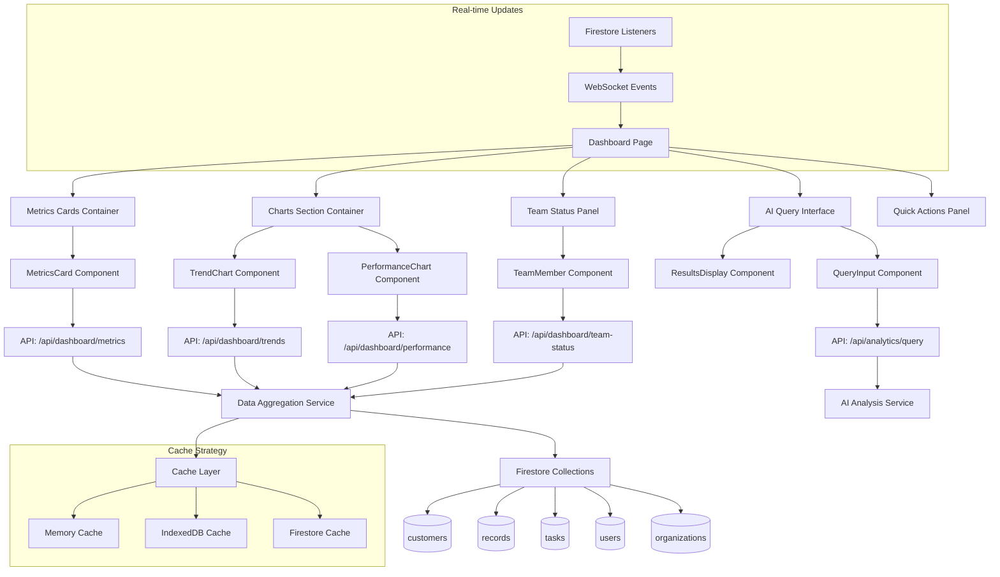
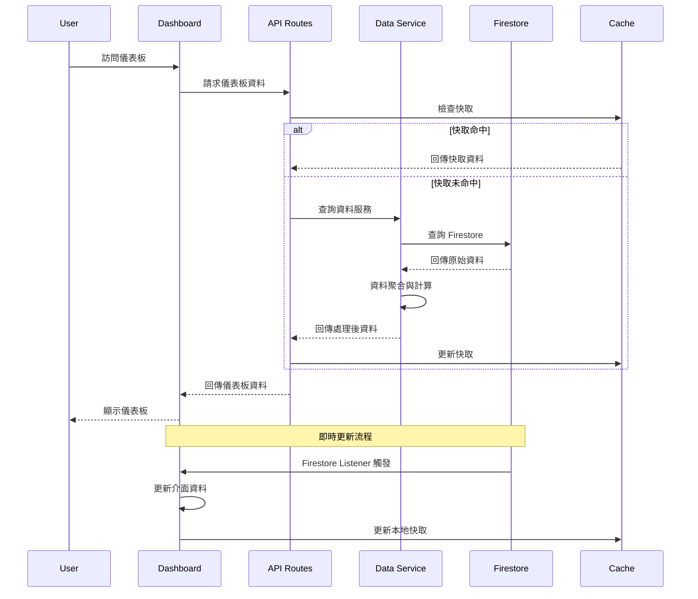

# PRP-123 儀表板頁面與分析功能整合 - 技術規格文件

## 🎯 專案概覽

### 系統名稱
DonnaAI 儀表板與分析系統

### 技術棧
- **前端框架**: Next.js 15 + App Router
- **UI 庫**: Radix UI + Tailwind CSS
- **圖表庫**: React Chart.js 2 (整合 Chart.js 4.5.0)
- **狀態管理**: Zustand
- **資料庫**: Firebase Firestore
- **快取系統**: 瀏覽器 IndexedDB (本地快取) + Firebase 快取機制
- **即時通訊**: Firestore Real-time Listeners
- **型別系統**: TypeScript
- **查詢管理**: TanStack Query (React Query)

### 版本資訊
- 文件版本: v1.0
- 建立日期: 2025-08-18
- 最後更新: 2025-08-18
- 負責 Agent: spec-writer

---

## 🏗️ 系統架構設計

### 1. 整體架構圖



### 2. 資料流架構



---

## 📊 資料模型設計

### 1. 核心介面定義

```typescript
// 儀表板主要資料模型
export interface DashboardData {
  metrics: DashboardMetrics;
  trends: TrendData[];
  performance: PerformanceData;
  teamStatus: TeamStatus[];
  lastUpdated: Date;
  organizationId: string;
  userId: string;
}

// 關鍵指標
export interface DashboardMetrics {
  totalRevenue: {
    value: number;
    currency: string;
    changePercent: number;
    previousPeriod: number;
  };
  customerCount: {
    total: number;
    active: number;
    new: number;
    changePercent: number;
  };
  taskCompletion: {
    completed: number;
    total: number;
    rate: number;
    changePercent: number;
  };
  monthlyTarget: {
    current: number;
    target: number;
    progress: number;
    daysRemaining: number;
  };
}

// 趨勢資料
export interface TrendData {
  date: string; // ISO date string
  revenue: number;
  customerAcquisition: number;
  taskCompletionRate: number;
  teamActivity: number;
}

// 團隊績效
export interface PerformanceData {
  individual: IndividualPerformance[];
  team: TeamPerformance;
  comparisons: PerformanceComparison[];
}

export interface IndividualPerformance {
  userId: string;
  name: string;
  avatar?: string;
  metrics: {
    revenue: number;
    customersManaged: number;
    tasksCompleted: number;
    efficiency: number;
  };
  trend: 'up' | 'down' | 'stable';
  rank: number;
}

// 團隊狀態
export interface TeamStatus {
  userId: string;
  name: string;
  avatar?: string;
  status: 'online' | 'offline' | 'busy' | 'away';
  currentTask?: {
    id: string;
    title: string;
    priority: 'high' | 'medium' | 'low';
    dueDate?: Date;
  };
  todayMetrics: {
    tasksCompleted: number;
    meetingsAttended: number;
    revenueGenerated: number;
  };
  lastActivity: Date;
}
```

### 2. API 回應格式

```typescript
// API 標準回應格式
export interface ApiResponse<T> {
  success: boolean;
  data?: T;
  error?: {
    code: string;
    message: string;
    details?: any;
  };
  meta?: {
    timestamp: string;
    requestId: string;
    cacheHit?: boolean;
    executionTime?: number;
  };
}

// 儀表板資料 API 回應
export interface DashboardApiResponse extends ApiResponse<DashboardData> {
  meta: {
    timestamp: string;
    requestId: string;
    cacheHit: boolean;
    executionTime: number;
    dataFreshness: number; // 資料新鮮度（分鐘）
    nextRefresh: string; // 下次更新時間
  };
}
```

### 3. Firestore 集合結構

```typescript
// Firestore 集合設計
interface FirestoreCollections {
  // 組織統計快照（每小時更新）
  'organization-stats': {
    [organizationId: string]: {
      hourly: {
        [timestamp: string]: {
          revenue: number;
          customerCount: number;
          activeUsers: number;
          taskCompletionRate: number;
          createdAt: Timestamp;
        };
      };
      daily: {
        [date: string]: {
          revenue: number;
          newCustomers: number;
          tasksCompleted: number;
          teamActivity: number;
          createdAt: Timestamp;
        };
      };
      monthly: {
        [month: string]: {
          revenue: number;
          customerGrowth: number;
          performance: number;
          createdAt: Timestamp;
        };
      };
    };
  };
  
  // 使用者績效快照（每日更新）
  'user-performance': {
    [userId: string]: {
      [date: string]: {
        revenue: number;
        customersManaged: number;
        tasksCompleted: number;
        meetingsAttended: number;
        efficiency: number;
        organizationId: string;
        createdAt: Timestamp;
      };
    };
  };
  
  // 即時團隊狀態
  'team-status': {
    [userId: string]: {
      status: 'online' | 'offline' | 'busy' | 'away';
      currentTask?: {
        id: string;
        title: string;
        priority: 'high' | 'medium' | 'low';
        startedAt: Timestamp;
      };
      lastActivity: Timestamp;
      organizationId: string;
      updatedAt: Timestamp;
    };
  };
}
```

---

## 🛡️ API 規格定義

### 1. 儀表板指標 API

```typescript
// GET /api/dashboard/metrics
export interface MetricsRequest {
  organizationId: string;
  period: 'today' | '7days' | '30days' | '90days' | 'year';
  timezone?: string;
  cache?: boolean;
}

export interface MetricsResponse extends ApiResponse<DashboardMetrics> {
  meta: {
    period: string;
    timezone: string;
    calculatedAt: string;
    includedData: string[]; // 包含的資料類型
  };
}

// API 實作規範
app.get('/api/dashboard/metrics', [
  authenticate,
  validateOrganizationAccess,
  validateQuery(MetricsRequestSchema),
  cacheMiddleware(5 * 60), // 5分鐘快取
  async (req, res) => {
    const { organizationId, period, timezone } = req.query;
    
    try {
      const metrics = await dashboardService.getMetrics({
        organizationId,
        period,
        timezone,
        userId: req.user.uid
      });
      
      res.json({
        success: true,
        data: metrics,
        meta: {
          timestamp: new Date().toISOString(),
          requestId: req.requestId,
          cacheHit: req.cacheHit || false,
          executionTime: Date.now() - req.startTime,
          period,
          timezone: timezone || 'UTC'
        }
      });
    } catch (error) {
      res.status(500).json({
        success: false,
        error: {
          code: 'METRICS_FETCH_ERROR',
          message: '無法獲取儀表板指標',
          details: error.message
        }
      });
    }
  }
]);
```

### 2. 趨勢圖表 API

```typescript
// GET /api/dashboard/trends
export interface TrendsRequest {
  organizationId: string;
  metrics: ('revenue' | 'customers' | 'tasks' | 'activity')[];
  period: 'week' | 'month' | 'quarter' | 'year';
  granularity: 'hour' | 'day' | 'week' | 'month';
  startDate?: string;
  endDate?: string;
}

export interface TrendsResponse extends ApiResponse<TrendData[]> {
  meta: {
    period: string;
    granularity: string;
    dataPoints: number;
    interpolated: boolean; // 是否有插值資料
  };
}
```

### 3. 團隊狀態 API

```typescript
// GET /api/dashboard/team-status
export interface TeamStatusRequest {
  organizationId: string;
  includeMetrics: boolean;
  includeCurrentTasks: boolean;
}

export interface TeamStatusResponse extends ApiResponse<TeamStatus[]> {
  meta: {
    totalMembers: number;
    onlineMembers: number;
    lastSync: string;
  };
}

// POST /api/dashboard/team-status/update
export interface UpdateStatusRequest {
  status: 'online' | 'offline' | 'busy' | 'away';
  currentTaskId?: string;
}
```

### 4. AI 查詢 API

```typescript
// POST /api/analytics/query
export interface AnalyticsQueryRequest {
  query: string;
  organizationId: string;
  context?: {
    timeRange?: string;
    dataTypes?: string[];
    filters?: Record<string, any>;
  };
  responseFormat: 'text' | 'chart' | 'table' | 'mixed';
}

export interface AnalyticsQueryResponse extends ApiResponse<{
  answer: string;
  data?: any[];
  visualizations?: ChartConfig[];
  confidence: number;
  sources: string[];
  suggestedFollowUp?: string[];
}> {
  meta: {
    queryId: string;
    processingTime: number;
    aiModel: string;
    dataPointsAnalyzed: number;
  };
}
```

---

## 🎨 前端元件設計

### 1. 主要元件結構

```typescript
// 主儀表板頁面元件
export default function DashboardPage() {
  const { data: dashboardData, isLoading, error } = useDashboardData();
  const { user } = useAuth();
  
  if (isLoading) return <DashboardSkeleton />;
  if (error) return <ErrorState error={error} />;
  
  return (
    <div className="dashboard-container">
      <DashboardHeader user={user} />
      <div className="dashboard-grid">
        <MetricsSection data={dashboardData.metrics} />
        <TrendsSection data={dashboardData.trends} />
        <AIQuerySection organizationId={user.organizationId} />
        <TeamStatusSection data={dashboardData.teamStatus} />
        <QuickActionsSection />
      </div>
    </div>
  );
}

// 指標卡片元件
interface MetricsCardProps {
  title: string;
  value: string | number;
  change?: {
    value: number;
    period: string;
    trend: 'up' | 'down' | 'stable';
  };
  icon: React.ComponentType;
  color: 'blue' | 'green' | 'orange' | 'purple';
  onClick?: () => void;
}

export function MetricsCard({ title, value, change, icon: Icon, color, onClick }: MetricsCardProps) {
  const trendColor = {
    up: 'text-green-600',
    down: 'text-red-600',
    stable: 'text-gray-600'
  };
  
  return (
    <div 
      className={`metrics-card ${color} ${onClick ? 'cursor-pointer hover:shadow-lg' : ''}`}
      onClick={onClick}
    >
      <div className="metrics-header">
        <Icon className="metrics-icon" />
        <span className="metrics-title">{title}</span>
      </div>
      <div className="metrics-value">{value}</div>
      {change && (
        <div className={`metrics-change ${trendColor[change.trend]}`}>
          <TrendIcon trend={change.trend} />
          {Math.abs(change.value)}% {change.period}
        </div>
      )}
    </div>
  );
}
```

### 2. 圖表元件設計

```typescript
// 趨勢圖表元件
interface TrendChartProps {
  data: TrendData[];
  metrics: string[];
  height?: number;
  interactive?: boolean;
  period: string;
}

export function TrendChart({ data, metrics, height = 300, interactive = true, period }: TrendChartProps) {
  const chartConfig = useMemo(() => ({
    type: 'line' as const,
    data: {
      labels: data.map(d => formatDate(d.date, period)),
      datasets: metrics.map((metric, index) => ({
        label: getMetricLabel(metric),
        data: data.map(d => d[metric]),
        borderColor: CHART_COLORS[index % CHART_COLORS.length],
        backgroundColor: `${CHART_COLORS[index % CHART_COLORS.length]}20`,
        tension: 0.4,
        fill: false,
        pointRadius: interactive ? 4 : 2,
        pointHoverRadius: 6,
      }))
    },
    options: {
      responsive: true,
      maintainAspectRatio: false,
      interaction: {
        mode: 'index',
        intersect: false,
      },
      plugins: {
        legend: {
          position: 'top' as const,
        },
        tooltip: {
          callbacks: {
            title: (context) => formatTooltipDate(context[0].label, period),
            label: (context) => `${context.dataset.label}: ${formatValue(context.parsed.y, context.datasetIndex)}`
          }
        }
      },
      scales: {
        x: {
          display: true,
          title: {
            display: true,
            text: '時間'
          }
        },
        y: {
          display: true,
          title: {
            display: true,
            text: '數值'
          },
          ticks: {
            callback: (value) => formatAxisValue(value)
          }
        }
      }
    }
  }), [data, metrics, period, interactive]);
  
  return (
    <div className="trend-chart-container" style={{ height }}>
      <Line data={chartConfig.data} options={chartConfig.options} />
    </div>
  );
}
```

### 3. AI 查詢介面元件

```typescript
// AI 查詢元件
interface AIQueryInterfaceProps {
  organizationId: string;
  onQueryResult?: (result: AnalyticsQueryResponse) => void;
}

export function AIQueryInterface({ organizationId, onQueryResult }: AIQueryInterfaceProps) {
  const [query, setQuery] = useState('');
  const [isLoading, setIsLoading] = useState(false);
  const [results, setResults] = useState<AnalyticsQueryResponse | null>(null);
  
  const handleSubmit = async (e: React.FormEvent) => {
    e.preventDefault();
    if (!query.trim()) return;
    
    setIsLoading(true);
    try {
      const response = await fetch('/api/analytics/query', {
        method: 'POST',
        headers: { 'Content-Type': 'application/json' },
        body: JSON.stringify({
          query,
          organizationId,
          responseFormat: 'mixed'
        })
      });
      
      const result = await response.json();
      setResults(result);
      onQueryResult?.(result);
    } catch (error) {
      console.error('查詢失敗:', error);
    } finally {
      setIsLoading(false);
    }
  };
  
  return (
    <div className="ai-query-interface">
      <form onSubmit={handleSubmit} className="query-form">
        <div className="query-input-container">
          <input
            type="text"
            value={query}
            onChange={(e) => setQuery(e.target.value)}
            placeholder="問我任何關於你的業務資料..."
            className="query-input"
            disabled={isLoading}
          />
          <button 
            type="submit" 
            disabled={isLoading || !query.trim()}
            className="query-submit"
          >
            {isLoading ? <LoadingIcon /> : <SearchIcon />}
          </button>
        </div>
      </form>
      
      {results && (
        <div className="query-results">
          <div className="answer-section">
            <h4>分析結果</h4>
            <p>{results.data.answer}</p>
          </div>
          
          {results.data.data && (
            <div className="data-section">
              <h4>相關資料</h4>
              <DataTable data={results.data.data} />
            </div>
          )}
          
          {results.data.visualizations && (
            <div className="chart-section">
              <h4>視覺化</h4>
              {results.data.visualizations.map((chart, index) => (
                <ChartRenderer key={index} config={chart} />
              ))}
            </div>
          )}
          
          {results.data.suggestedFollowUp && (
            <div className="suggestions-section">
              <h4>建議的後續問題</h4>
              <div className="suggestion-chips">
                {results.data.suggestedFollowUp.map((suggestion, index) => (
                  <button
                    key={index}
                    onClick={() => setQuery(suggestion)}
                    className="suggestion-chip"
                  >
                    {suggestion}
                  </button>
                ))}
              </div>
            </div>
          )}
        </div>
      )}
    </div>
  );
}
```

---

## ⚡ 效能需求規範

### 1. 載入效能指標

```typescript
// 效能監控配置
export const PERFORMANCE_THRESHOLDS = {
  // 頁面載入效能
  firstContentfulPaint: 1500, // ms
  largestContentfulPaint: 2000, // ms
  firstInputDelay: 100, // ms
  cumulativeLayoutShift: 0.1, // score
  
  // API 回應效能
  metricsApi: 500, // ms
  trendsApi: 800, // ms
  teamStatusApi: 300, // ms
  aiQueryApi: 3000, // ms
  
  // 資料更新效能
  realtimeUpdateDelay: 2000, // ms
  chartRenderTime: 1000, // ms
  
  // 快取效能
  cacheHitRatio: 0.8, // 80%
  cacheSize: 50 * 1024 * 1024, // 50MB
} as const;
```

### 2. 快取策略

```typescript
// 快取層級設計
export interface CacheStrategy {
  // Memory Cache (即時資料)
  memory: {
    ttl: 5 * 60 * 1000; // 5分鐘
    maxSize: 100; // 項目數
    keys: ['team-status', 'user-activity', 'notifications'];
  };
  
  // IndexedDB Cache (結構化資料)
  indexedDB: {
    ttl: 30 * 60 * 1000; // 30分鐘
    maxSize: 20 * 1024 * 1024; // 20MB
    keys: ['metrics', 'trends', 'performance-data'];
  };
  
  // Firestore Cache (原始資料)
  firestore: {
    persistenceEnabled: true;
    cacheSizeBytes: 100 * 1024 * 1024; // 100MB
    tabSyncEnabled: true;
  };
}

// 快取管理服務
export class DashboardCacheManager {
  private memoryCache = new Map<string, { data: any; expires: number }>();
  private idbCache: IDBDatabase | null = null;
  
  async get<T>(key: string, fallback?: () => Promise<T>): Promise<T | null> {
    // 1. 檢查記憶體快取
    const memoryData = this.memoryCache.get(key);
    if (memoryData && memoryData.expires > Date.now()) {
      return memoryData.data;
    }
    
    // 2. 檢查 IndexedDB 快取
    const idbData = await this.getFromIDB<T>(key);
    if (idbData) {
      // 更新記憶體快取
      this.memoryCache.set(key, {
        data: idbData,
        expires: Date.now() + CACHE_STRATEGY.memory.ttl
      });
      return idbData;
    }
    
    // 3. 執行 fallback 函數
    if (fallback) {
      const freshData = await fallback();
      await this.set(key, freshData);
      return freshData;
    }
    
    return null;
  }
  
  async set<T>(key: string, data: T): Promise<void> {
    // 更新記憶體快取
    this.memoryCache.set(key, {
      data,
      expires: Date.now() + CACHE_STRATEGY.memory.ttl
    });
    
    // 更新 IndexedDB 快取
    await this.setToIDB(key, data);
  }
}
```

### 3. 效能監控

```typescript
// 效能監控工具
export class PerformanceMonitor {
  private metrics = new Map<string, PerformanceEntry[]>();
  
  // 測量 API 效能
  measureApiCall(apiName: string) {
    const startTime = performance.now();
    
    return {
      end: (success: boolean = true) => {
        const endTime = performance.now();
        const duration = endTime - startTime;
        
        this.recordMetric(apiName, duration, success);
        
        // 檢查是否超過閾值
        const threshold = PERFORMANCE_THRESHOLDS[`${apiName}Api` as keyof typeof PERFORMANCE_THRESHOLDS];
        if (typeof threshold === 'number' && duration > threshold) {
          console.warn(`API ${apiName} 回應時間超過閾值: ${duration}ms > ${threshold}ms`);
        }
        
        return duration;
      }
    };
  }
  
  // 測量元件渲染效能
  measureComponentRender(componentName: string) {
    const startTime = performance.now();
    
    return () => {
      const endTime = performance.now();
      const duration = endTime - startTime;
      this.recordMetric(`${componentName}.render`, duration, true);
    };
  }
  
  // 生成效能報告
  getPerformanceReport(): PerformanceReport {
    const report: PerformanceReport = {
      timestamp: new Date().toISOString(),
      metrics: {},
      recommendations: []
    };
    
    this.metrics.forEach((entries, name) => {
      const durations = entries.map(e => e.duration);
      report.metrics[name] = {
        count: durations.length,
        avg: durations.reduce((a, b) => a + b, 0) / durations.length,
        min: Math.min(...durations),
        max: Math.max(...durations),
        p95: this.percentile(durations, 0.95)
      };
    });
    
    return report;
  }
}
```

---

## 🔒 安全性考量

### 1. 資料存取權限

```typescript
// 權限檢查中間件
export async function validateDashboardAccess(
  req: NextRequest,
  { params }: { params: { organizationId: string } }
) {
  const user = await getCurrentUser(req);
  if (!user) {
    return new Response('Unauthorized', { status: 401 });
  }
  
  // 檢查使用者是否有存取該組織的權限
  const hasAccess = await checkOrganizationAccess(user.uid, params.organizationId);
  if (!hasAccess) {
    return new Response('Forbidden', { status: 403 });
  }
  
  // 檢查角色權限
  const userRole = await getUserRole(user.uid, params.organizationId);
  if (!['admin', 'manager', 'member'].includes(userRole)) {
    return new Response('Insufficient permissions', { status: 403 });
  }
  
  return null; // 通過驗證
}

// 資料過濾規則
export function filterDashboardDataByRole(
  data: DashboardData,
  userRole: UserRole,
  userId: string
): DashboardData {
  switch (userRole) {
    case 'admin':
    case 'manager':
      // 管理員和主管可以看到所有資料
      return data;
      
    case 'member':
      // 一般成員只能看到自己相關的資料
      return {
        ...data,
        teamStatus: data.teamStatus.filter(member => 
          member.userId === userId || member.status === 'online'
        ),
        performance: {
          ...data.performance,
          individual: data.performance.individual.filter(perf => 
            perf.userId === userId
          )
        }
      };
      
    default:
      throw new Error('Invalid user role');
  }
}
```

### 2. API 安全措施

```typescript
// API 速率限制
export const rateLimitConfig = {
  windowMs: 15 * 60 * 1000, // 15分鐘
  max: 100, // 最多100個請求
  standardHeaders: true,
  legacyHeaders: false,
  keyGenerator: (req: NextRequest) => {
    return req.headers.get('x-user-id') || req.ip;
  }
};

// 資料驗證 schemas
export const DashboardRequestSchema = z.object({
  organizationId: z.string().uuid(),
  period: z.enum(['today', '7days', '30days', '90days', 'year']),
  timezone: z.string().optional(),
  cache: z.boolean().optional().default(true)
});

// AI 查詢安全檢查
export function sanitizeAIQuery(query: string): string {
  // 移除潛在的惡意內容
  return query
    .replace(/<script\b[^<]*(?:(?!<\/script>)<[^<]*)*<\/script>/gi, '') // 移除 script 標籤
    .replace(/javascript:/gi, '') // 移除 javascript: 協議
    .replace(/on\w+=/gi, '') // 移除事件處理器
    .trim()
    .slice(0, 500); // 限制查詢長度
}
```

---

## 🔄 整合策略

### 1. 與現有系統整合

```typescript
// Firebase 服務整合
export class DashboardFirebaseService {
  private db = getFirestore();
  private auth = getAuth();
  
  // 整合現有的認證系統
  async getCurrentUserWithPermissions(): Promise<UserWithPermissions | null> {
    const user = this.auth.currentUser;
    if (!user) return null;
    
    const userDoc = await getDoc(doc(this.db, 'users', user.uid));
    if (!userDoc.exists()) return null;
    
    const userData = userDoc.data();
    return {
      uid: user.uid,
      email: user.email,
      organizationId: userData.organizationId,
      role: userData.role,
      permissions: userData.permissions || []
    };
  }
  
  // 整合現有的資料結構
  async aggregateMetricsFromExistingCollections(
    organizationId: string,
    period: string
  ): Promise<DashboardMetrics> {
    const [customers, records, tasks, users] = await Promise.all([
      this.getCustomersMetrics(organizationId, period),
      this.getRecordsMetrics(organizationId, period),
      this.getTasksMetrics(organizationId, period),
      this.getUsersMetrics(organizationId, period)
    ]);
    
    return this.calculateDashboardMetrics(customers, records, tasks, users);
  }
}

// 與 AI 服務整合
export class DashboardAIService {
  async processQuery(
    query: string, 
    organizationId: string,
    context: any
  ): Promise<AIQueryResult> {
    // 整合現有的 AI 分析服務
    const sanitizedQuery = sanitizeAIQuery(query);
    
    // 獲取相關的業務資料
    const relevantData = await this.getRelevantBusinessData(organizationId, context);
    
    // 呼叫 AI 分析
    const response = await fetch('/api/ai/analyze', {
      method: 'POST',
      headers: { 'Content-Type': 'application/json' },
      body: JSON.stringify({
        query: sanitizedQuery,
        data: relevantData,
        organizationId
      })
    });
    
    return response.json();
  }
}
```

### 2. 即時更新機制

```typescript
// Firestore 監聽器設定
export function setupDashboardListeners(
  organizationId: string,
  onDataUpdate: (data: Partial<DashboardData>) => void
) {
  const listeners: (() => void)[] = [];
  
  // 監聽團隊狀態變更
  const teamStatusUnsubscribe = onSnapshot(
    collection(getFirestore(), 'team-status'),
    { includeMetadataChanges: true },
    (snapshot) => {
      const teamStatus = snapshot.docs
        .filter(doc => doc.data().organizationId === organizationId)
        .map(doc => ({ id: doc.id, ...doc.data() } as TeamStatus));
      
      onDataUpdate({ teamStatus });
    }
  );
  listeners.push(teamStatusUnsubscribe);
  
  // 監聽統計資料變更
  const statsUnsubscribe = onSnapshot(
    doc(getFirestore(), 'organization-stats', organizationId),
    (snapshot) => {
      if (snapshot.exists()) {
        const statsData = snapshot.data();
        const metrics = this.parseStatsToMetrics(statsData);
        onDataUpdate({ metrics });
      }
    }
  );
  listeners.push(statsUnsubscribe);
  
  // 返回清理函數
  return () => {
    listeners.forEach(unsubscribe => unsubscribe());
  };
}
```

---

## 🧪 技術選型說明

### 1. 圖表庫選擇：Chart.js + React-ChartJS-2

**選擇理由：**
- 與現有專案整合度高（專案已安裝 react-chartjs-2）
- 效能優異，支援大資料量渲染
- 豐富的圖表類型和自定義選項
- 優秀的響應式設計支援
- 活躍的社群和豐富的文件

**相對於 Recharts 的優勢：**
```typescript
// Chart.js 效能優勢
const chartJsPerformance = {
  dataPoints: '支援 10,000+ 資料點',
  renderTime: '大型資料集渲染時間 < 500ms',
  memoryUsage: '記憶體使用量較低',
  animation: '流暢的動畫效果',
  interaction: '高效的互動回應'
};

// 自定義配置範例
const chartConfig = {
  plugins: {
    legend: { position: 'top' },
    tooltip: {
      callbacks: {
        label: (context) => customTooltipFormat(context)
      }
    }
  },
  scales: {
    x: { type: 'time', time: { unit: 'day' } },
    y: { beginAtZero: true }
  }
};
```

### 2. 快取策略：混合式快取

**選擇理由：**
- **Memory Cache**：超快速存取，適合即時資料
- **IndexedDB**：持久化本地儲存，支援離線存取
- **Firestore Cache**：與後端同步，確保資料一致性

**實作細節：**
```typescript
class HybridCacheStrategy {
  // 三層快取架構
  async getData(key: string): Promise<any> {
    // L1: Memory Cache (最快)
    let data = await this.memoryCache.get(key);
    if (data) return data;
    
    // L2: IndexedDB (中等速度)
    data = await this.idbCache.get(key);
    if (data) {
      await this.memoryCache.set(key, data);
      return data;
    }
    
    // L3: Firestore (最慢但最新)
    data = await this.firestoreCache.get(key);
    if (data) {
      await this.idbCache.set(key, data);
      await this.memoryCache.set(key, data);
      return data;
    }
    
    return null;
  }
}
```

### 3. 狀態管理：Zustand

**選擇理由：**
- 與現有專案技術棧一致
- 輕量級，沒有 boilerplate 代碼
- 優秀的 TypeScript 支援
- 簡單的 API，易於測試

**實作範例：**
```typescript
interface DashboardStore {
  data: DashboardData | null;
  loading: boolean;
  error: string | null;
  
  // Actions
  fetchData: (organizationId: string) => Promise<void>;
  updateMetrics: (metrics: Partial<DashboardMetrics>) => void;
  updateTeamStatus: (status: TeamStatus[]) => void;
  clearError: () => void;
}

export const useDashboardStore = create<DashboardStore>((set, get) => ({
  data: null,
  loading: false,
  error: null,
  
  fetchData: async (organizationId) => {
    set({ loading: true, error: null });
    try {
      const response = await fetch(`/api/dashboard/data?org=${organizationId}`);
      const data = await response.json();
      set({ data, loading: false });
    } catch (error) {
      set({ error: error.message, loading: false });
    }
  },
  
  updateMetrics: (metrics) => {
    const currentData = get().data;
    if (currentData) {
      set({
        data: {
          ...currentData,
          metrics: { ...currentData.metrics, ...metrics }
        }
      });
    }
  }
}));
```

---

## 📋 開發階段規劃

### Phase 1: 基礎架構建立（1-2 天）
- [ ] 建立資料模型和 TypeScript 介面
- [ ] 設定 API 路由結構
- [ ] 實作基礎的快取管理服務
- [ ] 建立效能監控基礎設施

### Phase 2: 後端 API 開發（2-3 天）
- [ ] 實作儀表板指標聚合 API
- [ ] 建立趨勢資料查詢服務
- [ ] 實作團隊狀態即時更新系統
- [ ] 整合 AI 查詢處理服務

### Phase 3: 前端元件開發（2-3 天）
- [ ] 建立儀表板頁面主框架
- [ ] 實作指標卡片元件
- [ ] 開發圖表展示元件
- [ ] 建立 AI 查詢介面

### Phase 4: 整合與最佳化（1-2 天）
- [ ] 前後端整合測試
- [ ] 效能最佳化調整
- [ ] 快取策略微調
- [ ] 響應式設計完善

---

## 📊 驗收標準

### 效能標準
- [ ] 頁面首次載入時間 < 2秒
- [ ] API 回應時間：指標 < 500ms，趨勢 < 800ms，AI查詢 < 3秒
- [ ] 圖表渲染時間 < 1秒
- [ ] 即時更新延遲 < 3秒
- [ ] 快取命中率 > 80%

### 功能標準
- [ ] 所有關鍵業務指標正確顯示並支援即時更新
- [ ] 趨勢圖表支援多時段查詢和互動操作
- [ ] AI 查詢能夠準確回答業務問題並提供視覺化結果
- [ ] 團隊狀態實時同步，離線成員正確顯示
- [ ] 響應式設計在桌面、平板、手機三種螢幕尺寸下正常運作

### 安全標準
- [ ] 所有 API 端點實作適當的認證和授權檢查
- [ ] 資料存取權限按使用者角色正確過濾
- [ ] AI 查詢輸入經過適當的清理和驗證
- [ ] 敏感資料傳輸使用 HTTPS 加密
- [ ] 實作適當的速率限制防止濫用

### 使用者體驗標準
- [ ] 介面設計符合 Notion 風格一致性
- [ ] 載入狀態和錯誤處理提供清晰的視覺回饋
- [ ] 圖表互動流暢且直觀
- [ ] AI 查詢介面易用且回應明確
- [ ] 支援鍵盤導航和基本無障礙功能

---

## 🔧 技術債務與改進計劃

### 短期改進（1個月內）
- [ ] 實作更細緻的錯誤分類和處理
- [ ] 增加更多的效能監控指標
- [ ] 最佳化圖表動畫和過場效果
- [ ] 實作更智能的快取失效策略

### 中期改進（3個月內）
- [ ] 支援更多圖表類型和自定義選項
- [ ] 實作儀表板個人化和佈局自定義
- [ ] 增加離線模式支援
- [ ] 實作資料匯出和分享功能

### 長期改進（6個月內）
- [ ] 實作預測分析和趨勢預警
- [ ] 支援多組織資料比較
- [ ] 實作行動端原生應用優化
- [ ] 整合更多第三方資料源

---

*本技術規格文件由 spec-writer Agent 產出，版本 1.0*  
*最後更新：2025-08-18*  
*文件路徑：/Users/skyler/coding/DonnaAI-1.0/docs/specs/dashboard-analytics-technical-spec.md*