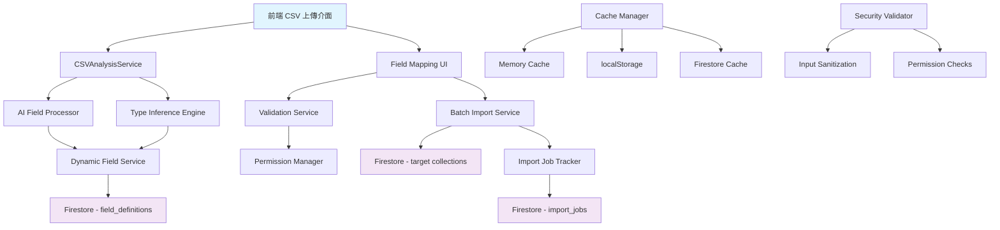

# 動態欄位映射系統技術規格

## 摘要

本系統為 DonnaAI 平台設計的動態欄位映射功能，允許用戶上傳 CSV 檔案時自動讀取所有欄位，並自訂每個欄位的類型、屬性和結構。系統保留原始 CSV 欄位名稱，支援 100+ 欄位的高效能處理，並自動建立欄位定義供後續查詢和顯示使用。

## 1. 系統架構概覽

```
┌─────────────────┐    ┌─────────────────┐    ┌─────────────────┐
│    前端層       │    │    服務層       │    │    資料層       │
│                 │    │                 │    │                 │
│ CSV Upload UI   │───▶│ Field Parser    │───▶│ Firestore       │
│ Field Mapper    │    │ Validation      │    │ Field Defs      │
│ Preview         │    │ Import Service  │    │ Field Relations │
└─────────────────┘    └─────────────────┘    └─────────────────┘
```

## 2. 資料模型設計

### 2.1 DynamicFieldSchema 介面

```typescript
/**
 * 動態欄位 Schema - 擴展現有 FieldConfig
 */
export interface DynamicFieldSchema extends FieldConfig {
  // 原有 FieldConfig 屬性 +
  isCustom: boolean;                    // 是否為自訂欄位
  sourceColumn?: string;                // 來源 CSV 欄位名稱
  dataPreview?: any[];                  // 資料預覽樣本 (前5筆)
  inferredType?: FieldType;             // AI 推斷的欄位類型
  constraints?: FieldConstraints;       // 欄位約束
  indexable: boolean;                   // 是否需要建立索引
  searchable: boolean;                  // 是否可搜尋
}

/**
 * 欄位約束
 */
export interface FieldConstraints {
  unique: boolean;                      // 唯一性約束
  notNull: boolean;                     // 非空約束
  minValue?: number;                    // 最小值 (數字類型)
  maxValue?: number;                    // 最大值 (數字類型)
  allowedValues?: string[];             // 允許的值列表
  format?: string;                      // 格式要求 (RegExp)
}
```

### 2.2 CSV 分析結果

```typescript
/**
 * CSV 分析結果
 */
export interface CSVAnalysisResult {
  fileName: string;
  totalRows: number;
  totalColumns: number;
  encoding: string;
  delimiter: string;
  hasHeader: boolean;
  columns: CSVColumnAnalysis[];
  dataTypes: Record<string, FieldType>;
  sampleData: any[][];                  // 前10行資料
  errors: CSVParseError[];
}

/**
 * 單一欄位分析
 */
export interface CSVColumnAnalysis {
  name: string;                         // 欄位名稱
  index: number;                        // 欄位索引
  type: FieldType;                      // 推斷類型
  confidence: number;                   // 推斷信心度 (0-1)
  nullCount: number;                    // 空值數量
  uniqueCount: number;                  // 唯一值數量
  sampleValues: any[];                  // 樣本值
  statistics?: {
    min?: any;
    max?: any;
    average?: number;                   // 數字類型的平均值
    commonValues: Array<{               // 最常見的值
      value: any;
      count: number;
    }>;
  };
}

/**
 * CSV 解析錯誤
 */
export interface CSVParseError {
  row: number;
  column: string;
  message: string;
  severity: 'error' | 'warning';
}
```

### 2.3 欄位映射配置

```typescript
/**
 * 欄位映射配置 - 擴展現有 FieldMapping
 */
export interface EnhancedFieldMapping extends FieldMapping {
  id: string;                           // 映射唯一ID
  confidence: number;                   // 自動映射信心度
  conflicts: MappingConflict[];         // 映射衝突
  aiSuggestion?: {
    suggestedType: FieldType;
    suggestedLabel: string;
    reason: string;
  };
}

/**
 * 映射衝突
 */
export interface MappingConflict {
  type: 'type_mismatch' | 'duplicate_mapping' | 'missing_required';
  message: string;
  severity: 'error' | 'warning';
  suggestedFix?: string;
}
```

### 2.4 批次匯入配置

```typescript
/**
 * 批次匯入配置
 */
export interface BatchImportConfig {
  id: string;
  organizationId: string;
  targetCollection: DatabaseType;
  batchSize: number;                    // 預設 100，可調整至 500
  skipValidation: boolean;              // 跳過資料驗證（高速模式）
  createIndexes: boolean;               // 是否建立索引
  preserveOrder: boolean;               // 保持原始順序
  onConflict: 'skip' | 'overwrite' | 'merge'; // 衝突處理策略
  fieldMappings: EnhancedFieldMapping[];
  createdAt: Timestamp;
  updatedAt: Timestamp;
}
```

## 3. API Endpoints 規格

### 3.1 檔案上傳與分析

```typescript
/**
 * POST /api/csv/analyze
 * 分析 CSV 檔案結構和內容
 */
interface AnalyzeCSVRequest {
  file: File;                           // CSV 檔案
  options?: {
    delimiter?: string;                 // 自訂分隔符
    encoding?: string;                  // 檔案編碼
    hasHeader?: boolean;                // 是否有標題行
    previewRows?: number;               // 預覽行數 (預設 10)
  };
}

interface AnalyzeCSVResponse {
  success: boolean;
  data: CSVAnalysisResult;
  processingTime: number;               // 處理耗時（毫秒）
}

/**
 * POST /api/csv/validate-mapping
 * 驗證欄位映射配置
 */
interface ValidateMappingRequest {
  csvAnalysis: CSVAnalysisResult;
  fieldMappings: EnhancedFieldMapping[];
  targetCollection: DatabaseType;
}

interface ValidateMappingResponse {
  success: boolean;
  isValid: boolean;
  conflicts: MappingConflict[];
  suggestions: Array<{
    field: string;
    suggestion: string;
    reason: string;
  }>;
}
```

### 3.2 欄位定義管理

```typescript
/**
 * POST /api/field-definitions/create-from-csv
 * 從 CSV 分析結果建立欄位定義
 */
interface CreateFieldDefinitionRequest {
  organizationId: string;
  collectionName: DatabaseType;
  csvAnalysis: CSVAnalysisResult;
  fieldMappings: EnhancedFieldMapping[];
  metadata?: {
    source: 'csv_import';
    fileName: string;
    importedBy: string;
  };
}

interface CreateFieldDefinitionResponse {
  success: boolean;
  fieldDefinitionId: string;
  fieldsCreated: number;
  indexesCreated: string[];
}

/**
 * GET /api/field-definitions/suggest-mapping
 * 基於現有欄位定義建議映射
 */
interface SuggestMappingRequest {
  organizationId: string;
  collectionName: DatabaseType;
  csvColumns: string[];
}

interface SuggestMappingResponse {
  success: boolean;
  suggestions: Array<{
    csvColumn: string;
    suggestedField: string;
    confidence: number;
    reason: string;
  }>;
}
```

### 3.3 批次匯入

```typescript
/**
 * POST /api/import/batch-start
 * 開始批次匯入程序
 */
interface BatchImportStartRequest {
  configId: string;                     // 批次配置 ID
  csvData: any[][];                     // CSV 資料
  options?: {
    dryRun?: boolean;                   // 測試模式
    notifyOnComplete?: boolean;         // 完成時通知
  };
}

interface BatchImportStartResponse {
  success: boolean;
  jobId: string;                        // 匯入任務 ID
  estimatedDuration: number;            // 預估完成時間（秒）
}

/**
 * GET /api/import/batch-status/{jobId}
 * 查詢匯入進度
 */
interface BatchImportStatusResponse {
  success: boolean;
  jobId: string;
  status: ImportJob['status'];
  progress: number;                     // 0-100
  processedRows: number;
  totalRows: number;
  errors: ImportError[];
  estimatedTimeRemaining?: number;      // 預估剩餘時間（秒）
}
```

## 4. 後端服務架構

### 4.1 CSVAnalysisService

```typescript
/**
 * CSV 分析服務
 * 負責解析和分析 CSV 檔案
 */
export class CSVAnalysisService {
  private aiFieldProcessor: AIFieldProcessor;
  private encoding = new TextDecoder();

  /**
   * 分析 CSV 檔案
   */
  async analyzeCSV(
    file: Buffer, 
    options: AnalyzeOptions = {}
  ): Promise<CSVAnalysisResult> {
    // 1. 檢測編碼和分隔符
    const encoding = await this.detectEncoding(file);
    const delimiter = await this.detectDelimiter(file, encoding);
    
    // 2. 解析 CSV 內容
    const parsed = await this.parseCSV(file, { encoding, delimiter });
    
    // 3. 分析欄位類型
    const columnAnalysis = await this.analyzeColumns(parsed.data);
    
    // 4. AI 類型推斷
    const aiSuggestions = await this.aiFieldProcessor.inferFieldTypes(
      parsed.headers, 
      parsed.data.slice(0, 10) // 只用前10行推斷
    );

    return {
      fileName: options.fileName || 'unknown.csv',
      totalRows: parsed.data.length,
      totalColumns: parsed.headers.length,
      encoding,
      delimiter,
      hasHeader: parsed.hasHeader,
      columns: columnAnalysis,
      dataTypes: aiSuggestions,
      sampleData: parsed.data.slice(0, 10),
      errors: parsed.errors
    };
  }

  /**
   * 建議欄位映射
   */
  async suggestFieldMappings(
    csvAnalysis: CSVAnalysisResult,
    existingFields: FieldConfig[]
  ): Promise<EnhancedFieldMapping[]> {
    const mappings: EnhancedFieldMapping[] = [];
    
    for (const column of csvAnalysis.columns) {
      // 1. 精確匹配欄位名稱
      let match = existingFields.find(f => 
        f.label.toLowerCase() === column.name.toLowerCase() ||
        f.key.toLowerCase() === column.name.toLowerCase()
      );
      
      // 2. 模糊匹配
      if (!match) {
        match = this.fuzzyMatchField(column.name, existingFields);
      }
      
      // 3. AI 建議
      const aiSuggestion = await this.aiFieldProcessor.suggestMapping(
        column, existingFields
      );

      mappings.push({
        id: `mapping_${column.index}`,
        sourceColumn: column.name,
        targetField: match?.key || `custom_${column.name}`,
        isNew: !match,
        fieldType: match?.type || column.type,
        confidence: match ? 0.9 : aiSuggestion.confidence,
        conflicts: [],
        aiSuggestion
      });
    }
    
    return mappings;
  }

  private async detectEncoding(file: Buffer): Promise<string> {
    // 實作編碼檢測邏輯
    // 支援 UTF-8, UTF-16, Big5, GB2312
  }

  private async detectDelimiter(file: Buffer, encoding: string): Promise<string> {
    // 實作分隔符檢測邏輯
    // 支援 comma, semicolon, tab, pipe
  }

  private fuzzyMatchField(columnName: string, fields: FieldConfig[]): FieldConfig | null {
    // 實作模糊匹配邏輯（編輯距離算法）
  }
}
```

### 4.2 DynamicFieldService

```typescript
/**
 * 動態欄位服務
 * 管理欄位定義的創建、更新、查詢
 */
export class DynamicFieldService {
  private db = getFirebaseDb();
  private fieldDefinitionsRef = collection(this.db, 'field_definitions');

  /**
   * 從 CSV 分析結果創建欄位定義
   */
  async createFieldDefinitionFromCSV(
    organizationId: string,
    collectionName: DatabaseType,
    csvAnalysis: CSVAnalysisResult,
    fieldMappings: EnhancedFieldMapping[]
  ): Promise<FieldDefinition> {
    // 1. 建立欄位配置
    const fields: DynamicFieldSchema[] = [];
    let order = 1;

    for (const mapping of fieldMappings) {
      const column = csvAnalysis.columns.find(c => c.name === mapping.sourceColumn);
      if (!column) continue;

      const field: DynamicFieldSchema = {
        key: mapping.isNew ? `custom_${mapping.sourceColumn}` : mapping.targetField,
        label: mapping.customLabel || mapping.sourceColumn,
        type: mapping.fieldType || column.type,
        required: false,
        order: order++,
        visible: true,
        isCustom: mapping.isNew,
        sourceColumn: mapping.sourceColumn,
        dataPreview: column.sampleValues.slice(0, 5),
        inferredType: column.type,
        constraints: this.inferConstraints(column),
        indexable: column.uniqueCount > 1 && column.uniqueCount < csvAnalysis.totalRows * 0.9,
        searchable: column.type === 'text' || column.type === 'email'
      };

      fields.push(field);
    }

    // 2. 建立欄位定義文檔
    const fieldDefinition: Omit<FieldDefinition, 'id'> = {
      collectionName,
      fields,
      version: 1,
      isActive: true,
      organizationId,
      createdAt: Timestamp.now(),
      updatedAt: Timestamp.now(),
      createdBy: 'system', // 從 auth context 取得
      updatedBy: 'system',
      description: `從 ${csvAnalysis.fileName} 匯入建立`
    };

    // 3. 儲存到 Firestore
    const docRef = await addDoc(this.fieldDefinitionsRef, fieldDefinition);
    
    // 4. 建立複合索引（非同步）
    this.createIndexesForFields(collectionName, fields.filter(f => f.indexable));

    return {
      id: docRef.id,
      ...fieldDefinition
    };
  }

  /**
   * 推斷欄位約束
   */
  private inferConstraints(column: CSVColumnAnalysis): FieldConstraints {
    const constraints: FieldConstraints = {
      unique: column.uniqueCount === column.statistics?.commonValues.length,
      notNull: column.nullCount === 0
    };

    // 數字類型的範圍約束
    if (column.type === 'number' && column.statistics) {
      constraints.minValue = column.statistics.min;
      constraints.maxValue = column.statistics.max;
    }

    // 文字類型的格式約束
    if (column.type === 'email') {
      constraints.format = '^[\\w-\\.]+@([\\w-]+\\.)+[\\w-]{2,4}$';
    }

    return constraints;
  }

  /**
   * 非同步建立 Firestore 複合索引
   */
  private async createIndexesForFields(
    collectionName: string, 
    fields: DynamicFieldSchema[]
  ): Promise<void> {
    // 注意：Firestore 複合索引需要透過 Firebase CLI 或 Console 手動建立
    // 這裡記錄需要的索引定義
    const indexDefinitions = fields.map(field => ({
      collectionGroup: collectionName,
      queryScope: 'COLLECTION',
      fields: [
        { fieldPath: 'organizationId', order: 'ASCENDING' },
        { fieldPath: field.key, order: 'ASCENDING' }
      ]
    }));

    // 將索引定義記錄到特殊集合供手動建立
    const indexRef = collection(this.db, 'index_requests');
    await addDoc(indexRef, {
      collectionName,
      indexes: indexDefinitions,
      createdAt: Timestamp.now(),
      status: 'pending'
    });
  }
}
```

### 4.3 BatchImportService

```typescript
/**
 * 批次匯入服務
 * 處理大量資料的高效能匯入
 */
export class BatchImportService {
  private db = getFirebaseDb();
  private maxBatchSize = 500; // Firestore 限制
  private maxConcurrentBatches = 5;

  /**
   * 開始批次匯入
   */
  async startBatchImport(
    config: BatchImportConfig,
    csvData: any[][]
  ): Promise<ImportJob> {
    // 1. 建立匯入任務
    const job: ImportJob = {
      id: `import_${Date.now()}`,
      status: 'queued',
      progress: 0,
      startedAt: Timestamp.now()
    };

    // 2. 非同步處理匯入
    this.processBatchImport(job, config, csvData).catch(error => {
      console.error('批次匯入失敗:', error);
      this.updateJobStatus(job.id, 'failed', { error: error.message });
    });

    return job;
  }

  /**
   * 處理批次匯入（非同步）
   */
  private async processBatchImport(
    job: ImportJob,
    config: BatchImportConfig,
    csvData: any[][]
  ): Promise<void> {
    try {
      // 1. 更新狀態為處理中
      await this.updateJobStatus(job.id, 'processing');

      // 2. 分割資料為批次
      const batches = this.chunkArray(csvData, config.batchSize);
      const totalBatches = batches.length;
      let processedBatches = 0;
      let successCount = 0;
      let errorCount = 0;
      const errors: ImportError[] = [];

      // 3. 並行處理批次（限制並發數）
      const semaphore = new Semaphore(this.maxConcurrentBatches);
      
      const batchPromises = batches.map(async (batch, index) => {
        await semaphore.acquire();
        try {
          const result = await this.processSingleBatch(
            config, 
            batch, 
            index * config.batchSize
          );
          
          successCount += result.successCount;
          errorCount += result.errorCount;
          errors.push(...result.errors);
          
          processedBatches++;
          const progress = (processedBatches / totalBatches) * 100;
          await this.updateJobProgress(job.id, progress);
          
        } finally {
          semaphore.release();
        }
      });

      await Promise.all(batchPromises);

      // 4. 完成匯入
      await this.updateJobStatus(job.id, 'completed', {
        successCount,
        errorCount,
        errors
      });

    } catch (error) {
      await this.updateJobStatus(job.id, 'failed', {
        error: error.message
      });
    }
  }

  /**
   * 處理單一批次
   */
  private async processSingleBatch(
    config: BatchImportConfig,
    batch: any[][],
    startRowIndex: number
  ): Promise<{ successCount: number; errorCount: number; errors: ImportError[] }> {
    const writeBatch = writeBatch(this.db);
    const collectionRef = collection(this.db, config.targetCollection);
    
    let successCount = 0;
    let errorCount = 0;
    const errors: ImportError[] = [];

    for (let i = 0; i < batch.length; i++) {
      const rowData = batch[i];
      const globalRowIndex = startRowIndex + i;

      try {
        // 1. 資料轉換和驗證
        const transformedData = await this.transformRowData(rowData, config.fieldMappings);
        
        if (!config.skipValidation) {
          const validation = await this.validateRowData(transformedData, config);
          if (!validation.isValid) {
            errors.push({
              row: globalRowIndex,
              message: validation.errors.join('; '),
              type: 'validation'
            });
            errorCount++;
            continue;
          }
        }

        // 2. 新增到批次寫入
        const docRef = doc(collectionRef);
        writeBatch.set(docRef, {
          ...transformedData,
          organizationId: config.organizationId,
          createdAt: Timestamp.now(),
          updatedAt: Timestamp.now(),
          importedFrom: 'csv',
          importJobId: `job_${Date.now()}`
        });

        successCount++;

      } catch (error) {
        errors.push({
          row: globalRowIndex,
          message: error.message,
          type: 'unknown'
        });
        errorCount++;
      }
    }

    // 3. 執行批次寫入
    if (successCount > 0) {
      await writeBatch.commit();
    }

    return { successCount, errorCount, errors };
  }

  /**
   * 轉換行資料
   */
  private async transformRowData(
    rowData: any[],
    fieldMappings: EnhancedFieldMapping[]
  ): Promise<Record<string, any>> {
    const transformed: Record<string, any> = {};

    for (const mapping of fieldMappings) {
      const sourceIndex = mapping.sourceColumn;
      let value = rowData[sourceIndex];

      // 資料轉換
      if (value !== null && value !== undefined) {
        switch (mapping.transform) {
          case 'uppercase':
            value = String(value).toUpperCase();
            break;
          case 'lowercase':
            value = String(value).toLowerCase();
            break;
          case 'trim':
            value = String(value).trim();
            break;
          case 'date':
            value = new Date(value);
            break;
        }
      }

      // 使用預設值
      if ((value === null || value === undefined || value === '') && mapping.defaultValue) {
        value = mapping.defaultValue;
      }

      transformed[mapping.targetField] = value;
    }

    return transformed;
  }

  private chunkArray<T>(array: T[], size: number): T[][] {
    const chunks: T[][] = [];
    for (let i = 0; i < array.length; i += size) {
      chunks.push(array.slice(i, i + size));
    }
    return chunks;
  }
}

/**
 * 簡單的信號量實作
 */
class Semaphore {
  private count: number;
  private waitQueue: Array<() => void> = [];

  constructor(count: number) {
    this.count = count;
  }

  async acquire(): Promise<void> {
    if (this.count > 0) {
      this.count--;
      return Promise.resolve();
    }

    return new Promise((resolve) => {
      this.waitQueue.push(resolve);
    });
  }

  release(): void {
    this.count++;
    if (this.waitQueue.length > 0) {
      const resolve = this.waitQueue.shift()!;
      this.count--;
      resolve();
    }
  }
}
```

## 5. 資料庫 Schema 設計

### 5.1 Firestore 集合結構

```typescript
/**
 * field_definitions 集合
 * 組織級別的欄位定義
 */
interface FieldDefinitionsCollection {
  [documentId: string]: {
    collectionName: 'customers' | 'records' | 'tasks' | 'users';
    fields: DynamicFieldSchema[];
    version: number;
    isActive: boolean;
    organizationId: string;
    createdAt: Timestamp;
    updatedAt: Timestamp;
    createdBy: string;
    updatedBy: string;
    description?: string;
    // 新增索引資訊
    indexStatus: {
      [fieldKey: string]: 'pending' | 'created' | 'failed';
    };
  };
}

/**
 * csv_analysis_cache 集合
 * CSV 分析結果快取（24小時後自動刪除）
 */
interface CSVAnalysisCacheCollection {
  [documentId: string]: {
    fileName: string;
    fileHash: string;                   // 檔案內容雜湊值
    analysisResult: CSVAnalysisResult;
    organizationId: string;
    createdAt: Timestamp;
    expiresAt: Timestamp;               // TTL 索引
  };
}

/**
 * import_jobs 集合
 * 匯入任務追蹤
 */
interface ImportJobsCollection {
  [documentId: string]: {
    status: ImportJob['status'];
    progress: number;
    startedAt: Timestamp;
    completedAt?: Timestamp;
    organizationId: string;
    userId: string;
    targetCollection: DatabaseType;
    totalRows: number;
    processedRows: number;
    successCount: number;
    errorCount: number;
    errors: ImportError[];
    config: BatchImportConfig;
    metadata: {
      fileName: string;
      fileSize: number;
      estimatedDuration: number;
    };
  };
}

/**
 * field_mapping_templates 集合
 * 可重複使用的映射範本
 */
interface FieldMappingTemplatesCollection {
  [documentId: string]: {
    name: string;
    description?: string;
    targetCollection: DatabaseType;
    fieldMappings: EnhancedFieldMapping[];
    organizationId: string;
    isPublic: boolean;                  // 是否為公開範本
    createdBy: string;
    createdAt: Timestamp;
    lastUsed?: Timestamp;
    useCount: number;
    tags: string[];                     // 標籤分類
  };
}
```

### 5.2 複合索引定義

```javascript
// firestore.indexes.json
{
  "indexes": [
    // 欄位定義查詢
    {
      "collectionGroup": "field_definitions",
      "queryScope": "COLLECTION",
      "fields": [
        {"fieldPath": "organizationId", "order": "ASCENDING"},
        {"fieldPath": "collectionName", "order": "ASCENDING"},
        {"fieldPath": "isActive", "order": "ASCENDING"}
      ]
    },
    
    // 匯入任務查詢
    {
      "collectionGroup": "import_jobs",
      "queryScope": "COLLECTION", 
      "fields": [
        {"fieldPath": "organizationId", "order": "ASCENDING"},
        {"fieldPath": "userId", "order": "ASCENDING"},
        {"fieldPath": "startedAt", "order": "DESCENDING"}
      ]
    },
    
    // CSV 快取查詢
    {
      "collectionGroup": "csv_analysis_cache",
      "queryScope": "COLLECTION",
      "fields": [
        {"fieldPath": "organizationId", "order": "ASCENDING"},
        {"fieldPath": "fileHash", "order": "ASCENDING"}
      ]
    },
    
    // 動態欄位查詢（客戶資料）
    {
      "collectionGroup": "customers",
      "queryScope": "COLLECTION",
      "fields": [
        {"fieldPath": "organizationId", "order": "ASCENDING"},
        {"fieldPath": "custom_company", "order": "ASCENDING"}
      ]
    }
  ],
  
  // TTL 規則
  "fieldOverrides": [
    {
      "collectionGroup": "csv_analysis_cache",
      "fieldPath": "expiresAt",
      "ttl": true
    }
  ]
}
```

## 6. 商業邏輯規則

### 6.1 欄位命名規範

```typescript
/**
 * 欄位命名驗證規則
 */
export class FieldNamingRules {
  // 禁用的欄位名稱（Firestore 保留字）
  private static RESERVED_NAMES = [
    '__name__', '__id__', '__parent__', '__path__',
    'id', 'createdAt', 'updatedAt', 'organizationId'
  ];

  // 特殊字符規則
  private static INVALID_CHARS = /[.\[\]/]/g;
  
  /**
   * 驗證欄位名稱
   */
  static validateFieldName(name: string): ValidationResult {
    // 1. 長度檢查
    if (name.length < 1 || name.length > 50) {
      return { isValid: false, error: '欄位名稱長度必須在 1-50 字元之間' };
    }

    // 2. 保留字檢查
    if (this.RESERVED_NAMES.includes(name.toLowerCase())) {
      return { isValid: false, error: `'${name}' 是系統保留字，請使用其他名稱` };
    }

    // 3. 特殊字符檢查
    if (this.INVALID_CHARS.test(name)) {
      return { isValid: false, error: '欄位名稱不能包含 . [ ] / 等特殊字符' };
    }

    // 4. 開頭檢查
    if (name.startsWith('_')) {
      return { isValid: false, error: '欄位名稱不能以底線開頭' };
    }

    return { isValid: true };
  }

  /**
   * 自動修正欄位名稱
   */
  static sanitizeFieldName(name: string): string {
    return name
      .replace(this.INVALID_CHARS, '_')     // 替換特殊字符
      .replace(/^_+/, '')                   // 移除開頭底線
      .replace(/\s+/g, '_')                 // 空格轉底線
      .toLowerCase()                        // 轉小寫
      .substring(0, 50);                    // 截取長度
  }
}

interface ValidationResult {
  isValid: boolean;
  error?: string;
}
```

### 6.2 資料類型推斷規則

```typescript
/**
 * 智能類型推斷
 */
export class TypeInferenceEngine {
  /**
   * 推斷欄位類型
   */
  static inferFieldType(values: any[]): { type: FieldType; confidence: number } {
    if (values.length === 0) {
      return { type: 'text', confidence: 0.1 };
    }

    const nonNullValues = values.filter(v => v !== null && v !== undefined && v !== '');
    if (nonNullValues.length === 0) {
      return { type: 'text', confidence: 0.1 };
    }

    // 1. 數字類型檢測
    const numberPattern = /^-?\d*\.?\d+$/;
    const numberCount = nonNullValues.filter(v => numberPattern.test(String(v))).length;
    if (numberCount / nonNullValues.length > 0.8) {
      return { type: 'number', confidence: numberCount / nonNullValues.length };
    }

    // 2. 日期類型檢測
    const datePatterns = [
      /^\d{4}-\d{2}-\d{2}$/,              // YYYY-MM-DD
      /^\d{2}\/\d{2}\/\d{4}$/,            // MM/DD/YYYY
      /^\d{1,2}\/\d{1,2}\/\d{2,4}$/,      // M/D/YY
    ];
    
    const dateCount = nonNullValues.filter(v => {
      const str = String(v);
      return datePatterns.some(pattern => pattern.test(str)) || !isNaN(Date.parse(str));
    }).length;
    
    if (dateCount / nonNullValues.length > 0.7) {
      return { type: 'date', confidence: dateCount / nonNullValues.length };
    }

    // 3. Email 類型檢測
    const emailPattern = /^[^\s@]+@[^\s@]+\.[^\s@]+$/;
    const emailCount = nonNullValues.filter(v => emailPattern.test(String(v))).length;
    if (emailCount / nonNullValues.length > 0.6) {
      return { type: 'email', confidence: emailCount / nonNullValues.length };
    }

    // 4. 電話類型檢測
    const phonePatterns = [
      /^\+?1?-?\(?\d{3}\)?-?\d{3}-?\d{4}$/,  // 北美格式
      /^\+?886-?\d{1,4}-?\d{6,8}$/,          // 台灣格式
      /^\+?86-?\d{11}$/,                     // 中國格式
    ];
    
    const phoneCount = nonNullValues.filter(v => {
      const str = String(v).replace(/\s/g, '');
      return phonePatterns.some(pattern => pattern.test(str));
    }).length;
    
    if (phoneCount / nonNullValues.length > 0.6) {
      return { type: 'phone', confidence: phoneCount / nonNullValues.length };
    }

    // 5. Boolean 類型檢測
    const booleanValues = ['true', 'false', '是', '否', 'yes', 'no', '1', '0'];
    const booleanCount = nonNullValues.filter(v => 
      booleanValues.includes(String(v).toLowerCase())
    ).length;
    
    if (booleanCount / nonNullValues.length > 0.8) {
      return { type: 'boolean', confidence: booleanCount / nonNullValues.length };
    }

    // 6. URL 類型檢測
    const urlPattern = /^https?:\/\/.+\..+/;
    const urlCount = nonNullValues.filter(v => urlPattern.test(String(v))).length;
    if (urlCount / nonNullValues.length > 0.7) {
      return { type: 'url', confidence: urlCount / nonNullValues.length };
    }

    // 7. 選擇類型檢測（重複值多）
    const uniqueValues = [...new Set(nonNullValues.map(v => String(v)))];
    if (uniqueValues.length <= 10 && uniqueValues.length / nonNullValues.length < 0.3) {
      return { type: 'select', confidence: 0.8 };
    }

    // 8. 預設為文字類型
    return { type: 'text', confidence: 0.9 };
  }
}
```

### 6.3 資料驗證規則

```typescript
/**
 * 匯入資料驗證
 */
export class ImportDataValidator {
  /**
   * 驗證單筆資料
   */
  static async validateRecord(
    data: Record<string, any>,
    fieldDefinitions: DynamicFieldSchema[]
  ): Promise<ValidationResult> {
    const errors: string[] = [];

    for (const field of fieldDefinitions) {
      const value = data[field.key];

      // 1. 必填檢查
      if (field.required && (value === null || value === undefined || value === '')) {
        errors.push(`${field.label} 為必填欄位`);
        continue;
      }

      // 2. 類型驗證
      if (value !== null && value !== undefined && value !== '') {
        const typeValidation = this.validateFieldType(value, field);
        if (!typeValidation.isValid) {
          errors.push(`${field.label}: ${typeValidation.error}`);
        }
      }

      // 3. 約束檢查
      if (field.constraints && value !== null && value !== undefined && value !== '') {
        const constraintValidation = this.validateConstraints(value, field.constraints);
        if (!constraintValidation.isValid) {
          errors.push(`${field.label}: ${constraintValidation.error}`);
        }
      }

      // 4. 自訂驗證規則
      if (field.validation) {
        for (const rule of field.validation) {
          const ruleValidation = this.validateRule(value, rule);
          if (!ruleValidation.isValid) {
            errors.push(`${field.label}: ${ruleValidation.error}`);
          }
        }
      }
    }

    return {
      isValid: errors.length === 0,
      errors
    };
  }

  private static validateFieldType(value: any, field: DynamicFieldSchema): ValidationResult {
    switch (field.type) {
      case 'number':
        if (isNaN(Number(value))) {
          return { isValid: false, error: '必須為數字' };
        }
        break;

      case 'email':
        const emailPattern = /^[^\s@]+@[^\s@]+\.[^\s@]+$/;
        if (!emailPattern.test(String(value))) {
          return { isValid: false, error: '電子郵件格式不正確' };
        }
        break;

      case 'date':
        if (isNaN(Date.parse(String(value)))) {
          return { isValid: false, error: '日期格式不正確' };
        }
        break;

      case 'boolean':
        const booleanValues = ['true', 'false', '是', '否', 'yes', 'no', '1', '0', true, false, 1, 0];
        if (!booleanValues.includes(value)) {
          return { isValid: false, error: '必須為 true/false 或 是/否' };
        }
        break;
    }

    return { isValid: true };
  }

  private static validateConstraints(value: any, constraints: FieldConstraints): ValidationResult {
    // 唯一性檢查（需要額外的資料庫查詢）
    if (constraints.unique) {
      // 這裡應該進行資料庫查詢檢查唯一性
      // 為了效能考量，可以在批次處理後進行
    }

    // 數值範圍檢查
    if (constraints.minValue !== undefined && Number(value) < constraints.minValue) {
      return { isValid: false, error: `值不能小於 ${constraints.minValue}` };
    }

    if (constraints.maxValue !== undefined && Number(value) > constraints.maxValue) {
      return { isValid: false, error: `值不能大於 ${constraints.maxValue}` };
    }

    // 允許值列表檢查
    if (constraints.allowedValues && !constraints.allowedValues.includes(String(value))) {
      return { 
        isValid: false, 
        error: `值必須為以下之一: ${constraints.allowedValues.join(', ')}` 
      };
    }

    // 格式檢查
    if (constraints.format) {
      const pattern = new RegExp(constraints.format);
      if (!pattern.test(String(value))) {
        return { isValid: false, error: '格式不符合要求' };
      }
    }

    return { isValid: true };
  }
}
```

## 7. 效能優化策略

### 7.1 大檔案處理優化

```typescript
/**
 * 大檔案串流處理
 */
export class LargeFileProcessor {
  private readonly CHUNK_SIZE = 1024 * 1024; // 1MB chunks
  private readonly MAX_MEMORY_USAGE = 50 * 1024 * 1024; // 50MB limit

  /**
   * 串流處理大型 CSV 檔案
   */
  async processLargeCSV(file: File): Promise<CSVAnalysisResult> {
    const reader = file.stream().getReader();
    const decoder = new TextDecoder();
    
    let buffer = '';
    let headers: string[] = [];
    let rowCount = 0;
    let sampleData: any[][] = [];
    const columnStats = new Map<string, ColumnStatCollector>();

    try {
      while (true) {
        const { done, value } = await reader.read();
        if (done) break;

        // 處理區塊
        buffer += decoder.decode(value, { stream: true });
        const lines = buffer.split('\n');
        
        // 保留最後一行（可能不完整）
        buffer = lines.pop() || '';

        for (const line of lines) {
          if (rowCount === 0) {
            // 解析標題列
            headers = this.parseCSVLine(line);
            this.initializeColumnStats(headers, columnStats);
          } else {
            // 處理資料列
            const rowData = this.parseCSVLine(line);
            
            // 更新統計資料
            this.updateColumnStats(rowData, columnStats);
            
            // 保存樣本資料（前1000行）
            if (sampleData.length < 1000) {
              sampleData.push(rowData);
            }
          }
          
          rowCount++;

          // 記憶體使用量檢查
          if (this.getMemoryUsage() > this.MAX_MEMORY_USAGE) {
            console.warn('記憶體使用量過高，切換至精簡模式');
            break;
          }
        }
      }

      // 完成統計
      return this.buildAnalysisResult(headers, columnStats, sampleData, rowCount);

    } finally {
      reader.releaseLock();
    }
  }

  private getMemoryUsage(): number {
    // 估算當前記憶體使用量
    return (performance as any).memory?.usedJSHeapSize || 0;
  }
}

/**
 * 欄位統計收集器
 */
class ColumnStatCollector {
  public nullCount = 0;
  public uniqueValues = new Set();
  public numericValues: number[] = [];
  public sampleValues: any[] = [];
  
  addValue(value: any): void {
    if (value === null || value === undefined || value === '') {
      this.nullCount++;
      return;
    }

    this.uniqueValues.add(value);
    
    // 數字統計
    const numValue = Number(value);
    if (!isNaN(numValue)) {
      this.numericValues.push(numValue);
    }

    // 樣本值（最多100個）
    if (this.sampleValues.length < 100) {
      this.sampleValues.push(value);
    }
  }

  getStatistics(): any {
    return {
      nullCount: this.nullCount,
      uniqueCount: this.uniqueValues.size,
      sampleValues: this.sampleValues.slice(0, 10),
      min: this.numericValues.length > 0 ? Math.min(...this.numericValues) : undefined,
      max: this.numericValues.length > 0 ? Math.max(...this.numericValues) : undefined,
      average: this.numericValues.length > 0 
        ? this.numericValues.reduce((a, b) => a + b) / this.numericValues.length 
        : undefined
    };
  }
}
```

### 7.2 快取策略

```typescript
/**
 * 多層快取系統
 */
export class CacheManager {
  private memoryCache = new Map<string, any>();
  private readonly MEMORY_CACHE_SIZE = 100;
  private readonly CACHE_TTL = 30 * 60 * 1000; // 30 分鐘

  /**
   * 獲取欄位定義（多層快取）
   */
  async getFieldDefinition(
    organizationId: string, 
    collectionName: string
  ): Promise<FieldDefinition | null> {
    const cacheKey = `field_def_${organizationId}_${collectionName}`;

    // 1. 記憶體快取
    const memCached = this.memoryCache.get(cacheKey);
    if (memCached && Date.now() - memCached.timestamp < this.CACHE_TTL) {
      return memCached.data;
    }

    // 2. localStorage 快取
    const localCached = this.getFromLocalStorage(cacheKey);
    if (localCached) {
      this.memoryCache.set(cacheKey, localCached);
      return localCached.data;
    }

    // 3. Firestore 查詢
    const fieldDef = await this.fetchFromFirestore(organizationId, collectionName);
    if (fieldDef) {
      this.setCache(cacheKey, fieldDef);
    }

    return fieldDef;
  }

  /**
   * 快取 CSV 分析結果
   */
  async cacheCsvAnalysis(
    fileHash: string,
    analysis: CSVAnalysisResult,
    organizationId: string
  ): Promise<void> {
    // 儲存到 Firestore（24小時TTL）
    const cacheRef = collection(getFirebaseDb(), 'csv_analysis_cache');
    await addDoc(cacheRef, {
      fileHash,
      analysisResult: analysis,
      organizationId,
      createdAt: Timestamp.now(),
      expiresAt: Timestamp.fromDate(new Date(Date.now() + 24 * 60 * 60 * 1000))
    });
  }

  private setCache(key: string, data: any): void {
    const cacheEntry = {
      data,
      timestamp: Date.now()
    };

    // 記憶體快取
    this.memoryCache.set(key, cacheEntry);
    
    // 限制記憶體快取大小
    if (this.memoryCache.size > this.MEMORY_CACHE_SIZE) {
      const firstKey = this.memoryCache.keys().next().value;
      this.memoryCache.delete(firstKey);
    }

    // localStorage 快取
    try {
      localStorage.setItem(key, JSON.stringify(cacheEntry));
    } catch (error) {
      console.warn('localStorage 快取失敗:', error);
    }
  }
}
```

### 7.3 索引優化策略

```typescript
/**
 * 智能索引管理
 */
export class IndexOptimizer {
  private db = getFirebaseDb();

  /**
   * 分析查詢模式並建議索引
   */
  async analyzeQueryPatterns(
    organizationId: string,
    collectionName: string
  ): Promise<IndexRecommendation[]> {
    // 1. 分析常用查詢欄位
    const queryLog = await this.getQueryLog(organizationId);
    const fieldUsage = this.analyzeFieldUsage(queryLog);

    // 2. 產生索引建議
    const recommendations: IndexRecommendation[] = [];

    for (const [field, usage] of fieldUsage.entries()) {
      if (usage.frequency > 0.1) { // 使用頻率超過10%
        recommendations.push({
          fields: ['organizationId', field],
          reason: `欄位 ${field} 查詢頻率高 (${(usage.frequency * 100).toFixed(1)}%)`,
          priority: this.calculatePriority(usage),
          estimatedCost: this.estimateIndexCost(collectionName, field)
        });
      }
    }

    // 3. 複合索引建議
    const compositeRecommendations = this.generateCompositeIndexes(fieldUsage);
    recommendations.push(...compositeRecommendations);

    return recommendations.sort((a, b) => b.priority - a.priority);
  }

  /**
   * 自動建立建議的索引
   */
  async createRecommendedIndexes(
    recommendations: IndexRecommendation[]
  ): Promise<void> {
    // 注意：Firestore 索引必須透過 Firebase CLI 建立
    // 這裡生成索引定義檔案
    const indexConfig = {
      indexes: recommendations.slice(0, 10).map(rec => ({
        collectionGroup: rec.collection,
        queryScope: 'COLLECTION',
        fields: rec.fields.map(field => ({
          fieldPath: field,
          order: 'ASCENDING'
        }))
      }))
    };

    // 儲存索引配置供手動建立
    const configRef = collection(this.db, 'index_configurations');
    await addDoc(configRef, {
      config: indexConfig,
      createdAt: Timestamp.now(),
      status: 'pending',
      organizationId: 'system'
    });
  }

  private calculatePriority(usage: FieldUsage): number {
    // 基於查詢頻率、資料量、複雜度計算優先級
    return usage.frequency * 0.4 + 
           usage.selectivity * 0.3 + 
           usage.complexity * 0.3;
  }
}

interface IndexRecommendation {
  fields: string[];
  reason: string;
  priority: number;
  estimatedCost: number;
  collection?: string;
}

interface FieldUsage {
  frequency: number;    // 查詢頻率 0-1
  selectivity: number;  // 選擇性 0-1  
  complexity: number;   // 查詢複雜度 0-1
}
```

## 8. 安全性考量

### 8.1 輸入驗證與清理

```typescript
/**
 * 安全輸入驗證
 */
export class SecurityValidator {
  // 危險關鍵字檢測
  private static DANGEROUS_KEYWORDS = [
    'javascript:', 'data:', 'vbscript:', 'onload', 'onerror',
    '<script', '</script>', 'eval(', 'function(',
    'SELECT', 'INSERT', 'UPDATE', 'DELETE', 'DROP'
  ];

  // 最大欄位長度限制
  private static MAX_FIELD_LENGTH = 10000;
  private static MAX_FIELDS_COUNT = 200;

  /**
   * 驗證 CSV 檔案安全性
   */
  static validateCSVSecurity(file: File): SecurityValidationResult {
    const errors: string[] = [];

    // 1. 檔案大小檢查
    if (file.size > 50 * 1024 * 1024) { // 50MB 限制
      errors.push('檔案大小不能超過 50MB');
    }

    // 2. 檔案類型檢查
    const allowedTypes = ['text/csv', 'application/csv', 'text/plain'];
    if (!allowedTypes.includes(file.type) && !file.name.endsWith('.csv')) {
      errors.push('只允許上傳 CSV 檔案');
    }

    // 3. 檔案名稱檢查
    const fileName = file.name;
    if (fileName.length > 255 || /[<>:"/\\|?*]/.test(fileName)) {
      errors.push('檔案名稱包含非法字符');
    }

    return {
      isSecure: errors.length === 0,
      errors
    };
  }

  /**
   * 清理 CSV 內容
   */
  static sanitizeCSVContent(content: string): string {
    // 1. 移除潛在的腳本內容
    let sanitized = content;
    
    this.DANGEROUS_KEYWORDS.forEach(keyword => {
      const regex = new RegExp(keyword, 'gi');
      sanitized = sanitized.replace(regex, '[FILTERED]');
    });

    // 2. 限制行長度
    const lines = sanitized.split('\n');
    const cleanLines = lines.map(line => {
      if (line.length > this.MAX_FIELD_LENGTH) {
        return line.substring(0, this.MAX_FIELD_LENGTH) + '[TRUNCATED]';
      }
      return line;
    });

    // 3. 限制總行數
    if (cleanLines.length > 100000) { // 10萬行限制
      return cleanLines.slice(0, 100000).join('\n') + '\n[FILE_TRUNCATED]';
    }

    return cleanLines.join('\n');
  }

  /**
   * 驗證欄位值安全性
   */
  static validateFieldValue(value: any, fieldType: FieldType): SecurityValidationResult {
    const errors: string[] = [];

    if (typeof value === 'string') {
      // 1. 長度檢查
      if (value.length > this.MAX_FIELD_LENGTH) {
        errors.push(`欄位值長度不能超過 ${this.MAX_FIELD_LENGTH} 字元`);
      }

      // 2. 危險內容檢查
      const lowerValue = value.toLowerCase();
      for (const keyword of this.DANGEROUS_KEYWORDS) {
        if (lowerValue.includes(keyword.toLowerCase())) {
          errors.push(`欄位值包含潛在危險內容: ${keyword}`);
          break;
        }
      }

      // 3. 特定類型驗證
      if (fieldType === 'email') {
        const emailRegex = /^[^\s@]+@[^\s@]+\.[^\s@]+$/;
        if (!emailRegex.test(value)) {
          errors.push('無效的 Email 格式');
        }
      }

      if (fieldType === 'url') {
        try {
          const url = new URL(value);
          if (!['http:', 'https:'].includes(url.protocol)) {
            errors.push('URL 必須使用 HTTP 或 HTTPS 協議');
          }
        } catch {
          errors.push('無效的 URL 格式');
        }
      }
    }

    return {
      isSecure: errors.length === 0,
      errors
    };
  }
}

interface SecurityValidationResult {
  isSecure: boolean;
  errors: string[];
}
```

### 8.2 權限控制

```typescript
/**
 * 動態欄位權限控制
 */
export class FieldPermissionManager {
  /**
   * 檢查欄位定義權限
   */
  static async checkFieldDefinitionPermission(
    userId: string,
    organizationId: string,
    action: 'read' | 'create' | 'update' | 'delete'
  ): Promise<boolean> {
    const user = await this.getUserWithRoles(userId);
    
    // 1. Super Admin 擁有所有權限
    if (user.role === 'super_admin') {
      return true;
    }

    // 2. 組織管理員權限
    if (user.role === 'admin' && user.organizationId === organizationId) {
      return ['read', 'create', 'update'].includes(action);
    }

    // 3. 一般用戶只能讀取
    if (user.organizationId === organizationId) {
      return action === 'read';
    }

    return false;
  }

  /**
   * 檢查匯入權限
   */
  static async checkImportPermission(
    userId: string,
    organizationId: string,
    targetCollection: DatabaseType
  ): Promise<ImportPermissionResult> {
    const user = await this.getUserWithRoles(userId);
    
    const basePermission = user.organizationId === organizationId && 
                          ['admin', 'manager'].includes(user.role);

    if (!basePermission) {
      return {
        canImport: false,
        reason: '權限不足：需要管理員或主管權限'
      };
    }

    // 檢查集合特定權限
    const collectionPermissions = await this.getCollectionPermissions(
      userId, 
      targetCollection
    );

    if (!collectionPermissions.canWrite) {
      return {
        canImport: false,
        reason: `權限不足：無法寫入 ${targetCollection} 集合`
      };
    }

    // 檢查資料量限制
    const usageInfo = await this.getUsageInfo(organizationId);
    if (usageInfo.exceedsLimit) {
      return {
        canImport: false,
        reason: '已達到資料量限制，請聯繫管理員升級方案'
      };
    }

    return {
      canImport: true,
      maxRecords: usageInfo.remainingRecords
    };
  }

  private static async getUserWithRoles(userId: string): Promise<any> {
    // 實作用戶角色查詢邏輯
  }

  private static async getCollectionPermissions(
    userId: string, 
    collection: DatabaseType
  ): Promise<any> {
    // 實作集合權限查詢邏輯
  }

  private static async getUsageInfo(organizationId: string): Promise<any> {
    // 實作使用量查詢邏輯
  }
}

interface ImportPermissionResult {
  canImport: boolean;
  reason?: string;
  maxRecords?: number;
}
```

### 8.3 Firestore Security Rules

```javascript
// firestore.rules - 動態欄位相關規則
rules_version = '2';
service cloud.firestore {
  match /databases/{database}/documents {
    
    // 欄位定義集合
    match /field_definitions/{definitionId} {
      // 讀取權限：組織成員
      allow read: if request.auth != null && 
        resource.data.organizationId in getUserOrganizations(request.auth.uid);
      
      // 建立權限：組織管理員
      allow create: if request.auth != null && 
        request.resource.data.organizationId in getUserOrganizations(request.auth.uid) &&
        hasRole(request.auth.uid, request.resource.data.organizationId, ['admin', 'manager']);
      
      // 更新權限：組織管理員，且不能更改 organizationId
      allow update: if request.auth != null && 
        resource.data.organizationId == request.resource.data.organizationId &&
        resource.data.organizationId in getUserOrganizations(request.auth.uid) &&
        hasRole(request.auth.uid, resource.data.organizationId, ['admin']);
      
      // 刪除權限：僅 Super Admin
      allow delete: if request.auth != null && 
        hasRole(request.auth.uid, 'system', ['super_admin']);
    }
    
    // 匯入任務集合
    match /import_jobs/{jobId} {
      // 讀取權限：任務創建者或組織管理員
      allow read: if request.auth != null && 
        (resource.data.userId == request.auth.uid ||
         (resource.data.organizationId in getUserOrganizations(request.auth.uid) &&
          hasRole(request.auth.uid, resource.data.organizationId, ['admin', 'manager'])));
      
      // 建立權限：組織成員（管理員/主管）
      allow create: if request.auth != null && 
        request.resource.data.userId == request.auth.uid &&
        request.resource.data.organizationId in getUserOrganizations(request.auth.uid) &&
        hasRole(request.auth.uid, request.resource.data.organizationId, ['admin', 'manager']);
      
      // 更新權限：系統自動更新或任務創建者
      allow update: if request.auth != null && 
        (request.resource.data.userId == request.auth.uid ||
         isSystemUpdate());
    }
    
    // CSV 分析快取集合
    match /csv_analysis_cache/{cacheId} {
      // 讀取權限：組織成員
      allow read: if request.auth != null && 
        resource.data.organizationId in getUserOrganizations(request.auth.uid);
      
      // 建立權限：組織成員
      allow create: if request.auth != null && 
        request.resource.data.organizationId in getUserOrganizations(request.auth.uid);
      
      // 自動刪除（TTL）
      allow delete: if true;
    }
    
    // 輔助函數
    function getUserOrganizations(userId) {
      return get(/databases/$(database)/documents/users/$(userId)).data.organizationIds;
    }
    
    function hasRole(userId, orgId, roles) {
      let user = get(/databases/$(database)/documents/users/$(userId));
      return user.data.role in roles && 
             (orgId == 'system' || user.data.organizationId == orgId);
    }
    
    function isSystemUpdate() {
      // 檢查是否為系統自動更新（透過特殊標記）
      return request.resource.data.diff(resource.data).affectedKeys()
        .hasOnly(['progress', 'status', 'processedRows', 'completedAt', 'result']);
    }
  }
}
```

## 9. 架構圖和程式碼範例

### 9.1 系統架構圖



### 9.2 前端實作範例

```typescript
// DynamicCSVImporter.tsx
import React, { useState, useCallback } from 'react';
import { CSVAnalysisService } from '@/services/csv/analysis';
import { DynamicFieldService } from '@/services/firebase/dynamicFields';
import { BatchImportService } from '@/services/firebase/batchImport';

interface DynamicCSVImporterProps {
  organizationId: string;
  targetCollection: DatabaseType;
  onImportComplete: (result: ImportResult) => void;
}

export const DynamicCSVImporter: React.FC<DynamicCSVImporterProps> = ({
  organizationId,
  targetCollection,
  onImportComplete
}) => {
  const [step, setStep] = useState<1 | 2 | 3>(1);
  const [csvAnalysis, setCsvAnalysis] = useState<CSVAnalysisResult | null>(null);
  const [fieldMappings, setFieldMappings] = useState<EnhancedFieldMapping[]>([]);
  const [importJob, setImportJob] = useState<ImportJob | null>(null);

  // 第一步：檔案上傳與分析
  const handleFileUpload = useCallback(async (file: File) => {
    try {
      const analysisService = new CSVAnalysisService();
      const result = await analysisService.analyzeCSV(file.arrayBuffer(), {
        fileName: file.name
      });
      
      setCsvAnalysis(result);
      setStep(2);
    } catch (error) {
      console.error('CSV 分析失敗:', error);
    }
  }, []);

  // 第二步：自動產生欄位映射
  const generateFieldMappings = useCallback(async () => {
    if (!csvAnalysis) return;

    try {
      const fieldService = new DynamicFieldService();
      const existingFields = await fieldService.getFieldDefinitions(
        organizationId, 
        targetCollection
      );

      const analysisService = new CSVAnalysisService();
      const suggestions = await analysisService.suggestFieldMappings(
        csvAnalysis,
        existingFields?.fields || []
      );

      setFieldMappings(suggestions);
    } catch (error) {
      console.error('欄位映射產生失敗:', error);
    }
  }, [csvAnalysis, organizationId, targetCollection]);

  // 第三步：開始匯入
  const startImport = useCallback(async () => {
    if (!csvAnalysis || !fieldMappings.length) return;

    try {
      const batchService = new BatchImportService();
      const config: BatchImportConfig = {
        id: `config_${Date.now()}`,
        organizationId,
        targetCollection,
        batchSize: 100,
        skipValidation: false,
        createIndexes: true,
        preserveOrder: true,
        onConflict: 'skip',
        fieldMappings,
        createdAt: Timestamp.now(),
        updatedAt: Timestamp.now()
      };

      const job = await batchService.startBatchImport(config, csvAnalysis.sampleData);
      setImportJob(job);
      setStep(3);

      // 輪詢匯入進度
      pollImportProgress(job.id);
    } catch (error) {
      console.error('匯入開始失敗:', error);
    }
  }, [csvAnalysis, fieldMappings, organizationId, targetCollection]);

  const pollImportProgress = useCallback(async (jobId: string) => {
    const interval = setInterval(async () => {
      try {
        const status = await fetch(`/api/import/batch-status/${jobId}`).then(r => r.json());
        
        if (status.data.status === 'completed' || status.data.status === 'failed') {
          clearInterval(interval);
          onImportComplete(status.data);
        } else {
          setImportJob(prev => prev ? { ...prev, ...status.data } : null);
        }
      } catch (error) {
        console.error('進度查詢失敗:', error);
        clearInterval(interval);
      }
    }, 2000);
  }, [onImportComplete]);

  return (
    <div className="dynamic-csv-importer">
      {step === 1 && (
        <FileUploadStep onFileUpload={handleFileUpload} />
      )}
      
      {step === 2 && csvAnalysis && (
        <FieldMappingStep
          csvAnalysis={csvAnalysis}
          fieldMappings={fieldMappings}
          onMappingsChange={setFieldMappings}
          onGenerateMappings={generateFieldMappings}
          onStartImport={startImport}
        />
      )}
      
      {step === 3 && importJob && (
        <ImportProgressStep job={importJob} />
      )}
    </div>
  );
};

// 子元件範例
const FieldMappingStep: React.FC<{
  csvAnalysis: CSVAnalysisResult;
  fieldMappings: EnhancedFieldMapping[];
  onMappingsChange: (mappings: EnhancedFieldMapping[]) => void;
  onGenerateMappings: () => void;
  onStartImport: () => void;
}> = ({ csvAnalysis, fieldMappings, onMappingsChange, onGenerateMappings, onStartImport }) => {
  return (
    <div className="field-mapping-step">
      <div className="csv-preview">
        <h3>CSV 檔案預覽</h3>
        <table>
          <thead>
            <tr>
              {csvAnalysis.columns.map(col => (
                <th key={col.name}>{col.name}</th>
              ))}
            </tr>
          </thead>
          <tbody>
            {csvAnalysis.sampleData.slice(0, 5).map((row, i) => (
              <tr key={i}>
                {row.map((cell, j) => (
                  <td key={j}>{String(cell)}</td>
                ))}
              </tr>
            ))}
          </tbody>
        </table>
      </div>

      <div className="field-mappings">
        <h3>欄位映射配置</h3>
        <button onClick={onGenerateMappings}>自動產生映射</button>
        
        {fieldMappings.map((mapping, index) => (
          <FieldMappingRow
            key={mapping.id}
            mapping={mapping}
            columnAnalysis={csvAnalysis.columns.find(c => c.name === mapping.sourceColumn)}
            onChange={(updated) => {
              const newMappings = [...fieldMappings];
              newMappings[index] = updated;
              onMappingsChange(newMappings);
            }}
          />
        ))}
      </div>

      <div className="import-actions">
        <button 
          onClick={onStartImport}
          disabled={fieldMappings.some(m => m.conflicts.length > 0)}
        >
          開始匯入
        </button>
      </div>
    </div>
  );
};
```

## 10. 測試策略

### 10.1 單元測試範例

```typescript
// CSVAnalysisService.test.ts
import { CSVAnalysisService } from '@/services/csv/analysis';
import { FieldType } from '@/types/fieldDefinitions';

describe('CSVAnalysisService', () => {
  let service: CSVAnalysisService;

  beforeEach(() => {
    service = new CSVAnalysisService();
  });

  describe('analyzeCSV', () => {
    it('應該正確分析包含混合資料類型的 CSV', async () => {
      const csvContent = `name,age,email,active,salary
John Doe,25,john@example.com,true,50000
Jane Smith,30,jane@example.com,false,60000
Bob Johnson,35,bob@example.com,true,70000`;
      
      const buffer = Buffer.from(csvContent, 'utf-8');
      const result = await service.analyzeCSV(buffer, { fileName: 'test.csv' });

      expect(result.totalRows).toBe(3);
      expect(result.totalColumns).toBe(5);
      expect(result.hasHeader).toBe(true);
      
      // 驗證類型推斷
      expect(result.columns.find(c => c.name === 'name')?.type).toBe('text');
      expect(result.columns.find(c => c.name === 'age')?.type).toBe('number');
      expect(result.columns.find(c => c.name === 'email')?.type).toBe('email');
      expect(result.columns.find(c => c.name === 'active')?.type).toBe('boolean');
      expect(result.columns.find(c => c.name === 'salary')?.type).toBe('number');
    });

    it('應該處理包含空值的資料', async () => {
      const csvContent = `name,phone,notes
John Doe,,Some notes
Jane Smith,123-456-7890,
Bob Johnson,098-765-4321,Important client`;
      
      const buffer = Buffer.from(csvContent, 'utf-8');
      const result = await service.analyzeCSV(buffer);

      const phoneColumn = result.columns.find(c => c.name === 'phone');
      expect(phoneColumn?.nullCount).toBe(1);
      expect(phoneColumn?.type).toBe('phone');
    });
  });

  describe('suggestFieldMappings', () => {
    it('應該建議正確的欄位映射', async () => {
      const csvAnalysis: CSVAnalysisResult = {
        fileName: 'customers.csv',
        totalRows: 10,
        totalColumns: 3,
        encoding: 'utf-8',
        delimiter: ',',
        hasHeader: true,
        columns: [
          { name: '客戶姓名', index: 0, type: 'text', confidence: 0.9, nullCount: 0, uniqueCount: 10, sampleValues: ['John', 'Jane'] },
          { name: '電子信箱', index: 1, type: 'email', confidence: 0.95, nullCount: 0, uniqueCount: 10, sampleValues: ['john@example.com'] },
          { name: '公司', index: 2, type: 'text', confidence: 0.8, nullCount: 2, uniqueCount: 8, sampleValues: ['ABC Corp'] }
        ],
        dataTypes: {},
        sampleData: [],
        errors: []
      };

      const existingFields: FieldConfig[] = [
        { key: 'name', label: '客戶姓名', type: 'text', required: true, order: 1, visible: true },
        { key: 'email', label: '電子郵件', type: 'email', required: false, order: 2, visible: true },
        { key: 'company', label: '公司名稱', type: 'text', required: false, order: 3, visible: true }
      ];

      const mappings = await service.suggestFieldMappings(csvAnalysis, existingFields);

      expect(mappings).toHaveLength(3);
      expect(mappings.find(m => m.sourceColumn === '客戶姓名')?.targetField).toBe('name');
      expect(mappings.find(m => m.sourceColumn === '電子信箱')?.targetField).toBe('email');
      expect(mappings.find(m => m.sourceColumn === '公司')?.targetField).toBe('company');
    });
  });
});
```

### 10.2 整合測試範例

```typescript
// DynamicFieldImport.integration.test.ts
import { render, screen, fireEvent, waitFor } from '@testing-library/react';
import { DynamicCSVImporter } from '@/components/import/DynamicCSVImporter';
import { CSVAnalysisService } from '@/services/csv/analysis';
import { BatchImportService } from '@/services/firebase/batchImport';

// Mock 服務
jest.mock('@/services/csv/analysis');
jest.mock('@/services/firebase/batchImport');

const mockAnalysisService = CSVAnalysisService as jest.MockedClass<typeof CSVAnalysisService>;
const mockBatchService = BatchImportService as jest.MockedClass<typeof BatchImportService>;

describe('動態欄位匯入整合測試', () => {
  beforeEach(() => {
    mockAnalysisService.mockClear();
    mockBatchService.mockClear();
  });

  it('應該完成完整的匯入流程', async () => {
    // 1. Mock CSV 分析結果
    const mockAnalysis: CSVAnalysisResult = {
      fileName: 'test-customers.csv',
      totalRows: 100,
      totalColumns: 4,
      encoding: 'utf-8',
      delimiter: ',',
      hasHeader: true,
      columns: [
        { name: 'customer_name', index: 0, type: 'text', confidence: 0.9, nullCount: 0, uniqueCount: 100, sampleValues: [] },
        { name: 'email_address', index: 1, type: 'email', confidence: 0.95, nullCount: 5, uniqueCount: 95, sampleValues: [] },
        { name: 'company_name', index: 2, type: 'text', confidence: 0.8, nullCount: 10, uniqueCount: 80, sampleValues: [] },
        { name: 'annual_revenue', index: 3, type: 'number', confidence: 0.9, nullCount: 15, uniqueCount: 75, sampleValues: [] }
      ],
      dataTypes: {},
      sampleData: [
        ['John Doe', 'john@example.com', 'ABC Corp', '100000'],
        ['Jane Smith', 'jane@example.com', 'XYZ Inc', '200000']
      ],
      errors: []
    };

    mockAnalysisService.prototype.analyzeCSV.mockResolvedValueOnce(mockAnalysis);

    // 2. Mock 欄位映射建議
    const mockMappings: EnhancedFieldMapping[] = [
      { id: '1', sourceColumn: 'customer_name', targetField: 'name', isNew: false, confidence: 0.9, conflicts: [] },
      { id: '2', sourceColumn: 'email_address', targetField: 'email', isNew: false, confidence: 0.95, conflicts: [] },
      { id: '3', sourceColumn: 'company_name', targetField: 'company', isNew: false, confidence: 0.8, conflicts: [] },
      { id: '4', sourceColumn: 'annual_revenue', targetField: 'custom_revenue', isNew: true, fieldType: 'number', confidence: 0.9, conflicts: [] }
    ];

    mockAnalysisService.prototype.suggestFieldMappings.mockResolvedValueOnce(mockMappings);

    // 3. Mock 匯入任務
    const mockJob: ImportJob = {
      id: 'job_123',
      status: 'queued',
      progress: 0
    };

    mockBatchService.prototype.startBatchImport.mockResolvedValueOnce(mockJob);

    // 4. 渲染元件
    const onImportComplete = jest.fn();
    render(
      <DynamicCSVImporter
        organizationId="org_123"
        targetCollection="customers"
        onImportComplete={onImportComplete}
      />
    );

    // 5. 模擬檔案上傳
    const fileInput = screen.getByLabelText(/選擇 CSV 檔案/i);
    const file = new File(['customer_name,email_address,company_name,annual_revenue\nJohn,john@example.com,ABC,100000'], 'customers.csv', { type: 'text/csv' });
    
    fireEvent.change(fileInput, { target: { files: [file] } });

    // 6. 等待分析完成
    await waitFor(() => {
      expect(screen.getByText('欄位映射配置')).toBeInTheDocument();
    });

    // 7. 驗證映射建議
    expect(screen.getByText('customer_name → name')).toBeInTheDocument();
    expect(screen.getByText('annual_revenue → custom_revenue (新欄位)')).toBeInTheDocument();

    // 8. 開始匯入
    const importButton = screen.getByText('開始匯入');
    fireEvent.click(importButton);

    // 9. 驗證匯入服務被呼叫
    await waitFor(() => {
      expect(mockBatchService.prototype.startBatchImport).toHaveBeenCalledWith(
        expect.objectContaining({
          organizationId: 'org_123',
          targetCollection: 'customers',
          fieldMappings: mockMappings
        }),
        mockAnalysis.sampleData
      );
    });

    // 10. 模擬匯入完成
    // 在實際應用中，這會通過輪詢觸發
    expect(screen.getByText('匯入進行中...')).toBeInTheDocument();
  });

  it('應該處理欄位映射衝突', async () => {
    const mockAnalysis: CSVAnalysisResult = {
      fileName: 'conflicted.csv',
      totalRows: 10,
      totalColumns: 2,
      encoding: 'utf-8',
      delimiter: ',',
      hasHeader: true,
      columns: [
        { name: 'name', index: 0, type: 'text', confidence: 0.9, nullCount: 0, uniqueCount: 10, sampleValues: [] },
        { name: 'phone', index: 1, type: 'text', confidence: 0.6, nullCount: 0, uniqueCount: 10, sampleValues: ['not-a-phone'] }
      ],
      dataTypes: {},
      sampleData: [],
      errors: []
    };

    const conflictedMappings: EnhancedFieldMapping[] = [
      { id: '1', sourceColumn: 'name', targetField: 'name', isNew: false, confidence: 0.9, conflicts: [] },
      { 
        id: '2', 
        sourceColumn: 'phone', 
        targetField: 'phone', 
        isNew: false, 
        fieldType: 'phone',
        confidence: 0.6, 
        conflicts: [
          { type: 'type_mismatch', message: '資料格式不符合電話號碼格式', severity: 'warning' }
        ]
      }
    ];

    mockAnalysisService.prototype.analyzeCSV.mockResolvedValueOnce(mockAnalysis);
    mockAnalysisService.prototype.suggestFieldMappings.mockResolvedValueOnce(conflictedMappings);

    const onImportComplete = jest.fn();
    render(
      <DynamicCSVImporter
        organizationId="org_123"
        targetCollection="customers"
        onImportComplete={onImportComplete}
      />
    );

    // 模擬檔案上傳
    const fileInput = screen.getByLabelText(/選擇 CSV 檔案/i);
    const file = new File(['name,phone\nJohn,not-a-phone'], 'conflicted.csv', { type: 'text/csv' });
    fireEvent.change(fileInput, { target: { files: [file] } });

    // 等待映射頁面
    await waitFor(() => {
      expect(screen.getByText('欄位映射配置')).toBeInTheDocument();
    });

    // 應該顯示衝突警告
    expect(screen.getByText(/資料格式不符合電話號碼格式/)).toBeInTheDocument();
    
    // 匯入按鈕應該被禁用（如果有錯誤等級的衝突）
    const importButton = screen.getByText('開始匯入');
    expect(importButton).not.toBeDisabled(); // 警告不會禁用，只有錯誤才會
  });
});
```

## 結論

本技術規格提供了一個完整的動態欄位映射系統設計，涵蓋了從前端使用者介面到後端服務架構，從資料模型到安全性考量的所有層面。系統設計考慮了 Firestore 的限制和最佳實踐，同時提供了高效能的大檔案處理能力和靈活的欄位定義管理。

主要特點：
- 🚀 **高效能**: 支援 100+ 欄位和大型檔案的串流處理
- 🧠 **智能化**: AI 輔助的類型推斷和欄位映射建議
- 🔒 **安全性**: 完整的輸入驗證、權限控制和 Security Rules
- 📊 **可擴展**: 模組化架構便於功能擴展和維護
- 💾 **優化**: 多層快取和智能索引管理
- 🔄 **可靠性**: 批次處理、錯誤恢復和進度追蹤

這個系統將大幅提升 DonnaAI 平台的資料匯入能力，讓企業客戶能夠輕鬆地將現有資料遷移到平台上，同時保持資料結構的靈活性和完整性。