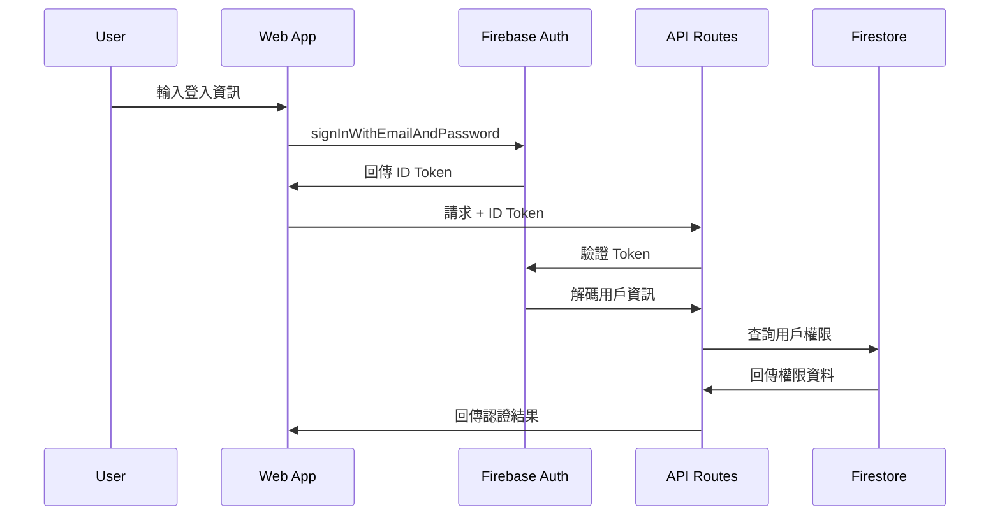

# PRP-122 Firebase Web SDK 整合與認證系統技術規格

## 專案概覽

**專案名稱**: DonnaAI Web 平台 Firebase 整合  
**版本**: 1.0.0  
**建立日期**: 2025-01-18  
**負責團隊**: Web 開發團隊  
**相關文件**: [INITIAL.md](/Users/skyler/coding/DonnaAI-1.0/INITIAL.md), [ARCHITECTURE.md](/Users/skyler/coding/DonnaAI-1.0/ARCHITECTURE.md)  

## 目標與範圍

### 主要目標
1. **建立完整的 Firebase Web SDK v9+ 整合架構**
2. **實現與 Mobile 版本的資料共享與同步**
3. **建立可擴展的認證與權限管理系統**
4. **確保 Web 平台的高效能與安全性**

### 功能範圍
- Firebase Web SDK v9+ 模組化整合
- 統一認證系統（支援 Email/Password、Google 登入）
- Firestore 實時資料同步
- Firebase Storage 檔案管理
- Cloud Functions 整合
- 開發/生產環境配置管理

## 系統架構設計

### 整體架構圖
```
┌─────────────────────────────────────────────────────────────────┐
│                    DonnaAI Web Platform                         │
├─────────────────────┬───────────────────┬─────────────────────┤
│   Client-Side (Web) │    Server-Side    │   Firebase Services │
│                     │   (API Routes)    │                     │
├─────────────────────┼───────────────────┼─────────────────────┤
│ • Firebase Web SDK  │ • Firebase Admin  │ • Authentication    │
│ • React Components  │ • Next.js API     │ • Firestore DB      │
│ • Auth Provider     │ • Middleware      │ • Cloud Storage     │
│ • State Management  │ • Permission      │ • Cloud Functions   │
│                     │   Service         │ • Security Rules    │
└─────────────────────┴───────────────────┴─────────────────────┘
```

### 技術棧分析

#### 前端技術棧
```typescript
{
  "framework": "Next.js 15.4.6",
  "react": "19.1.0",
  "typescript": "^5",
  "ui_library": "Radix UI + Tailwind CSS",
  "state_management": "Zustand + TanStack Query",
  "firebase_client": "Firebase Web SDK v12.1.0"
}
```

#### 後端技術棧
```typescript
{
  "runtime": "Node.js (Next.js API Routes)",
  "firebase_admin": "Firebase Admin SDK v13.4.0", 
  "authentication": "Firebase Auth + Custom Middleware",
  "database": "Firestore (NoSQL Document Database)",
  "file_storage": "Firebase Storage"
}
```

## Firebase 整合策略

### 1. SDK 配置架構

#### Client-Side 配置 (`firebase-client.ts`)
```typescript
// 分析現有實作優勢：
✅ 模組化初始化，避免重複實例
✅ 完整的 Firebase 服務整合（Auth, Firestore, Storage, Functions）
✅ 開發環境模擬器自動連接
✅ 環境變數驗證與錯誤處理

// 改進建議：
🔧 增加連線狀態監控
🔧 實作離線支援策略
🔧 加入效能監控整合
```

#### Server-Side 配置 (`firebase-admin.ts`) 
```typescript
// 分析現有實作優勢：
✅ 完整的 Admin SDK 整合
✅ 統一的錯誤處理機制
✅ 豐富的 Firestore 操作類別
✅ 權限驗證輔助函數

// 改進建議：
🔧 加入批次操作最佳化
🔧 實作資料驗證層
🔧 增加審計日誌功能
```

### 2. 認證系統架構

#### 認證流程設計


#### 權限管理模型
```typescript
// 樹狀權限架構
interface UserPermissions {
  role: 'superAdmin' | 'orgAdmin' | 'manager' | 'salesperson';
  organizationId: string;
  teamIds?: string[];
  customPermissions?: {
    customers: ['read', 'write', 'delete'];
    meetings: ['read', 'write', 'delete'];
    analytics: ['read', 'export'];
    settings: ['read', 'write'];
  };
}

// 權限檢查策略
class PermissionService {
  // 基於角色的訪問控制 (RBAC)
  static async canAccessResource(
    userId: string, 
    resource: string, 
    action: string,
    organizationId?: string
  ): Promise<boolean>

  // 階層權限檢查
  static async isManagerOfTeam(
    userId: string, 
    teamId: string
  ): Promise<boolean>
}
```

### 3. 資料庫架構設計

#### Firestore 集合結構
```typescript
// 資料庫集合設計
interface FirestoreCollections {
  users: {
    [userId: string]: UserDoc;
  };
  organizations: {
    [orgId: string]: OrganizationDoc;
  };
  customers: {
    [customerId: string]: CustomerDoc;
  };
  meetings: {
    [meetingId: string]: MeetingDoc;
  };
  // 子集合設計
  'customers/{customerId}/activities': ActivityDoc[];
  'meetings/{meetingId}/participants': ParticipantDoc[];
}

// 優化策略
1. 複合索引設計：organizationId + createdAt
2. 分頁查詢：使用 startAfter 游標分頁
3. 實時監聽：針對性訂閱特定文檔變化
4. 批次操作：使用 WriteBatch 提升寫入效能
```

#### 資料驗證層
```typescript
// 使用 Zod 進行資料驗證
const CustomerSchema = z.object({
  name: z.string().min(1, '客戶名稱不能為空'),
  company: z.string().min(1, '公司名稱不能為空'),
  email: z.string().email('Email 格式不正確').optional(),
  phone: z.string().optional(),
  assignedTo: z.string().uuid('業務員 ID 格式錯誤'),
  teamId: z.string().uuid('團隊 ID 格式錯誤'),
  organizationId: z.string().uuid('組織 ID 格式錯誤'),
  customFields: z.record(z.any()).optional(),
});

// API 路由中的驗證
export async function POST(request: Request) {
  try {
    const data = await request.json();
    const validatedData = CustomerSchema.parse(data);
    
    // 權限驗證
    const user = await verifyToken(request);
    const canCreate = await PermissionService.canAccessResource(
      user.uid, 'customers', 'write', validatedData.organizationId
    );
    
    if (!canCreate) {
      return NextResponse.json({ error: '權限不足' }, { status: 403 });
    }
    
    // 執行建立操作
    const result = await FirestoreService.createDocument(
      'customers', 
      validatedData
    );
    
    return NextResponse.json(result);
  } catch (error) {
    return handleApiError(error);
  }
}
```

## 安全性設計

### 1. Firebase Security Rules
```javascript
// Firestore 安全規則優化
rules_version = '2';
service cloud.firestore {
  match /databases/{database}/documents {
    
    // 組織級別權限控制
    function belongsToOrganization(resource) {
      return request.auth != null && (
        get(/databases/$(database)/documents/users/$(request.auth.uid)).data.role == 'superAdmin' ||
        get(/databases/$(database)/documents/users/$(request.auth.uid)).data.organizationId == resource.data.organizationId
      );
    }
    
    // 客戶資料權限
    match /customers/{customerId} {
      allow read: if belongsToOrganization(resource);
      allow write: if belongsToOrganization(resource) && 
        validateCustomerData(resource.data);
    }
    
    // 會議資料權限  
    match /meetings/{meetingId} {
      allow read: if belongsToOrganization(resource);
      allow write: if belongsToOrganization(resource) && 
        request.auth.uid in resource.data.participantIds;
    }
    
    // 資料驗證函數
    function validateCustomerData(data) {
      return data.keys().hasAll(['name', 'company', 'organizationId']) &&
        data.name is string && data.name.size() > 0 &&
        data.company is string && data.company.size() > 0;
    }
  }
}
```

### 2. API 安全中介層
```typescript
// 統一認證中介層
export async function authMiddleware(
  request: Request,
  requiredPermissions?: {
    resource: string;
    action: string;
    organizationId?: string;
  }
) {
  try {
    const token = extractTokenFromRequest(request);
    const user = await AuthService.verifyIdToken(token);
    
    if (!user.success) {
      return { error: '認證失敗', status: 401 };
    }
    
    // 權限檢查
    if (requiredPermissions) {
      const hasPermission = await PermissionService.canAccessResource(
        user.data!.uid,
        requiredPermissions.resource,
        requiredPermissions.action,
        requiredPermissions.organizationId
      );
      
      if (!hasPermission) {
        return { error: '權限不足', status: 403 };
      }
    }
    
    return { user: user.data, status: 200 };
  } catch (error) {
    console.error('Auth middleware error:', error);
    return { error: '伺服器錯誤', status: 500 };
  }
}

// 使用範例
export async function GET(
  request: Request,
  { params }: { params: { id: string } }
) {
  const authResult = await authMiddleware(request, {
    resource: 'customers',
    action: 'read'
  });
  
  if (authResult.error) {
    return NextResponse.json(
      { error: authResult.error }, 
      { status: authResult.status }
    );
  }
  
  // 繼續處理業務邏輯...
}
```

### 3. 資料加密與隱私
```typescript
// 敏感資料加密策略
class DataEncryption {
  // 客戶端敏感欄位加密
  static encryptSensitiveFields(data: any): any {
    const sensitiveFields = ['phone', 'email', 'notes'];
    const encrypted = { ...data };
    
    sensitiveFields.forEach(field => {
      if (encrypted[field]) {
        encrypted[field] = encrypt(encrypted[field]);
      }
    });
    
    return encrypted;
  }
  
  // 解密
  static decryptSensitiveFields(data: any): any {
    // 實作解密邏輯...
  }
}

// 審計日誌
interface AuditLog {
  userId: string;
  action: string;
  resource: string;
  resourceId: string;
  timestamp: Date;
  metadata?: Record<string, any>;
}

class AuditLogger {
  static async log(log: AuditLog): Promise<void> {
    await FirestoreService.createDocument('audit_logs', log);
  }
}
```

## API 設計與錯誤處理

### 1. 統一 API 響應格式
```typescript
// API 響應介面
interface ApiResponse<T = any> {
  success: boolean;
  data?: T;
  error?: {
    code: string;
    message: string;
    details?: any;
  };
  metadata?: {
    timestamp: string;
    requestId: string;
    pagination?: PaginationInfo;
  };
}

// 統一錯誤處理
export function handleApiError(error: unknown): NextResponse {
  console.error('API Error:', error);
  
  if (error instanceof z.ZodError) {
    return NextResponse.json({
      success: false,
      error: {
        code: 'VALIDATION_ERROR',
        message: '資料驗證失敗',
        details: error.errors
      }
    }, { status: 400 });
  }
  
  if (error instanceof FirebaseError) {
    return NextResponse.json({
      success: false,
      error: {
        code: error.code,
        message: getFirebaseErrorMessage(error.code),
      }
    }, { status: getHttpStatusFromFirebaseError(error.code) });
  }
  
  // 預設錯誤響應
  return NextResponse.json({
    success: false,
    error: {
      code: 'INTERNAL_SERVER_ERROR',
      message: '伺服器內部錯誤'
    }
  }, { status: 500 });
}
```

### 2. 分頁與篩選 API
```typescript
// 統一查詢介面
interface QueryOptions {
  page?: number;
  limit?: number;
  sort?: string;
  order?: 'asc' | 'desc';
  filters?: Record<string, any>;
  search?: string;
}

// 客戶列表 API 實作
export async function GET(request: Request) {
  const authResult = await authMiddleware(request, {
    resource: 'customers',
    action: 'read'
  });
  
  if (authResult.error) {
    return NextResponse.json(
      { success: false, error: authResult.error }, 
      { status: authResult.status }
    );
  }
  
  try {
    const { searchParams } = new URL(request.url);
    const queryOptions: QueryOptions = {
      page: parseInt(searchParams.get('page') || '1'),
      limit: Math.min(parseInt(searchParams.get('limit') || '20'), 100),
      sort: searchParams.get('sort') || 'createdAt',
      order: (searchParams.get('order') as 'asc' | 'desc') || 'desc',
      search: searchParams.get('search') || undefined,
    };
    
    // 建立 Firestore 查詢
    const firestoreQuery: FirestoreQueryOptions = {
      where: [
        {
          field: 'organizationId',
          operator: '==',
          value: authResult.user.organizationId
        }
      ],
      orderBy: [{
        field: queryOptions.sort,
        direction: queryOptions.order
      }],
      limit: queryOptions.limit
    };
    
    // 執行查詢
    const result = await FirestoreService.queryWithPagination(
      'customers',
      queryOptions.limit,
      firestoreQuery
    );
    
    if (!result.success) {
      throw new Error(result.error);
    }
    
    return NextResponse.json({
      success: true,
      data: result.data?.data,
      metadata: {
        timestamp: new Date().toISOString(),
        requestId: generateRequestId(),
        pagination: {
          page: queryOptions.page,
          limit: queryOptions.limit,
          hasMore: result.data?.hasMore || false,
          total: result.data?.total
        }
      }
    });
    
  } catch (error) {
    return handleApiError(error);
  }
}
```

## 效能最佳化策略

### 1. 資料庫查詢最佳化
```typescript
// 查詢最佳化策略
class FirestoreOptimization {
  
  // 1. 複合索引設計
  static getOptimalIndexes() {
    return [
      // 客戶查詢索引
      { 
        collection: 'customers',
        fields: ['organizationId', 'createdAt'],
        order: 'desc'
      },
      // 會議查詢索引  
      {
        collection: 'meetings', 
        fields: ['organizationId', 'scheduledAt'],
        order: 'desc'
      }
    ];
  }
  
  // 2. 批次操作
  static async bulkCreateCustomers(
    customers: CustomerDoc[]
  ): Promise<OperationResult<void>> {
    const batchSize = 500; // Firestore 批次限制
    const batches = chunk(customers, batchSize);
    
    for (const batch of batches) {
      const operations = batch.map(customer => ({
        type: 'create' as const,
        collection: 'customers',
        data: customer
      }));
      
      await FirestoreService.batchWrite(operations);
    }
    
    return { success: true };
  }
  
  // 3. 分頁快取策略
  static async getCachedCustomers(
    organizationId: string,
    page: number,
    limit: number
  ): Promise<PaginatedResult<CustomerDoc>> {
    const cacheKey = `customers:${organizationId}:${page}:${limit}`;
    
    // 檢查快取
    let result = await cache.get(cacheKey);
    
    if (!result) {
      // 從 Firestore 查詢
      const queryResult = await FirestoreService.queryWithPagination(
        'customers',
        limit,
        {
          where: [{
            field: 'organizationId',
            operator: '==', 
            value: organizationId
          }],
          orderBy: [{
            field: 'createdAt',
            direction: 'desc'
          }]
        }
      );
      
      result = queryResult.data;
      
      // 快取 5 分鐘
      await cache.set(cacheKey, result, 300);
    }
    
    return result;
  }
}
```

### 2. 前端效能最佳化
```typescript
// React Query 快取策略
const queryClient = new QueryClient({
  defaultOptions: {
    queries: {
      staleTime: 5 * 60 * 1000, // 5 分鐘
      gcTime: 10 * 60 * 1000, // 10 分鐘
      refetchOnWindowFocus: false,
      retry: (failureCount, error) => {
        // 針對不同錯誤類型的重試策略
        if (error.status === 401 || error.status === 403) {
          return false; // 認證錯誤不重試
        }
        return failureCount < 3;
      }
    }
  }
});

// 資料預載策略
export function useCustomersWithPrefetch() {
  const { data, ...query } = useQuery({
    queryKey: ['customers', { page: 1 }],
    queryFn: () => fetchCustomers({ page: 1 }),
  });
  
  // 預載下一頁
  useEffect(() => {
    if (data?.hasMore) {
      queryClient.prefetchQuery({
        queryKey: ['customers', { page: 2 }],
        queryFn: () => fetchCustomers({ page: 2 }),
      });
    }
  }, [data]);
  
  return { data, ...query };
}
```

### 3. 實時同步最佳化
```typescript
// 選擇性實時監聽
class RealtimeSync {
  private subscriptions = new Map<string, () => void>();
  
  // 訂閱特定組織的客戶變更
  subscribeToCustomers(
    organizationId: string,
    callback: (customers: CustomerDoc[]) => void
  ) {
    const unsubscribe = FirestoreService.subscribeToCollection(
      'customers',
      {
        where: [{
          field: 'organizationId',
          operator: '==',
          value: organizationId
        }],
        limit: 100 // 限制實時監聽的資料量
      },
      callback,
      (error) => {
        console.error('Realtime sync error:', error);
        // 實作錯誤恢復機制
        this.handleRealtimeError(organizationId, error);
      }
    );
    
    this.subscriptions.set(`customers:${organizationId}`, unsubscribe);
    return unsubscribe;
  }
  
  // 清理所有訂閱
  cleanup() {
    this.subscriptions.forEach(unsubscribe => unsubscribe());
    this.subscriptions.clear();
  }
  
  private handleRealtimeError(organizationId: string, error: Error) {
    // 實作指數退讓重新連接策略
    const retryDelay = Math.min(1000 * Math.pow(2, retryCount), 30000);
    
    setTimeout(() => {
      this.subscribeToCustomers(organizationId, lastCallback);
    }, retryDelay);
  }
}
```

## 測試策略

### 1. 單元測試
```typescript
// Firebase 服務測試
describe('FirestoreService', () => {
  beforeEach(async () => {
    // 使用 Firebase 模擬器進行測試
    await initializeTestEnvironment();
  });
  
  afterEach(async () => {
    await cleanupTestData();
  });
  
  it('should create customer with validation', async () => {
    const customerData = {
      name: '測試客戶',
      company: '測試公司',
      email: 'test@example.com',
      organizationId: 'test-org-id',
      assignedTo: 'test-user-id',
      teamId: 'test-team-id'
    };
    
    const result = await FirestoreService.createDocument(
      'customers', 
      customerData
    );
    
    expect(result.success).toBe(true);
    expect(result.data).toMatchObject({
      ...customerData,
      id: expect.any(String),
      createdAt: expect.any(Date),
      updatedAt: expect.any(Date)
    });
  });
  
  it('should handle permission errors', async () => {
    const unauthorizedUser = { uid: 'unauthorized-user' };
    
    const result = await PermissionService.canAccessResource(
      unauthorizedUser.uid,
      'customers',
      'write',
      'different-org-id'
    );
    
    expect(result).toBe(false);
  });
});
```

### 2. 整合測試
```typescript
// API 路由測試
describe('/api/customers', () => {
  it('should require authentication', async () => {
    const response = await fetch('/api/customers');
    expect(response.status).toBe(401);
  });
  
  it('should return paginated results', async () => {
    const token = await getTestAuthToken();
    
    const response = await fetch('/api/customers?page=1&limit=10', {
      headers: {
        'Authorization': `Bearer ${token}`
      }
    });
    
    expect(response.status).toBe(200);
    
    const data = await response.json();
    expect(data.success).toBe(true);
    expect(data.data).toBeInstanceOf(Array);
    expect(data.metadata.pagination).toMatchObject({
      page: 1,
      limit: 10,
      hasMore: expect.any(Boolean)
    });
  });
});
```

## 部署配置

### 1. 環境配置管理
```typescript
// 環境特定配置
const config = {
  development: {
    firebase: {
      useEmulator: true,
      emulatorPorts: {
        auth: 9099,
        firestore: 8080,
        storage: 9199,
        functions: 5001
      }
    },
    logging: {
      level: 'debug',
      enableConsole: true
    }
  },
  
  production: {
    firebase: {
      useEmulator: false,
      projectId: process.env.FIREBASE_PROJECT_ID
    },
    logging: {
      level: 'error',
      enableSentry: true
    },
    cache: {
      redis: {
        url: process.env.REDIS_URL,
        ttl: 300
      }
    }
  }
};
```

### 2. CI/CD 流程
```yaml
# .github/workflows/web-deploy.yml
name: Web Platform Deploy

on:
  push:
    branches: [main]
    paths: ['web/**']

jobs:
  test:
    runs-on: ubuntu-latest
    steps:
      - uses: actions/checkout@v4
      - uses: actions/setup-node@v4
        with:
          node-version: '18'
          cache: 'npm'
          cache-dependency-path: web/package-lock.json
      
      - name: Install dependencies
        run: cd web && npm ci
      
      - name: Run tests
        run: cd web && npm run test
        env:
          FIREBASE_PROJECT_ID: ${{ secrets.FIREBASE_PROJECT_ID }}
          
      - name: Build
        run: cd web && npm run build
  
  deploy:
    needs: test
    runs-on: ubuntu-latest
    if: github.ref == 'refs/heads/main'
    steps:
      - name: Deploy to Vercel
        uses: amondnet/vercel-action@v25
        with:
          vercel-token: ${{ secrets.VERCEL_TOKEN }}
          working-directory: web
```

## 監控與維護

### 1. 效能監控
```typescript
// Firebase Performance 整合
import { getPerformance } from 'firebase/performance';

const perf = getPerformance(firebaseClientApp);

// 自訂效能追蹤
export function trackApiPerformance(
  apiName: string, 
  operation: () => Promise<any>
) {
  const trace = perf.trace(apiName);
  trace.start();
  
  return operation()
    .then(result => {
      trace.stop();
      return result;
    })
    .catch(error => {
      trace.putAttribute('error', error.message);
      trace.stop();
      throw error;
    });
}
```

### 2. 錯誤監控
```typescript
// Sentry 整合
import * as Sentry from '@sentry/nextjs';

Sentry.init({
  dsn: process.env.SENTRY_DSN,
  environment: process.env.NODE_ENV,
  beforeSend(event) {
    // 過濾敏感資訊
    if (event.user) {
      delete event.user.email;
    }
    return event;
  }
});

// Firebase 錯誤報告
export function reportFirebaseError(
  error: FirebaseError, 
  context: Record<string, any>
) {
  Sentry.withScope(scope => {
    scope.setTag('firebase_error', true);
    scope.setContext('firebase_context', context);
    Sentry.captureException(error);
  });
}
```

## 總結與建議

### 現有實作優勢
1. ✅ **完整的 Firebase SDK 整合**：Client 和 Admin SDK 都已正確配置
2. ✅ **模組化架構設計**：良好的代碼組織和分離關注點
3. ✅ **完善的認證系統**：包含錯誤處理和狀態管理
4. ✅ **型別安全**：全面的 TypeScript 支援
5. ✅ **開發環境支援**：模擬器整合和環境變數管理

### 改進機會
1. 🔧 **效能最佳化**：實作查詢快取和批次操作
2. 🔧 **監控完善**：加入效能和錯誤監控
3. 🔧 **測試覆蓋**：增加單元和整合測試
4. 🔧 **安全強化**：實作資料加密和審計日誌
5. 🔧 **離線支援**：加入 PWA 功能和離線快取

### 下一步行動計劃
1. **第一階段**（1-2 週）：完善監控和測試框架
2. **第二階段**（2-3 週）：實作效能最佳化策略  
3. **第三階段**（1 週）：加強安全性功能
4. **第四階段**（1 週）：部署和監控配置

整體而言，DonnaAI Web 平台的 Firebase 整合已經有很好的基礎，透過系統性的改進和最佳化，可以建立一個高效、安全、可擴展的企業級 Web 應用程式。