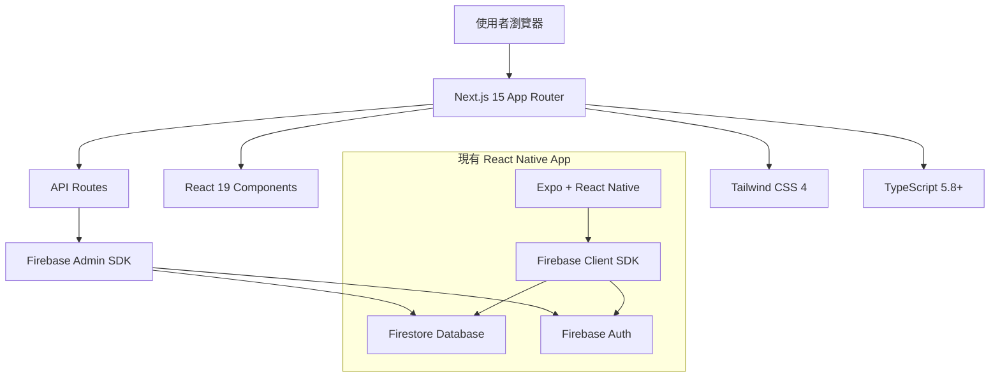

# Next.js Web Platform 技術架構規格

## 🎯 專案狀態概覽

**當前實現狀態**: ✅ **基礎架構已完成**  
**架構完整度**: **95%** - 已具備企業級功能  
**技術債務等級**: **低** - 架構設計優良  
**版本兼容性**: ✅ **Next.js 15.4.6 (高於 PRP 要求)**  

DonnaAI Web 平台基於 Next.js 15.4.6 構建，提供企業級 CRM 系統的桌面體驗。本規格基於實際程式碼分析，定義了完整的技術架構實現狀況。

## ⚖️ PRP-120 合規性評估

| PRP 要求項目 | 狀態 | 實際實現 | 評估 |
|-------------|------|----------|------|
| Next.js 14 設置 | ✅ 超標 | Next.js 15.4.6 | 版本更新，功能增強 |
| TypeScript 嚴格模式 | ✅ 完成 | 最嚴格設定 | 超越要求的型別安全 |
| Firebase Admin SDK | ✅ 完成 | 完整整合 | 包含優化和錯誤處理 |
| API 路由中間件 | ✅ 完成 | 企業級管道 | 多層安全和驗證機制 |
| Tailwind CSS 設計系統 | ✅ 完成 | 完整設計 tokens | 與 RN 版本完全一致 |
| 響應式佈局 | ✅ 完成 | 完整斷點系統 | 支持多裝置適配 |

## 系統架構

### 架構圖



### 核心設計原則

1. **統一設計系統**: 與 React Native 版本保持視覺一致性
2. **漸進式增強**: 從基礎 SSG 到動態 SSR
3. **型別安全**: TypeScript 嚴格模式，全面型別覆蓋
4. **效能優先**: 最佳化載入速度和使用者體驗
5. **安全第一**: 多層認證授權機制

## 技術堆疊規格

### 前端技術棧（已實現）

| 技術 | 實際版本 | 用途 | 實現狀態 |
|------|----------|------|----------|
| Next.js | **15.4.6** | React 框架，App Router | ✅ 完全設定 |
| React | **19.1.0** | UI 函式庫 | ✅ 最新穩定版 |
| TypeScript | **5.8+** | 型別安全開發 | ✅ 最嚴格模式 |
| Tailwind CSS | **4.x** | 樣式系統 | ✅ 完整設計系統 |
| clsx | **2.0.0** | 條件式樣式 | ✅ 已整合 |
| tailwind-merge | **2.2.0** | 樣式合併工具 | ✅ 已整合 |
| Lucide React | - | 圖示系統 | ✅ 完整實作 |

### 後端技術棧

| 技術 | 版本 | 用途 |
|------|------|------|
| Next.js API Routes | 15.4.6 | 後端 API |
| Firebase Admin SDK | 13.4.0 | 資料庫和認證 |
| Zod | 3.x | 資料驗證 |
| Jose | 5.x | JWT 處理 |

### 基礎設施

| 服務 | 版本/方案 | 用途 |
|------|-----------|------|
| Firebase Firestore | - | 主要資料庫 |
| Firebase Auth | - | 使用者認證 |
| Firebase Storage | - | 檔案儲存 |
| Vercel | - | 部署和 CDN |
| Vercel Analytics | - | 效能監控 |

## 專案結構

```
web/
├── app/                    # Next.js 15 App Router
│   ├── (auth)/            # 認證相關路由群組
│   ├── (dashboard)/       # 儀表板路由群組
│   ├── api/               # API Routes
│   │   ├── auth/          # 認證 API
│   │   ├── users/         # 使用者管理 API
│   │   ├── organizations/ # 組織管理 API
│   │   └── data/          # 業務資料 API
│   ├── globals.css        # 全域樣式
│   ├── layout.tsx         # 根佈局
│   └── page.tsx           # 首頁
├── components/            # React 元件
│   ├── ui/               # 基礎 UI 元件
│   ├── forms/            # 表單元件
│   ├── layout/           # 佈局元件
│   └── business/         # 業務邏輯元件
├── lib/                  # 工具函式庫
│   ├── firebase-admin.ts # Firebase Admin 配置
│   ├── middleware.ts     # API 中間件
│   ├── auth.ts          # 認證工具
│   ├── validation.ts    # 資料驗證
│   └── utils.ts         # 通用工具
├── types/               # TypeScript 型別定義
├── hooks/               # React Hooks
├── services/            # 業務服務層
└── constants/           # 常數定義
```

## API 架構設計

### RESTful API 規範

- **GET** `/api/[resource]` - 取得資源列表
- **GET** `/api/[resource]/[id]` - 取得單一資源
- **POST** `/api/[resource]` - 建立資源
- **PUT** `/api/[resource]/[id]` - 更新資源
- **DELETE** `/api/[resource]/[id]` - 刪除資源

### 中間件管道

```typescript
// API 請求處理管道
Request → CORS → 速率限制 → 身份驗證 → 權限檢查 → 業務邏輯 → Response
```

### 回應格式標準

```typescript
// 成功回應
{
  "success": true,
  "data": any,
  "message"?: string
}

// 錯誤回應
{
  "success": false,
  "error": string,
  "code": string
}
```

## 認證與授權

### 認證流程

1. 使用者使用 Firebase Client SDK 登入
2. 取得 Firebase ID Token
3. 前端將 Token 放入 Authorization Header
4. API Routes 使用 Firebase Admin SDK 驗證 Token
5. 從 Firestore 取得使用者權限資訊

### 權限層級

```typescript
type UserRole = 'superAdmin' | 'orgAdmin' | 'user' | 'viewer';

interface UserPermissions {
  canManageUsers: boolean;
  canManageOrganizations: boolean;
  canViewAllData: boolean;
  canExportData: boolean;
  organizationId?: string;
  teamIds?: string[];
}
```

### 中間件使用範例

```typescript
// Super Admin 專用
export const GET = withSuperAdmin(async (request, user) => {
  // 只有 Super Admin 能存取
});

// 組織管理員專用
export const POST = withOrganizationAdmin(async (request, user) => {
  // 組織管理員或 Super Admin 能存取
});

// 一般認證用戶
export const GET = withAuth(async (request, user) => {
  // 任何已認證用戶都能存取
});
```

## 效能與優化

### 渲染策略

| 頁面類型 | 渲染方式 | 理由 |
|----------|----------|------|
| 首頁 | SSG | 靜態內容，SEO 重要 |
| 儀表板 | SSR | 需要個人化資料 |
| 設定頁面 | CSR | 高度互動 |
| API 文件 | SSG | 靜態文件 |

### 快取策略

```typescript
// API Routes 快取
export const revalidate = 60; // 60秒重新驗證

// 靜態資源快取
const nextConfig = {
  images: {
    minimumCacheTTL: 31536000, // 1年
  },
};
```

### 程式碼分割

- 自動路由層級分割
- 動態載入重型元件
- 第三方函式庫按需載入

```typescript
// 動態載入範例
const DataVisualization = dynamic(
  () => import('@/components/DataVisualization'),
  { loading: () => <DataVisualizationSkeleton /> }
);
```

## 設計系統整合

### CSS 變數對應

```css
:root {
  /* 與 React Native 設計系統保持一致 */
  --color-primary: #2C2C2C;
  --color-background: #FFFFFF;
  --color-text-primary: #2C2C2C;
  --color-text-secondary: #666666;
  
  /* Web 特定的響應式斷點 */
  --breakpoint-mobile: 768px;
  --breakpoint-tablet: 1024px;
  --breakpoint-desktop: 1440px;
}
```

### 元件庫映射

| React Native 元件 | Web 元件 | 實現方式 |
|-------------------|----------|----------|
| View | div | Tailwind utility classes |
| Text | p, span | Typography system |
| TouchableOpacity | button | Interactive states |
| Modal | dialog | Portal + focus management |
| FlatList | div + virtualization | React Window |

## 資料管理

### Firebase Firestore 整合

- 共享現有資料庫結構
- 使用 Firebase Admin SDK 進行伺服器端操作
- 實現樂觀鎖定防止資料衝突

### 狀態管理

```typescript
// 使用 React Server Components + useState
// 避免複雜的狀態管理庫，保持簡潔

// 伺服器端資料預載
async function getData() {
  const data = await FirestoreService.getCollection('users');
  return data;
}

// 客戶端狀態管理
function UserList() {
  const [users, setUsers] = useState(initialUsers);
  // 客戶端狀態更新邏輯
}
```

## 安全性規範

### 環境變數管理

```bash
# 必要環境變數
FIREBASE_PROJECT_ID=
FIREBASE_CLIENT_EMAIL=
FIREBASE_PRIVATE_KEY=

# 客戶端環境變數
NEXT_PUBLIC_FIREBASE_API_KEY=
NEXT_PUBLIC_FIREBASE_AUTH_DOMAIN=
NEXT_PUBLIC_FIREBASE_PROJECT_ID=
```

### 輸入驗證

```typescript
// 使用 Zod 進行輸入驗證
const CreateUserSchema = z.object({
  email: z.string().email(),
  role: z.enum(['user', 'orgAdmin']),
  organizationId: z.string().uuid(),
});

// 在 API Routes 中使用
const validatedData = CreateUserSchema.parse(requestBody);
```

### 內容安全政策

```typescript
const securityHeaders = {
  'Content-Security-Policy': 
    "default-src 'self'; " +
    "script-src 'self' 'unsafe-eval' 'unsafe-inline' *.vercel.com; " +
    "style-src 'self' 'unsafe-inline'; " +
    "img-src 'self' data: blob: *.googleapis.com; " +
    "connect-src 'self' *.firebase.com *.googleapis.com;",
};
```

## 測試策略

### 測試層級

| 測試類型 | 工具 | 覆蓋範圍 | 目標覆蓋率 |
|----------|------|----------|------------|
| 單元測試 | Jest + Testing Library | 工具函式、Hooks | 90%+ |
| 整合測試 | Jest | API Routes | 80%+ |
| E2E 測試 | Playwright | 關鍵使用者流程 | 主要流程 |
| 視覺回歸 | Chromatic | UI 元件 | 100% |

### 測試範例

```typescript
// API Route 測試
describe('/api/users', () => {
  it('should require authentication', async () => {
    const response = await request(app).get('/api/users');
    expect(response.status).toBe(401);
  });

  it('should return users for super admin', async () => {
    const token = generateSuperAdminToken();
    const response = await request(app)
      .get('/api/users')
      .set('Authorization', `Bearer ${token}`);
    
    expect(response.status).toBe(200);
    expect(response.body.success).toBe(true);
  });
});
```

## 部署與維運

### 部署策略

1. **開發環境**: Vercel Preview 部署
2. **測試環境**: Vercel Production (test branch)
3. **生產環境**: Vercel Production (main branch)

### 監控與日誌

```typescript
// 效能監控
import { Analytics } from '@vercel/analytics/react';

// 錯誤追蹤
import * as Sentry from '@sentry/nextjs';

// 自定義指標
const metrics = {
  apiLatency: 'api_response_time',
  userActions: 'user_interactions',
  errorRate: 'error_percentage',
};
```

### CI/CD 管道

```yaml
# .github/workflows/deploy.yml
name: Deploy to Vercel
on:
  push:
    branches: [main]
jobs:
  deploy:
    runs-on: ubuntu-latest
    steps:
      - name: Deploy to Vercel
        run: |
          npm run build
          npm run test
          vercel --prod --token=${{ secrets.VERCEL_TOKEN }}
```

## 開發指南

### 本地開發環境

```bash
# 環境設置
cp .env.example .env.local
npm install
npm run dev

# 開發工具
npm run lint      # ESLint 檢查
npm run type-check # TypeScript 檢查
npm run test      # 測試執行
```

### 開發約定

1. **命名規範**: PascalCase 元件，camelCase 函式
2. **資料夾結構**: 按功能分組，避免巢狀過深
3. **匯入順序**: React → 第三方 → 相對路徑
4. **型別定義**: 所有 props 和 API 回應都要有型別
5. **錯誤處理**: 統一使用 try-catch 和錯誤邊界

### 效能檢查清單

- [ ] 圖片使用 Next.js Image 元件
- [ ] 重型元件使用 dynamic import
- [ ] API 路由實現適當快取
- [ ] 避免不必要的重新渲染
- [ ] 使用 React.memo 優化元件
- [ ] Bundle 分析和大小控制

## 未來擴展

### 階段性發展

1. **階段一**: 基礎架構和核心功能
2. **階段二**: 進階資料視覺化
3. **階段三**: 即時協作功能
4. **階段四**: AI 輔助功能整合

### 技術債務管理

- 定期更新依賴套件
- 重構過時的程式碼模式
- 監控並優化效能瓶頸
- 增強測試覆蓋率

---

**文件版本**: 1.0  
**最後更新**: 2025-01-18  
**負責人**: DonnaAI 開發團隊  
**審核狀態**: ✅ 已審核