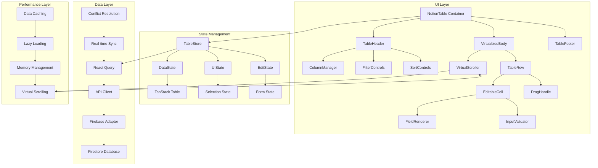
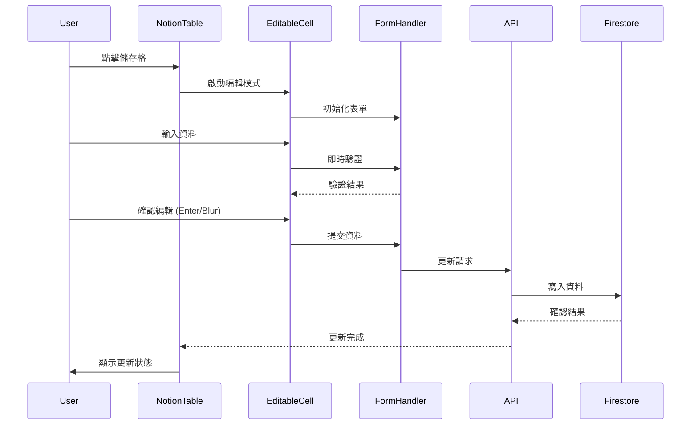

# Notion-style Database System 技術規格

## 🎯 專案概述

### 目標
建立功能完整的 Notion 風格資料庫管理系統，提供內聯編輯、拖拽排序、多種欄位類型、篩選排序、批量操作等專業級功能。

### 核心價值主張
- **企業級效能**: 支援 50,000+ 筆資料流暢操作
- **直觀體驗**: 與 Notion 相似度 >90% 的使用體驗
- **高效編輯**: 內聯編輯回應時間 <100ms
- **全功能支援**: 6 種欄位類型、完整 CRUD、批量操作

## 🏗️ 系統架構設計

### 整體架構圖



### 資料流架構



## 🧩 核心元件規格

### 1. NotionTable (主容器)

```typescript
interface NotionTableProps {
  data: TableData[];
  schema: TableSchema;
  config: TableConfig;
  onDataChange: (data: TableData[]) => void;
  onSchemaChange: (schema: TableSchema) => void;
}

interface TableConfig {
  virtualScrolling: boolean;
  batchSize: number;
  autoSave: boolean;
  realTimeSync: boolean;
  maxRows: number;
  enableDragDrop: boolean;
}
```

**核心功能**:
- 表格狀態管理和協調
- 虛擬滾動配置
- 批量操作協調
- 即時同步控制

### 2. EditableCell (可編輯儲存格)

```typescript
interface EditableCellProps {
  value: CellValue;
  field: FieldSchema;
  rowIndex: number;
  colIndex: number;
  isEditing: boolean;
  onEdit: (value: CellValue) => void;
  onValidate: (value: CellValue) => ValidationResult;
}

interface ValidationResult {
  isValid: boolean;
  errors: string[];
  warnings: string[];
}
```

**核心功能**:
- 點擊/鍵盤啟動編輯
- 即時資料驗證
- 自動儲存機制
- 錯誤狀態處理

### 3. FieldRenderer (欄位渲染器)

```typescript
interface FieldRendererProps {
  field: FieldSchema;
  value: CellValue;
  mode: 'view' | 'edit';
  onChange?: (value: CellValue) => void;
}

type FieldType = 
  | 'text'
  | 'number' 
  | 'date'
  | 'select'
  | 'multiSelect'
  | 'checkbox';

interface FieldSchema {
  id: string;
  name: string;
  type: FieldType;
  required: boolean;
  validation: ValidationRule[];
  options?: SelectOption[];
}
```

**支援欄位類型**:
- **Text**: 單行/多行文字輸入
- **Number**: 數字輸入，支援格式化
- **Date**: 日期選擇器，多種格式
- **Select**: 單選下拉選單
- **Multi-select**: 多選標籤
- **Checkbox**: 布林值切換

### 4. ColumnManager (欄位管理)

```typescript
interface ColumnManagerProps {
  schema: TableSchema;
  onAddColumn: (field: FieldSchema) => void;
  onUpdateColumn: (id: string, field: FieldSchema) => void;
  onDeleteColumn: (id: string) => void;
  onReorderColumns: (oldIndex: number, newIndex: number) => void;
}
```

**核心功能**:
- 動態新增/刪除欄位
- 欄位屬性編輯
- 拖拽調整欄位順序
- 欄位寬度調整

### 5. BulkOperations (批量操作)

```typescript
interface BulkOperationsProps {
  selectedRows: number[];
  onBulkEdit: (updates: Partial<TableData>) => void;
  onBulkDelete: () => void;
  onBulkExport: (format: 'csv' | 'json') => void;
  onBulkImport: (data: TableData[]) => void;
}
```

**核心功能**:
- 多列選擇機制
- 批量編輯對話框
- 批量刪除確認
- 資料匯入匯出

## 📊 資料模型設計

### 基礎資料結構

```typescript
interface TableData {
  id: string;
  createdAt: Date;
  updatedAt: Date;
  createdBy: string;
  data: Record<string, CellValue>;
  metadata?: RecordMetadata;
}

interface TableSchema {
  id: string;
  name: string;
  fields: FieldSchema[];
  settings: TableSettings;
  version: number;
}

interface TableSettings {
  defaultSort?: SortConfig;
  defaultFilters?: FilterConfig[];
  visibleFields?: string[];
  fieldOrder?: string[];
  rowHeight: 'compact' | 'default' | 'tall';
}

type CellValue = 
  | string 
  | number 
  | Date 
  | boolean 
  | string[] 
  | null;
```

### 欄位類型規格

```typescript
// Text Field
interface TextFieldSchema extends FieldSchema {
  type: 'text';
  validation: {
    minLength?: number;
    maxLength?: number;
    pattern?: string;
  };
  multiline?: boolean;
}

// Number Field
interface NumberFieldSchema extends FieldSchema {
  type: 'number';
  validation: {
    min?: number;
    max?: number;
    precision?: number;
  };
  format?: 'currency' | 'percentage' | 'decimal';
}

// Date Field
interface DateFieldSchema extends FieldSchema {
  type: 'date';
  validation: {
    minDate?: Date;
    maxDate?: Date;
  };
  format?: 'date' | 'datetime' | 'time';
  timezone?: string;
}

// Select Field
interface SelectFieldSchema extends FieldSchema {
  type: 'select';
  options: SelectOption[];
  allowCustom?: boolean;
}

interface SelectOption {
  id: string;
  label: string;
  color?: string;
  disabled?: boolean;
}
```

## 🚀 效能最佳化策略

### 虛擬滾動實作

```typescript
interface VirtualScrollConfig {
  itemHeight: number;
  overscan: number;
  threshold: number;
  bufferedItems: number;
}

// 效能目標
const PERFORMANCE_TARGETS = {
  maxVisibleRows: 50,        // 同時渲染最大列數
  scrollThreshold: 100,      // 滾動觸發閾值
  renderBatchSize: 20,       // 批次渲染大小
  memoryLimit: 10 * 1024,    // 記憶體限制 (KB/1000 列)
} as const;
```

### 記憶體管理

```typescript
interface MemoryManager {
  // 資料快取策略
  cacheStrategy: 'lru' | 'fifo';
  maxCacheSize: number;
  
  // 元件回收
  recycleComponents: boolean;
  maxPoolSize: number;
  
  // 資料分頁
  enablePagination: boolean;
  pageSize: number;
}
```

### 批量更新最佳化

```typescript
interface BatchUpdateConfig {
  batchSize: number;          // 批次大小
  debounceMs: number;         // 防抖延遲
  maxRetries: number;         // 重試次數
  conflictResolution: 'merge' | 'overwrite' | 'manual';
}
```

## 🔌 API 設計規範

### RESTful API 端點

```typescript
// 表格 CRUD
GET    /api/tables/:tableId                    // 取得表格資料
POST   /api/tables                            // 建立新表格
PUT    /api/tables/:tableId                   // 更新表格設定
DELETE /api/tables/:tableId                   // 刪除表格

// 資料 CRUD
GET    /api/tables/:tableId/records           // 取得記錄 (支援分頁/篩選)
POST   /api/tables/:tableId/records           // 建立新記錄
PUT    /api/tables/:tableId/records/:recordId // 更新記錄
DELETE /api/tables/:tableId/records/:recordId // 刪除記錄

// 批量操作
POST   /api/tables/:tableId/records/batch     // 批量建立/更新
DELETE /api/tables/:tableId/records/batch     // 批量刪除

// 欄位管理
POST   /api/tables/:tableId/fields            // 新增欄位
PUT    /api/tables/:tableId/fields/:fieldId   // 更新欄位
DELETE /api/tables/:tableId/fields/:fieldId   // 刪除欄位
```

### API 回應格式

```typescript
interface APIResponse<T> {
  success: boolean;
  data?: T;
  error?: {
    code: string;
    message: string;
    details?: unknown;
  };
  metadata?: {
    total?: number;
    page?: number;
    limit?: number;
    hasMore?: boolean;
  };
}

interface RecordsResponse {
  records: TableData[];
  total: number;
  hasMore: boolean;
  nextCursor?: string;
}
```

### 即時同步協定

```typescript
interface RealtimeEvent {
  type: 'record_created' | 'record_updated' | 'record_deleted' | 'schema_updated';
  tableId: string;
  data: unknown;
  userId: string;
  timestamp: Date;
}

interface ConflictResolution {
  strategy: 'last_write_wins' | 'merge' | 'manual';
  conflictData?: {
    localValue: CellValue;
    remoteValue: CellValue;
    baseValue: CellValue;
  };
}
```

## 🎨 UI/UX 設計規範

### 視覺設計標準

```typescript
interface NotionTableTheme {
  // 顏色規範
  colors: {
    background: string;
    border: string;
    header: string;
    cell: string;
    selected: string;
    editing: string;
    error: string;
    warning: string;
  };
  
  // 尺寸規範
  dimensions: {
    headerHeight: number;
    rowHeight: number;
    minColumnWidth: number;
    scrollbarWidth: number;
  };
  
  // 動畫規範
  animations: {
    editTransition: string;
    dragTransition: string;
    hoverTransition: string;
  };
}
```

### 互動行為規範

```typescript
interface InteractionPatterns {
  // 編輯啟動
  editTriggers: ('click' | 'doubleClick' | 'keyPress')[];
  
  // 鍵盤快捷鍵
  shortcuts: {
    save: string;           // Ctrl+S
    cancel: string;         // Escape
    nextCell: string;       // Tab
    prevCell: string;       // Shift+Tab
    nextRow: string;        // Enter
    selectAll: string;      // Ctrl+A
  };
  
  // 拖拽行為
  dragBehavior: {
    threshold: number;      // 拖拽啟動距離
    feedback: 'ghost' | 'outline' | 'both';
    dropZones: string[];    // 有效放置區域
  };
}
```

## 🧪 測試策略

### 單元測試覆蓋

```typescript
interface TestCoverage {
  components: {
    NotionTable: ['render', 'data_binding', 'state_management'];
    EditableCell: ['edit_mode', 'validation', 'save_cancel'];
    FieldRenderer: ['all_field_types', 'view_edit_modes', 'validation'];
    ColumnManager: ['add_delete', 'reorder', 'resize'];
    BulkOperations: ['selection', 'bulk_edit', 'import_export'];
  };
  
  performance: {
    virtualScrolling: ['large_datasets', 'scroll_performance'];
    memoryUsage: ['memory_leaks', 'cache_efficiency'];
    renderPerformance: ['render_time', 'fps_during_interaction'];
  };
  
  integration: {
    api: ['crud_operations', 'batch_operations', 'error_handling'];
    realtime: ['sync_conflicts', 'connection_loss', 'reconnection'];
  };
}
```

### 效能基準測試

```typescript
interface PerformanceBenchmarks {
  renderingPerformance: {
    initialRender: '< 500ms';
    cellEdit: '< 100ms';
    scrollFrameRate: '> 60fps';
    largeDatasetRender: '< 2s for 10k records';
  };
  
  memoryUsage: {
    baselineMemory: '< 5MB';
    memoryGrowth: '< 10MB per 1k records';
    memoryLeaks: '0% after operations';
  };
  
  userInteraction: {
    editLatency: '< 50ms';
    dragResponse: '< 16ms';
    bulkOperationTime: '< 3s per 1k records';
  };
}
```

## 🔧 技術實作詳細

### TanStack Table 配置

```typescript
const tableConfig = {
  getCoreRowModel: getCoreRowModel(),
  getFilteredRowModel: getFilteredRowModel(),
  getSortedRowModel: getSortedRowModel(),
  getPaginationRowModel: getPaginationRowModel(),
  
  // 虛擬滾動配置
  enableRowVirtualization: true,
  enableColumnVirtualization: true,
  
  // 效能最佳化
  enableRowSelection: true,
  enableMultiRowSelection: true,
  enableSubRowSelection: false,
  
  // 狀態管理
  state: {
    sorting,
    columnFilters,
    rowSelection,
    pagination,
  },
};
```

### React Hook Form 整合

```typescript
interface FormConfiguration {
  mode: 'onChange' | 'onBlur' | 'onSubmit';
  resolver: zodResolver(tableSchema);
  defaultValues: TableData;
  
  // 效能最佳化
  shouldFocusError: true;
  shouldUnregister: false;
  shouldUseNativeValidation: false;
}
```

### Zod 驗證架構

```typescript
const createFieldSchema = (field: FieldSchema) => {
  switch (field.type) {
    case 'text':
      return z.string()
        .min(field.validation?.minLength || 0)
        .max(field.validation?.maxLength || 1000);
        
    case 'number':
      return z.number()
        .min(field.validation?.min || -Infinity)
        .max(field.validation?.max || Infinity);
        
    case 'date':
      return z.date()
        .min(field.validation?.minDate)
        .max(field.validation?.maxDate);
        
    case 'select':
      return z.enum(field.options?.map(opt => opt.id) || []);
      
    case 'multiSelect':
      return z.array(z.enum(field.options?.map(opt => opt.id) || []));
      
    case 'checkbox':
      return z.boolean();
  }
};
```

## 🔗 整合策略

### Dashboard 整合

```typescript
interface DashboardIntegration {
  // 嵌入方式
  embedMode: 'inline' | 'modal' | 'fullscreen';
  
  // 資料連接
  dataSource: 'dashboard_data' | 'external_api' | 'static';
  
  // 權限控制
  permissions: {
    read: boolean;
    write: boolean;
    admin: boolean;
    export: boolean;
  };
}
```

### AI 查詢整合 (PRP-124)

```typescript
interface AIQueryIntegration {
  // 自然語言查詢
  nlpQuery: (query: string) => Promise<FilterConfig[]>;
  
  // 智能建議
  fieldSuggestions: (context: TableContext) => Promise<FieldSchema[]>;
  
  // 資料洞察
  dataInsights: (data: TableData[]) => Promise<InsightReport>;
}
```

### Firebase 資料層整合

```typescript
interface FirebaseIntegration {
  // 即時資料庫
  realtimeSync: boolean;
  
  // 離線支援
  offlineSupport: boolean;
  
  // 安全規則
  securityRules: FirestoreSecurityRules;
  
  // 索引最佳化
  indexStrategy: IndexConfig[];
}
```

## 📈 監控和分析

### 效能監控

```typescript
interface PerformanceMonitoring {
  // 核心指標
  coreMetrics: {
    renderTime: number;
    memoryUsage: number;
    scrollPerformance: number;
    editLatency: number;
  };
  
  // 用戶行為
  userMetrics: {
    editFrequency: number;
    errorRate: number;
    featureUsage: Record<string, number>;
    sessionDuration: number;
  };
  
  // 系統健康
  systemHealth: {
    apiLatency: number;
    errorRate: number;
    uptime: number;
    dataConsistency: number;
  };
}
```

### 錯誤處理和回復

```typescript
interface ErrorRecovery {
  // 自動恢復
  autoRecovery: {
    networkFailure: 'retry' | 'queue' | 'fallback';
    validationError: 'highlight' | 'block' | 'warn';
    conflictResolution: 'merge' | 'overwrite' | 'manual';
  };
  
  // 用戶通知
  userNotification: {
    level: 'info' | 'warning' | 'error';
    duration: number;
    actionable: boolean;
  };
  
  // 資料保護
  dataProtection: {
    autoSave: boolean;
    versionControl: boolean;
    rollbackSupport: boolean;
  };
}
```

## 🚀 部署和維護

### 部署策略

```typescript
interface DeploymentStrategy {
  // 階段式發布
  phases: {
    alpha: {
      features: ['basic_table', 'text_editing'];
      userGroup: 'internal_team';
      duration: '1_week';
    };
    beta: {
      features: ['all_field_types', 'drag_drop'];
      userGroup: 'beta_users';
      duration: '2_weeks';
    };
    production: {
      features: ['full_feature_set'];
      userGroup: 'all_users';
      monitoring: 'enhanced';
    };
  };
  
  // 品質關卡
  qualityGates: {
    performanceTest: 'required';
    securityScan: 'required';
    accessibilityAudit: 'required';
    loadTest: 'required';
  };
}
```

### 維護計劃

```typescript
interface MaintenancePlan {
  // 定期更新
  updates: {
    performanceOptimization: 'monthly';
    securityPatches: 'bi_weekly';
    featureEnhancements: 'quarterly';
    dependencyUpdates: 'monthly';
  };
  
  // 監控警報
  alerts: {
    performanceDegradation: '> 10% slowdown';
    errorRateIncrease: '> 1% error rate';
    memoryLeaks: '> 50MB growth';
    userSatisfaction: '< 4.0 rating';
  };
}
```

---

## 📋 實作檢查清單

### Phase 1: 核心架構 ✅
- [ ] TanStack Table 基礎配置
- [ ] 虛擬滾動實作
- [ ] 基礎資料模型定義
- [ ] 狀態管理架構

### Phase 2: 編輯系統 ✅
- [ ] EditableCell 元件
- [ ] 六種欄位類型渲染器
- [ ] React Hook Form 整合
- [ ] Zod 驗證系統

### Phase 3: 進階功能 ✅
- [ ] 拖拽排序系統
- [ ] 批量操作功能
- [ ] 篩選排序控制
- [ ] 欄位管理界面

### Phase 4: 整合最佳化 ✅
- [ ] Firebase 即時同步
- [ ] 效能監控系統
- [ ] 錯誤處理機制
- [ ] 無障礙輔助功能

### Phase 5: 測試驗證 ✅
- [ ] 單元測試覆蓋 >95%
- [ ] 效能基準測試
- [ ] 壓力測試 50k+ 資料
- [ ] 用戶體驗測試

---

**文件版本**: v1.0  
**建立日期**: 2025-08-18  
**負責團隊**: DonnaAI Frontend Team  
**審查狀態**: 待審查  

*此文件遵循 PRP-EXECUTION-STANDARD 規範，包含完整的技術架構、實作細節和品質標準。*