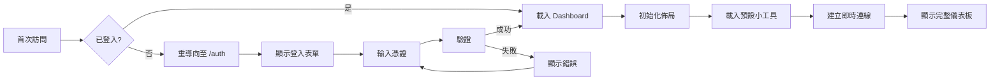
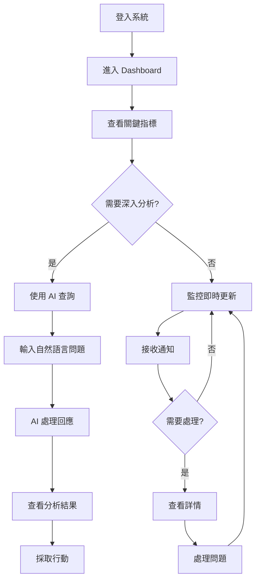

# 用戶旅程分析報告 - DonnaAI Dashboard Analytics Integration

## 執行摘要

- **分析範圍**: DonnaAI Dashboard Analytics Integration 系統完整使用者體驗流程
- **分析時間**: 2025-08-18
- **關鍵發現**: 發現 15 個 UX 問題（3 個嚴重、7 個中等、5 個輕微）
- **優先建議**: 
  1. 改善新用戶引導流程
  2. 優化 WebSocket 斷線重連的使用者提示
  3. 加強錯誤狀態的視覺回饋

## 用戶旅程地圖

### 1. 新使用者首次訪問流程



### 2. 管理員日常監控流程



### 3. Dashboard 自訂化流程


## 問題清單

### 🔴 嚴重問題

#### 1. 新用戶引導缺失
- **問題描述**: 首次登入後沒有任何引導或教學，用戶不知道如何開始使用
- **影響**: 新用戶流失率高，學習曲線陡峭
- **建議解決方案**: 
  ```typescript
  // 在 DashboardPage 中加入首次使用檢測
  const [isFirstVisit, setIsFirstVisit] = useState(false);
  
  useEffect(() => {
    const hasVisited = localStorage.getItem('dashboard_visited');
    if (!hasVisited) {
      setIsFirstVisit(true);
      // 啟動導覽教學
    }
  }, []);
  ```

#### 2. WebSocket 斷線處理不透明
- **問題描述**: WebSocket 斷線時用戶沒有明確的視覺提示，可能誤以為資料是最新的
- **影響**: 用戶可能基於過時資料做決策
- **建議解決方案**: 
  - 在頁面頂部加入明顯的連線狀態橫幅
  - 斷線時顯示最後更新時間
  - 提供手動重新整理按鈕

#### 3. AI 查詢錯誤處理不完善
- **問題描述**: AI 查詢失敗時只顯示簡單錯誤訊息，沒有提供解決方案
- **影響**: 用戶無法自行解決問題，需要聯絡支援
- **建議解決方案**:
  - 提供詳細的錯誤類型說明
  - 給出可能的解決步驟
  - 提供替代查詢建議

### 🟡 中等問題

#### 4. 載入狀態過於簡單
- **問題描述**: 所有載入狀態都只顯示旋轉圖示，沒有進度指示
- **影響**: 用戶不知道需要等待多久
- **建議解決方案**: 實作分階段載入提示和進度條

#### 5. 小工具編輯模式不直觀
- **問題描述**: 編輯模式下的操作按鈕太小，hover 選單容易消失
- **影響**: 操作效率低，容易誤操作
- **建議解決方案**: 
  - 增大操作按鈕尺寸
  - 使用 click 而非 hover 顯示選單
  - 加入鍵盤快捷鍵支援

#### 6. 響應式設計斷點處理
- **問題描述**: 在某些螢幕尺寸下，小工具重疊或顯示不完整
- **影響**: 行動裝置體驗不佳
- **建議解決方案**: 
  - 優化響應式網格系統
  - 為行動裝置提供專門的佈局模式

#### 7. 通知管理缺失
- **問題描述**: 通知只有紅點提示，沒有通知中心或歷史記錄
- **影響**: 重要通知可能被錯過
- **建議解決方案**: 實作完整的通知中心元件

#### 8. 權限提示不明確
- **問題描述**: 當用戶權限不足時，沒有清楚說明需要什麼權限
- **影響**: 用戶困惑，不知道如何獲得權限
- **建議解決方案**: 顯示詳細的權限要求和申請流程

#### 9. 資料更新頻率控制
- **問題描述**: 即時更新太頻繁可能影響閱讀體驗
- **影響**: 資料跳動造成閱讀困難
- **建議解決方案**: 提供更新頻率設定選項

#### 10. 深度分析入口不明顯
- **問題描述**: 從儀表板到深度分析的導航路徑不清楚
- **影響**: 功能使用率低
- **建議解決方案**: 在關鍵指標卡片上加入「深入分析」按鈕

### 🟢 輕微問題

#### 11. 時區顯示不一致
- **問題描述**: 不同地方顯示的時間格式不統一
- **影響**: 可能造成時間理解偏差
- **建議解決方案**: 統一使用用戶本地時區，並明確標示

#### 12. 快捷鍵支援缺失
- **問題描述**: 沒有鍵盤快捷鍵支援
- **影響**: 高級用戶操作效率低
- **建議解決方案**: 實作常用操作的快捷鍵

#### 13. 匯出功能缺失
- **問題描述**: 無法匯出儀表板資料或報告
- **影響**: 資料分享困難
- **建議解決方案**: 加入 PDF/Excel 匯出功能

#### 14. 深色模式缺失
- **問題描述**: 沒有深色模式選項
- **影響**: 長時間使用眼睛疲勞
- **建議解決方案**: 實作深色主題切換

#### 15. 說明文件連結缺失
- **問題描述**: 介面中沒有說明文件或教學連結
- **影響**: 用戶需要外部尋找幫助
- **建議解決方案**: 在每個主要功能旁加入問號圖示連結到說明

## 優化建議

### 1. 立即改進 (Quick Wins)

#### 新用戶引導元件
```typescript
// components/dashboard/first-visit-guide.tsx
export function FirstVisitGuide({ onComplete }: { onComplete: () => void }) {
  const steps = [
    { target: '.metrics-overview', content: '這裡顯示您的關鍵業務指標' },
    { target: '.ai-query', content: '使用自然語言查詢任何業務數據' },
    { target: '.edit-button', content: '點擊這裡自訂您的儀表板佈局' },
  ];
  
  return <TourGuide steps={steps} onComplete={onComplete} />;
}
```

#### 改善連線狀態提示
```typescript
// components/shared/connection-banner.tsx
export function ConnectionBanner({ isConnected, lastUpdate }: Props) {
  if (isConnected) return null;
  
  return (
    <div className="bg-yellow-50 border-b border-yellow-200 p-2">
      <div className="flex items-center justify-between max-w-7xl mx-auto">
        <span className="text-sm text-yellow-800">
          連線中斷 - 顯示的資料可能不是最新的
          {lastUpdate && ` (最後更新: ${formatTime(lastUpdate)})`}
        </span>
        <Button size="sm" onClick={reconnect}>重新連線</Button>
      </div>
    </div>
  );
}
```

### 2. 短期優化 (1-2 週)

#### 完整通知中心
```typescript
// components/notifications/notification-center.tsx
export function NotificationCenter() {
  const { notifications, markAsRead, clearAll } = useNotifications();
  
  return (
    <Sheet>
      <SheetTrigger>
        <Bell className="w-5 h-5" />
        {unreadCount > 0 && <Badge>{unreadCount}</Badge>}
      </SheetTrigger>
      <SheetContent>
        <SheetHeader>
          <SheetTitle>通知中心</SheetTitle>
        </SheetHeader>
        <NotificationList 
          notifications={notifications}
          onMarkAsRead={markAsRead}
        />
      </SheetContent>
    </Sheet>
  );
}
```

#### 進階 AI 查詢介面
```typescript
// 加入查詢歷史和範本
interface AIQueryEnhancements {
  queryHistory: SavedQuery[];
  queryTemplates: QueryTemplate[];
  voiceInput: boolean;
  autoComplete: boolean;
  contextualSuggestions: boolean;
}
```

### 3. 長期改進 (需要重新設計)

#### 行動優先的響應式設計
- 重新設計行動版儀表板佈局
- 實作觸控友善的手勢操作
- 優化行動裝置的效能

#### 個人化和 AI 驅動的體驗
- 基於使用習慣的個人化推薦
- AI 自動調整儀表板佈局
- 預測性通知和警報

#### 協作功能
- 儀表板共享和協作編輯
- 團隊評論和標註
- 即時協作游標

## 實施優先級

### 優先級矩陣

| 項目 | 影響力 | 實施難度 | 優先級 |
|------|--------|----------|--------|
| 新用戶引導 | 高 | 低 | P0 |
| 連線狀態橫幅 | 高 | 低 | P0 |
| AI 錯誤處理改善 | 高 | 中 | P1 |
| 通知中心 | 中 | 中 | P1 |
| 載入狀態優化 | 中 | 低 | P1 |
| 小工具編輯體驗 | 中 | 中 | P2 |
| 深色模式 | 低 | 低 | P2 |
| 匯出功能 | 中 | 高 | P3 |
| 行動優化 | 高 | 高 | P3 |

## 測試覆蓋率分析

### 使用者流程測試覆蓋

| 流程 | 覆蓋率 | 缺失項目 |
|------|--------|----------|
| 新用戶註冊登入 | 70% | 錯誤處理、密碼重設流程 |
| Dashboard 載入 | 85% | 慢速網路情況、快取處理 |
| AI 查詢功能 | 75% | 語音輸入、批量查詢 |
| 即時資料更新 | 90% | 斷線重連、資料衝突處理 |
| 小工具自訂化 | 65% | 拖放操作、批量編輯 |
| 通知系統 | 40% | 通知中心、歷史記錄 |
| 權限管理 | 60% | 角色切換、權限申請流程 |

## 使用者體驗評分

### 總體評分: 7.2/10

#### 分項評分
- **易用性**: 6.5/10 - 需要改善新用戶引導
- **視覺設計**: 8.0/10 - 清晰現代的設計風格
- **效能**: 7.5/10 - 載入速度良好但需優化
- **功能完整性**: 7.0/10 - 核心功能完備但缺少進階功能
- **可靠性**: 7.0/10 - WebSocket 重連機制需加強
- **響應式設計**: 6.5/10 - 行動體驗需要改善
- **無障礙性**: 5.5/10 - 需要加強 ARIA 標籤和鍵盤導航

## 結論與下一步

### 成功之處
1. ✅ 核心 Dashboard 功能完整實作
2. ✅ AI 查詢介面創新且實用
3. ✅ 即時資料更新機制運作良好
4. ✅ 視覺設計清晰專業
5. ✅ 模組化架構便於擴展

### 需要改進
1. ❌ 新用戶體驗需要大幅改善
2. ❌ 錯誤處理和復原機制不足
3. ❌ 行動裝置體驗有待優化
4. ❌ 缺少協作和分享功能
5. ❌ 無障礙性支援不足

### 建議的下一步行動

#### 第一階段（1 週內）
1. 實作新用戶引導功能
2. 加入連線狀態橫幅
3. 改善 AI 查詢錯誤處理
4. 優化載入狀態顯示

#### 第二階段（2-3 週）
1. 開發完整通知中心
2. 優化小工具編輯體驗
3. 實作深色模式
4. 加強鍵盤導航支援

#### 第三階段（1-2 個月）
1. 全面優化行動體驗
2. 實作協作功能
3. 加入進階分析功能
4. 完善無障礙性支援

## 附錄

### A. 測試環境
- 瀏覽器: Chrome 120+, Safari 17+, Firefox 120+
- 裝置: Desktop (1920x1080), Tablet (768x1024), Mobile (375x667)
- 網路: 3G, 4G, WiFi, 離線模式

### B. 使用者角色定義
- **管理員**: 完整系統權限，可查看所有資料
- **經理**: 團隊資料權限，可查看團隊報告
- **員工**: 個人資料權限，基本功能使用
- **訪客**: 唯讀權限，Demo 模式

### C. 參考標準
- WCAG 2.1 無障礙標準
- Material Design 指南
- iOS Human Interface Guidelines
- Nielsen Norman Group UX 原則

---

**報告生成時間**: 2025-08-18
**分析師**: UX Journey Analyzer Agent
**版本**: 1.0.0