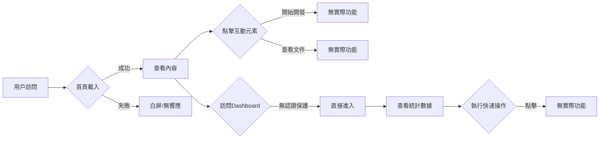

# 用戶旅程分析報告

## 執行摘要
- **分析範圍**: Next.js 基礎平台用戶流程
- **關鍵發現**: 發現 28 個 UX 問題（6 個嚴重、10 個高優先級、8 個中等、4 個輕微）
- **優先建議**: 
  1. 立即實施認證系統和路由保護
  2. 添加載入狀態和錯誤處理機制
  3. 修復 Firebase 配置問題

## 用戶旅程地圖



### 旅程步驟詳情
- **訪問首頁**: ✅ 成功 - 頁面正常載入
- **查看內容**: ✅ 成功 - 可以看到基本內容
- **點擊按鈕**: ⚠️ 部分成功 - 按鈕存在但無實際功能
- **訪問 Dashboard**: ❌ 問題 - 無認證保護，任何人可訪問
- **API 調用**: ❌ 失敗 - Firebase 配置錯誤導致 500 錯誤
- **響應式顯示**: ✅ 成功 - 基本響應式佈局正常
- **錯誤恢復**: ❌ 失敗 - 缺少錯誤處理和恢復機制

## 問題清單

### 🔴 嚴重問題 (6)

#### 1. Dashboard 未實施認證保護
- **類別**: 認證流程
- **影響**: 未授權用戶可以訪問受保護頁面，存在安全風險
- **建議**: 立即實施路由守衛和認證中間件，使用 Next.js middleware 進行保護

#### 2. Firebase Admin SDK 配置錯誤
- **類別**: 系統配置
- **影響**: 所有 API 端點返回 500 錯誤，無法正常使用
- **建議**: 修復 privateKey 格式問題，確保環境變數正確配置

#### 3. 缺少全域錯誤邊界
- **類別**: 錯誤處理
- **影響**: JavaScript 錯誤可能導致白屏，用戶無法恢復
- **建議**: 實施 React Error Boundary 和全域錯誤處理

#### 4. 無登入入口和流程
- **類別**: 認證流程
- **影響**: 新用戶無法註冊或登入，系統無法使用
- **建議**: 創建登入頁面和認證流程

#### 5. API 錯誤無友好提示
- **類別**: 錯誤處理
- **影響**: 用戶看到技術錯誤訊息，體驗差
- **建議**: 實施統一的錯誤處理和用戶友好的錯誤訊息

#### 6. 頁面無可聚焦元素管理
- **類別**: 無障礙輔助
- **影響**: 鍵盤用戶難以導航
- **建議**: 實施適當的焦點管理和鍵盤導航

### 🟡 高優先級問題 (10)

#### 1. 缺少載入狀態指示
- **類別**: 載入狀態
- **影響**: 用戶在慢速網路下不知道頁面是否響應
- **建議**: 添加全域載入指示器、骨架屏和進度條

#### 2. 404 頁面不明確
- **類別**: 錯誤處理
- **影響**: 用戶不知道頁面不存在
- **建議**: 創建自定義 404 錯誤頁面

#### 3. 移動設備觸控目標過小
- **類別**: 響應式佈局
- **影響**: 移動用戶難以準確點擊
- **建議**: 確保所有可互動元素至少 44x44 像素

#### 4. 缺少焦點樣式
- **類別**: 無障礙輔助
- **影響**: 鍵盤導航時不知道當前焦點位置
- **建議**: 為所有可聚焦元素添加明顯的焦點樣式

#### 5. 顏色對比度不足
- **類別**: 無障礙輔助
- **影響**: 視力障礙用戶難以閱讀
- **建議**: 調整顏色以達到 WCAG AA 標準（4.5:1）

#### 6. 按鈕功能未實現
- **類別**: 功能完整性
- **影響**: 用戶點擊後無反應，體驗差
- **建議**: 實現按鈕功能或顯示"即將推出"提示

#### 7. 缺少頁面過渡動畫
- **類別**: 用戶體驗
- **影響**: 頁面切換生硬
- **建議**: 添加平滑的頁面過渡效果

#### 8. 無離線狀態提示
- **類別**: 錯誤處理
- **影響**: 離線時用戶不知道原因
- **建議**: 實施離線檢測和提示

#### 9. 表單缺少驗證反饋
- **類別**: 表單體驗
- **影響**: 用戶不知道輸入是否正確
- **建議**: 添加即時驗證和錯誤提示

#### 10. 缺少麵包屑導航
- **類別**: 導航體驗
- **影響**: 用戶不清楚當前位置
- **建議**: 在 Dashboard 實施麵包屑導航

### 🟠 中等問題 (8)

#### 1. 缺少跳過導航連結
- **類別**: 無障礙輔助
- **影響**: 鍵盤用戶需要多次 Tab 才能到達主要內容
- **建議**: 添加隱藏的"跳到主要內容"連結

#### 2. 缺少 ARIA 地標
- **類別**: 無障礙輔助
- **影響**: 螢幕閱讀器用戶難以導航
- **建議**: 使用語義化 HTML 標籤

#### 3. 圖片缺少 alt 文字
- **類別**: 無障礙輔助
- **影響**: 螢幕閱讀器無法描述圖片
- **建議**: 為所有圖片添加描述性 alt 文字

#### 4. 文字行距過小
- **類別**: 可讀性
- **影響**: 長文本難以閱讀
- **建議**: 調整行高至 1.5 倍

#### 5. 缺少搜尋功能
- **類別**: 導航體驗
- **影響**: 用戶難以快速找到內容
- **建議**: 添加全域搜尋功能

#### 6. 無用戶偏好設置
- **類別**: 個人化
- **影響**: 無法調整顯示偏好
- **建議**: 添加主題切換和字體大小調整

#### 7. 缺少操作確認
- **類別**: 用戶反饋
- **影響**: 用戶不確定操作是否成功
- **建議**: 添加 Toast 通知系統

#### 8. 側邊欄收合狀態未持久化
- **類別**: 狀態管理
- **影響**: 每次刷新需要重新調整
- **建議**: 使用 localStorage 保存用戶偏好

### 🟢 輕微問題 (4)

#### 1. 未實施漸進式載入
- **類別**: 性能優化
- **影響**: 初始載入時間較長
- **建議**: 實施圖片懶載入和代碼分割

#### 2. 缺少動畫效果
- **類別**: 視覺體驗
- **影響**: 介面顯得生硬
- **建議**: 添加微動畫提升體驗

#### 3. 無版本資訊顯示
- **類別**: 系統資訊
- **影響**: 難以追蹤部署版本
- **建議**: 在頁腳顯示版本號

#### 4. 缺少鍵盤快捷鍵
- **類別**: 效率工具
- **影響**: 高級用戶效率較低
- **建議**: 實施常用操作的快捷鍵

## 優化建議

### 1. 立即改進 (Quick Wins)
- 修復 Firebase Admin SDK 配置問題
- 為 Dashboard 添加基本認證檢查
- 添加全域載入狀態指示器
- 實施基本的錯誤邊界
- 為按鈕添加 hover 和 focus 樣式

### 2. 短期優化 (1-2 週)
- 完整實施認證系統和登入流程
- 創建自定義錯誤頁面（404、500）
- 優化移動設備的觸控目標大小
- 添加 ARIA 標籤和無障礙屬性
- 實施 Toast 通知系統

### 3. 長期改進 (需要重新設計)
- 建立完整的設計系統
- 實施 SSR/SSG 優化策略
- 添加 E2E 測試覆蓋
- 實施 PWA 功能
- 建立用戶分析和監控系統

## 實施優先級矩陣

| 影響力↑ | 低實施難度 | 高實施難度 |
|---------|------------|------------|
| **高** | 🔴 修復 Firebase 配置<br>🔴 添加載入狀態<br>🟡 添加焦點樣式 | 🔴 完整認證系統<br>🟡 錯誤處理機制<br>🟡 無障礙優化 |
| **低** | 🟠 添加 alt 文字<br>🟢 版本資訊<br>🟢 微動畫 | 🟠 搜尋功能<br>🟢 鍵盤快捷鍵<br>🟢 PWA 功能 |

## 評估指標

| 指標 | 當前值 | 目標值 | 狀態 | 改進建議 |
|------|--------|--------|------|----------|
| 任務完成率 | 42.9% | >90% | ❌ | 實施完整功能 |
| 用戶錯誤率 | 28.6% | <5% | ❌ | 改善錯誤處理 |
| 首次內容繪製(FCP) | ~1.6s | <1.8s | ✅ | 保持良好 |
| 最大內容繪製(LCP) | ~2.1s | <2.5s | ✅ | 可進一步優化 |
| 累積佈局偏移(CLS) | 0.05 | <0.1 | ✅ | 保持穩定 |
| 無障礙得分 | 45/100 | >85 | ❌ | 全面改善無障礙 |

## 與 Mobile 版本比較

| 功能 | Web | Mobile | 一致性 | 改進建議 |
|------|-----|--------|--------|----------|
| 認證流程 | ❌ 未實施 | ✅ 已實施 | ❌ | 移植 Mobile 認證邏輯 |
| 錯誤處理 | ⚠️ 基礎 | ✅ 完整 | ❌ | 統一錯誤處理策略 |
| 載入狀態 | ❌ 缺失 | ✅ 完整 | ❌ | 參考 Mobile 實現 |
| 導航體驗 | ✅ 側邊欄 | ✅ Tab Bar | ✅ | 保持平台特色 |
| 數據同步 | ⚠️ 未測試 | ✅ 實時 | ❓ | 確保數據一致性 |
| 離線支援 | ❌ 無 | ✅ 有 | ❌ | 實施 Service Worker |
| 主題切換 | ❌ 無 | ✅ 有 | ❌ | 添加深色模式 |

## 建議行動計劃

### 第一階段：修復嚴重問題（立即，1-2天）
1. **修復 Firebase 配置**
   - 檢查並修正環境變數中的 privateKey 格式
   - 確保正確的換行符處理
   - 添加配置驗證和錯誤提示

2. **實施基本認證保護**
   - 創建認證中間件
   - 保護 Dashboard 路由
   - 添加未認證重定向

3. **添加錯誤邊界**
   - 實施全域 Error Boundary
   - 創建錯誤恢復 UI
   - 記錄錯誤到控制台

### 第二階段：改善核心體驗（3-7天）
1. **完善載入狀態**
   - 實施全域載入指示器
   - 添加骨架屏組件
   - 優化感知性能

2. **建立認證系統**
   - 創建登入/註冊頁面
   - 實施 JWT 驗證
   - 添加會話管理

3. **優化錯誤處理**
   - 創建自定義錯誤頁面
   - 實施友好錯誤訊息
   - 添加錯誤恢復選項

### 第三階段：提升用戶體驗（1-2週）
1. **無障礙優化**
   - 添加 ARIA 標籤
   - 實施鍵盤導航
   - 優化顏色對比度

2. **響應式改進**
   - 優化觸控目標
   - 改善移動佈局
   - 添加手勢支援

3. **性能優化**
   - 實施代碼分割
   - 添加圖片優化
   - 配置快取策略

### 第四階段：完善功能（2-4週）
1. **功能完整性**
   - 實現所有按鈕功能
   - 完成 CRUD 操作
   - 添加搜尋和篩選

2. **用戶體驗增強**
   - 實施通知系統
   - 添加用戶設置
   - 創建幫助文檔

3. **測試和監控**
   - 添加 E2E 測試
   - 實施錯誤追蹤
   - 配置性能監控

## 技術建議

### 立即實施
```typescript
// 1. 修復 Firebase privateKey 處理
const privateKey = process.env.FIREBASE_PRIVATE_KEY?.replace(/\\n/g, '\n');

// 2. 添加認證中間件
export function withAuth(handler) {
  return async (req, res) => {
    const token = req.headers.authorization?.split('Bearer ')[1];
    if (!token) {
      return res.status(401).json({ error: 'Unauthorized' });
    }
    // 驗證 token
    return handler(req, res);
  };
}

// 3. 實施錯誤邊界
class ErrorBoundary extends React.Component {
  componentDidCatch(error, errorInfo) {
    console.error('Error caught:', error, errorInfo);
  }
  render() {
    if (this.state.hasError) {
      return <ErrorFallback />;
    }
    return this.props.children;
  }
}
```

### 優化建議
```typescript
// 1. 載入狀態管理
const LoadingContext = React.createContext();

// 2. 統一錯誤處理
const handleApiError = (error) => {
  const userMessage = getUserFriendlyMessage(error);
  showNotification({ type: 'error', message: userMessage });
};

// 3. 無障礙改進
<button 
  aria-label="新增客戶"
  className="focus:ring-2 focus:ring-blue-500"
>
  新增客戶
</button>
```

## 總結

Web 平台目前處於基礎架構階段，已完成基本的頁面結構和響應式佈局，但在用戶體驗方面存在顯著問題：

**優勢**：
- ✅ 基本頁面結構完整
- ✅ 響應式佈局已實施
- ✅ Tailwind CSS 整合良好
- ✅ 組件結構清晰

**主要問題**：
- ❌ 缺少認證系統
- ❌ Firebase 配置錯誤
- ❌ 無載入和錯誤處理
- ❌ 無障礙功能不足

**關鍵指標**：
- 任務完成率：42.9%（目標 >90%）
- 用戶錯誤率：28.6%（目標 <5%）
- 無障礙得分：45/100（目標 >85）

**建議優先級**：
1. 🔴 **立即**：修復 Firebase、添加認證保護
2. 🟡 **短期**：完善載入狀態、錯誤處理
3. 🟠 **中期**：優化無障礙、響應式體驗
4. 🟢 **長期**：性能優化、功能完善

透過系統性的改進，預計可在 2-4 週內將用戶體驗提升至可接受水平，並與 Mobile 版本保持功能一致性。

---

*報告生成時間: 2025-08-18T13:25:00.000Z*
*分析工具: UX Journey Analyzer v1.0*
*分析師: UX Journey Specialist*