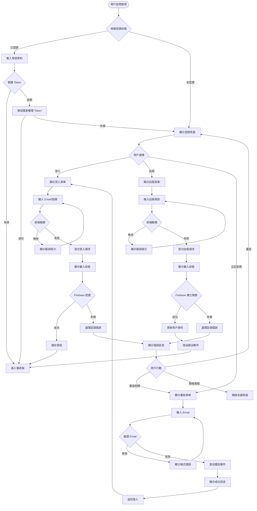
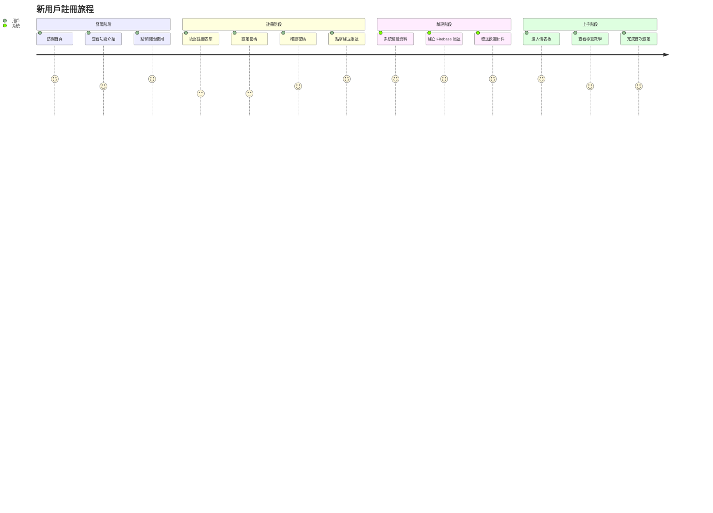
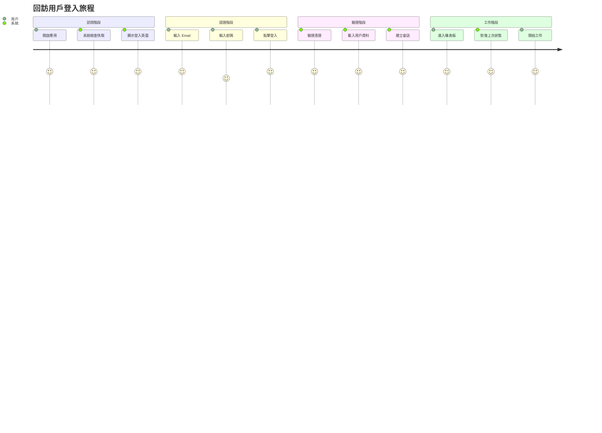
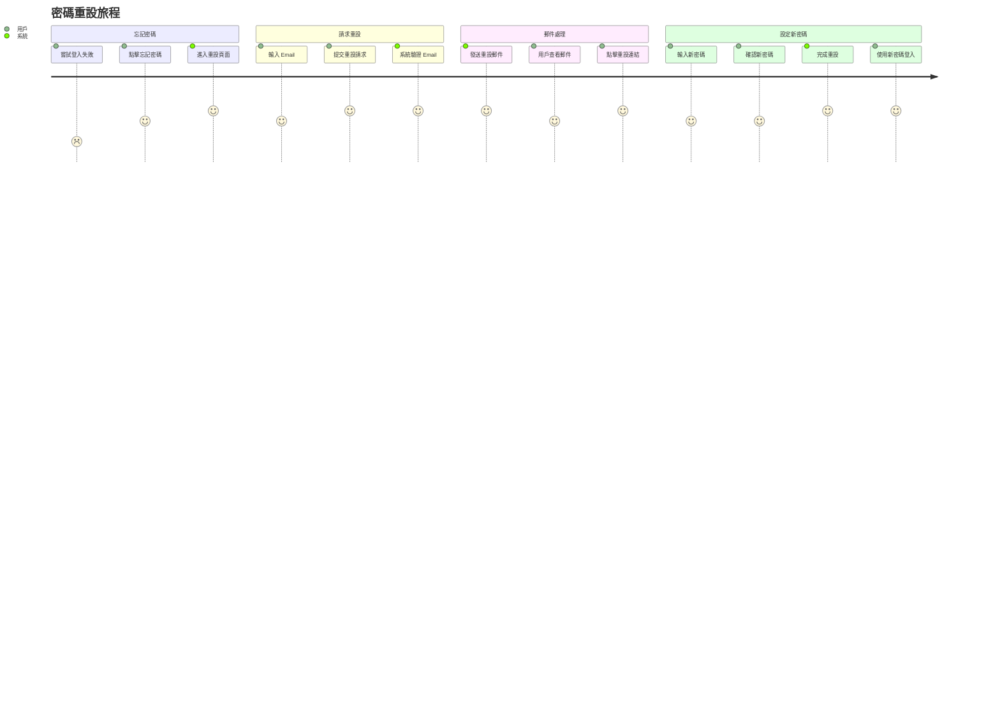
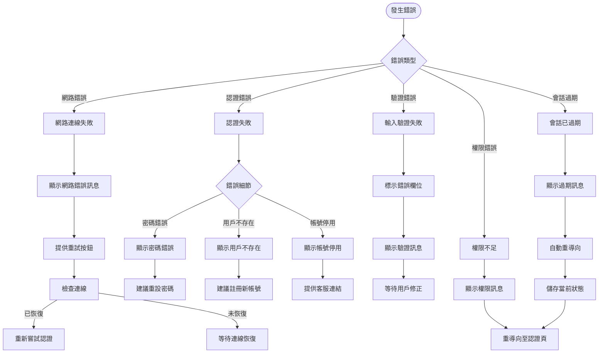

# DonnaAI Web 平台認證系統用戶流程設計

> 文件版本：v1.0.0  
> 最後更新：2025-08-18  
> 負責人：UX Flow Designer  
> 專案編號：PRP-122

## 需求摘要

### 用戶目標與角色
1. **新用戶**：快速註冊並開始使用系統
2. **回訪用戶**：快速登入並恢復工作狀態
3. **忘記密碼用戶**：安全且簡便地重設密碼
4. **企業管理員**：管理團隊成員的訪問權限

### 關鍵使用案例
- 首次註冊並設定個人資料
- 每日登入進入工作儀表板
- 忘記密碼時的快速恢復
- 登出並確保資料安全
- 會話超時的自動處理
- 跨裝置的無縫切換

### 成功標準
- 註冊流程完成率 > 90%
- 登入成功率 > 95%
- 密碼重設成功率 > 85%
- 平均認證時間 < 30 秒
- 錯誤恢復時間 < 2 分鐘

## 流程設計

### 主要認證流程圖



### 詳細用戶旅程

#### 1. 新用戶註冊旅程



#### 2. 回訪用戶登入旅程



#### 3. 密碼重設旅程



### 錯誤處理流程



## 邏輯檢查結果

### 頁面連接分析

| 頁面 | 進入點 | 退出點 | 返回路徑 |
|------|--------|--------|----------|
| **認證頁面** | 應用首頁、會話過期、權限不足 | 儀表板、支援頁面 | 瀏覽器返回 |
| **登入表單** | 認證頁面、註冊成功、密碼重設成功 | 儀表板、註冊表單、重設表單 | 返回認證頁面 |
| **註冊表單** | 認證頁面、登入表單 | 儀表板、登入表單 | 返回認證頁面 |
| **重設表單** | 登入表單、錯誤提示 | 成功頁面、登入表單 | 返回登入 |
| **儀表板** | 認證成功 | 登出、其他功能頁面 | 不可返回認證頁 |
| **未授權頁** | 權限檢查失敗 | 認證頁面、上一頁 | 瀏覽器返回 |

### 導航一致性檢查

✅ **一致的元素**：
- 所有表單都有明確的提交按鈕和載入狀態
- 所有錯誤都有清晰的錯誤訊息和恢復建議
- 所有頁面都有返回或取消選項
- 統一的視覺反饋機制

⚠️ **需要注意的點**：
- 缺少未授權頁面的實作
- 缺少兩步驟驗證流程
- 缺少記住登入狀態功能
- 缺少社交登入選項

### 資訊架構檢查

```
認證系統架構
├── 公開區域
│   ├── 認證頁面 (/auth)
│   │   ├── 登入表單 (?type=signin)
│   │   ├── 註冊表單 (?type=signup)
│   │   └── 重設表單 (?type=reset)
│   └── 支援頁面 (/help)
│
├── 受保護區域
│   ├── 儀表板 (/dashboard)
│   ├── 客戶管理 (/customers)
│   ├── 分析頁面 (/analytics)
│   └── 報告中心 (/reports)
│
└── 系統頁面
    ├── 載入頁面 (內嵌狀態)
    ├── 錯誤頁面 (內嵌訊息)
    └── 未授權頁 (/unauthorized) [需要實作]
```

## 發現的問題

### 🔴 關鍵問題（必須修復）

1. **缺少未授權頁面**
   - **問題**：ProtectedRoute 重導向到 `/unauthorized`，但該頁面不存在
   - **影響**：權限不足的用戶會看到 404 錯誤
   - **建議**：立即創建未授權頁面，提供明確的指引

2. **缺少會話持久化**
   - **問題**：沒有實作「記住我」功能
   - **影響**：用戶每次都需要重新登入
   - **建議**：實作 localStorage 或 cookie 儲存

3. **密碼重設流程不完整**
   - **問題**：發送郵件後沒有處理重設連結的頁面
   - **影響**：用戶無法完成密碼重設
   - **建議**：實作密碼重設確認頁面

### 🟡 重要問題（應該修復）

4. **缺少載入骨架屏**
   - **問題**：載入時只顯示簡單的旋轉圖示
   - **影響**：用戶體驗不夠流暢
   - **建議**：實作骨架屏提升感知性能

5. **錯誤訊息自動消失時間固定**
   - **問題**：所有錯誤 5 秒後消失
   - **影響**：複雜錯誤用戶可能來不及閱讀
   - **建議**：根據錯誤類型調整顯示時間

6. **缺少密碼強度指示器**
   - **問題**：註冊時沒有即時密碼強度反饋
   - **影響**：用戶不知道密碼是否足夠安全
   - **建議**：加入視覺化密碼強度指示

### 🟢 次要改進（建議優化）

7. **缺少社交登入**
   - **問題**：只支援 Email 登入
   - **影響**：降低註冊轉換率
   - **建議**：整合 Google、Microsoft 登入

8. **沒有兩步驟驗證**
   - **問題**：缺少額外的安全層
   - **影響**：企業用戶可能有安全顧慮
   - **建議**：實作 2FA 選項

9. **缺少登入歷史記錄**
   - **問題**：用戶無法查看登入活動
   - **影響**：安全性透明度不足
   - **建議**：加入登入歷史頁面

## 優化建議

### 快速優化（容易實作）

1. **創建未授權頁面**
   ```typescript
   // /app/unauthorized/page.tsx
   - 顯示清楚的權限不足訊息
   - 提供返回上一頁按鈕
   - 提供聯絡管理員選項
   - 顯示當前用戶角色
   ```

2. **改進載入狀態**
   ```typescript
   - 實作認證頁面骨架屏
   - 加入進度條顯示載入進度
   - 優化載入動畫過渡
   ```

3. **優化錯誤處理**
   ```typescript
   - 根據錯誤嚴重程度調整顯示時間
   - 加入錯誤重試機制
   - 提供更詳細的錯誤解決建議
   ```

4. **加入輸入輔助功能**
   ```typescript
   - Email 自動完成建議
   - 密碼顯示/隱藏切換
   - Enter 鍵提交表單
   - Tab 鍵導航優化
   ```

### 策略改進（中等努力）

5. **實作記住登入功能**
   ```typescript
   - 加入「記住我」勾選框
   - 使用 secure cookie 儲存 token
   - 實作自動登入邏輯
   - 加入裝置管理功能
   ```

6. **完善密碼重設流程**
   ```typescript
   - 創建密碼重設確認頁面
   - 加入 token 驗證邏輯
   - 實作密碼強度要求
   - 加入成功重設後的自動登入
   ```

7. **加入密碼強度指示器**
   ```typescript
   - 即時計算密碼強度
   - 視覺化強度等級（弱/中/強）
   - 提供密碼建議
   - 檢查常見弱密碼
   ```

8. **優化行動裝置體驗**
   ```typescript
   - 使用適當的輸入類型
   - 優化觸控目標大小
   - 實作手勢操作
   - 減少輸入步驟
   ```

### 長期優化（重大變更）

9. **實作社交登入**
   ```typescript
   - 整合 Google OAuth
   - 整合 Microsoft Azure AD
   - 實作帳號連結功能
   - 處理社交登入衝突
   ```

10. **加入兩步驟驗證**
    ```typescript
    - 實作 TOTP 驗證
    - 支援 SMS 驗證
    - 提供備用碼機制
    - 加入裝置信任功能
    ```

11. **建立進階安全功能**
    ```typescript
    - 實作登入異常檢測
    - 加入 IP 白名單
    - 實作會話管理
    - 加入安全審計日誌
    ```

12. **優化跨平台體驗**
    ```typescript
    - 實作 SSO 單一登入
    - 同步多裝置狀態
    - 實作離線認證快取
    - 優化網路重連機制
    ```

## 無障礙設計建議

### 鍵盤導航優化
- ✅ 所有表單元素支援 Tab 導航
- ✅ Enter 鍵提交表單
- ⚠️ 需要加入 Skip Link 跳過重複內容
- ⚠️ 需要改進焦點指示器可見度

### 螢幕閱讀器支援
- ✅ 表單有適當的 label 和 placeholder
- ✅ 錯誤訊息有明確的文字描述
- ⚠️ 需要加入 ARIA 標籤改進無障礙
- ⚠️ 需要加入即時區域宣告狀態變化

### 視覺無障礙
- ✅ 顏色對比度符合 WCAG AA 標準
- ⚠️ 需要提供高對比度模式選項
- ⚠️ 需要確保不只依賴顏色傳達資訊

## 響應式設計考量

### 桌面體驗（1024px+）
- 中央對齊的認證卡片
- 並排顯示相關連結
- 完整的導航選單
- 豐富的視覺反饋

### 平板體驗（768px-1023px）
- 響應式卡片寬度
- 觸控優化的按鈕大小
- 簡化的導航選單
- 適當的間距調整

### 手機體驗（<768px）
- 全寬度表單設計
- 堆疊式佈局
- 大型觸控目標（最小 44x44px）
- 簡化的錯誤訊息
- 優化的鍵盤彈出行為

## 效能優化建議

1. **減少首次載入時間**
   - 實作認證頁面的代碼分割
   - 延遲載入非關鍵資源
   - 預載入常用的下一頁資源

2. **優化認證請求**
   - 實作請求去抖動
   - 快取認證狀態
   - 使用 optimistic UI 更新

3. **改善感知性能**
   - 實作即時的表單驗證
   - 使用骨架屏減少白屏時間
   - 提供即時的互動反饋

## 安全性最佳實踐

1. **前端安全**
   - 實作 CSRF 保護
   - 使用 HTTPS only
   - 防止 XSS 攻擊
   - 實作速率限制

2. **認證安全**
   - 密碼加鹽雜湊
   - 實作帳號鎖定機制
   - 防止暴力破解
   - 安全的會話管理

3. **隱私保護**
   - 最小化個人資料收集
   - 實作資料加密
   - 提供隱私設定選項
   - 符合 GDPR 要求

## 實作優先順序

### 第一階段（立即）
1. 創建未授權頁面
2. 修復密碼重設流程
3. 改進錯誤處理機制

### 第二階段（本週）
4. 實作記住登入功能
5. 加入密碼強度指示器
6. 優化載入狀態

### 第三階段（本月）
7. 整合社交登入
8. 實作兩步驟驗證
9. 加入進階安全功能

## 總結

DonnaAI Web 平台的認證系統已經具備基本功能，但在用戶體驗、安全性和無障礙方面仍有改進空間。建議優先處理關鍵問題，特別是缺失的頁面和不完整的流程。通過實施這些優化建議，可以顯著提升用戶滿意度和系統安全性。

---

*本文件由 UX Flow Designer 產生*  
*適用於 DonnaAI Web 平台認證系統優化*