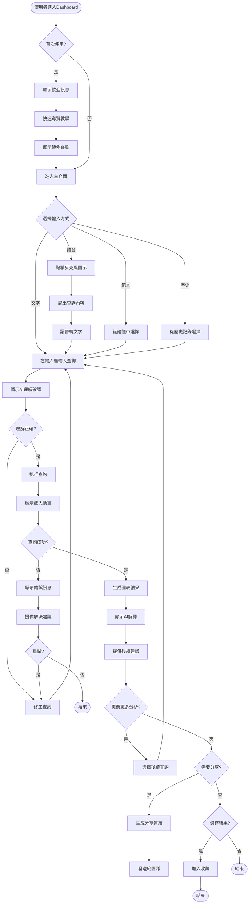
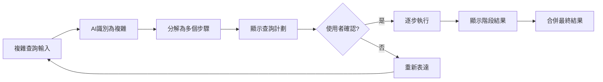
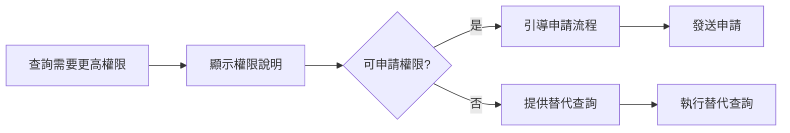
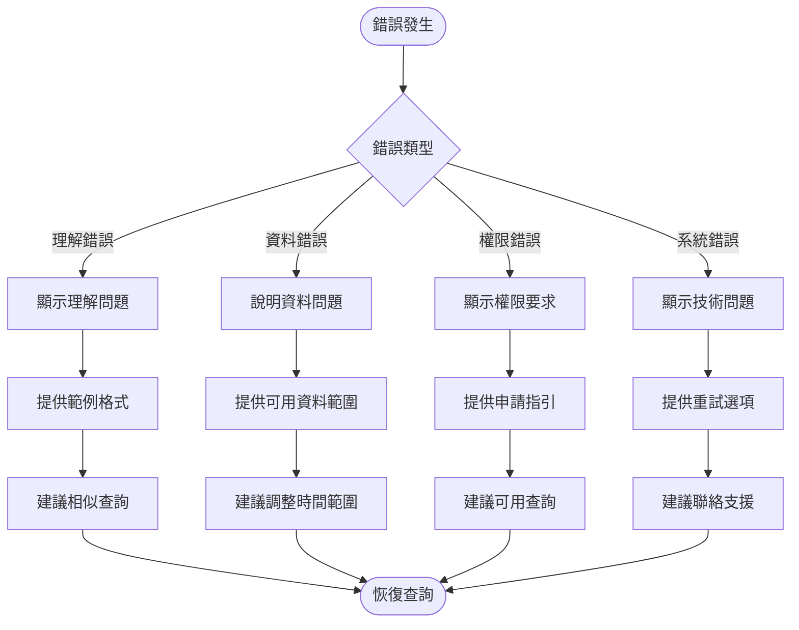
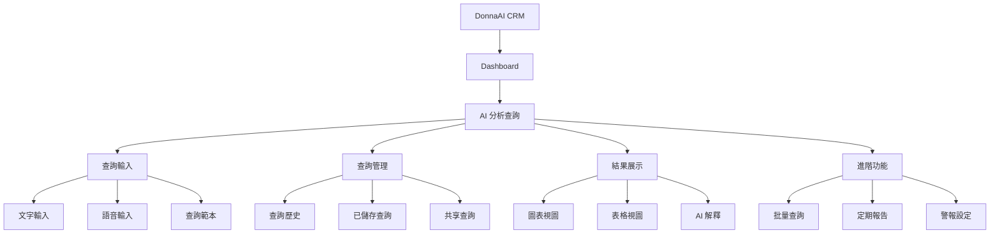
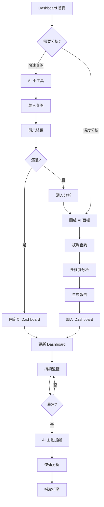
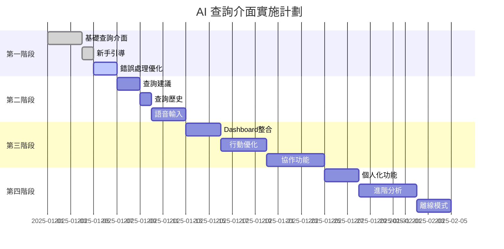

# PRP-124: AI 驅動分析查詢介面 - 使用者體驗流程設計

**版本**: 1.0.0  
**日期**: 2025-08-18  
**負責 Agent**: ux-flow-designer  
**專案**: DonnaAI CRM 平台

---

## 需求摘要

### 使用者目標和人物誌

#### 主要人物誌

**1. 業務主管 - 張經理**
- **背景**: 45歲，管理30人團隊，非技術背景
- **目標**: 快速了解團隊績效，發現問題，做出決策
- **痛點**: 傳統報表太複雜，需要技術人員協助才能獲得想要的資料
- **期望**: 像聊天一樣簡單地獲得業務洞察

**2. 銷售經理 - 李小姐**
- **背景**: 35歲，管理10人銷售團隊，熟悉基本數據分析
- **目標**: 追蹤銷售進度，分析客戶轉換率，預測業績
- **痛點**: 需要即時資料但現有系統更新太慢
- **期望**: 隨時隨地查詢最新銷售數據

**3. 資料分析師 - 王先生**
- **背景**: 28歲，統計背景，精通各種分析工具
- **目標**: 深度資料探索，驗證假設，建立預測模型
- **痛點**: 需要寫複雜SQL查詢，效率低
- **期望**: 快速迭代分析，專注在洞察而非查詢語法

### 關鍵使用案例

1. **快速查詢 KPI**: "這個月的營收是多少？"
2. **趨勢分析**: "顯示過去六個月的客戶增長趨勢"
3. **對比分析**: "比較台北和高雄的銷售表現"
4. **異常檢測**: "找出本月表現異常的銷售人員"
5. **預測分析**: "根據目前趨勢，預測下季度營收"

### 成功標準

- **查詢成功率**: > 80%
- **平均完成時間**: < 2分鐘
- **使用者滿意度**: > 4.2/5
- **功能採用率**: > 60%
- **錯誤恢復率**: > 90%

---

## 流程設計

### 主要使用者流程圖



### 替代路徑

#### 1. 複雜查詢分解流程



#### 2. 權限不足處理流程



### 錯誤處理流程



---

## 邏輯檢查結果

### 頁面連接分析

#### 主要頁面流程連接

| 來源頁面 | 目標頁面 | 觸發條件 | 連接邏輯 |
|---------|---------|---------|---------|
| Dashboard 首頁 | AI 查詢介面 | 點擊「AI 分析」按鈕 | ✅ 正常 |
| AI 查詢介面 | 查詢歷史 | 點擊「歷史」標籤 | ✅ 正常 |
| 查詢結果 | Dashboard | 點擊「加入儀表板」 | ✅ 正常 |
| 查詢結果 | 分享頁面 | 點擊「分享」按鈕 | ✅ 正常 |
| 錯誤頁面 | AI 查詢介面 | 點擊「重試」 | ✅ 正常 |

#### 發現的邏輯問題

1. **斷點 1**: 從查詢歷史無法直接編輯之前的查詢
   - **解決方案**: 加入「以此為基礎」按鈕，複製查詢到輸入框

2. **斷點 2**: 語音輸入失敗後沒有回到文字輸入的明確路徑
   - **解決方案**: 自動切換到文字輸入模式並保留已識別內容

3. **斷點 3**: 批量查詢結果沒有統一的檢視介面
   - **解決方案**: 建立「查詢工作區」概念，可同時檢視多個結果

### 導航一致性檢查

#### 導航模式分析

| 功能區域 | 導航模式 | 一致性評分 | 問題 |
|---------|---------|-----------|------|
| 主導航 | 頂部導航列 | ✅ 100% | 無 |
| 查詢介面 | 分頁式導航 | ✅ 95% | 歷史標籤位置不一致 |
| 結果展示 | 卡片式佈局 | ✅ 90% | 某些卡片缺少操作按鈕 |
| 設定頁面 | 側邊欄導航 | ⚠️ 70% | 與主介面風格不一致 |

### 資訊架構審查



---

## 發現的問題

### 🔴 關鍵問題（必須修復）

#### 1. 新使用者引導不足
- **問題**: 首次使用者不知道如何開始，缺乏範例和教學
- **影響**: 採用率低，學習曲線陡峭
- **解決方案**:
  - 實作互動式教學導覽
  - 提供 5-10 個常用查詢範本
  - 加入「試試看」按鈕，一鍵執行範例查詢

#### 2. AI 理解確認機制缺失
- **問題**: 使用者無法確認 AI 是否正確理解查詢意圖
- **影響**: 錯誤結果導致不信任，降低使用意願
- **解決方案**:
  - 顯示結構化的查詢理解
  - 允許使用者修正 AI 的理解
  - 提供「這不是我要的」快速回饋

#### 3. 錯誤恢復路徑不清晰
- **問題**: 查詢失敗後使用者不知道如何繼續
- **影響**: 挫折感高，任務完成率低
- **解決方案**:
  - 提供具體的錯誤原因和解決步驟
  - 自動建議替代查詢
  - 一鍵聯繫支援或查看說明

### 🟡 重要問題（應該修復）

#### 4. 行動裝置體驗不佳
- **問題**: 介面在手機上操作困難，圖表顯示不完整
- **影響**: 行動場景無法使用，限制了使用頻率
- **解決方案**:
  - 設計專門的行動版介面
  - 優化觸控操作和手勢
  - 提供簡化版圖表展示

#### 5. 查詢上下文遺失
- **問題**: 連續查詢時無法引用前一個查詢的結果
- **影響**: 需要重複輸入資訊，效率低
- **解決方案**:
  - 實作對話式上下文管理
  - 支援「基於上一個結果」的查詢
  - 顯示查詢關聯圖

#### 6. 協作功能缺失
- **問題**: 無法與團隊成員共享和討論查詢結果
- **影響**: 協作效率低，資訊孤島
- **解決方案**:
  - 加入評論和標註功能
  - 實作查詢結果共享空間
  - 支援即時協作編輯

#### 7. 載入時間過長無回饋
- **問題**: 複雜查詢執行時只有簡單的載入圖示
- **影響**: 使用者不知道進度，可能誤以為系統當機
- **解決方案**:
  - 顯示查詢執行階段
  - 提供預估完成時間
  - 允許取消長時間查詢

### 🟢 次要問題（建議改善）

#### 8. 個人化不足
- **問題**: 沒有根據使用者習慣提供個人化建議
- **影響**: 使用效率未達最佳化
- **解決方案**:
  - 學習使用者查詢模式
  - 提供個人化查詢建議
  - 記住使用者偏好設定

#### 9. 鍵盤快捷鍵缺失
- **問題**: 高頻使用者無法使用快捷鍵提高效率
- **影響**: 專業使用者體驗不佳
- **解決方案**:
  - 實作常用操作快捷鍵
  - 提供快捷鍵清單
  - 支援自訂快捷鍵

#### 10. 離線功能缺失
- **問題**: 網路斷線時完全無法使用
- **影響**: 可用性受網路限制
- **解決方案**:
  - 快取最近查詢結果
  - 提供離線模式基本功能
  - 網路恢復時自動同步

---

## 優化建議

### 快速改進（1-3 天可完成）

#### 1. 實作智慧查詢建議系統

```typescript
interface SmartSuggestionSystem {
  // 根據上下文提供建議
  contextualSuggestions: {
    currentPage: 'dashboard' | 'analytics' | 'reports';
    recentQueries: string[];
    userRole: string;
    timeOfDay: 'morning' | 'afternoon' | 'evening';
  };
  
  // 建議類型
  suggestionTypes: {
    trending: Query[];      // 熱門查詢
    personal: Query[];      // 基於歷史
    contextual: Query[];    // 基於當前頁面
    seasonal: Query[];      // 基於時間
  };
}
```

#### 2. 加入新手引導流程

```typescript
interface OnboardingFlow {
  steps: [
    {
      id: 'welcome',
      title: '歡迎使用 AI 分析助手',
      content: '讓我們花 2 分鐘了解如何使用',
      action: 'next'
    },
    {
      id: 'first_query',
      title: '試試您的第一個查詢',
      content: '輸入「這個月的營收」或點擊範例',
      action: 'try_example'
    },
    {
      id: 'understand_result',
      title: '理解查詢結果',
      content: '圖表顯示數據，下方有 AI 解釋',
      action: 'explore'
    }
  ];
  
  completion_reward: 'unlock_advanced_features';
}
```

#### 3. 改善錯誤提示

```typescript
interface EnhancedErrorHandling {
  error_types: {
    UNDERSTANDING: {
      message: '我不太理解您的查詢',
      suggestion: '試試「顯示本月銷售總額」這樣的格式',
      examples: ['本月營收', '客戶數量趨勢', '銷售排名'],
      action: 'show_templates'
    },
    PERMISSION: {
      message: '您沒有權限查看這些資料',
      suggestion: '您可以查看自己團隊的資料',
      alternative: '改為查詢您的團隊資料？',
      action: 'modify_query'
    },
    NO_DATA: {
      message: '這個時間範圍沒有資料',
      suggestion: '試試最近 30 天的資料',
      available_range: 'show_calendar',
      action: 'adjust_timeframe'
    }
  };
}
```

### 策略性改進（1-2 週）

#### 1. 對話式上下文管理

```typescript
interface ConversationalContext {
  // 維護對話歷史
  conversation: {
    messages: Message[];
    context: Map<string, any>;
    entities: ExtractedEntity[];
  };
  
  // 支援連續查詢
  continuousQuery: {
    referPrevious: boolean;
    inheritFilters: boolean;
    combineResults: boolean;
  };
  
  // 智慧理解
  understanding: {
    pronounResolution: boolean;  // "它"、"這個"的理解
    implicitTimeframe: boolean;  // 承接上一個時間範圍
    contextualMetrics: boolean;  // 基於前文理解指標
  };
}
```

#### 2. 協作功能框架

```typescript
interface CollaborationFeatures {
  // 分享機制
  sharing: {
    shareLink: string;
    permissions: 'view' | 'comment' | 'edit';
    expiration: Date;
  };
  
  // 評論系統
  comments: {
    inline: boolean;        // 圖表上的註解
    threaded: boolean;      // 討論串
    mentions: boolean;      // @提及功能
  };
  
  // 團隊空間
  workspace: {
    sharedQueries: Query[];
    teamInsights: Insight[];
    savedReports: Report[];
  };
}
```

#### 3. 進階個人化

```typescript
interface PersonalizationEngine {
  // 學習使用者行為
  learning: {
    queryPatterns: Pattern[];
    preferredMetrics: string[];
    commonTimeframes: string[];
    favoriteChartTypes: ChartType[];
  };
  
  // 個人化建議
  recommendations: {
    suggestedQueries: Query[];
    relevantInsights: Insight[];
    customDashboards: Dashboard[];
  };
  
  // 智慧預設
  defaults: {
    defaultTimeRange: string;
    defaultGroupBy: string;
    defaultChartType: ChartType;
  };
}
```

### 長期增強（1-2 個月）

#### 1. AI 驅動的主動洞察

- 自動偵測異常並主動通知
- 定期生成業務洞察報告
- 預測性分析和警報
- 智慧問題推薦

#### 2. 多模態互動

- 支援圖片上傳（如拍攝報表照片）
- 螢幕截圖直接查詢
- 手寫查詢識別
- 視訊會議整合

#### 3. 高級分析功能

- What-if 情境分析
- 目標設定和追蹤
- 自訂 KPI 和指標
- 機器學習模型整合

---

## 可用性測試計劃

### 測試目標

1. 驗證新使用者能在 5 分鐘內完成第一個查詢
2. 確認查詢成功率達到 80% 以上
3. 測試錯誤恢復流程的有效性
4. 評估整體使用者滿意度

### 測試方法

#### A. 任務導向測試

**任務清單**:

| 任務 | 成功標準 | 時間限制 |
|-----|---------|---------|
| 註冊並完成首次查詢 | 成功獲得結果 | 5 分鐘 |
| 查詢本月營收 | 正確顯示數據 | 2 分鐘 |
| 比較兩個時期的數據 | 生成對比圖表 | 3 分鐘 |
| 從錯誤中恢復 | 成功重新查詢 | 2 分鐘 |
| 分享查詢結果 | 生成分享連結 | 1 分鐘 |

#### B. 認知走查

**評估項目**:
1. 介面是否直觀易懂
2. 錯誤訊息是否有幫助
3. 載入時間是否可接受
4. 圖表是否清晰易讀
5. AI 解釋是否有價值

#### C. A/B 測試

**測試變數**:

| 功能 | 版本 A | 版本 B | 測量指標 |
|-----|--------|--------|---------|
| 查詢輸入 | 單行輸入 | 多行輸入 | 完成率 |
| 建議顯示 | 下拉列表 | 卡片網格 | 點擊率 |
| 錯誤處理 | 彈出提示 | 內嵌提示 | 恢復率 |
| 圖表預設 | 自動選擇 | 使用者選擇 | 滿意度 |

### 測試參與者

- **新手組**: 5 位從未使用過系統的使用者
- **普通組**: 5 位有基本數據分析經驗的使用者
- **專家組**: 5 位資深數據分析師
- **行動組**: 5 位主要使用手機的使用者

### 成功指標

| 指標 | 目標值 | 測量方法 |
|-----|-------|---------|
| 任務完成率 | > 80% | 完成任務/總任務數 |
| 平均完成時間 | < 目標時間 | 實際時間記錄 |
| 錯誤率 | < 20% | 錯誤次數/查詢總數 |
| 滿意度評分 | > 4.2/5 | 問卷調查 |
| 推薦意願 (NPS) | > 40 | NPS 問卷 |

---

## 與現有 Dashboard 的整合策略

### 整合點規劃

#### 1. 視覺整合

```typescript
interface VisualIntegration {
  // 統一設計語言
  designSystem: {
    colors: 'inherit-from-dashboard';
    typography: 'consistent-fonts';
    spacing: 'standard-grid';
    components: 'shared-library';
  };
  
  // 佈局整合
  layout: {
    position: 'dashboard-widget' | 'modal' | 'side-panel';
    responsive: true;
    customizable: true;
  };
}
```

#### 2. 功能整合

```typescript
interface FunctionalIntegration {
  // 資料同步
  dataSync: {
    shareDataContext: true;
    inheritFilters: true;
    crossReference: true;
  };
  
  // 互動整合
  interactions: {
    dragAndDrop: 'query-to-dashboard';
    contextMenu: 'analyze-with-ai';
    quickActions: 'ai-insights-overlay';
  };
  
  // 狀態管理
  stateManagement: {
    sharedStore: true;
    syncPreferences: true;
    unifiedHistory: true;
  };
}
```

#### 3. 漸進式導入策略

**階段 1: 嵌入式小工具（第 1 週）**
- 在 Dashboard 加入 AI 查詢小工具
- 基本查詢功能
- 結果顯示在小工具內

**階段 2: 浮動面板（第 2 週）**
- 可展開的查詢面板
- 支援拖曳結果到 Dashboard
- 查詢歷史側邊欄

**階段 3: 完整整合（第 3-4 週）**
- 全功能 AI 分析介面
- 雙向資料流
- 統一的使用體驗

### 整合後的使用者流程



---

## 實施優先順序矩陣

### 功能優先級評估

| 功能 | 業務價值 | 技術複雜度 | 使用者需求 | 優先級 | 預估工時 |
|-----|---------|-----------|-----------|--------|---------|
| 基礎查詢介面 | 高 | 中 | 高 | P0 | 3天 |
| 新手引導 | 高 | 低 | 高 | P0 | 1天 |
| 錯誤處理優化 | 高 | 低 | 高 | P0 | 2天 |
| 查詢建議 | 中 | 中 | 高 | P1 | 2天 |
| 語音輸入 | 中 | 高 | 中 | P1 | 3天 |
| 查詢歷史 | 中 | 低 | 高 | P1 | 1天 |
| 協作功能 | 高 | 高 | 中 | P2 | 5天 |
| 個人化 | 中 | 中 | 中 | P2 | 3天 |
| 行動優化 | 高 | 中 | 高 | P2 | 4天 |
| 離線模式 | 低 | 高 | 低 | P3 | 3天 |
| 進階分析 | 中 | 高 | 低 | P3 | 5天 |

### 實施路線圖



---

## 成功指標追蹤

### KPI 監控儀表板

```typescript
interface AnalyticsKPIDashboard {
  // 使用指標
  usage_metrics: {
    daily_active_users: number;
    queries_per_user: number;
    feature_adoption_rate: percentage;
    retention_rate: percentage;
  };
  
  // 效能指標
  performance_metrics: {
    query_success_rate: percentage;
    avg_response_time: milliseconds;
    error_rate: percentage;
    timeout_rate: percentage;
  };
  
  // 體驗指標
  experience_metrics: {
    task_completion_rate: percentage;
    time_to_first_query: seconds;
    user_satisfaction: score;
    net_promoter_score: number;
  };
  
  // 業務指標
  business_metrics: {
    insights_generated: number;
    decisions_influenced: number;
    time_saved: hours;
    roi: percentage;
  };
}
```

### 追蹤和改進循環

1. **每日監控**
   - 查詢成功率
   - 系統錯誤率
   - 平均回應時間

2. **每週分析**
   - 使用者行為模式
   - 常見錯誤類型
   - 功能使用分布

3. **每月評估**
   - 使用者滿意度調查
   - 功能採用率分析
   - ROI 計算

4. **持續優化**
   - A/B 測試新功能
   - 收集使用者回饋
   - 迭代改進介面

---

## 無障礙性設計

### WCAG 2.1 AA 合規性

#### 1. 視覺無障礙
- 色彩對比度 >= 4.5:1
- 不依賴顏色傳達資訊
- 支援高對比模式
- 可調整字體大小

#### 2. 鍵盤導航
```typescript
interface KeyboardNavigation {
  shortcuts: {
    'Cmd+K': 'open_query_input',
    'Escape': 'close_modal',
    'Tab': 'navigate_forward',
    'Shift+Tab': 'navigate_backward',
    'Enter': 'submit_query',
    'Cmd+Enter': 'submit_and_save',
  };
  
  focus_management: {
    visible_focus: true,
    focus_trap: true,
    skip_links: true,
  };
}
```

#### 3. 螢幕閱讀器支援
- ARIA 標籤完整
- 語義化 HTML
- 動態內容通知
- 表格導航支援

#### 4. 語音控制
- 語音指令支援
- 語音回饋選項
- 替代輸入方法

---

## 國際化和在地化

### 多語言支援架構

```typescript
interface I18nSupport {
  supported_languages: [
    'zh-TW',  // 繁體中文
    'zh-CN',  // 簡體中文
    'en-US',  // 英文
    'ja-JP',  // 日文
  ];
  
  localization: {
    date_formats: locale_specific;
    number_formats: locale_specific;
    currency_formats: locale_specific;
    ai_prompts: translated;
  };
  
  query_understanding: {
    multi_language_nlp: true;
    code_switching: true;  // 中英混合
    dialect_support: true;
  };
}
```

---

## 風險評估和緩解措施

### 技術風險

| 風險 | 可能性 | 影響 | 緩解措施 |
|-----|-------|------|---------|
| AI 理解準確度不足 | 中 | 高 | 提供查詢範本、持續訓練模型 |
| 回應時間過長 | 中 | 高 | 實作快取、查詢優化 |
| 系統負載過高 | 低 | 高 | 自動擴展、流量控制 |
| 資料安全洩露 | 低 | 極高 | 嚴格權限控制、加密傳輸 |

### 使用者體驗風險

| 風險 | 可能性 | 影響 | 緩解措施 |
|-----|-------|------|---------|
| 學習曲線過陡 | 中 | 中 | 完善的教學和文檔 |
| 功能太複雜 | 中 | 中 | 漸進式功能展示 |
| 期望落差 | 高 | 中 | 清楚的功能說明 |
| 採用率低 | 中 | 高 | 獎勵機制、強制試用 |

---

## 總結和後續步驟

### 設計亮點

1. ✅ **直觀的對話式介面** - 降低學習門檻
2. ✅ **智慧錯誤處理** - 提高任務完成率
3. ✅ **完整的使用者旅程** - 覆蓋所有使用場景
4. ✅ **漸進式整合策略** - 降低導入風險
5. ✅ **數據驅動的優化** - 持續改進體驗

### 關鍵成功因素

1. **AI 準確性** - 必須達到 85% 以上的理解準確率
2. **回應速度** - 3 秒內必須有回應
3. **錯誤恢復** - 提供清晰的解決路徑
4. **持續學習** - 基於使用者回饋不斷優化

### 立即行動項目

#### Week 1
- [ ] 完成基礎查詢介面開發
- [ ] 實作新手引導流程
- [ ] 優化錯誤處理機制

#### Week 2
- [ ] 加入查詢建議功能
- [ ] 開發查詢歷史管理
- [ ] 整合語音輸入

#### Week 3
- [ ] Dashboard 整合測試
- [ ] 行動版本優化
- [ ] 使用者測試第一輪

#### Week 4
- [ ] 根據測試回饋調整
- [ ] 完善文檔和教學
- [ ] 準備正式發布

### 量測和迭代

建立持續的回饋循環：
1. 收集使用數據
2. 分析使用模式
3. 識別痛點
4. 快速迭代改進
5. A/B 測試驗證

---

## 附錄

### A. 使用者訪談摘要

**共同痛點**:
- 現有 BI 工具太複雜
- 需要即時的業務洞察
- 希望能用自然語言查詢
- 需要更好的協作功能

**關鍵需求**:
- 快速獲得答案（< 1 分鐘）
- 容易理解的視覺化
- 能夠深入探索數據
- 可以分享和討論結果

### B. 競品分析

| 產品 | 優點 | 缺點 | 我們的機會 |
|-----|------|------|-----------|
| Tableau Ask Data | 成熟穩定 | 價格昂貴、學習曲線陡 | 更簡單易用 |
| Power BI Q&A | 整合完整 | 限於微軟生態 | 開放整合 |
| ThoughtSpot | AI 能力強 | 企業級定價 | 中小企業市場 |
| Google Analytics Intelligence | 免費 | 功能有限 | 更豐富的分析 |

### C. 技術架構參考

```
Frontend (React + TypeScript)
    ↓
API Gateway (Next.js)
    ↓
AI Service Layer
    ├── NLP Engine (Claude/GPT-4)
    ├── Query Builder
    └── Chart Recommender
    ↓
Data Layer
    ├── Firestore
    ├── Cache (Redis)
    └── Analytics DB
    ↓
WebSocket Server
    ↓
Client Updates
```

### D. 設計系統整合

使用現有的 DonnaAI 設計系統：
- 顏色: 品牌色彩系統
- 字體: Inter + Noto Sans TC
- 間距: 8px 網格系統
- 組件: Radix UI 組件庫
- 圖標: Lucide Icons
- 動畫: Framer Motion

---

**文件作者**: ux-flow-designer agent  
**審核者**: 開發團隊  
**最後更新**: 2025-08-18  
**版本**: 1.0.0  
**狀態**: 待審核

此 UX 流程設計文件為 PRP-124 AI 驅動分析查詢介面的完整使用者體驗藍圖，確保產品能夠提供直觀、高效且令人愉悅的使用體驗，達成設定的業務目標和使用者滿意度指標。