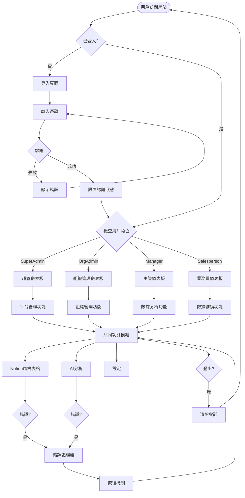
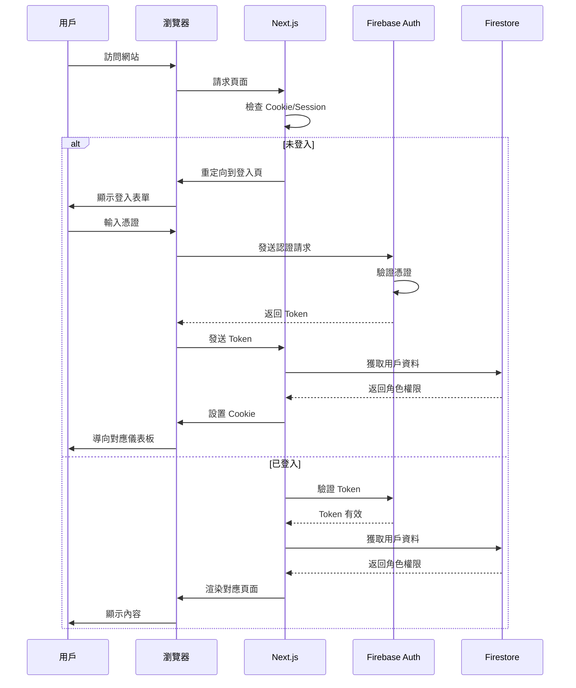
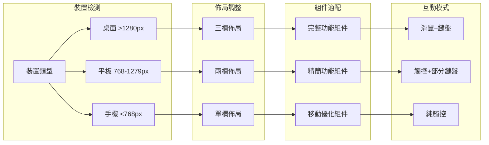
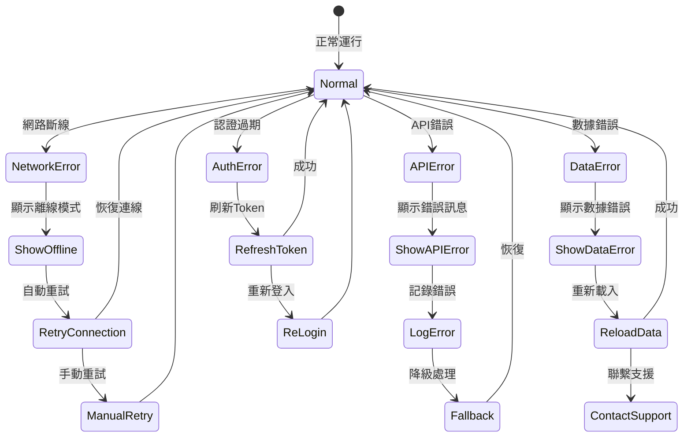
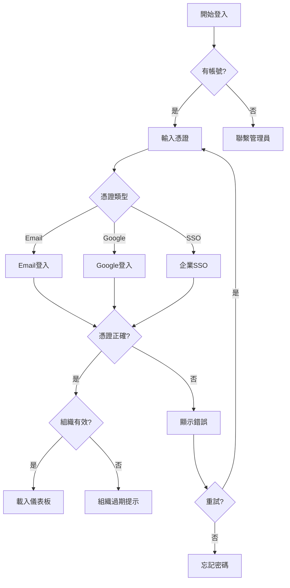
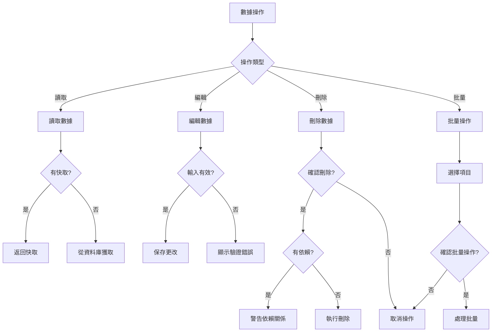
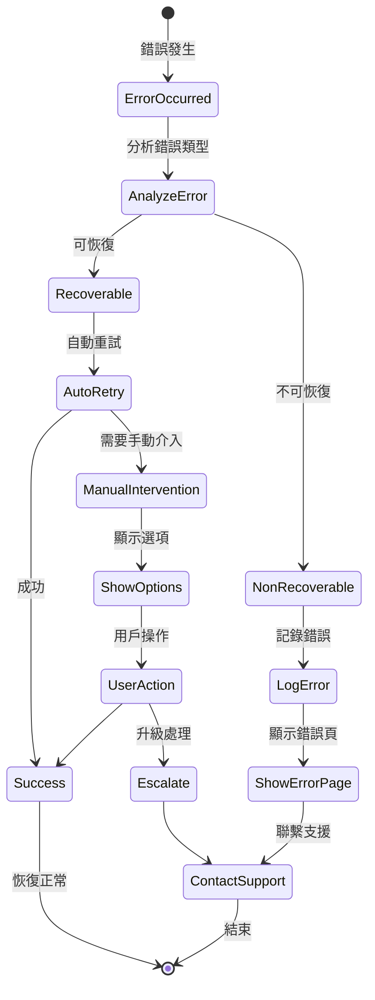
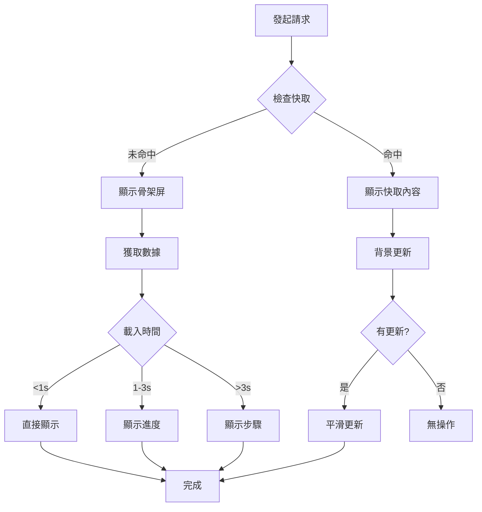
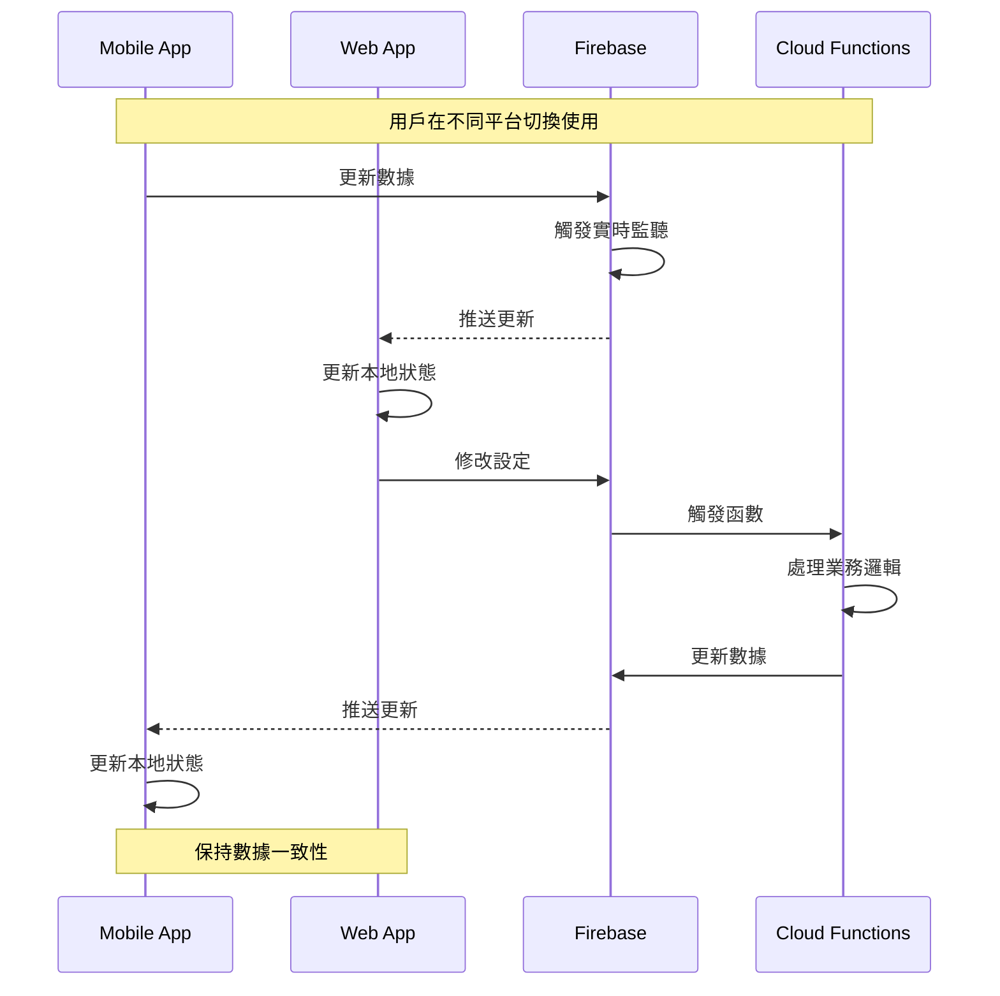

# Web Platform Foundation UX 流程設計文件

## 📋 需求摘要

### 專案背景
- **專案名稱**: DonnaAI Next.js Web Platform Foundation
- **版本**: v1.0
- **設計系統**: Notion 風格的黑白灰極簡設計
- **技術架構**: Next.js 14 + TypeScript + Tailwind CSS + Firebase

### 用戶角色定義

#### 🔴 SuperAdmin (超級管理員)
- **特徵**: 技術背景強，需要快速處理多組織事務
- **目標**: 高效管理平台、快速解決問題、監控系統健康
- **痛點**: 需要在多個組織間切換、處理緊急問題

#### 🟠 Organization Admin (組織管理員)
- **特徵**: 企業IT或HR背景，負責組織內部管理
- **目標**: 設定組織架構、管理用戶權限、配置系統
- **痛點**: 批量用戶管理困難、權限設定複雜

#### 🟡 Manager (業務主管)
- **特徵**: 資深管理者，重視數據分析
- **目標**: 監控團隊績效、生成報表、做出決策
- **痛點**: 數據分散、報表生成耗時

#### 🟢 Salesperson (業務員)
- **特徵**: 現場工作為主，偶爾使用Web進行數據整理
- **目標**: 快速完成文書工作、批量數據處理
- **痛點**: Mobile和Web數據同步、大量數據輸入

### 核心使用情境
1. **首次登入與環境熟悉**
2. **日常數據查看與分析**
3. **複雜表格編輯操作**
4. **跨裝置無縫切換**
5. **錯誤處理與恢復**

### 成功標準
- 首次使用者能在 5 分鐘內完成基本操作
- 頁面載入時間 < 2 秒
- 錯誤恢復時間 < 10 秒
- 用戶滿意度 > 85%

---

## 🗺️ 流程設計

### 主要用戶旅程地圖



### 認證與授權流程



### 響應式設計流程



### 錯誤處理與恢復流程



---

## 🎯 關鍵決策點和分支流程

### 1. 登入決策樹



### 2. 數據操作決策流程



---

## 📱 響應式設計的 UX 考量

### 螢幕尺寸斷點定義

| 裝置類型 | 寬度範圍 | 佈局策略 | 導航模式 | 內容優先級 |
|---------|---------|---------|---------|-----------|
| **桌面** | ≥1280px | 三欄佈局 | 側邊欄固定 | 完整顯示所有功能 |
| **平板橫向** | 1024-1279px | 兩欄佈局 | 側邊欄可收合 | 隱藏次要功能 |
| **平板直向** | 768-1023px | 單欄+浮動面板 | 底部導航 | 重要功能優先 |
| **手機** | <768px | 單欄堆疊 | 漢堡選單 | 核心功能only |

### 響應式組件行為

```typescript
// 響應式組件配置示例
interface ResponsiveConfig {
  desktop: {
    layout: 'grid' | 'flex',
    columns: 3,
    showSidebar: true,
    showSecondaryNav: true,
    tableColumns: 'all',
    chartSize: 'large'
  },
  tablet: {
    layout: 'flex',
    columns: 2,
    showSidebar: 'collapsible',
    showSecondaryNav: false,
    tableColumns: 'primary',
    chartSize: 'medium'
  },
  mobile: {
    layout: 'stack',
    columns: 1,
    showSidebar: false,
    showSecondaryNav: false,
    tableColumns: 'minimal',
    chartSize: 'small'
  }
}
```

### 觸控與滑鼠操作優化

| 功能 | 桌面操作 | 觸控操作 | 鍵盤快捷鍵 |
|-----|---------|---------|-----------|
| **選擇多項** | Ctrl+Click | 長按進入選擇模式 | Shift+方向鍵 |
| **拖放排序** | 滑鼠拖曳 | 長按後拖曳 | Alt+上下鍵 |
| **右鍵選單** | 右鍵點擊 | 長按呼出 | Shift+F10 |
| **快速編輯** | 雙擊 | 點擊編輯圖標 | Enter |
| **批量操作** | 框選 | 批量選擇模式 | Ctrl+A |

---

## 🚨 錯誤狀態和恢復機制的 UX 設計

### 錯誤分類與處理策略

| 錯誤類型 | 嚴重程度 | 用戶提示 | 恢復機制 | 自動重試 |
|---------|---------|---------|---------|---------|
| **網路斷線** | 🟡 中 | Toast通知 | 離線模式 | 每30秒 |
| **API超時** | 🟡 中 | 進度提示 | 重試按鈕 | 3次 |
| **認證過期** | 🟠 高 | Modal提示 | 自動刷新Token | 1次 |
| **權限不足** | 🔴 高 | 頁面提示 | 返回上頁 | 無 |
| **數據衝突** | 🟠 高 | 確認對話框 | 合併選項 | 無 |
| **伺服器錯誤** | 🔴 嚴重 | 錯誤頁面 | 聯繫支援 | 無 |

### 錯誤提示設計規範

```typescript
interface ErrorDisplay {
  // Toast 通知 (非阻塞性錯誤)
  toast: {
    position: 'top-right',
    duration: 5000,
    showRetry: boolean,
    autoHide: true,
    style: {
      background: '#2C2C2C',
      color: '#FFFFFF',
      borderRadius: '8px'
    }
  },
  
  // Modal 對話框 (需要用戶決策)
  modal: {
    backdrop: true,
    closable: false,
    showIcon: true,
    actions: ['retry', 'cancel', 'contact'],
    style: {
      maxWidth: '480px',
      background: '#FFFFFF',
      border: '1px solid #E5E7EB'
    }
  },
  
  // 內嵌提示 (表單驗證錯誤)
  inline: {
    position: 'below-field',
    color: '#FF3B30',
    fontSize: '12px',
    showIcon: true
  },
  
  // 全頁錯誤 (嚴重錯誤)
  fullPage: {
    showErrorCode: true,
    showTimestamp: true,
    showContactInfo: true,
    showBackButton: true
  }
}
```

### 錯誤恢復流程



---

## ⏱️ 載入狀態的用戶回饋設計

### 載入狀態分級

| 載入時長 | 回饋類型 | 視覺表現 | 用戶預期管理 |
|---------|---------|---------|-------------|
| **0-300ms** | 無需回饋 | 無 | 感知為即時 |
| **300ms-1s** | 簡單指示器 | Spinner | 短暫等待 |
| **1-3s** | 進度指示 | 進度條 | 顯示進度百分比 |
| **3-10s** | 詳細回饋 | 步驟說明 | 說明正在處理什麼 |
| **>10s** | 背景處理 | 通知提醒 | 允許用戶做其他事 |

### 載入狀態組件設計

```typescript
interface LoadingStates {
  // 骨架屏 (內容載入)
  skeleton: {
    type: 'content' | 'table' | 'card' | 'chart',
    animate: true,
    backgroundColor: '#FAFAFA',
    highlightColor: '#F0F0F0',
    duration: 1.5 // 動畫週期(秒)
  },
  
  // 進度條 (操作載入)
  progressBar: {
    position: 'top' | 'inline',
    height: 4,
    color: '#2C2C2C',
    showPercentage: boolean,
    showEstimatedTime: boolean
  },
  
  // Spinner (快速載入)
  spinner: {
    size: 'small' | 'medium' | 'large',
    color: '#2C2C2C',
    overlay: boolean,
    text?: string
  },
  
  // 步驟指示器 (多步驟操作)
  stepper: {
    steps: string[],
    currentStep: number,
    showCheckmarks: true,
    estimatedTime: number[]
  }
}
```

### 載入優化策略



---

## 🔄 跨平台體驗一致性指南

### 平台特性對照表

| 功能特性 | Web (Desktop) | Web (Mobile) | Native App | 一致性要求 |
|---------|--------------|--------------|------------|-----------|
| **導航模式** | 側邊欄+頂部 | 底部Tab | 底部Tab | 圖標和順序一致 |
| **數據展示** | 完整表格 | 卡片列表 | 卡片列表 | 信息架構一致 |
| **編輯模式** | 內嵌編輯 | Modal編輯 | Modal編輯 | 欄位順序一致 |
| **手勢操作** | 滑鼠hover | 觸控手勢 | 觸控手勢 | 操作邏輯一致 |
| **快捷操作** | 鍵盤快捷鍵 | 長按選單 | 長按選單 | 功能對應一致 |
| **文件處理** | 拖放上傳 | 選擇上傳 | 相機/相簿 | 處理流程一致 |

### 設計Token同步機制

```typescript
// 共享設計系統配置
const DesignTokens = {
  // 顏色系統 (跨平台統一)
  colors: {
    primary: '#2C2C2C',
    background: '#FFFFFF',
    surface: '#FAFAFA',
    text: {
      primary: '#1A1A1A',
      secondary: '#666666',
      disabled: '#CCCCCC'
    },
    border: {
      light: '#E5E7EB',
      default: '#D1D5DB',
      dark: '#9CA3AF'
    }
  },
  
  // 間距系統 (響應式調整)
  spacing: {
    base: 4, // 4px為基準
    scale: [0, 1, 2, 4, 6, 8, 12, 16, 20, 24, 32],
    responsive: {
      mobile: 0.875, // 87.5% of base
      tablet: 1,
      desktop: 1
    }
  },
  
  // 字體系統
  typography: {
    fontFamily: {
      default: '-apple-system, BlinkMacSystemFont, "Segoe UI"',
      mono: 'SF Mono, Monaco, Consolas'
    },
    sizes: {
      xs: 12,
      sm: 14,
      base: 16,
      lg: 18,
      xl: 20,
      '2xl': 24,
      '3xl': 30
    }
  },
  
  // 動畫時長 (統一體驗)
  animation: {
    instant: 0,
    fast: 150,
    normal: 300,
    slow: 500
  },
  
  // 圓角系統
  borderRadius: {
    none: 0,
    sm: 4,
    default: 8,
    lg: 12,
    full: 9999
  }
}
```

### 資料同步策略



---

## 🎨 互動模式和微互動設計

### 核心互動模式

#### 1. Hover States (桌面端)
```css
/* 基礎 hover 效果 */
.interactive-element {
  transition: all 150ms ease;
  cursor: pointer;
}

.interactive-element:hover {
  background: rgba(44, 44, 44, 0.05);
  transform: translateY(-1px);
}

/* 表格行 hover */
.table-row:hover {
  background: #F7F7F7;
}

/* 按鈕 hover */
.button:hover {
  opacity: 0.9;
  box-shadow: 0 2px 4px rgba(0,0,0,0.1);
}
```

#### 2. Focus States (無障礙)
```css
/* 焦點樣式 */
.focusable:focus {
  outline: 2px solid #2C2C2C;
  outline-offset: 2px;
}

/* 鍵盤導航指示 */
.keyboard-navigable:focus-visible {
  box-shadow: 0 0 0 3px rgba(44, 44, 44, 0.2);
}
```

#### 3. Active States (點擊回饋)
```css
/* 點擊效果 */
.clickable:active {
  transform: scale(0.98);
  opacity: 0.8;
}
```

### 微互動清單

| 互動場景 | 觸發時機 | 動畫效果 | 持續時間 | 目的 |
|---------|---------|---------|---------|-----|
| **按鈕點擊** | onClick | 縮放+陰影 | 150ms | 確認操作 |
| **輸入聚焦** | onFocus | 邊框變色 | 200ms | 引導輸入 |
| **載入完成** | onLoad | 淡入 | 300ms | 平滑過渡 |
| **刪除項目** | onDelete | 滑出+淡出 | 300ms | 視覺連續性 |
| **新增項目** | onCreate | 滑入+高亮 | 400ms | 引起注意 |
| **切換開關** | onToggle | 滑動+變色 | 200ms | 狀態改變 |
| **展開折疊** | onExpand | 高度動畫 | 250ms | 內容顯隱 |
| **拖曳排序** | onDrag | 陰影+縮放 | 0ms | 即時回饋 |
| **成功提示** | onSuccess | 彈入+勾號 | 400ms | 正向回饋 |
| **錯誤提示** | onError | 抖動+紅色 | 300ms | 錯誤提醒 |

### 手勢操作設計 (觸控設備)

```typescript
interface GestureHandlers {
  // 基礎手勢
  tap: { action: 'select', feedback: 'highlight' },
  doubleTap: { action: 'edit', feedback: 'zoom' },
  longPress: { action: 'contextMenu', feedback: 'haptic' },
  
  // 滑動手勢
  swipeLeft: { action: 'delete', feedback: 'slideOut' },
  swipeRight: { action: 'archive', feedback: 'slideOut' },
  swipeDown: { action: 'refresh', feedback: 'pullIndicator' },
  
  // 縮放手勢
  pinchIn: { action: 'zoomOut', feedback: 'scale' },
  pinchOut: { action: 'zoomIn', feedback: 'scale' },
  
  // 拖曳手勢
  dragStart: { action: 'pickup', feedback: 'elevate' },
  dragMove: { action: 'reorder', feedback: 'placeholder' },
  dragEnd: { action: 'drop', feedback: 'settle' }
}
```

---

## 📊 UI/UX 實作建議

### 1. 導航系統設計

#### 桌面版導航架構
```
┌─────────────────────────────────────────┐
│ Logo    主導航選單          用戶資料     │ <- 頂部導航欄
├─────────┬───────────────────────────────┤
│         │                               │
│  側邊欄  │          主內容區             │
│         │                               │
│  ·儀表板 │                               │
│  ·分析   │                               │
│  ·數據庫 │                               │
│  ·人事   │                               │
│  ·設定   │                               │
│         │                               │
└─────────┴───────────────────────────────┘
```

#### 移動版導航架構
```
┌─────────────────────────┐
│ ≡  頁面標題        用戶  │ <- 頂部標題欄
├─────────────────────────┤
│                         │
│      主內容區           │
│                         │
│                         │
│                         │
├─────────────────────────┤
│  首頁 分析 數據 人事 更多│ <- 底部導航
└─────────────────────────┘
```

### 2. 表單設計最佳實踐

```typescript
interface FormDesignGuidelines {
  // 輸入框設計
  input: {
    height: 44, // 最小觸控目標
    padding: '12px 16px',
    fontSize: 16, // 防止手機自動縮放
    borderRadius: 8,
    placeholderColor: '#999999'
  },
  
  // 標籤設計
  label: {
    position: 'above', // 標籤在上方
    fontSize: 14,
    color: '#666666',
    marginBottom: 8
  },
  
  // 錯誤提示
  error: {
    position: 'below',
    color: '#FF3B30',
    fontSize: 12,
    marginTop: 4,
    icon: 'exclamation-circle'
  },
  
  // 表單佈局
  layout: {
    maxWidth: 600, // 最佳閱讀寬度
    spacing: 24, // 欄位間距
    groupSpacing: 32, // 群組間距
    responsive: true
  }
}
```

### 3. 數據表格優化

#### 桌面版表格
- 顯示所有欄位
- 支援排序、篩選、搜尋
- 內嵌編輯功能
- 批量操作工具列
- 可調整欄寬

#### 移動版表格
- 顯示關鍵欄位（3-4個）
- 卡片式列表展示
- 點擊展開詳情
- 滑動操作（刪除/編輯）
- 固定表頭滾動

### 4. 效能優化建議

```typescript
interface PerformanceOptimization {
  // 圖片優化
  images: {
    lazyLoad: true,
    format: 'webp',
    responsive: true,
    placeholder: 'blur'
  },
  
  // 代碼分割
  codeSplitting: {
    routes: true,
    components: 'dynamic',
    libraries: 'vendor'
  },
  
  // 快取策略
  caching: {
    static: '1 year',
    api: '5 minutes',
    user: 'session'
  },
  
  // 預載策略
  prefetch: {
    links: 'viewport',
    data: 'hover',
    images: 'priority'
  }
}
```

---

## 🌐 Web 平台特殊優勢利用

### 1. 大螢幕優勢
- **多視窗操作**: 支援多個瀏覽器標籤同時工作
- **分割視圖**: 左右對比或上下分割顯示
- **拖放功能**: 檔案拖放上傳、項目拖曳排序
- **豐富工具列**: 更多快捷操作按鈕
- **即時預覽**: 報表生成時的即時預覽

### 2. 鍵盤操作優化

| 快捷鍵 | 功能 | 範圍 |
|--------|------|------|
| `Ctrl/Cmd + S` | 儲存 | 全域 |
| `Ctrl/Cmd + Z` | 復原 | 編輯區 |
| `Ctrl/Cmd + F` | 搜尋 | 當前頁 |
| `Ctrl/Cmd + K` | 快速命令 | 全域 |
| `Tab` | 切換焦點 | 表單 |
| `Arrow Keys` | 導航 | 表格 |
| `Space` | 選擇/取消 | 列表 |
| `Enter` | 確認/編輯 | 全域 |
| `Esc` | 取消/關閉 | Modal |
| `/` | 快速搜尋 | 列表頁 |

### 3. 瀏覽器功能整合
- **通知API**: 桌面通知提醒
- **剪貼簿API**: 快速複製貼上
- **全螢幕API**: 專注模式
- **列印優化**: 報表列印樣式
- **書籤功能**: 快速訪問常用頁面

### 4. 協作功能增強
- **即時協作游標**: 顯示其他用戶的編輯位置
- **評論系統**: 在數據旁添加評論
- **版本歷史**: 查看和恢復歷史版本
- **分享連結**: 快速分享特定視圖

---

## ✅ 無障礙設計要求

### WCAG 2.1 AA 標準檢查清單

- [ ] **顏色對比度**: 文字與背景對比度 ≥ 4.5:1
- [ ] **鍵盤導航**: 所有功能可通過鍵盤訪問
- [ ] **焦點指示**: 清晰的焦點視覺指示
- [ ] **屏幕閱讀器**: 正確的ARIA標籤
- [ ] **表單標籤**: 所有輸入框有對應標籤
- [ ] **錯誤提示**: 清晰的錯誤說明
- [ ] **替代文本**: 圖片和圖標的替代文本
- [ ] **語義化HTML**: 使用正確的HTML元素
- [ ] **跳過連結**: 提供跳過導航的連結
- [ ] **響應時間**: 給予足夠的操作時間

### ARIA 實作範例

```html
<!-- 導航選單 -->
<nav role="navigation" aria-label="主導航">
  <ul role="menubar">
    <li role="none">
      <a role="menuitem" 
         href="/dashboard" 
         aria-current="page">
        儀表板
      </a>
    </li>
  </ul>
</nav>

<!-- 表單元素 -->
<div role="group" aria-labelledby="form-title">
  <h2 id="form-title">用戶資料</h2>
  <label for="email">
    電子郵件
    <span aria-label="必填">*</span>
  </label>
  <input 
    id="email" 
    type="email" 
    required
    aria-required="true"
    aria-invalid="false"
    aria-describedby="email-error"
  />
  <span id="email-error" role="alert" hidden>
    請輸入有效的電子郵件
  </span>
</div>

<!-- 載入狀態 -->
<div role="status" aria-live="polite" aria-busy="true">
  <span class="sr-only">載入中...</span>
  <div class="spinner" aria-hidden="true"></div>
</div>
```

---

## 📈 成功指標與監控

### 關鍵績效指標 (KPIs)

| 指標類別 | 具體指標 | 目標值 | 測量方法 |
|---------|---------|--------|---------|
| **性能** | 首次內容繪製(FCP) | <1.8s | Lighthouse |
| | 最大內容繪製(LCP) | <2.5s | Web Vitals |
| | 首次輸入延遲(FID) | <100ms | Analytics |
| | 累積佈局偏移(CLS) | <0.1 | Web Vitals |
| **可用性** | 任務完成率 | >90% | 用戶測試 |
| | 錯誤率 | <5% | 錯誤日誌 |
| | 平均任務時間 | -20% | Analytics |
| **滿意度** | NPS分數 | >50 | 問卷調查 |
| | 用戶留存率 | >80% | Analytics |
| | 支援請求數 | -30% | 支援系統 |

### 監控儀表板配置

```typescript
interface MonitoringDashboard {
  realtime: {
    activeUsers: number,
    requestsPerSecond: number,
    errorRate: number,
    avgResponseTime: number
  },
  
  daily: {
    uniqueVisitors: number,
    pageViews: number,
    bounceRate: number,
    avgSessionDuration: number
  },
  
  performance: {
    serverUptime: number,
    apiLatency: number[],
    databaseQueries: number,
    cacheHitRate: number
  },
  
  userBehavior: {
    topPages: string[],
    userFlows: Map<string, number>,
    dropoffPoints: string[],
    searchQueries: string[]
  }
}
```

---

## 🔒 安全性考量

### 前端安全檢查清單

- [ ] **輸入驗證**: 所有用戶輸入進行客戶端驗證
- [ ] **XSS防護**: 對用戶內容進行轉義處理
- [ ] **CSRF Token**: 表單提交包含CSRF令牌
- [ ] **內容安全策略**: 設置適當的CSP頭
- [ ] **HTTPS強制**: 所有請求使用HTTPS
- [ ] **敏感資料**: 不在前端存儲敏感信息
- [ ] **權限檢查**: 前端路由權限驗證
- [ ] **安全標頭**: 設置安全相關的HTTP標頭
- [ ] **依賴更新**: 定期更新npm依賴
- [ ] **代碼混淆**: 生產環境代碼混淆

---

## 📋 實施路線圖

### Phase 1: 基礎建設 (第1-2週)
- [ ] Next.js 專案初始化
- [ ] 設計系統實作
- [ ] 認證系統整合
- [ ] 基礎路由設置

### Phase 2: 核心功能 (第3-4週)
- [ ] 儀表板開發
- [ ] 數據表格組件
- [ ] API整合
- [ ] 錯誤處理機制

### Phase 3: 進階功能 (第5-6週)
- [ ] AI分析整合
- [ ] 批量操作功能
- [ ] 報表生成系統
- [ ] 檔案上傳處理

### Phase 4: 優化測試 (第7-8週)
- [ ] 性能優化
- [ ] 跨瀏覽器測試
- [ ] 無障礙測試
- [ ] 用戶測試

### Phase 5: 部署上線 (第9週)
- [ ] 生產環境配置
- [ ] 監控系統設置
- [ ] 文檔完善
- [ ] 培訓材料準備

---

## 📚 附錄

### A. 相關文檔連結
- [Next.js 技術規格](/docs/specs/nextjs-web-platform-technical-spec.md)
- [設計系統指南](/docs/UI-DESIGN-GUIDE.md)
- [Web架構規格](/docs/WEB-ARCHITECTURE-SPECIFICATION.md)
- [測試計劃](/docs/WEB-PLATFORM-TEST-CHECKLIST.md)

### B. 設計資源
- Figma設計稿: [待建立]
- 圖標庫: Heroicons
- 字體: Inter, SF Pro
- 色彩系統: 黑白灰極簡設計

### C. 技術資源
- Next.js 14 文檔
- Tailwind CSS 文檔
- Firebase 文檔
- TypeScript 手冊

### D. 測試工具
- Lighthouse (性能測試)
- axe DevTools (無障礙測試)
- BrowserStack (跨瀏覽器測試)
- Cypress (E2E測試)

---

**文檔版本**: v1.0  
**最後更新**: 2025-08-18  
**作者**: UX Flow Designer Agent  
**審核狀態**: 待審核

## 下一步行動

1. **審核此文檔** - 請開發團隊審核並提供反饋
2. **建立設計稿** - 基於此流程設計創建視覺稿
3. **技術評估** - 評估技術可行性和資源需求
4. **原型開發** - 建立互動原型進行測試
5. **用戶測試** - 進行可用性測試並迭代改進

---

*此文檔為 PRP-120 Next.js Web Platform Foundation 的 UX 流程設計規範，將作為開發實施的指導文件。*