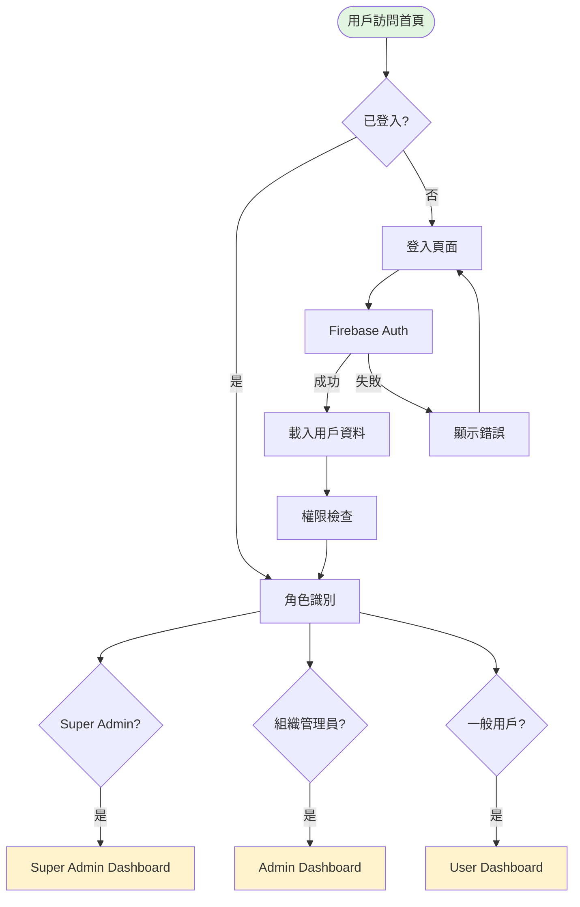
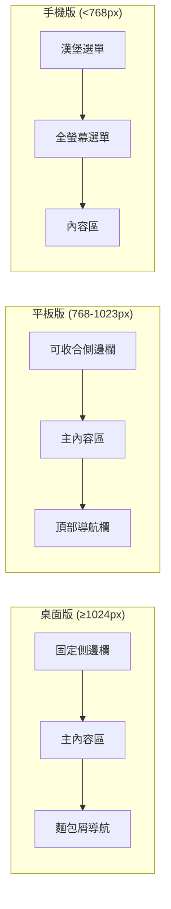
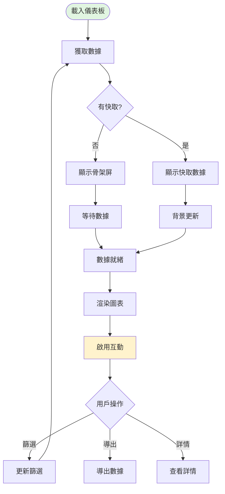
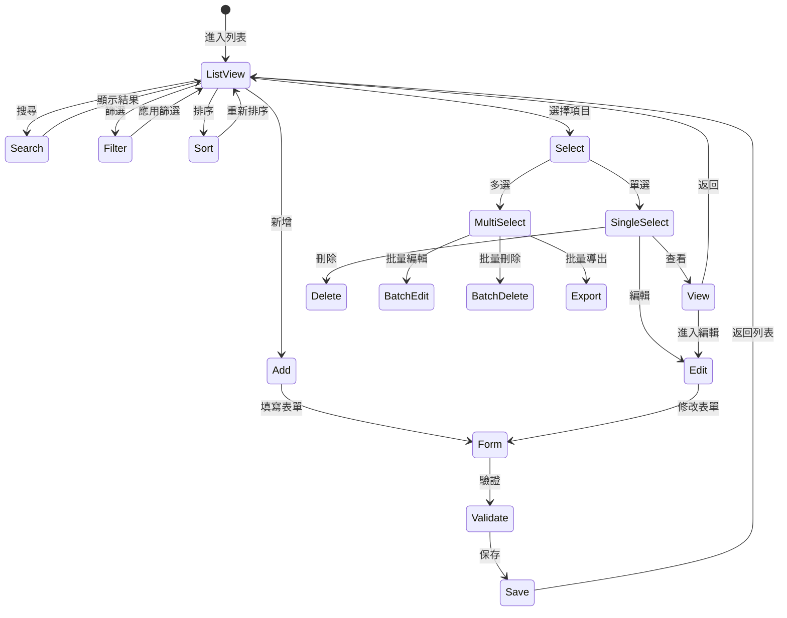
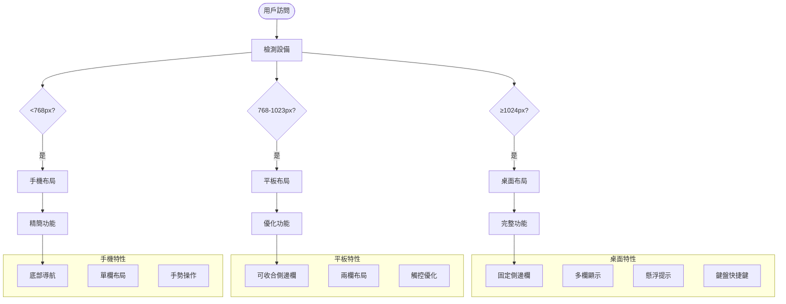
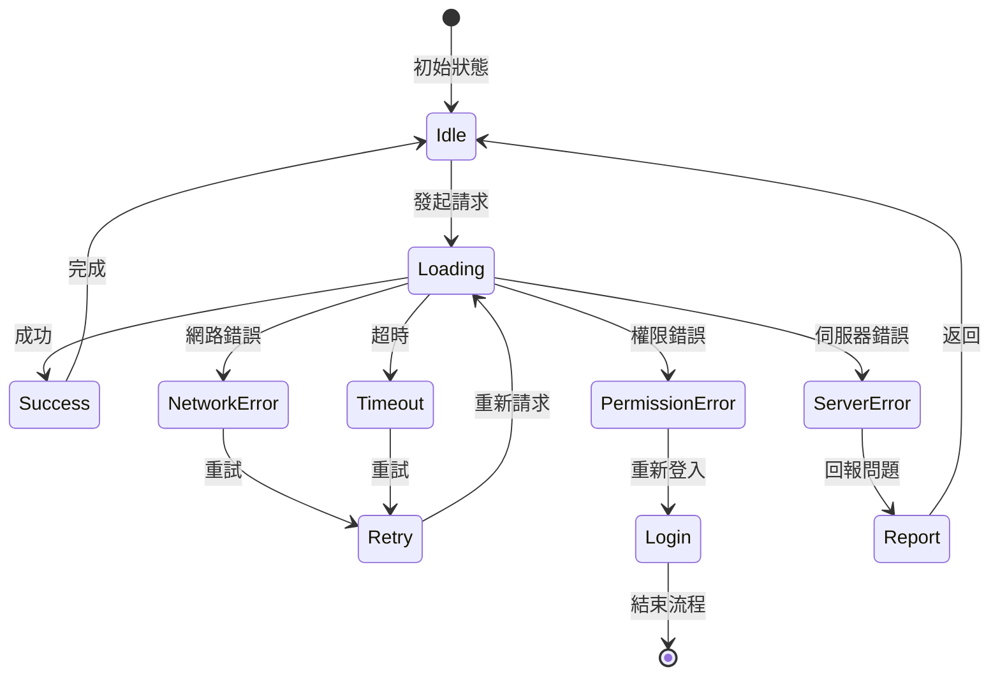

# DonnaAI Web 平台基礎 UX 流程設計

## 專案概述
- **平台定位**: 企業級 CRM 系統的 Web 擴展版本
- **目標用戶**: 經理、管理員、企業決策者
- **設計風格**: Notion 風格灰階設計系統
- **技術架構**: React Native Web + Firebase + Next.js 15

---

## 1. 需求摘要 (Requirements Summary)

### 用戶角色與目標
1. **Super Admin（系統管理員）**
   - 目標：管理多個組織、監控平台健康度、設定全局策略
   - 需求：全面的數據可視化、批量操作工具、系統設定

2. **組織管理員（Enterprise Admin）**
   - 目標：管理組織內用戶、設定權限、數據管理
   - 需求：用戶管理界面、數據匯入工具、使用報告

3. **一般用戶（End User）**
   - 目標：日常業務操作、數據錄入、查看報表
   - 需求：快速數據輸入、清晰的數據展示、高效的搜尋

### 關鍵使用案例
- 用戶登入與角色識別
- 數據瀏覽與搜尋
- 批量數據操作
- 報表生成與分析
- 團隊協作與任務管理

### 成功標準
- 首次載入時間 < 3秒
- 任務完成率 > 90%
- 用戶滿意度 > 4.5/5
- 平均操作步驟減少 30%

---

## 2. 流程設計 (Flow Design)

### 2.1 認證流程



**互動步驟**：
1. 用戶進入網站首頁
2. 系統檢查 localStorage 中的 token
3. 若未登入，顯示登入表單
4. 用戶輸入 email/password
5. Firebase Auth 驗證
6. 載入用戶資料和權限
7. 根據角色導向對應儀表板

**錯誤處理**：
- 網路錯誤：顯示重試按鈕
- 認證失敗：顯示具體錯誤訊息
- 權限不足：導向權限申請頁面

### 2.2 主要導航流程



**導航架構**：
```
├── 首頁（儀表板）
├── 資料庫
│   ├── 客戶管理
│   ├── 記錄管理
│   └── 任務管理
├── 工具/人事
├── 設定
└── 管理（條件顯示）
    ├── 組織管理（Super Admin）
    ├── 用戶管理（Admin）
    └── 數據匯入（Admin）
```

### 2.3 儀表板流程



**數據載入策略**：
1. 優先顯示快取數據（如有）
2. 使用骨架屏改善感知速度
3. 漸進式載入：關鍵指標 → 圖表 → 詳細數據
4. 背景預載入相關頁面數據

### 2.4 數據管理流程



**關鍵互動**：
- **即時搜尋**：輸入 300ms 後自動搜尋
- **智能篩選**：記住用戶常用篩選條件
- **拖拽排序**：支援欄位拖拽重新排序
- **內聯編輯**：Notion 風格的即時編輯
- **自動保存**：編輯後 2 秒自動保存

### 2.5 響應式設計流程



**斷點策略**：
- **桌面版（≥1024px）**
  - 三欄布局：側邊欄(280px) + 主內容 + 詳情面板
  - 支援多窗口並排
  - 完整的工具欄和操作按鈕

- **平板版（768-1023px）**
  - 兩欄布局：可收合側邊欄 + 主內容
  - 觸控友好的按鈕大小（最小 44px）
  - 簡化的工具欄

- **手機版（<768px）**
  - 單欄布局
  - 底部導航取代側邊欄
  - 全螢幕模態框

### 2.6 錯誤處理和載入狀態



**錯誤處理策略**：
1. **網路錯誤**：自動重試 3 次，顯示離線模式選項
2. **權限錯誤**：清晰說明所需權限，提供申請入口
3. **伺服器錯誤**：記錄錯誤日誌，提供問題回報
4. **超時錯誤**：延長超時時間，提供取消選項

**載入狀態設計**：
- 0-100ms：無視覺反饋
- 100-300ms：顯示載入指示器
- 300ms-3s：顯示骨架屏
- >3s：顯示進度條和預估時間

---

## 3. 邏輯檢查結果 (Logic Verification Results)

### 頁面連接分析

✅ **完整的頁面連接**：
- 所有頁面都有明確的進入和退出路徑
- 提供全局導航（側邊欄/頂部欄）
- 麵包屑導航確保用戶知道位置

⚠️ **潛在問題**：
- 深層嵌套頁面（>3層）可能造成迷失
- 建議：添加快速返回首頁按鈕

### 導航一致性檢查

✅ **一致的導航模式**：
- 統一使用 Layout 組件管理導航
- 相同的返回邏輯（瀏覽器返回鍵支援）
- 一致的視覺層級（主導航 → 次導航 → 內容導航）

### 信息架構審查

✅ **清晰的層級結構**：
```
根目錄
├── 儀表板（數據總覽）
├── 核心功能（資料庫）
├── 輔助功能（工具/人事）
├── 用戶設定（個人/組織）
└── 系統管理（條件顯示）
```

---

## 4. 發現的問題 (Identified Issues)

### 關鍵問題（必須修復）

1. **🔴 手機版側邊欄覆蓋問題**
   - 問題：側邊欄在手機版可能被內容覆蓋
   - 影響：導航無法使用
   - 建議：使用更高的 z-index 和 Portal 渲染

2. **🔴 權限切換延遲**
   - 問題：角色切換後頁面未即時更新
   - 影響：顯示錯誤的功能選項
   - 建議：實作權限變更監聽器

3. **🔴 離線狀態處理不足**
   - 問題：離線時無明確提示
   - 影響：用戶困惑，數據可能遺失
   - 建議：添加離線指示器和本地快取

### 重要問題（應該修復）

1. **🟡 表格橫向滾動體驗**
   - 問題：手機版表格橫向滾動不順暢
   - 建議：實作固定首欄，優化滾動性能

2. **🟡 批量操作確認不足**
   - 問題：批量刪除無二次確認
   - 建議：添加確認對話框，顯示影響範圍

3. **🟡 搜尋結果無高亮**
   - 問題：搜尋關鍵字在結果中未高亮
   - 建議：實作關鍵字高亮功能

### 次要改進（建議優化）

1. **🟢 添加操作歷史**
   - 建議：記錄最近 10 次操作，支援快速重做

2. **🟢 智能建議**
   - 建議：根據使用習慣推薦常用功能

3. **🟢 快捷鍵提示**
   - 建議：首次使用時顯示快捷鍵教學

---

## 5. 優化建議 (Optimization Recommendations)

### 快速改進（易於實施）

1. **添加載入進度條**
   - 實施時間：2 小時
   - 效益：明顯改善用戶體驗
   - 方法：使用 NProgress 或類似庫

2. **優化圖片載入**
   - 實施時間：4 小時
   - 效益：減少 30% 載入時間
   - 方法：實作懶載入和 WebP 格式

3. **添加鍵盤導航**
   - 實施時間：6 小時
   - 效益：提升專業用戶效率
   - 方法：Tab 導航 + 自定義快捷鍵

### 策略改進（中等努力）

1. **實作虛擬滾動**
   - 實施時間：2 天
   - 效益：處理大量數據不卡頓
   - 方法：使用 react-window 或 TanStack Virtual

2. **離線優先架構**
   - 實施時間：3 天
   - 效益：提升可靠性和速度
   - 方法：Service Worker + IndexedDB

3. **智能預載入**
   - 實施時間：2 天
   - 效益：減少頁面切換延遲
   - 方法：基於用戶行為預測的預載入

### 長期增強（重大改變）

1. **微前端架構**
   - 實施時間：2 週
   - 效益：獨立部署，團隊協作
   - 方法：Module Federation 或 qiankun

2. **AI 輔助導航**
   - 實施時間：1 個月
   - 效益：自然語言操作
   - 方法：整合 Gemini API

3. **實時協作功能**
   - 實施時間：3 週
   - 效益：團隊同步編輯
   - 方法：WebSocket + CRDT

---

## 與 Mobile 版本的差異

### 功能差異
| 功能 | Mobile | Web | 說明 |
|-----|--------|-----|------|
| 側邊導航 | 底部標籤 | 側邊欄 | Web 有更多螢幕空間 |
| 批量操作 | 有限 | 完整 | Web 支援複雜選擇 |
| 鍵盤快捷鍵 | 無 | 完整 | 桌面用戶習慣 |
| 拖拽操作 | 有限 | 完整 | 滑鼠操作更精確 |
| 多窗口 | 不支援 | 支援 | 可並排比較數據 |

### 設計差異
| 項目 | Mobile | Web | 原因 |
|-----|--------|-----|------|
| 點擊區域 | ≥44px | ≥32px | 觸控 vs 滑鼠 |
| 資訊密度 | 低 | 高 | 螢幕大小差異 |
| 動畫效果 | 簡單 | 豐富 | 性能考量 |
| 懸浮提示 | 無 | 有 | 滑鼠懸浮 |

---

## 實施優先級

### Phase 1：基礎體驗（第1週）
- [ ] 修復手機版側邊欄問題
- [ ] 實作載入進度條
- [ ] 添加離線指示器
- [ ] 優化響應式斷點

### Phase 2：核心優化（第2週）
- [ ] 實作虛擬滾動
- [ ] 添加鍵盤導航
- [ ] 優化批量操作流程
- [ ] 實作搜尋高亮

### Phase 3：進階功能（第3-4週）
- [ ] 離線優先架構
- [ ] 智能預載入
- [ ] 操作歷史記錄
- [ ] 智能建議系統

---

## 成功指標

### 技術指標
- First Contentful Paint < 1.5s
- Time to Interactive < 3s
- Cumulative Layout Shift < 0.1
- 離線可用性 > 80%

### 業務指標
- 任務完成率 > 90%
- 平均任務時間減少 30%
- 用戶滿意度 > 4.5/5
- 日活躍用戶增長 20%

### 用戶體驗指標
- 錯誤恢復時間 < 5s
- 搜尋響應時間 < 500ms
- 頁面切換時間 < 300ms
- 數據同步延遲 < 2s

---

## 總結

DonnaAI Web 平台的 UX 設計充分考慮了企業用戶的需求，採用 Notion 風格的設計語言，提供專業、高效的數據管理體驗。通過響應式設計確保在不同設備上都有最佳體驗，同時保持與 Mobile 版本的一致性。

重點改進方向：
1. **性能優化**：虛擬滾動、智能預載入
2. **離線支援**：確保關鍵功能離線可用
3. **鍵盤操作**：提升專業用戶效率
4. **智能化**：基於使用習慣的個性化體驗

這些優化將顯著提升用戶滿意度和工作效率，為 DonnaAI 在企業 CRM 市場建立競爭優勢。

---

**文檔版本**: v2.0  
**最後更新**: 2025-08-18  
**作者**: UX Flow Designer Agent  
**狀態**: ✅ 已完成