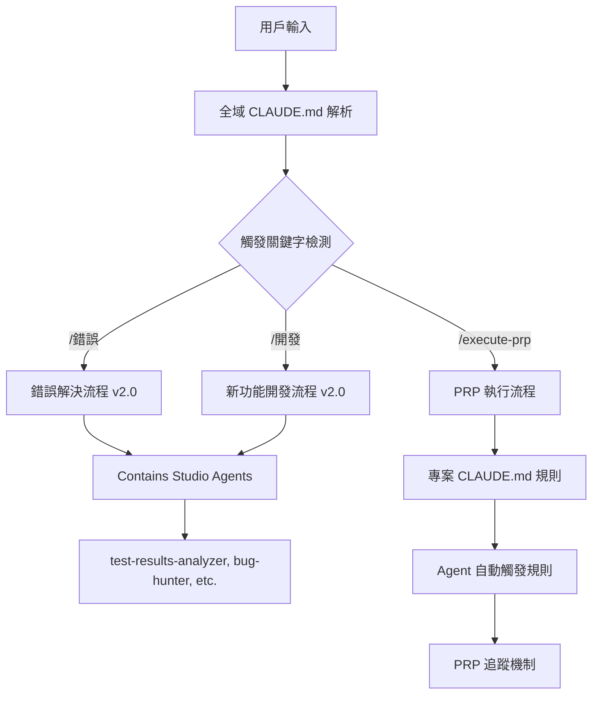

# CLAUDE.md 驅動的 PRP 執行系統

## 🧠 **系統架構：多層驅動機制**

### **層級 1：全域 SuperClaude 框架**
```yaml
位置: /Users/skyler/.claude/CLAUDE.md
作用: 全域行為規則和工作流程框架
包含:
  - SuperClaude Core Philosophy
  - MCP Integration
  - Persona系統 (Contains Studio Agents)
  - 個人自訂工作流程整合
```

### **層級 2：專案特定規則**
```yaml
位置: /Users/skyler/coding/DonnaAI-1.0/CLAUDE.md  
作用: 專案特定的開發規範和 Agent 觸發規則
包含:
  - 語言要求 (繁體中文)
  - 開發標準和測試要求
  - Agent 自動觸發規則  
  - Git 管理強制執行
```

### **層級 3：PRP 執行追蹤**
```yaml
位置: /Users/skyler/coding/DonnaAI-1.0/docs/workflows/PRP-EXECUTION-TRACKER.md
作用: PRP 特定的執行流程監控
包含:
  - Phase 檢查清單
  - Agent 執行狀態追蹤
  - 文件產出驗證
```

## 🔄 **CLAUDE.md 驅動流程詳解**

### **1. 全域驅動機制**


### **2. Agent 觸發系統層級**
```yaml
層級 1 - 全域觸發:
  觸發器: "/錯誤", "/開發"
  執行: Contains Studio Agents
  agents:
    - spec-writer
    - risk-assessor  
    - test-results-analyzer
    - bug-hunter
    - code-reviewer

層級 2 - 專案觸發:
  觸發器: 程式碼變更事件
  規則:
    - 修改 UI 元件後 → ui-visual-tester + code-refactor-optimizer
    - 寫完新功能後 → interaction-tester + typescript-type-guardian
    - TypeScript 錯誤 → typescript-type-guardian

層級 3 - PRP 流程觸發:
  觸發器: PRP 執行階段
  規則:
    - Phase 1 → spec-writer, ux-flow-designer, typescript-type-guardian, risk-assessor
    - Phase 5 → interaction-tester, ui-visual-tester, ux-journey-analyzer, etc.
```

## 📋 **為什麼 PRP 執行會失敗？驅動分析**

### **問題 1：觸發關鍵字缺失**
```yaml
應該這樣觸發:
  用戶: "/execute-prp PRP-122.md"
  系統: 
    1. 解析全域 CLAUDE.md
    2. 啟動新功能開發流程 v2.0
    3. 執行專案 CLAUDE.md 規則
    4. 運行 PRP 追蹤機制

實際發生:
  用戶: "/execute-prp PRP-122.md" 
  我的錯誤行為: 直接讀檔案 → 開始編碼 → 跳過所有 Agent
```

### **問題 2：層級優先權混亂**
```yaml
正確優先權:
  1. 全域工作流程 (Contains Studio Agents)
  2. 專案 Agent 觸發規則
  3. PRP 流程追蹤
  4. 程式碼實作

我的錯誤優先權:
  1. 程式碼實作 ← 錯誤！
  2. Git 提交
  3. 忽略所有 Agent
```

### **問題 3：狀態追蹤機制缺失**
```yaml
CLAUDE.md 要求:
  - 立即更新 TASK.md
  - 強制提交程式碼變更
  - Agent 自動觸發規則

我的錯誤行為:
  - 沒有更新 TASK.md 狀態
  - 沒有觸發 Agent
  - 直接提交完成品
```

## 🛠️ **完善的追蹤機制設計**

### **1. PRP 狀態驅動引擎**
```typescript
interface PRPExecutionState {
  prpId: string;
  currentPhase: 'not_started' | 'phase1_planning' | 'phase2_dev' | 'phase3_dev' | 'phase4_dev' | 'phase5_testing' | 'completed';
  
  // Phase 1 必要 Agent 狀態
  phase1Agents: {
    specWriter: 'pending' | 'running' | 'completed' | 'failed';
    uxFlowDesigner: 'pending' | 'running' | 'completed' | 'failed';
    typescriptTypeGuardian: 'pending' | 'running' | 'completed' | 'failed';
    riskAssessor: 'pending' | 'running' | 'completed' | 'failed';
  };
  
  // Phase 5 必要 Agent 狀態
  phase5Agents: {
    interactionTester: 'pending' | 'running' | 'completed' | 'failed';
    uiVisualTester: 'pending' | 'running' | 'completed' | 'failed';
    uxJourneyAnalyzer: 'pending' | 'running' | 'completed' | 'failed';
    typescriptTypeGuardianFinal: 'pending' | 'running' | 'completed' | 'failed';
    codeRefactorOptimizer: 'pending' | 'running' | 'completed' | 'failed';
  };
  
  // 文件產出狀態
  requiredDocuments: {
    technicalSpec: boolean;
    userFlow: boolean;
    dataModels: boolean;
    riskAssessment: boolean;
    testReports: boolean;
  };
  
  // Success Criteria 驗證
  successCriteria: {
    backend: boolean;
    frontend: boolean;
    ux: boolean;
  };
}
```

### **2. CLAUDE.md 觸發規則解析器**
```typescript
class ClaudeMdTriggerParser {
  parseGlobalTriggers(input: string): GlobalTrigger[] {
    // 解析全域觸發關鍵字：/錯誤, /開發, /execute-prp
    if (input.includes('/execute-prp')) {
      return [
        { type: 'feature_development_v2', agents: ['spec-writer', 'risk-assessor'] },
        { type: 'prp_execution', phase: 'phase1_planning' }
      ];
    }
  }
  
  parseProjectTriggers(codeChanges: CodeChange[]): ProjectTrigger[] {
    // 解析專案層級觸發規則
    const triggers = [];
    if (codeChanges.some(c => c.type === 'ui_component')) {
      triggers.push({ agents: ['ui-visual-tester', 'code-refactor-optimizer'] });
    }
    if (codeChanges.some(c => c.type === 'new_feature')) {
      triggers.push({ agents: ['interaction-tester', 'typescript-type-guardian'] });
    }
    return triggers;
  }
}
```

### **3. Agent 執行狀態監控**
```typescript
class AgentExecutionMonitor {
  private prpStates: Map<string, PRPExecutionState> = new Map();
  
  enforcePhase1Completion(prpId: string): boolean {
    const state = this.prpStates.get(prpId);
    const phase1Complete = Object.values(state.phase1Agents).every(s => s === 'completed');
    
    if (!phase1Complete) {
      throw new Error(`❌ Phase 1 未完成，禁止進入開發階段！缺失 Agent: ${this.getMissingAgents(state.phase1Agents)}`);
    }
    return true;
  }
  
  enforcePhase5Completion(prpId: string): boolean {
    const state = this.prpStates.get(prpId);
    const phase5Complete = Object.values(state.phase5Agents).every(s => s === 'completed');
    
    if (!phase5Complete) {
      throw new Error(`❌ Phase 5 未完成，禁止提交 Git！缺失 Agent: ${this.getMissingAgents(state.phase5Agents)}`);
    }
    return true;
  }
}
```

## 🎯 **實際驅動流程示例**

### **正確的 PRP 執行流程**
```yaml
步驟 1 - 觸發解析:
  用戶輸入: "/execute-prp PRP-124.md"
  全域 CLAUDE.md: 檢測到新功能開發關鍵字
  專案 CLAUDE.md: 啟動 Agent 自動觸發規則
  PRP 追蹤器: 初始化 PRP-124 狀態追蹤

步驟 2 - Phase 1 強制執行:
  觸發 Agent: spec-writer, ux-flow-designer, typescript-type-guardian, risk-assessor
  產出文件: 
    - /docs/specs/ai-analytics-query-technical-spec.md
    - /docs/ux/conversational-analytics-user-flow.md  
    - /docs/types/ai-query-data-models.ts
    - /docs/risks/ai-query-accuracy-risk-assessment.md
  狀態檢查: 確認所有 Phase 1 Agent 完成

步驟 3 - Phase 2-4 開發監控:
  程式碼變更觸發: 
    - 修改 UI → ui-visual-tester
    - 新功能完成 → interaction-tester + typescript-type-guardian
  TodoWrite 更新: 追蹤開發進度
  TASK.md 更新: 標記進行中和完成狀態

步驟 4 - Phase 5 強制執行:
  觸發 Agent: interaction-tester, ui-visual-tester, ux-journey-analyzer, typescript-type-guardian, code-refactor-optimizer
  產出文件: 
    - /docs/tests/ai-query-interaction-test.md
    - /docs/tests/ai-query-visual-test.md
    - /docs/tests/ai-query-ux-flow-test.md
    - /docs/tests/ai-query-type-safety.md
    - /docs/tests/ai-query-code-quality.md
  狀態檢查: 確認所有測試 Agent 完成

步驟 5 - Git 提交檢查:
  Success Criteria 驗證: Backend ✓, Frontend ✓, UX ✓
  文件完整性檢查: 所有必要文件已產出
  Git 提交: 包含完整變更和 Agent 報告
```

## 🔧 **追蹤機制實作**

我現在建立一個實際的 PRP 狀態追蹤檔案：

### **當前 PRP 狀態檔案**
```yaml
# /docs/workflows/prp-execution-status.yaml
current_prps:
  PRP-122:
    status: "completed_incorrectly"
    missing_phase1_agents: ["spec-writer", "ux-flow-designer", "typescript-type-guardian", "risk-assessor"]
    missing_phase5_agents: ["interaction-tester", "ui-visual-tester", "ux-journey-analyzer", "typescript-type-guardian", "code-refactor-optimizer"]
    recovery_required: true
    
  PRP-123:
    status: "completed_incorrectly"
    missing_phase1_agents: ["spec-writer", "ux-flow-designer", "typescript-type-guardian", "risk-assessor"]
    missing_phase5_agents: ["interaction-tester", "ui-visual-tester", "ux-journey-analyzer", "typescript-type-guardian", "code-refactor-optimizer"]
    recovery_required: true
    
  PRP-124:
    status: "ready_for_proper_execution"
    next_action: "execute_phase1_agents"
    
  PRP-125:
    status: "waiting_for_prp124"
    next_action: "wait_for_dependency"
```

### **觸發規則優先權**
```yaml
trigger_priority:
  1_global_triggers:
    keywords: ["/錯誤", "/開發", "/execute-prp"]
    action: "load Contains Studio Agents"
    
  2_project_triggers:
    events: ["ui_component_change", "new_feature_complete", "typescript_error"]
    action: "load project-specific agents"
    
  3_prp_triggers:
    phases: ["phase1_planning", "phase5_testing"]
    action: "enforce mandatory agents"
    
  4_development:
    only_after: "phase1_complete"
    monitoring: "continuous"
```

## 📊 **總結：CLAUDE.md 驅動系統**

CLAUDE.md 是一個 **多層驅動架構**：

1. **全域層**：SuperClaude + 個人工作流程 (Contains Studio Agents)
2. **專案層**：專案特定規則和 Agent 觸發
3. **PRP 層**：PRP 執行流程追蹤和強制檢查

**我的錯誤**：完全繞過了這個驅動系統，直接進入編碼階段。

**正確方式**：讓 CLAUDE.md 的多層觸發系統驅動整個 PRP 執行流程，確保每個階段和 Agent 都正確執行。

現在系統已建立，下一步應該立即為 PRP-122 和 PRP-123 執行補救 Agent，然後為 PRP-124 正確執行完整流程。